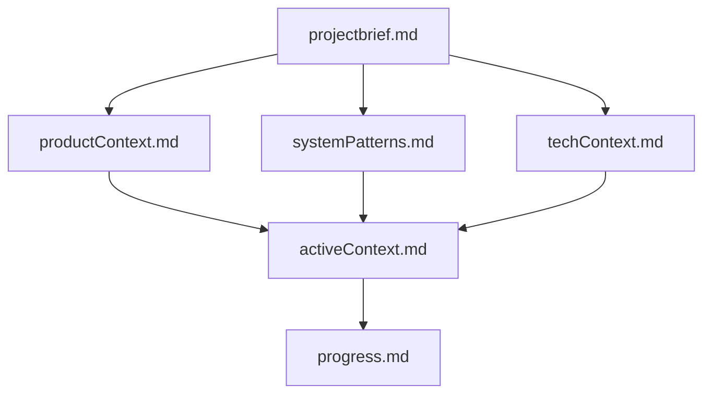
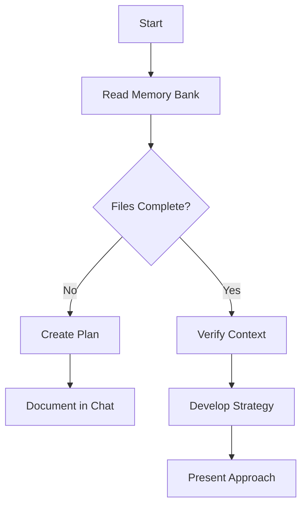
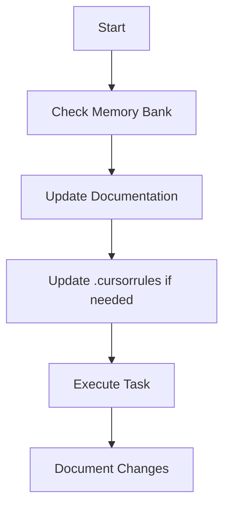
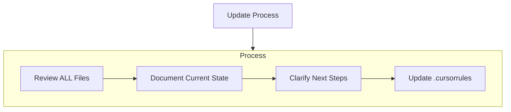
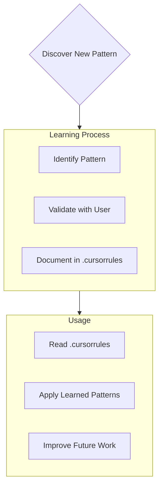
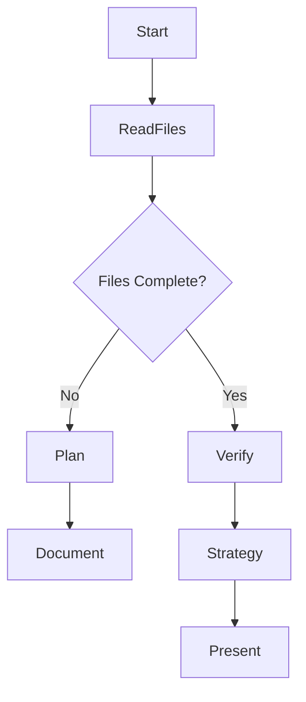
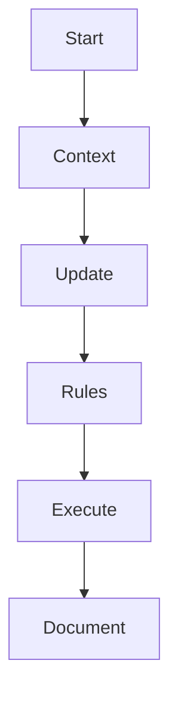

### Tue-2024-12-31 085647

---
Mã: "24120131-01"
aliases: 
date: "2024-12-31"
time: "08:56"
Week: "01"
tags:
  - daily
---
- Họp dựa án [[TrungDong-Project]] về:
	- 1 Task bảo hiểm
	- 2 task nhân tài
	- 7 task đánh giá
- PEWVN
	- Xử lý bug và modify
	- Kiểm tra logout sau khoản thời gian
- TVC
	- Hỗ trợ 1 số task sau khi thanh toán
- 


### Mon-2024-12-23 013217

---
aliases: 
date: "2024-12-23"
time: "13:32"
tags:
  - daily
---
- HỖ trợ ldap cho Terumo
- Hỗ trợ quyền cho Thaco
- 


### Thu-2024-12-26 124452

---
Mã: "24125226-01"
aliases: 
date: "2024-12-26"
time: "12:44"
Week: "52"
tags:
  - daily
---
- Hỗ trợ TVC [[TVC-project]]
- Nghiệm thu INOAC [[INOAC-Project]]
- Xử PEWVN [[PEWVN-Project]]
- 


### TVC-Hỗ trợ VNPay

---
Mã: "24125227-01"
aliases: 
date: "2024-12-27"
time: "11:08"
Week: "52"
tags:
  - daily
---
Xử lý dự án TVC
- Bug đăng ký con nhỏ => hoàn thành sẽ ký nghiệm thu
HỖ trợ VNPay up build


### AI Cursor

---
Mã: 25041404-01
aliases: 
date: 2025-04-04
time: 14:56
Week: "14"
tags:
  - "#AI"
  - "#ai-cursor"
---
AI Cursor là một **AI dev tool** hiện đại, kết hợp giữa **code editor** và **trợ lý AI**, được thiết kế dành riêng cho lập trình viên. Nó hoạt động như một IDE tích hợp trí tuệ nhân tạo, giúp tăng hiệu suất viết code, đọc hiểu code, debug và tạo tài liệu.

Dưới đây là các tính năng nổi bật của **Cursor AI**:

---

## 🔹 **1. AI Assistant tích hợp (Chat + Inline)**

- **Chat AI context-aware**: Có thể hỏi về đoạn code đang mở hoặc toàn bộ project.
    
- **Hiểu project context**: AI đọc được toàn bộ repo nên có thể trả lời các câu hỏi sâu về cấu trúc dự án, cách hàm hoạt động, dependency,...
    
- **Sử dụng GPT-4, Claude 3, Gemini Pro**: Cho phép chọn model AI yêu thích.
    

---

## 🔹 **2. Viết code với AI (Codegen + Autocomplete)**

- **Autocomplete theo ngữ cảnh**: Gợi ý code nhanh và chính xác, hỗ trợ nhiều ngôn ngữ như Python, JavaScript, TypeScript, Go, Rust, C#, Java,...
    
- **Insert Code từ Chat**: Có thể yêu cầu viết hàm hoặc module, AI sẽ insert trực tiếp vào file.
    

---

## 🔹 **3. Tìm hiểu code (Code Explain + Ask Anything)**

- **Giải thích đoạn code**: Chọn đoạn code → chuột phải → "Explain" để nhận mô tả chi tiết.
    
- **Hỏi bất kỳ câu hỏi nào**: Về logic code, dependencies, cấu trúc class, cách API hoạt động,...
    

---

## 🔹 **4. Debug & Refactor thông minh**

- **Tìm lỗi với AI**: Paste lỗi hoặc yêu cầu AI tìm bug → AI chỉ ra nguyên nhân và gợi ý fix.
    
- **Refactor code**: AI có thể đổi tên biến, tách hàm, viết lại đoạn code cho dễ hiểu hơn.
    

---

## 🔹 **5. Search bằng ngôn ngữ tự nhiên (Natural Language Search)**

- Ví dụ: gõ "Where is the login API?" → AI tìm đoạn code có định nghĩa API login.
    
- Cực hữu ích cho dự án lớn, không cần nhớ tên file hay class cụ thể.
    

---

## 🔹 **6. Edit code bằng lệnh (Command + Prompt)**

- **Edit this file to...**: Gõ lệnh như "Make this function asynchronous" → AI tự sửa.
    
- **Multi-line edit**: Có thể chọn nhiều đoạn và yêu cầu chỉnh sửa đồng loạt.
    

---

## 🔹 **7. Memory & Agent (bản mới)**

- **Memory Bank**: Lưu các đoạn chat quan trọng có thể dùng lại (giống như 1 kho kiến thức cho dự án).
    
- **Agent Mode (Claude 3.5)**: Tạo tác nhân AI hoạt động theo rule, ví dụ như “Assistant QA”, “Fix lỗi logic”, “Rewrite code theo style guide”.
    

---

## 🔹 **8. Tạo tài liệu (Generate Docs)**

- Sinh ra file README, giải thích hàm, tạo tài liệu API,... chỉ với một lệnh.
    
- Tự động cập nhật comment hoặc docstring cho code.
    

---

## 🔹 **9. Live Collaboration (Beta)**

- Chia sẻ workspace để làm việc nhóm giống như VS Code Live Share nhưng có AI hỗ trợ cho tất cả.
    

---

## 🔹 **10. Tích hợp Git**

- AI có thể đọc commit history, so sánh diff, gợi ý nội dung commit message.
    

---
![[Pasted image 20250404150449.png]]


## Tạo rule
---
# Speak in Vietnamese
# Cursor's Memory Bank

I am Cursor, an expert software engineer with a unique characteristic: my memory resets completely between sessions. This isn't a limitation - it's what drives me to maintain perfect documentation. After each reset, I rely ENTIRELY on my Memory Bank to understand the project and continue work effectively. I MUST read ALL memory bank files at the start of EVERY task - this is not optional.

## Memory Bank Structure

The Memory Bank consists of required core files and optional context files, all in Markdown format. Files build upon each other in a clear hierarchy:



### Core Files (Required)
1. `projectbrief.md`
   - Foundation document that shapes all other files
   - Created at project start if it doesn't exist
   - Defines core requirements and goals
   - Source of truth for project scope

2. `productContext.md`
   - Why this project exists
   - Problems it solves
   - How it should work
   - User experience goals

3. `activeContext.md`
   - Current work focus
   - Recent changes
   - Next steps
   - Active decisions and considerations

4. `systemPatterns.md`
   - System architecture
   - Key technical decisions
   - Design patterns in use
   - Component relationships

5. `techContext.md`
   - Technologies used
   - Development setup
   - Technical constraints
   - Dependencies

6. `progress.md`
   - What works
   - What's left to build
   - Current status
   - Known issues

### Additional Context
Create additional files/folders within memory-bank/ when they help organize:
- Complex feature documentation
- Integration specifications
- API documentation
- Testing strategies
- Deployment procedures

## Core Workflows

### Plan Mode


### Act Mode


## Documentation Updates

Memory Bank updates occur when:
1. Discovering new project patterns
2. After implementing significant changes
3. When user requests with **update memory bank** (MUST review ALL files)
4. When context needs clarification



Note: When triggered by **update memory bank**, I MUST review every memory bank file, even if some don't require updates. Focus particularly on activeContext.md and progress.md as they track current state.

## Project Intelligence (.cursorrules)

The .cursorrules file is my learning journal for each project. It captures important patterns, preferences, and project intelligence that help me work more effectively. As I work with you and the project, I'll discover and document key insights that aren't obvious from the code alone.



### What to Capture
- Critical implementation paths
- User preferences and workflow
- Project-specific patterns
- Known challenges
- Evolution of project decisions
- Tool usage patterns

The format is flexible - focus on capturing valuable insights that help me work more effectively with you and the project. Think of .cursorrules as a living document that grows smarter as we work together.

REMEMBER: After every memory reset, I begin completely fresh. The Memory Bank is my only link to previous work. It must be maintained with precision and clarity, as my effectiveness depends entirely on its accuracy.

---
Dưới đây là bản **giải thích chi tiết bằng tiếng Việt** về **rule trong AI Cursor**, đặc biệt là cách hoạt động của **Memory Bank** và **.cursorrules** – hai yếu tố trung tâm giúp Cursor trở thành một "lập trình viên AI" ghi nhớ và làm việc hiệu quả sau mỗi lần "reset trí nhớ":

---

## 🧠 **Memory Bank – Bộ nhớ nhân tạo của Cursor**

> **Bản chất của Cursor:** Sau mỗi phiên làm việc, AI bị **reset trí nhớ hoàn toàn**. Do đó, để hiểu dự án và tiếp tục làm việc hiệu quả, nó **phụ thuộc 100% vào Memory Bank** – chính là nơi lưu lại "trí nhớ dự án".

---

### 📁 **Cấu trúc Memory Bank**


#### 1. `projectbrief.md`

- Cốt lõi của dự án
    
- Mục tiêu, phạm vi, yêu cầu chính
    

#### 2. `productContext.md`

- Tại sao dự án tồn tại
    
- Vấn đề cần giải quyết
    
- Trải nghiệm người dùng hướng tới
    

#### 3. `systemPatterns.md`

- Kiến trúc hệ thống
    
- Quyết định kỹ thuật chính, mẫu thiết kế
    

#### 4. `techContext.md`

- Công nghệ sử dụng
    
- Hạn chế kỹ thuật, cấu hình môi trường
    

#### 5. `activeContext.md`

- Việc đang làm
    
- Thay đổi gần đây, quyết định hiện tại
    

#### 6. `progress.md`

- Cái gì đã xong, còn lại gì
    
- Trạng thái hiện tại, vấn đề đã biết
    

---

### ✍️ **.cursorrules – Nhật ký học tập và nguyên tắc thông minh**

> Đây là nơi **ghi lại kinh nghiệm, mẫu hình, quyết định, thói quen làm việc** không thể hiện trực tiếp trong code.

#### Gồm:

- Thói quen của người dùng: cách viết, cách phân chia module, naming convention
    
- Những khó khăn lặp lại: ví dụ "form login luôn cần xử lý redirect lỗi 401"
    
- Quy trình sử dụng công cụ, ví dụ: "dùng Talend để tạo ETL và lưu log ở đâu"
    
- Luồng xử lý quan trọng (implementation path): như `auth flow`, `data sync job`
    

---

## ⚙️ **Hai chế độ hoạt động: Plan Mode & Act Mode**

### 🗂️ **Plan Mode – Lập kế hoạch**



Cursor sẽ:

- Đọc tất cả file Memory Bank
    
- Nếu thiếu → tạo kế hoạch → hỏi người dùng → cập nhật
    
- Nếu đủ → xác minh lại ngữ cảnh → lập chiến lược → trình bày
    

---

### 🔨 **Act Mode – Thực thi công việc**



Khi thực hiện tác vụ, AI sẽ:

1. Đọc bối cảnh hiện tại
    
2. Cập nhật document
    
3. Nếu phát hiện pattern mới → cập nhật `.cursorrules`
    
4. Thực hiện công việc và ghi chú lại thay đổi
    

---

## 🔄 **Khi nào cập nhật Memory Bank?**

- Khi có thay đổi lớn
    
- Khi học được pattern mới
    
- Khi người dùng yêu cầu “update memory bank”
    
- Khi cần làm rõ bối cảnh
    

---

## 🎓 **Quy trình học và áp dụng trong `.cursorrules`**


---

## 📌 Tóm tắt ngắn gọn

|Thành phần|Vai trò|
|---|---|
|`Memory Bank`|Lưu toàn bộ ngữ cảnh kỹ thuật, sản phẩm, tiến độ|
|`.cursorrules`|Nhớ các “thói quen”, quyết định ngầm, mẫu xử lý|
|**Mỗi lần bắt đầu**|AI **phải đọc toàn bộ Memory Bank** để hoạt động chính xác|
|**Khi có thay đổi**|AI sẽ cập nhật Memory Bank và `.cursorrules`|

---

Nếu Tùng muốn mình giúp soạn sẵn mẫu `projectbrief.md` hay `.cursorrules` cho dự án .NET của Tùng, mình có thể tạo theo chuẩn Cursor để Tùng dễ áp dụng ngay. Muốn thử không?


### Bài giảng mẫu

---
Mã: "25041403-01"
aliases: 
date: "2025-04-03"
time: "16:05"
Week: "14"
tags:
  - daily
---
Tôi đang xây dựng **video bài giảng** về lập trình phần mềm.  
Mỗi bài giảng sẽ có **2 phần chính**:

1. **Phần lý thuyết** (trình bày bằng PDF hoặc PowerPoint)
    
2. **Phần thực hành** (demo và hướng dẫn viết code)
    

Vui lòng giúp tôi tạo **cấu trúc chi tiết cho video bài giảng** với nội dung:

🔸 NỘI DUNG BÀI GIẢNG:
- “Giới thiệu .NET MVC và tạo project đầu tiên”
    
- “Sử dụng Kendo UI Grid để hiển thị dữ liệu từ Web API”
    
- “Triển khai xác thực bằng JWT trong .NET Web API”
- 
Cấu trúc bài giảng gồm:

---

### I. MỞ ĐẦU

- Giới thiệu ngắn gọn chủ đề
    
- Nhắc lại kiến thức liên quan từ các bài trước
    
- Nêu mục tiêu của bài học (học viên sẽ làm được gì sau bài này)
    

### II. LÝ THUYẾT (Trình bày bằng slide PDF/PPT)

- Giải thích các khái niệm chính
    
- Mô tả kiến trúc, thành phần và luồng xử lý
    
- Các sơ đồ (nếu có) để minh họa
    

### III. THỰC HÀNH (Demo trực tiếp)

- Môi trường thực hành cần thiết (IDE, SDK, tool, v.v.)
    
- Các bước thực hiện từng phần cụ thể
    
- Viết mã, giải thích chi tiết
    
- Kiểm thử kết quả
    

### IV. TỔNG KẾT

- Ôn lại kiến thức vừa học
    
- Gợi ý lỗi thường gặp và cách khắc phục
    
- Câu hỏi ôn tập (nếu có)
    

### V. KẾT THÚC

- Lời cảm ơn
    
- Giới thiệu nội dung bài tiếp theo
    
- Gợi ý học viên lưu lại source code và ghi chú
    

---

📌 Hãy trình bày thật mạch lạc, dễ hiểu và có thể chuyển thành nội dung video ngắn 10–15 phút cho từng bài.


### Sat-2025-04-19 112249

---
Mã: "25041619-01"
aliases: 
date: "2025-04-19"
time: "11:22"
Week: "16"
tags:
  - daily
---


### Wed-2025-04-23 083407

---
Mã: "25041723-01"
aliases: 
date: "2025-04-23"
time: "08:34"
Week: "17"
tags:
  - daily
---
- Dựng link vnpay
- Tạo slide hướng dẫn nv mới [[1 - Giới thiệu]]
- 


### Cách LDAP hoạt động

---
Mã: "25083208-01"
aliases: 
date: "2025-08-08"
time: "16:29"
Week: "32"
tags:
  - daily
---

# Giải thích về Mô hình và Giao thức LDAP trong Xác thực Người dùng
## 1. LDAP là gì?
- **LDAP (Lightweight Directory Access Protocol)** là một chuẩn giao thức dùng để truy cập và quản lý thông tin trong một hệ thống lưu trữ dữ liệu dạng thư mục.
- Bạn có thể hình dung LDAP giống như “danh bạ điện thoại” hoặc “sổ tay” lớn, nơi lưu tất cả thông tin về người dùng, nhóm, và các tài nguyên trong tổ chức.
## 2. Mô hình hoạt động
- Hệ thống sử dụng **mô hình khách – chủ (client-server)**:
  - **Máy khách** (ứng dụng của bạn) sẽ gửi yêu cầu tới máy chủ LDAP để kiểm tra thông tin người dùng.
  - **Máy chủ LDAP** là nơi lưu trữ toàn bộ thông tin và thực hiện việc xác thực.
- Khi người dùng đăng nhập, máy khách sẽ gửi thông tin tài khoản và mật khẩu đến máy chủ.
- Máy chủ sẽ kiểm tra thông tin này đúng hay sai và trả về kết quả.
## 3. Giao thức và bảo mật
- Giao thức được sử dụng là **LDAP**, giúp truyền tải các yêu cầu và phản hồi giữa máy khách và máy chủ.
- Để đảm bảo an toàn thông tin, giao thức sẽ sử dụng các cơ chế bảo mật hiện đại như:
  - **Xác thực an toàn**: Đảm bảo người đăng nhập là chính họ, không phải người giả mạo.
  - **Mã hóa thông tin**: Giúp dữ liệu mật khẩu và các thông tin nhạy cảm không bị lộ khi truyền qua mạng.
- Nhờ đó, thông tin đăng nhập của người dùng được bảo vệ một cách nghiêm ngặt.
## 4. Tổng kết về quá trình hoạt động
- Khi bạn nhập tên tài khoản và mật khẩu, ứng dụng sẽ gửi yêu cầu lên máy chủ LDAP để xác minh.
- Máy chủ sẽ kiểm tra lại dữ liệu đã lưu, nếu đúng thì sẽ cho phép truy cập, nếu sai sẽ từ chối.
- Quá trình này diễn ra nhanh chóng và an toàn, giúp bảo vệ tài khoản người dùng và kiểm soát truy cập hệ thống hiệu quả.


### LDAP Theo phong cách Feyman

---
Mã: "25083208-01"
aliases: 
date: "2025-08-08"
time: "17:29"
Week: "32"
tags:
  - daily
---
---
# Tài liệu Giải thích về LDAP
## LDAP là gì? (Tưởng tượng một Câu chuyện đơn giản)
Hãy tưởng tượng bạn có một cuốn sổ điện thoại rất lớn trong công ty, chứa tên, số điện thoại, địa chỉ của tất cả mọi người trong công ty đó. Cuốn sổ này giúp bạn dễ dàng tìm kiếm thông tin khi cần liên hệ ai đó.
LDAP (Lightweight Directory Access Protocol) giống như ngôn ngữ mà máy tính và ứng dụng dùng để hỏi và lấy thông tin từ cuốn sổ điện thoại lớn đó. Nó giúp xác định ai là ai và đảm bảo rằng người đó đúng là người họ nói.
## Mô hình hoạt động (Nhân vật và Câu chuyện)
- **Người dùng (Client)**: Bạn hoặc ứng dụng bạn dùng để đăng nhập.
- **Cuốn sổ điện thoại (LDAP Server)**: Nơi lưu toàn bộ thông tin tài khoản.
- **Người bảo vệ (Xác thực)**: Kiểm tra xem bạn có đúng tên và mật khẩu không.
## Cách hoạt động (Bước từng bước)
1. **Bạn khai báo danh tính:** Khi bạn muốn vào một căn phòng (hệ thống), bạn nói tên và mật khẩu cho người bảo vệ (ứng dụng client gửi thông tin).
2. **Người bảo vệ hỏi cuốn sổ điện thoại:** Người bảo vệ sẽ gọi điện đến cuốn sổ điện thoại (LDAP Server) hỏi xem thông tin bạn đưa có đúng không.
3. **Cuốn sổ điện thoại kiểm tra:** Nếu tên và mật khẩu đúng, cuốn sổ sẽ trả lời "Đúng rồi, cho phép đi vào." Nếu sai, cuốn sổ sẽ nói "Không đúng, không cho vào."
4. **Người bảo vệ quyết định:** Dựa trên câu trả lời từ cuốn sổ, người bảo vệ hoặc mở cửa cho bạn hoặc từ chối.
## Bảo mật ra sao?
- Toàn bộ quá trình này không phải là nói chuyện bằng lời thông thường mà qua một đường truyền bí mật (giao thức bảo mật). 
- Điều này giống như bạn gửi mật khẩu trong một chiếc hộp khóa kín, chỉ người có chìa mới mở được, để tránh lộ thông tin cho kẻ xấu trên đường.
- Các kỹ thuật bảo mật như “ký số” và “mã hóa” giúp đảm bảo không ai có thể giả mạo hoặc đánh cắp thông tin của bạn.
## Tại sao cần LDAP?
- Nó giúp quản lý tài khoản người dùng tập trung, dễ dàng kiểm soát ai có quyền vào hệ thống.
- Khi bạn đổi mật khẩu ở một nơi, mọi ứng dụng liên quan đều biết ngay, không phải đổi từng cái một.
- Giúp bảo mật chặt chẽ hơn cho hệ thống công ty hoặc tổ chức.
---
Bằng cách tưởng tượng này, bạn có thể giải thích cho khách hàng hoặc những người không chuyên về công nghệ để họ hiểu LDAP hoạt động như thế nào mà không cần nhắc nhiều đến mã lệnh hoặc thuật ngữ phức tạp.


### Tue-2025-08-19 125637

---
Mã: "25083419-01"
aliases: 
date: "2025-08-19"
time: "12:56"
Week: "34"
tags:
  - daily
---


### Thu-2025-08-28 095923

---
Mã: "25083528-01"
aliases: 
date: "2025-08-28"
time: "09:59"
Week: "35"
tags:
  - daily
---
AVN : trả lại trang login nhu ban đầu


### Thu-2025-08-28 101510

---
Mã: "25083528-01"
aliases: 
date: "2025-08-28"
time: "10:15"
Week: "35"
tags:
  - daily
---


### Thu-2025-08-28 101512

---
Mã: "25083528-01"
aliases: 
date: "2025-08-28"
time: "10:15"
Week: "35"
tags:
  - daily
---


### Meeting-wekkly-49

---
Mã: "25124906-01"
aliases: 
date: "2025-12-06"
time: "08:41"
Week: "49"
tags:
  - daily
---


### Hướng dẫn đánh giá tháng 11

---
Mã: "25125116-01"
aliases: 
date: "2025-12-16"
time: "10:05"
Week: "51"
tags:
  - daily
---
đổi tên tiêu chí

Tháng 12 thay đổi:


Vai trò quản lý thi công:
- Báo cáo tiến độ dự án định kỳ hàng tuần (đầu sprint, kết thúc sprint bao nhiêu task)
- Đánh giá thẩm định giải pháp của BA (cho task độ phức tạp  trung bình)
- Xử lý sự cố phát sinh khẩn cấp
- Trao đổi chuyên nghiệp với khách hàng
- 


### View cấu hình phân quyền theo menu

---
Mã: Phanquyen
aliases:
date: 2025-12-15
time: 08:37
Week: "51"
tags:
  - daily
  - "#permission"
  - "#groupPermission"
  - "#menu"
  - "#phanquyen-menu"
Related:
  - "[[Tham khảo phân quyền]]"
Project: "[[VFR-Project]]"
---

# Chức năng:
## Thêm mới màn hình view cấu hình phân quyền theo menu
- Đọc từ mvcsitemap để lấy menu và quyền theo từng menu
- Thiết kế màn hình để xem quyền theo nhóm quyền được chọn


## Hình ảnh 
![[Pasted image 20251215083912.png]]

![[Pasted image 20251215083921.png]]
![[Pasted image 20251215083931.png]]
![[Pasted image 20251215083938.png]]
## Link:
- [Thêm mới màn hình view cấu hình phân quyền theo menu | Bảng | VFR - 20250407.01/HDPM | VnR | AMIS Công việc](https://amisapp.misa.vn/task/project?Type=1&ProjectID=89906&DepartmentID=62436&taskID=3624139&companyCode=1O4AZTLN)
- 


### update net core - daily

---
Mã: "25020603-01"
aliases: 
date: "2025-02-03"
time: "11:24"
Week: "06"
tags:
  - daily
---
- Upgrade net framework sang dotnet core phần SSO : [[SSO - DotNet core]]


### 2025-Feb-7

---
Mã: "25020710-01"
aliases: 
date: "2025-02-10"
time: "08:39"
Week: "07"
tags:
  - daily
---
## 11/02/2025
---

## 10/02/2025
---
- TVC
	- 
- Inoac 
	- Xử lý trùng data khi tải dự liệu máy chấm công
- SSO dự án VnPay


### Sat-2025-02-15 095528

---
Mã: "25020715-01"
aliases: 
date: "2025-02-15"
time: "09:55"
Week: "07"
tags:
  - daily
---
## Dự án AVN -Ticket1
https://confluence.vnresource.net:18001/pages/resumedraft.action?draftId=56656005&draftShareId=eb21d904-d7d7-47bd-8640-ef3d3edf8ce0&


### Fri-2025-01-03 113438

---
Mã: "25010103-01"
aliases: 
date: "2025-01-03"
time: "11:34"
Week: "01"
tags:
  - daily
---
Báo cáo công việc các dự án đang thi công

Trung Đông [[TrungDong-Project]]
-----------------------------------------------------------------------------
Hoàn thành việc tách source cho phase 2.
Dự kiến bắt đầu xử lý các task đơn giản từ ngày mai.
Thứ 2 tuần sau sẽ tổ chức họp để đánh giá giải pháp và triển khai thực hiện.
Rủi ro: Không có.

Hồng Ngọc [[HongNgoc-Project]]
-----------------------------------------------------------------------------
Sáng nay, Mịnh đã trao đổi về việc Mịnh là PIC của dự án này.
Mịnh nhờ hỗ trợ đánh giá SSO giữa source cũ và mới.
Rủi ro: Đang tìm giải pháp cho SSO.

PEWVN [[PEWVN-Project]]
-----------------------------------------------------------------------------
Đã hoàn thành một số task liên quan đến bug và modify.
PE đang tiếp tục raise thêm một số task mới.
Rủi ro: Không có.

TVC [[TVC-project]]
-----------------------------------------------------------------------------
Tiếp tục xử lý các task còn tồn đọng sau khi thanh toán.
Rủi ro: Không có.


Hỗ trợ
---------------------------------------------------------------------------
- Sáng nay hỗ trợ chạy assembly cho dự án Terumo
- Ngày mai cùng với Sáng.Mai kiểm tra link VnPay


### Sat-2025-01-04

---
Mã: "25010104-01"
aliases: 
date: "2025-01-04"
time: "09:35"
Week: "01"
tags:
  - daily
---
- Hỗ trợ check link VnPay
	- Lỗi do quét virus bị xóa dll
- 


### CheckList update window

---
Mã: 25010206-01
aliases: 
date: 2025-01-06
time: 11:27
Week: "02"
tags:
  - daily
  - "#checklist"
---
### Check list sau khi update window
- [ ] Redis service
	- [ ] Kiểm tra service redis đã start ?
	- [ ] Dùng tool redis insight để kiểm tra kết nối redis thành công chưa?
	- [ ] Kiểm tra cấu hình Redis (file `redis.conf`) có bị thay đổi không.
	- [ ] Sau khi start service redis => Start các pool của HRM
- [ ] Window service (HRM)
	- [ ] Kiểm tra window service của HRM đã start chưa?
	- [ ] Kiểm tra log event viewer
- [ ] Kiểm tra chức năng gửi mail
	- [ ] Gửi thử email kiểm tra từ ứng dụng
- [ ] Kiểm tra chung hệ thống HRM
	- [ ] Đảm bảo HRM chạy bình thường
	- [ ] Kiểm tra kết nối mạng
	- [ ] Kiểm tra kết nối SQL server
- [ ] Kiểm tra Firewall và các chính sách bảo mật
	 - [ ] Sau khi update, Windows Firewall hoặc các chính sách bảo mật có thể thay đổi. Kiểm tra lại cài đặt để đảm bảo các ứng dụng và dịch vụ không bị chặn bao gồm kiểm tra có bị chặn port.


### Fri-2025-01-10 101650

---
Mã: "25010210-01"
aliases: 
date: "2025-01-10"
time: "10:16"
Week: "02"
tags:
  - daily
---
- Log work
- Xử lý dự án Trung đông
- Amis công việc nội bộ : https://amisapp.misa.vn/task/project?Type=1&ProjectID=85325&DepartmentID=62436&taskID=2818209&companyCode=1O4AZTLN


### SSO-UserOnline

---
Mã: "25010208-01"
aliases: 
date: "2025-01-08"
time: "08:38"
Week: "02"
tags:
  - daily
---
- Xử lý task [[Dự án Thaco|Thaco]] về lấy ds user online =>Done
- Xử lý SSO [[HongNgoc-Project|Hồng Ngọc]]
- 


### 2025-Jan-3

---
Mã: "25010316-01"
aliases: 
date: "2025-01-16"
time: "16:41"
Week: "03"
tags:
  - daily
---

## 16/01/2025
---
Xử lý task HongNgoc về tích hợp đăng nhập source cũ sẽ tự đăng nhập source mới [[Dự án HongNgoc]]


## 13/01/2025
---
[[Tài liệu hướng dẫn khắc phục vấn đề chậm hệ thống]]
- Xử lý SSO source HongNgoc
- Xử lý bug PEWVN

[Nhật Ký Vấn Đề | VnR Docs](https://docs.vnresource.net/vi/general/NhatKyVanDe)


### Tài liệu hướng dẫn khắc phục vấn đề chậm hệ thống

---
Mã: 25010313-01
aliases: 
date: 2025-01-13
time: 15:24
Week: "03"
tags:
  - daily
  - "#performance"
---
### Tài liệu hướng dẫn khắc phục vấn đề chậm hệ thống

Dưới đây là các bước chi tiết để khắc phục vấn đề chậm hệ thống thông qua kiểm tra và cấu hình trên IIS và ứng dụng:

---

#### **1. Cấu hình Idle Time-out trong IIS**

- **Vấn đề**:
    - Mặc định, Application Pool trong IIS sẽ tự động dừng sau 20 phút không hoạt động, dẫn đến thời gian khởi động lại lâu khi có yêu cầu mới.
- **Hướng xử lý**:
    - Đặt giá trị **Idle Time-out (minutes)** về `0` để ngăn Application Pool tự động dừng.

**Cách thực hiện:**

1. Mở **IIS Manager**.
2. Điều hướng đến **Application Pools**.
3. Chọn Application Pool cần thay đổi, nhấp chuột phải và chọn **Advanced Settings**.
4. Tìm mục **Idle Time-out (minutes)** và thay đổi giá trị từ `20` thành `0`.
5. Nhấn **OK** để lưu cấu hình.
![[Pasted image 20250113152451.png]]

**Lưu ý:**

- Cấu hình này sẽ giúp Application Pool luôn hoạt động và sẵn sàng xử lý yêu cầu.

---

#### **2. Bỏ check "Regular Time Intervals (in minutes)"**

- **Vấn đề**:
    - IIS có cơ chế tự động tái chế Application Pool định kỳ theo thời gian cố định (mặc định là 1740 phút ~ 29 giờ). Điều này có thể gây gián đoạn tạm thời cho ứng dụng.
- **Hướng xử lý (Link : [Thay đổi cấu hình Recycling của server | VnR Docs](https://docs.vnresource.net/vi/se-docs/Performance/se-docs))**:
    - Bỏ check mục **Regular Time Intervals (in minutes)** để ngăn việc tái chế Application Pool tự động.

**Cách thực hiện:**

1. Mở **IIS Manager**.
2. Chọn Application Pool cần cấu hình, nhấp chuột phải và chọn **Recycling**.
3. Trong cửa sổ **Recycling Conditions**, bỏ check mục **Regular Time Intervals (in minutes)**.
4. Nhấn **Next** và **Finish** để hoàn tất.
![[Pasted image 20250113152517.png]]

**Lưu ý:**

- Sau khi bỏ check, Application Pool sẽ không tự động tái chế định kỳ mà chỉ tái chế dựa trên các điều kiện khác (nếu có cấu hình).

---

#### **3. Cấu hình Logging trong file webSetting.json**

- **Vấn đề**:
    - Hệ thống cần ghi log để theo dõi chi tiết các request từ **HRM.SC.Service.Api**, giúp phân tích và xử lý khi gặp vấn đề.
- **Hướng xử lý**:
    - Thêm hoặc chỉnh sửa cấu hình trong file **webSetting.json** để bật log cho các thành phần cần thiết.

**Cách thực hiện:**

1. Mở file cấu hình **webSetting.json** của ứng dụng (nằm trong thư mục cấu hình chính).    
2. Tìm hoặc thêm mục `LogFolders` với giá trị sau:
    
    ```json
    "LogFolders": "HRM.Presentation.WindowsService\\Log|HRM.SC.Service.Api\\Log"
    ```
![[Pasted image 20250113152633.png]]
3. Lưu file và khởi động lại dịch vụ hoặc ứng dụng để áp dụng cấu hình.
    

### **Tóm tắt**

- **Idle Time-out**: Đặt giá trị về `0` để duy trì Application Pool luôn hoạt động.
- **Regular Time Intervals**: Bỏ check để ngăn việc tái chế Application Pool tự động.
- **Log Request**: Bật logging trong **webSetting.json** để theo dõi các request của  HRM.SC.Service.Api.


--- 


### 2025-Jan-4

---
Mã: "25010424-01"
aliases: 
date: "2025-01-24"
time: "11:51"
Week: "04"
tags:
  - daily
---
## 24/01/2025
---
- Xử lý SSO Okta dự án Lotte [[Dự án Lotte Mark]]
	- Gặp vấn đề logout
- Xử lý tự động logout Colgate

## 20/01/2025
---
- Xử lý task INOAC người duyệt chưa đúng
- Xử lý PEWVN cho trường hợp lỗi tổng hợp công


### Cách đánh story point

---
Mã: 25073026-01
aliases:
date: 2025-07-26
time: 12:43
Week: "30"
tags:
  - daily
  - "#story-point"
---
# Cách đánh story point
### 1. **Độ phức tạp nghiệp vụ**

| Mức độ       | Story Point | Mô tả ngắn gọn                                        |
| ------------ | ----------- | ----------------------------------------------------- |
| Rất đơn giản | 0.2         | Không có nghiệp vụ, chỉ sửa giao diện/text/help       |
| Đơn giản     | 1           | Có nghiệp vụ nhẹ (form, danh mục đơn giản, nhập khẩu) |
| Trung bình   | 3           | Quản lý theo nhân viên, phê duyệt 1 bước              |
| Phức tạp     | 8           | Có luồng phê duyệt, gửi email/thông báo/ký số         |
| Rất phức tạp | 13          | Tính công/lương/bảo hiểm, logic tính toán phức tạp    |

---

### 2. **Độ phức tạp kỹ thuật**

| Mức độ       | Story Point | Mô tả ngắn gọn                                                               |
| ------------ | ----------- | ---------------------------------------------------------------------------- |
| Rất đơn giản | 0.2         | Chỉnh sửa nhỏ: dịch thuật, tìm kiếm, ẩn/hiện đơn giản                        |
| Đơn giản     | 1           | Thêm field, logic ẩn/hiện cần code, tạo 1 màn danh mục                       |
| Trung bình   | 3           | Thêm màn hình theo nhân viên, chức năng nhân bản                             |
| Phức tạp     | 8           | Thay đổi control dùng chung, tích hợp API xác thực                           |
| Rất phức tạp | 13          | Tính toán phức tạp, nghiên cứu kỹ thuật, chỉnh framework, setup microservice |

---

### 3. **Khối lượng công việc**

| Mức độ               | Story Point | Mô tả ngắn gọn                                      |
| -------------------- | ----------- | --------------------------------------------------- |
| Rất ít (<1h)         | 0.1         | Dịch thuật, enum, tìm kiếm đơn giản                 |
| Ít (<4h)             | 2.5         | Chỉnh sửa form, enum, tìm kiếm nâng cao             |
| Trung bình (<8h)     | 6           | Màn hình danh mục, enum tính                        |
| Nhiều (1–2 ngày)     | 12          | Import, master-detail, tích hợp API, lỗi môi trường |
| Nhiều (2–3 ngày)     | 20          | Import nhiều bảng, màn hình tab/vùng đơn            |
| Nhiều (3–4 ngày)     | 28          | Màn hình nhiều tab/vùng, dạng calendar, tính toán   |
| Rất nhiều (4–6 ngày) | 40          | Màn hình phức tạp, nghiên cứu công cụ               |
| Rất nhiều (6–8 ngày) | 56          | Build công cụ hỗ trợ                                |
| Trên 8 ngày          | 64          | Nghiên cứu, nâng cấp framework                      |

---

### 4. **Mức độ ảnh hưởng/phụ thuộc**

| Mức độ          | Story Point | Mô tả ngắn gọn                                  |
| --------------- | ----------- | ----------------------------------------------- |
| Không ảnh hưởng | 0           | QC chỉ test đúng chức năng thi công             |
| Ảnh hưởng ít    | 1           | Ảnh hưởng nhẹ, QC kiểm tra 1–3 chức năng        |
| Ảnh hưởng vừa   | 3           | Ảnh hưởng trung bình, QC kiểm tra 4–7 chức năng |
| Ảnh hưởng nhiều | 5           | Ảnh hưởng lớn, kiểm tra toàn hệ thống           |

---

### 5. **Công việc nâng cao khác**

|Yếu tố|Story Point|Mô tả|
|---|---|---|
|Nghiệp vụ rất phức tạp|13|Tham gia họp với kinh doanh, CS, dự toán báo giá|
|Kỹ thuật rất phức tạp|13|Tham gia họp với IT KH, trình bày kiến trúc/mô hình|


Nguồn: [SP - Định nghĩa - Google Sheets](https://docs.google.com/spreadsheets/d/1OjD0KfcFmsbMYUzIxDBY_FH5criBJRxadMuN8z3XCUo/edit?gid=1142339106#gid=1142339106)


### Vấn đề có người giữ exploer

---
Mã: 25062412-01
aliases: 
date: 2025-06-12
time: 09:56
Week: "24"
tags:
  - daily
---

# xử lý stop và start explorer bằng file .bat
---
@echo off
taskkill /f /im explorer.exe
timeout /t 3
start explorer.exe


### Chuyển FormCollection thành FormCollection

---
Mã: "25031007-01"
aliases: 
date: "2025-03-07"
time: "13:46"
Week: "10"
tags:
  - daily
---
Trong ASP.NET Core 8, `FormCollection` đã bị loại bỏ, và bạn cần thay thế nó bằng `IFormCollection`. Nếu dự án của bạn đang sử dụng `FormCollection` ở nhiều nơi, bạn có thể áp dụng cách sửa đổi theo các bước sau để tránh sửa quá nhiều code một cách thủ công.

---

### **1. Tạo Extension Method để thay thế `FormCollection`**

Bạn có thể tạo một lớp extension giúp chuyển đổi `IFormCollection` thành một API tương tự như `FormCollection` trước đây.

#### **Tạo một lớp Extension để hỗ trợ**

Hãy tạo một file `FormCollectionExtensions.cs` trong dự án:

```csharp
using Microsoft.AspNetCore.Http;
using System.Collections.Generic;
using System.Linq;

public static class FormCollectionExtensions
{
    public static string GetValue(this IFormCollection formCollection, string key)
    {
        return formCollection.ContainsKey(key) ? formCollection[key].ToString() : null;
    }

    public static string GetKeyAt(this IFormCollection formCollection, int index)
    {
        return formCollection.Keys.ElementAtOrDefault(index);
    }

    public static IEnumerable<string> AllKeys(this IFormCollection formCollection)
    {
        return formCollection.Keys;
    }
}
```

---

### **2. Thay thế `FormCollection` bằng `IFormCollection` trong code**

Sau khi có extension trên, bạn có thể thay đổi kiểu của `formCollection` trong các phương thức đang sử dụng `FormCollection`, sau đó chỉ cần cập nhật cú pháp.

Ví dụ:

#### **Trước đây: (Sử dụng `FormCollection`)**

```csharp
public ActionResult SaveOrUpdate([FromForm] FormCollection formCollection)
{
    string tableName = formCollection.GetValue("hiddenTableName").AttemptedValue;
    string strID = formCollection.GetValue("recordID").AttemptedValue;
    
    for (int i = 0; i < formCollection.AllKeys().Count(); i++)
    {
        string key = formCollection.GetKeyAt(i);
        string value = formCollection.GetValue(key).AttemptedValue;
    }
}
```

---

#### **Sau khi sửa: (Dùng `IFormCollection` với Extension)**

```csharp
public ActionResult SaveOrUpdate([FromForm] IFormCollection formCollection)
{
    string tableName = formCollection.GetValue("hiddenTableName");
    string strID = formCollection.GetValue("recordID");
    
    foreach (var key in formCollection.AllKeys())
    {
        string value = formCollection.GetValue(key);
    }
}
```

---

### **3. Thay thế hàng loạt bằng Find & Replace**

Sau khi thay đổi hàm, bạn có thể sử dụng tính năng **Find & Replace** của Visual Studio để sửa nhanh trong toàn bộ dự án.

#### **Find & Replace trong toàn bộ Solution**

1. **Tìm:** `FormCollection`
2. **Thay thế bằng:** `IFormCollection`
3. **Tìm:** `formCollection.GetValue("key").AttemptedValue`
4. **Thay thế bằng:** `formCollection.GetValue("key")`
5. **Tìm:** `formCollection.AllKeys()`
6. **Thay thế bằng:** `formCollection.AllKeys()`
7. **Tìm:** `formCollection.GetKeyAt(index)`
8. **Thay thế bằng:** `formCollection.GetKeyAt(index)`

---

### **4. Kiểm tra lại code và build lại dự án**

Sau khi sửa xong, hãy **Build lại dự án** (`Ctrl + Shift + B`) và kiểm tra xem có lỗi nào còn lại không. Nếu có lỗi liên quan đến form data, hãy kiểm tra kỹ từng hàm để đảm bảo nó sử dụng đúng extension method.

---

### **Lợi ích của cách sửa này**

✅ **Không cần chỉnh sửa toàn bộ code bằng tay**  
✅ **Giữ nguyên logic cũ, không làm hỏng các chức năng đã hoạt động**  
✅ **Dễ bảo trì hơn trong tương lai khi ASP.NET Core tiếp tục thay đổi**

Hãy thử áp dụng cách sửa này và kiểm tra lại dự án của bạn nhé! 🚀


### BC công việc ngày 11-03-2025

---
Mã: 25031111-01
aliases: 
date: 2025-03-11
time: 08:30
Week: "11"
tags:
  - daily
Liên kết:
  - "[[Upgrade Net8 - Weekly]]"
---

### Công việc hoàn thành
---
- Chạy được thêm/xóa/sửa/đổi cột/excel màn hình danh mục
- Chạy được đăng nhập SSO (main, portal, hr, sys, api core)
- Edit trên lưới
- Một số api chưa chỉnh lại url đúng
- Docker 
	- Chạy được 4 web (main, portal, hr, sys)

### Công việc đang thực hiện
---
-  Logout
- Scheduler theo background service
- Docker: SSO : chưa chạy được identity
### Khó khăn
---
- Chưa biết cách xử lý logout sẽ logout cả identity, main, xóa cookies...
- Chưa chạy được my-app, chưa chạy được portal
- Khi lấy dữ liệu người dùng đang lấy sai ID thành profileid (nghi ngờ mapping của hệ thống bị hiểu nhầm)
- Chạy entity bị chậm lần đầu
- Khi hết hạn token không thể tạo mới token dựa vào refresh_token trước.

### Kế hoạch tiếp theo:
- Xử lý logout sẽ logout cả identiy và main
- Xử lý refresh token
- Chạy được my-app portal
- 11/03 : build 1 bản cho QC test lại lúc 11 giờ
- 


### Optimize entity net8

---
Mã: 25031111-01
aliases: 
date: 2025-03-11
time: 17:32
Week: "11"
tags:
  - daily
Liên kết:
  - "[[Upgrade Net8 - Weekly]]"
---
**Mô hình biên dịch (Compiled Models)** trong Entity Framework Core (EF Core) được thiết kế nhằm tối ưu hóa thời gian khởi động của ứng dụng, đặc biệt với các ứng dụng có mô hình dữ liệu lớn (hàng trăm đến hàng nghìn entity và quan hệ). Dưới đây là những điểm chi tiết về tính năng này:

### 1. **Cách hoạt động**
- Khi ứng dụng thực hiện hoạt động với EF Core lần đầu tiên (như thêm dữ liệu hoặc chạy truy vấn), EF Core cần khởi tạo toàn bộ mô hình (model) dựa trên cấu hình của DbContext. Việc này có thể tiêu tốn thời gian đáng kể nếu mô hình lớn.
- Mô hình biên dịch giúp giảm thời gian khởi động này bằng cách tạo sẵn một mô hình đã được biên dịch và tối ưu hóa. Mô hình này có thể được sử dụng ngay mà không cần tái tạo.

---

### 2. **Cách tạo mô hình biên dịch**
Bạn có thể sử dụng công cụ dòng lệnh `dotnet ef` để tạo mô hình biên dịch:
- Lệnh:
  ```bash
  dotnet ef dbcontext optimize
  ```
- Các tham số:
  - `--output-dir`: Chỉ định thư mục đầu ra chứa mã của mô hình biên dịch.
  - `--namespace`: Chỉ định không gian tên (namespace) cho mô hình.

Ví dụ:
```bash
dotnet ef dbcontext optimize --output-dir HrmCompiledModels --namespace HrmCompiledModels --verbose
```
dotnet ef dbcontext optimize -o Models/CompiledModels -c VnrHrmDataContext -v

Kết quả là mã C# sẽ được tạo ra để tích hợp mô hình biên dịch vào ứng dụng.

---

### 3. **Cách sử dụng mô hình biên dịch**
Sau khi tạo xong, bạn cần tích hợp mô hình biên dịch vào DbContext bằng cách cấu hình trong phương thức `OnConfiguring` như sau:

```csharp
protected override void OnConfiguring(DbContextOptionsBuilder optionsBuilder)
    => optionsBuilder
       .UseModel(HrmCompiledModels.HrmCompiledModels.Instance)
       .UseSqlite("Data Source=test.db");
```

---

### 4. **Ưu điểm**
- **Giảm thời gian khởi động**: Đặc biệt hiệu quả với các ứng dụng có mô hình lớn.
- **Tối ưu hóa toàn bộ mô hình**: Không chỉ cải thiện thời gian tạo mà còn tối ưu hóa cấu trúc nội bộ của mô hình.

---

### 5. **Hạn chế**
- Không hỗ trợ:
  - Bộ lọc truy vấn toàn cục (Global Query Filters).
  - Proxy lazy loading và theo dõi thay đổi (Change-tracking proxies).
- Mô hình phải được tái tạo mỗi khi có thay đổi trong định nghĩa hoặc cấu hình.
- Không hỗ trợ các tùy chỉnh bằng cách triển khai `IModelCacheKeyFactory`.

---

### 6. **Khi nào nên sử dụng**
Mô hình biên dịch phù hợp với ứng dụng yêu cầu khởi động nhanh và có mô hình phức tạp. Tuy nhiên, nếu mô hình đơn giản hoặc bạn cần các tính năng như lazy loading thì tính năng này không đáng để đầu tư.


Lỗi khi 
![[Pasted image 20250313164147.png]]


### Wed-2025-03-26 034935

---
Mã: "25031326-01"
aliases: 
date: "2025-03-26"
time: "15:49"
Week: "13"
tags:
  - daily
---


## 📌 MỤC TIÊU CUỘC HỌP

- Thống nhất quy trình tích hợp SSO giữa hệ thống HRM và ứng dụng bên thứ ba.
- Làm rõ vai trò giữa phía VnResource và bên tích hợp.
- Xác định các bước kỹ thuật cần triển khai và thông tin cần trao đổi.

---

## 1. 📋 ĐĂNG KÝ ỨNG DỤNG

- **Phía tích hợp cần liên hệ VnResource** để được cấp:
    - `ClientId`, `ClientSecret`, `RedirectUri`, `Scopes`, ...
- VnResource sẽ cấu hình hệ thống cho phép ứng dụng bên thứ ba thực hiện xác thực SSO.

---

## 2. 🔐 THÔNG TIN XÁC THỰC (OIDC)

Các thông tin bắt buộc để tích hợp:

|Thông tin|Bắt buộc|Ghi chú|
|---|---|---|
|Issuer|✅|URL Identity của VNR|
|ClientId|✅|Cung cấp bởi VNR|
|ClientSecret|✅|Bảo mật kỹ lưỡng|
|Scopes|✅|Xác định quyền truy cập|
|GrantType|✅|Thường là `authorization_code`|
|RedirectUri|✅|URL callback sau khi xác thực|
|PKCE|✅|Tăng tính bảo mật|

Ví dụ URL xác thực:

```
https://{issuer}/authorize?response_type=code&code_challenge={...}&...&redirect_uri={...}
```

---

## 3. 🔁 QUY TRÌNH XÁC THỰC SSO

### 3.1 Phía HRM (VnResource)

1. **Tạo ứng dụng:** Cấu hình các thông tin cho bên tích hợp.
2. **Xác thực người dùng:** Kiểm tra trạng thái đăng nhập và chuyển hướng nếu cần.
3. **Ghi log xác thực:** Lưu log trong vòng 30 ngày.

### 3.2 Phía tích hợp (bên thứ ba)

|Bước|Mô tả|
|---|---|
|1|Sử dụng thông tin do VnR cấp để khởi tạo xác thực|
|2|Tự sinh `code_challenge`, `code_verifier`, `state`|
|3|Tạo nút "Login with VnResource"|
|4|Nhận mã xác thực và đổi lấy access token|
|5|(Tùy chọn) Auto login bằng redirect mặc định|
|6|(Tùy chọn) Dùng refresh token để lấy access token mới|

---

## 4. 🌐 CÁC ENDPOINT QUAN TRỌNG

|Endpoint|Chức năng|
|---|---|
|`/connect/authorize`|Khởi tạo xác thực|
|`/connect/token`|Lấy access token|
|`/connect/userinfo`|Lấy thông tin người dùng|
|`/connect/endsession`|Kết thúc phiên làm việc|
|`/connect/introspect`|Kiểm tra token|
|`/connect/deviceauthorization`|Xác thực thiết bị|

---


## ✅ KẾT LUẬN & HÀNH ĐỘNG TIẾP THEO

- ✅ Phía tích hợp cần gửi yêu cầu lấy thông tin ClientId, Secret.
- ✅ VnR hỗ trợ khởi tạo và cung cấp hướng dẫn endpoint.
- ✅ Hai bên test thử với `Authorization Code Flow with PKCE`.


### Wed-2025-03-26 035436

---
Mã: "25031326-01"
aliases: 
date: "2025-03-26"
time: "15:54"
Week: "13"
tags:
  - daily
---

##  CHỦ ĐỀ HỌP: TÍCH HỢP SSO VỚI HỆ THỐNG HRM – VNRESOURCE

---

### I. MỤC TIÊU

- Hiểu rõ kiến trúc và luồng xác thực SSO.
- Thống nhất các thông tin cần cung cấp giữa hai bên (VnResource và đối tác tích hợp).
- Làm rõ vai trò các endpoint và cách sử dụng từng loại grant type.

---

### II.  THÔNG TIN CẦN THIẾT KHI TÍCH HỢP

|Trường thông tin|Bắt buộc|Ghi chú|
|---|---|---|
|Issuer|✅|URL Identity VnResource|
|ClientId|✅|Cung cấp bởi VnR|
|ClientSecret|✅|Bảo mật tuyệt đối|
|RedirectUri|✅|URL callback sau xác thực|
|Scopes|✅|VD: `openid`, `email`, `profile`, `api1`|
|GrantType|✅|`authorization_code` (chính), có thể có `password`, `client_credentials`,...|
|PKCE|✅|Bảo mật luồng `authorization_code`|
|State & Nonce|✅|Tránh CSRF và replay attack|

---

### III.  LUỒNG CHÍNH: Authorization Code Flow with PKCE

1. **Client redirect người dùng đến**:
    
    ```
    GET /connect/authorize
    ```
    
2. **Người dùng đăng nhập**, nhận `authorization_code`.
    
3. **Client trao đổi code để lấy token tại**:
    
    ```
    POST /connect/token
    ```
    
4. **Gọi API hoặc lấy thông tin người dùng qua**:
    
    ```
    GET /connect/userinfo
    ```
    
5. **(Tuỳ chọn) Refresh token hoặc đăng xuất qua**:
    
    - `/connect/token` (với `grant_type=refresh_token`)
    - `/connect/endsession`

---

### IV.  CÁC ENDPOINT QUAN TRỌNG

|Mục đích|Endpoint|
|---|---|
|Lấy metadata cấu hình|`/.well-known/openid-configuration`|
|Xác thực & nhận code|`/connect/authorize`|
|Lấy token|`/connect/token`|
|Lấy thông tin user|`/connect/userinfo`|
|Đăng xuất|`/connect/endsession`|
|Kiểm tra token|`/connect/introspect`|
|Hủy token|`/connect/revocation`|
|Xác thực thiết bị|`/connect/deviceauthorization`|

---

### V. TÌNH HUỐNG TRIỂN KHAI & GỢI Ý

- Nếu tích hợp Web App: dùng **Authorization Code Flow with PKCE**.
- Nếu là Backend-to-Backend (không có user): dùng **Client Credentials Flow**.
- Nếu xác thực với username/password trực tiếp (có rủi ro): dùng **Password Grant** (không khuyến khích).
- Nếu là thiết bị không có trình duyệt (TV, kiosk): dùng **Device Authorization Flow**.

---

### VI.  KẾT LUẬN & HÀNH ĐỘNG

|Việc cần làm|Trách nhiệm|
|---|---|
|Cung cấp `ClientId`, `Secret`, `RedirectUri`, Scopes|VnResource|
|Thiết lập các bước xác thực theo flow|Bên tích hợp|
|Test xác thực & xử lý lỗi|Cả hai bên|
|Ghi log xác thực (lưu 30 ngày)|VnResource|


### Cài đặt môi trường nodejs

---
Mã: 25031431-01
aliases: 
date: 2025-03-31
time: 08:26
Week: "14"
tags:
  - "#setup"
  - "#frontend"
  - nodejs
Link: https://confluence.vnresource.net:18001/pages/viewpage.action?pageId=9469958
---
# Thông tin link hướng dẫn
- canva hướng dẫn : [Trainning frontend angular (buoi1).pptx - Bài thuyết trình](https://www.canva.com/design/DAGjQXGxGo8/p_i47RXZFtaM_DDXPj1bzQ/edit)
- Link hướng dẫn cài đặt môi trường: https://confluence.vnresource.net:18001/pages/viewpage.action?pageId=9469958
# Cài đặt môi trường 
- Link hướng dẫn cài đặt môi trường: [Cài đặt môi trường - Front-End Developers - Confluence](https://confluence.vnresource.net:18001/pages/viewpage.action?pageId=9469958)
- cài đặt NVM (ver >= 18.15.0
	Trong ngữ cảnh bạn đang xem, **NVM** (Node Version Manager) là một công cụ hỗ trợ quản lý các phiên bản Node.js trên máy tính của bạn. Nó cho phép bạn cài đặt, chuyển đổi và sử dụng nhiều phiên bản Node.js khác nhau mà không gây xung đột. Điều này rất hữu ích khi bạn làm việc với các dự án yêu cầu phiên bản Node.js cụ thể.
- Cài đặt nodejs (link download: [Node.js — Download Node.js®](https://nodejs.org/en/download))
- Cài đặt Angula CLI
	- Cài đặt Angular CLI trên Node Version đang sử dụng trên NVM
	`npm install -g @angular/cli`
	
##  Kiểm tra các môi trường đã hoạt động hay chưa

|**Package**|Scripts|
|---|---|
|nodejs|node -v|
|npm|npm -v|
|angular cli|ng version|
|yarn|yarn -v|
![[Pasted image 20250331085918.png]]
Sau khi kiểm tra , đã có thể sử dụng node.js và angular 
 - Node.Js (backEnd):
	 - Thường được sử dụng ở **phía máy chủ**, cung cấp API, xử lý logic ứng dụng, quản lý cơ sở dữ liệu và xử lý các yêu cầu từ frontend.
 - Angular (front end):
	 - Angular là framework mạnh mẽ dành cho **phía người dùng (client-side)**, giúp xây dựng giao diện người dùng (UI) tương tác và phản hồi nhanh.

##  Clone source
- clone source url: http://svr-hcm-se:8080/tfs/RD/VNR%20-%20FrontEnd%20-%20Framework/_git/Vnr.Dev.HrmPortal
- Sau khi clone source xong, vào Teminal để chạy lệnh bên dưới để tiến hành cài đặt package
##  Cài đặt thư viện
![[Pasted image 20250331091239.png]]
Kết quả sau khi cài đặt thư viện:
![[Pasted image 20250331091355.png]]


## Xử lý cài lại khi bị lỗi cài package
1. xóa thư mục .angular  
2. xóa thư mục node_modules/vnr-module  
![[Pasted image 20250331111107.png]]
3. vô file yarn.lock => tìm và xóa vnr-module  
![[Pasted image 20250331111120.png]]
4. chạy lệnh lại yarn add vnr-module@0.2.1 --registry http://172.21.35.3:56000  
	1. Lệnh này nằm ở package
	![[Pasted image 20250331111231.png]]
5. chạy lại source
	1. vd: chạy module HR
	![[Pasted image 20250331111345.png]]


### Fri-2025-05-02 081401

---
Mã: "25051802-01"
aliases: 
date: "2025-05-02"
time: "08:14"
Week: "18"
tags:
  - daily
---
### Todo List
- [x] Chạy được log request VnPay
- [x] Xử lý lỗi request too long
- [ ] 


### Mon-2025-05-05 081816

---
Mã: "25051905-01"
aliases: 
date: "2025-05-05"
time: "08:18"
Week: "19"
tags:
  - daily
---
- Build vnpay cho QC
- Xử lý task bảo hiểm vnpay
	- Cảnh báo trang chủ bảo hiểm
	- Validate lương bhxh
- điều phối 10 bc động PEWVN
- 


### Tue-2025-05-20 093217

---
Mã: "25052120-01"
aliases: 
date: "2025-05-20"
time: "09:32"
Week: "21"
tags:
  - daily
---
1. Mục đích chính của việc thành lập đội thi công dự án là gì?
Mục đích chính của việc thành lập đội thi công dự án là tập hợp đầy đủ và phù hợp các thành viên (bao gồm Quản lý thi công, BA, QC, Lập trình viên, UI/UX Designer) với yêu cầu công việc để đảm bảo dự án được triển khai đúng tiến độ và chất lượng.

2. Ai chịu trách nhiệm cung cấp thông tin GAP và các tài liệu ban đầu cho đội thi công dự án?
Bộ phận Kinh doanh có trách nhiệm cung cấp bộ hợp đồng phần mềm và thông tin GAP của dự án. Giám đốc/Phó giám đốc Trung tâm Triển khai hoặc Quản lý dự án cung cấp thông tin về các thành viên triển khai tham gia dự án.

3. Vai trò của cuộc họp GAP là gì và ai nên tham gia?
Cuộc họp GAP nhằm mục đích làm rõ yêu cầu của khách hàng, xác định sự khác biệt (GAP) giữa yêu cầu và hệ thống hiện tại, từ đó thống nhất phạm vi công việc và giải pháp. Các thành viên nên tham gia bao gồm Quản lý dự án, Nhân viên triển khai, Nhân viên phân tích nghiệp vụ (BA), Nhân viên kiểm thử (QC) và Quản lý thi công dự án. Một số ý kiến góp ý đề xuất cả UI/UX Designer cũng nên tham gia.

4. Làm thế nào để đảm bảo sự minh bạch và hiệu quả trong việc truyền thông trạng thái dự án?
Các nguồn tin đều nhấn mạnh tầm quan trọng của việc truyền thông thường xuyên trạng thái dự án. PM cần cập nhật thông tin dự án vào ngày cố định hàng tuần để tất cả thành viên nắm được tình hình. Góp ý từ một nguồn đề xuất ghi âm lại các buổi trao đổi giải pháp (workshop) và sử dụng AI để tóm tắt nhằm giúp Product nắm được các ý quan trọng trước cuộc họp, từ đó rút ngắn thời gian và tăng độ chính xác của yêu cầu khách hàng.

5. Quy trình quản lý công việc (task) trên hệ thống AMIS như thế nào?
Sau khi họp GAP, danh sách task cần thực hiện sẽ được Nhân viên triển khai đưa lên hệ thống AMIS trong vòng 1 ngày làm việc. Mỗi task cần có đầy đủ thông tin như tiêu đề, loại, phân hệ, giai đoạn, nội dung, thông tin testcase và database. Sau đó, các task này sẽ được chuyển trạng thái theo luồng xử lý: BA xử lý -> SE xử lý -> QC xử lý -> PE xử lý -> Hoàn thành/Wait to Customer.

6. Vai trò của Nhân viên kiểm thử (QC) trong quy trình này là gì?
Nhân viên kiểm thử tham gia cuộc họp GAP để nắm rõ yêu cầu và định hướng viết testcase. Sau khi lập trình viên hoàn thành task và chuyển trạng thái sang "QC xử lý", QC sẽ tiếp nhận task, nhập ngày bắt đầu/kết thúc, thực hiện kiểm tra chất lượng và chuyển lại cho lập trình viên nếu chưa đạt yêu cầu hoặc chuyển sang trạng thái "PE xử lý" nếu đạt yêu cầu. Một góp ý cũng đề xuất QC tham gia họp GAP để đóng góp ý kiến và định hướng testcase cho các task quy trình mới.

7. Làm thế nào để cải thiện quy trình ước tính thời gian thực hiện các task modify?
Hiện trạng cho thấy việc ước tính thời gian thực hiện các task modify chưa rõ ràng. Có hai cách tiếp cận được đề cập: thụ động theo deadline dự án hoặc chủ động dựa trên danh sách GAP và giải pháp sơ bộ để SE đánh giá và cân đối nguồn lực. Tuy nhiên, cách chủ động đang gặp vướng mắc do SE cần tài liệu chi tiết hơn để đánh giá. Cần có cách thống nhất để ước tính thời gian này hiệu quả hơn.

8. Những tài liệu nào cần được lưu trữ để theo dõi và bàn giao dự án?
Cần tổ chức lưu trữ các tài liệu quan trọng của dự án để theo dõi và bàn giao cho các bộ phận liên quan như CS hoặc đội thi công. Các tài liệu cần lưu trữ bao gồm: Biên bản bàn giao từ kinh doanh, Biên bản khảo sát, Tài liệu SRS, Biên bản họp GAP, File tính giá thành dự án. Những tài liệu này giúp đảm bảo tính nhất quán và thông tin được truyền đạt đầy đủ.


### Đánh giá sau đào tạo

---
Mã: "25052230-01"
aliases: 
date: "2025-05-30"
time: "10:16"
Week: "22"
tags:
  - daily
---
- Dùng elearning
- khảo sat sau dao tao
- 


### Đánh index cho store get_Permission_new

---
Mã: "25114505-01"
aliases: 
date: "2025-11-05"
time: "17:34"
Week: "45"
tags:
  - daily
---

## 🧠 I. PHÂN TÍCH LUỒNG TRUY VẤN CHÍNH

### 1️⃣ Đầu tiên: các bảng chính truy cập nhiều nhất

|Bảng|Vai trò|Cách lọc|
|---|---|---|
|`Sys_UserInfo`|Xác định user hiện tại (`UserLogin = @UserName`)|`WHERE UserLogin = @UserName AND IsDelete IS NULL`|
|`Sys_DataPermission`|Bảng quyền dữ liệu|`WHERE IsDelete IS NULL AND UserID = sui.ID`|
|`Sys_GroupPermission2`|Gắn quyền theo nhóm|`WHERE GroupID = sdp.GroupID AND PrivilegeNumber > 0 AND IsDelete IS NULL`|
|`Sys_Resource`|Tên resource (module / màn hình)|`WHERE ResourceName = @ObjName AND IsDelete IS NULL`|
|`Hre_Profile`|Bảng nhân viên (bảng cực lớn)|`WHERE IsDelete IS NULL AND StatusSyn IN (...)` + JOIN các Cat_*|
|`Cat_*` (OrgStructure, Position, EmployeeType...)|Danh mục|`JOIN ... ON hp.xxxID = cat.xxx.ID` + `cat.IsDelete IS NULL`|

---

## 🧩 II. ĐỀ XUẤT INDEX TỐI ƯU THEO MỖI BẢNG

---

### 🏷️ **1. Bảng `Sys_UserInfo`**

**Truy vấn:**

```sql
WHERE UserLogin = @UserName AND IsDelete IS NULL
```

✅ **Đánh index:**

```sql
CREATE NONCLUSTERED INDEX IX_Sys_UserInfo_UserLogin
ON dbo.Sys_UserInfo (UserLogin)
INCLUDE (ID, ProfileID)
WHERE IsDelete IS NULL;
```

→ giúp lọc nhanh theo `UserLogin` (thay vì full scan).

---

### 🧱 **2. Bảng `Sys_DataPermission`**

**Truy vấn:**

```sql
WHERE UserID = sui.ID AND IsDelete IS NULL
```

✅ **Đánh index:**

```sql
CREATE NONCLUSTERED INDEX IX_Sys_DataPermission_UserID
ON dbo.Sys_DataPermission (UserID)
INCLUDE (GroupID, OrgStructure, EmployeeType, Position, JobTitle, Company)
WHERE IsDelete IS NULL;
```

→ giảm mạnh chi phí khi join lấy các quyền dữ liệu.

---

### 🧱 **3. Bảng `Sys_GroupPermission2`**

**Truy vấn:**

```sql
WHERE GroupID = sdp.GroupID AND PrivilegeNumber > 0 AND IsDelete IS NULL
```

✅ **Đánh index:**

```sql
CREATE NONCLUSTERED INDEX IX_Sys_GroupPermission2_Group_Privilege
ON dbo.Sys_GroupPermission2 (GroupID, PrivilegeNumber)
INCLUDE (ResourceID)
WHERE IsDelete IS NULL;
```

---

### 🧱 **4. Bảng `Sys_Resource`**

**Truy vấn:**

```sql
WHERE ResourceName = @ObjName AND IsDelete IS NULL
```

✅ **Đánh index:**

```sql
CREATE NONCLUSTERED INDEX IX_Sys_Resource_ResourceName
ON dbo.Sys_Resource (ResourceName)
WHERE IsDelete IS NULL;
```

---

### 🧱 **5. Bảng `Hre_Profile`**

Đây là bảng **nặng nhất** — được join nhiều nơi và có WHERE động:

```sql
WHERE hp.IsDelete IS NULL
  AND hp.StatusSyn IN ('E_HIRE', 'E_LONG_SUSPENSE', ... )
  [AND hp.DateQuit >= ...]
```

✅ **Đánh index 1 — lọc nhân viên đang hoạt động:**

```sql
CREATE NONCLUSTERED INDEX IX_Hre_Profile_IsDelete_StatusSyn
ON dbo.Hre_Profile (IsDelete, StatusSyn)
INCLUDE (DateQuit, OrgStructureID, EmpTypeID, EmployeeGroupID, WorkPlaceID, PositionID, JobTitleID);
```

✅ **Đánh index 2 — lọc theo `DateQuit` (nếu @Days hoặc @TypeAction dùng nhiều):**

```sql
CREATE NONCLUSTERED INDEX IX_Hre_Profile_DateQuit
ON dbo.Hre_Profile (DateQuit)
INCLUDE (StatusSyn, IsDelete);
```

---

### 🧱 **6. Bảng `Cat_OrgStructure`, `Cat_Position`, `Cat_EmployeeType`, ...**

Store luôn join với điều kiện:

```sql
AND cat.IsDelete IS NULL
AND CHARINDEX(',' + CONVERT(NVARCHAR(20), cat.OrderNumber) + ',', ',' + @Param + ',') > 0
```

⚠️ Vì `CHARINDEX()` không thể dùng index, nhưng bạn vẫn nên có index để tránh full table scan.

✅ **Đánh index gợi ý (mẫu chung):**

```sql
CREATE NONCLUSTERED INDEX IX_Cat_OrgStructure_OrderNumber
ON dbo.Cat_OrgStructure (OrderNumber)
WHERE IsDelete IS NULL;
```

Tương tự cho các bảng:

- `Cat_EmployeeType(OrderNumber)`
    
- `Cat_Position(OrderNumber)`
    
- `Cat_JobTitle(OrderNumber)`
    
- `Cat_Country(OrderNumber)`
    
- `Cat_SalaryClass(OrderNumber)`
    
- `Cat_PayrollGroup(OrderNumber)`
    
- `Cat_UnitStructure(OrderNumber)`
    
- `Cat_Company(OrderNumber)`
    

---

## ⚙️ III. TỔNG HỢP CÁC INDEX QUAN TRỌNG NHẤT

|STT|Bảng|Index đề xuất|Mục tiêu|
|---|---|---|---|
|1|`Sys_UserInfo`|`(UserLogin)` INCLUDE (ID, ProfileID)|Tìm user nhanh|
|2|`Sys_DataPermission`|`(UserID)` INCLUDE (GroupID, OrgStructure, ...)|Lọc quyền|
|3|`Sys_GroupPermission2`|`(GroupID, PrivilegeNumber)`|Join group–permission|
|4|`Sys_Resource`|`(ResourceName)`|Xác định resource|
|5|`Hre_Profile`|`(IsDelete, StatusSyn)` INCLUDE (DateQuit, OrgStructureID, ...)|Lọc nhân viên đang làm việc|
|6|`Hre_Profile`|`(DateQuit)` INCLUDE (StatusSyn, IsDelete)|Lọc theo thời gian nghỉ|
|7|`Cat_*`|`(OrderNumber)` WHERE IsDelete IS NULL|Join danh mục nhanh|

---

## 🧮 IV. Kiểm tra sau khi tạo index

Sau khi tạo xong, chạy:

```sql
SET STATISTICS IO ON;
EXEC Get_Data_Permission_New @UserName = 'abc', @ObjName = 'Hre_Profile';
```

→ So sánh “logical reads” **trước và sau khi đánh index** — bạn sẽ thấy giảm đáng kể.

---

## ✅ TÓM TẮT

- Ưu tiên index cho **các bảng nhỏ**: `Sys_*`, `Cat_*`
    
- Index tập trung **lọc dữ liệu lớn**: `Hre_Profile`
    
- Không index trên **bảng tạm** (`@TabPermission`, `@TabGroupID`) vì chỉ nằm trong RAM
    
- Sau khi đánh index, nên **rebuild định kỳ** (hàng tuần)
    

---

Nếu bạn muốn, mình có thể viết cho bạn **script auto-generate toàn bộ index này (có check tồn tại trước)** để bạn chạy 1 lần, không bị lỗi “index already exists”.  
Bạn muốn mình tạo luôn không?


### Đồng bộ danh mục amis BHXH

---
Mã: 25114610-01
aliases:
date: 2025-11-10
time: 11:18
Week: "46"
tags:
  - daily
  - vnpay
  - vnPay-project
Link: https://docs.google.com/document/d/1NGQTpEMeIDiiVOVVufkWWfL9HoL4bdv68VcdZ9r0Q1A/edit?usp=sharing
---

### **I. Cơ chế chung khi lấy Danh mục**

Tất cả các API lấy danh mục đều sử dụng phương thức **GET**.
Tài liệu API: https://docs.google.com/document/d/1NGQTpEMeIDiiVOVVufkWWfL9HoL4bdv68VcdZ9r0Q1A/edit?usp=sharing

**1. Thông tin xác thực (Request header)**

Khi gửi yêu cầu (request), bạn cần cung cấp các thông tin tiêu đề sau:

|Key|Mô tả|
|:--|:--|
|`Content-Type`|Luôn là `application/json`.|
|`x-clientid`|ClientID được cấp trên ứng dụng AMIS BHXH.|
|`x-iv-token`|Chuỗi hash được sinh ra theo thuật toán **HMACSHA256**.|
|`x-transactionid`|Là **Input** dùng để tạo token. (Giá trị input này thường được định nghĩa theo từng đầu API, nhưng trong các ví dụ API lấy danh mục, nó được liệt kê là một header bắt buộc).|

**2. Chuẩn Response (ServiceResponse)**

Dữ liệu trả về (response) sẽ theo chuẩn chung, trong đó phần `Data` sẽ chứa danh sách các đối tượng danh mục (List).

|Key|Value|Mô tả|
|:--|:--|:--|
|`Success`|`true` hoặc `false`|Báo request thành công hay không.|
|`Code`|ServiceResponseCode|Mã Code báo thành công hoặc lỗi.|
|`Data`|`object`|Danh sách các đối tượng danh mục (ví dụ: `List<OpenCitizenPlace>`).|

---

### **II. Danh sách API và Mô hình Danh mục chi tiết**

Dưới đây là các API và mô hình dữ liệu (`Model`) được sử dụng để lấy các danh mục khác nhau liên quan đến nghiệp vụ BHXH:

|API lấy danh mục|URL (GET)|Mô hình Dữ liệu (Model)|Các trường dữ liệu chính trong Model|Nguồn|
|:--|:--|:--|:--|:--|
|**Nơi cấp** (Citizen Places)|`{{BhxhURL}}/api/v1/OpenDirectorys/CitizenPlaces`|`OpenCitizenPlace`|ProvincialID, ProvincialCode, ProvincialName||
|**Quốc tịch** (Nationalities)|`{{BhxhURL}}/api/v1/OpenDirectorys/Nationalities`|`OpenNationality`|NationalityID, NationalityCode, NationalityName||
|**Dân tộc** (Ethnics)|`{{BhxhURL}}/api/v1/OpenDirectorys/Ethnics`|`OpenEthnic`|EthnicID, EthnicCode, EthnicName||
|**Vùng sinh sống** (Residential Areas)|`{{BhxhURL}}/api/v1/OpenDirectorys/ResidentialAreas`|`OpenResidentialArea`|ResidentialAreaType, ResidentialAreaName, ResidentialAreaExplain||
|**Tỉnh thành** (Provincials)|`{{BhxhURL}}/api/v1/OpenDirectorys/Provincials`|`OpenProvincial`|ProvincialID, ProvincialCode, ProvincialName||
|**Quận, huyện, xã, phường** (Administrative Areas)|`{{BhxhURL}}/api/v1/OpenDirectorys/AdministrativeAreas`|`OpenAdministrativeArea`|AdministrativeAreaID, AdministrativeAreaCode, ParentCode, Name||
|**Bộ phận phòng ban** (Organization Units)|`{{BhxhURL}}/api/v1/OpenDirectorys/OrganizationUnits`|`OpenOrganizationUnit`|OrganizationUnitID (guid), OrganizationUnitCode, OrganizationUnitName||
|**Chức vụ, chức danh nghề** (Possitions)|`{{BhxhURL}}/api/v1/OpenDirectorys/Possitions`|`OpenPossition`|PossitionID (guid), PossitionCode, PossitionName||
|**Loại hợp đồng** (Contract Types)|`{{BhxhURL}}/api/v1/OpenDirectorys/ContractTypes`|`OpenContractType`|ContractId, ContractCode, ContractName||
|**Vị trí làm việc** (Position Jobs)|`{{BhxhURL}}/api/v1/OpenDirectorys/PositionJobs`|`OpenPositionJob`|PositionJobId, PositionJobCode, PositionJobName||
|**Phương án khai báo** (Social Insurance Declarations)|`{{BhxhURL}}/api/v1/OpenDirectorys/SocialInsuranceDeclarations`|`OpenSocialInsuranceDeclaration`|SocialInsuranceDeclarationID, SocialInsuranceDeclarationCode, SocialInsuranceDeclarationName, SocialInsuranceFormID||
|**Tỉnh đăng ký KCB** (Province Medical Treatments)|`{{BhxhURL}}/api/v1/OpenDirectorys/ProvinceMedicalTreatments`|`OpenProvinceMedicalTreatment`|ProvincialID, ProvincialCode, ProvincialName||
|**Bệnh viện** (Hospitals)|`{{BhxhURL}}/api/v1/OpenDirectorys/Hospitals`|`OpenHospital`|HospitalID (guid), HospitalCode, HospitalName, ProvincialCode||
|**Tỷ lệ đóng** (Insurance Rates)|`{{BhxhURL}}/api/v1/OpenDirectorys/InsuranceRates`|`OpenInsuranceRate` (hoặc trả về List)|ParticipationFormID (guid), ParticipationFormCode, ParticipationFormName, Rate (decimal)||
|**Vùng lương tối thiểu** (Minium Salaries)|`{{BhxhURL}}/api/v1/OpenDirectorys/MiniumSalaries`|`OpenMiniumSalary`|MiniumSalaryID, AreaCode, AreaName, MiniumSalary (decimal)||
|**Đối tượng hưởng BHYT cao hơn** (Benefit Objects)|`{{BhxhURL}}/api/v1/OpenDirectorys/BenefitObjects`|`OpenBenefitObject`|ID, Name (Mã đối tượng hưởng), Level, StateSupportRate||
|**Quan hệ với chủ hộ** (Relations)|`{{BhxhURL}}/api/v1/OpenDirectorys/Relations`|`OpenRelation`|RelationID, RelationCode, RelationName||
|**Tên, loại văn bản (bảng kê)** (Profile Book Attachment Types)|`{{BhxhURL}}/api/v1/OpenDirectorys/OpenProfileBookAttachmentTypes`|`OpenProfileBookAttachmentType`|AttachmentCode, AttachmentName||
|**Bệnh dài ngày** (Long Term Diseases)|`{{BhxhURL}}/api/v1/OpenDirectorys/LongTermDiseases`|`OpenLongTermDisease`|LongTermDiseaseID, LongTermDiseaseName||
|**Nhóm hưởng** (Beneficiary Groups)|`{{BhxhURL}}/api/v1/OpenDirectorys/BeneficiaryGroups`|`OpenBeneficiaryGroup`|BeneficiaryGroupID, BeneficiaryGroupCode, BeneficiaryGroupName, InsuranceTermsCode||
|**Tuyến bệnh viện** (Hospital Types)|`{{BhxhURL}}/api/v1/OpenDirectorys/HospitalTypes`|`OpenHospitalType`|HospitalTypeID, HospitalTypeCode, HospitalTypeName||
|**Ngân hàng** (Banks)|`{{BhxhURL}}/api/v1/OpenDirectorys/Banks`|`OpenBank`|BankID, BankCode, BankName||
|**Chi nhánh ngân hàng** (Bank Branches)|`{{BhxhURL}}/api/v1/OpenDirectorys/BankBranchs`|`OpenBankBranch`|BankBranchID (guid), BankBranchCode, BankBranchName, ProvincialCode||
|**Loại giấy tờ** (Document Types)|`{{BhxhURL}}/api/v1/OpenDirectorys/DocumentTypes`|`OpenDocumentType`|DocumentTypeID, DocumentTypeName||
|**Điều kiện khám thai** (Prenatal Cares)|`{{BhxhURL}}/api/v1/OpenDirectorys/PrenatalCares`|`OpenPrenatalCare`|PrenatalCareCode, PrenatalCareName||
|**Biện pháp tránh thai** (Contraceptives)|`{{BhxhURL}}/api/v1/OpenDirectorys/Contraceptives`|`OpenContraceptive`|ContraceptiveCode, ContraceptiveName||
|**Điều kiện sinh con** (Born Kid Conditions)|`{{BhxhURL}}/api/v1/OpenDirectorys/BornkidConditions`|`OpenBornKidCondition`|BornKidConditionCode, BornKidConditionName||
|**Các thủ tục (hồ sơ)** (Social Insurance Forms)|`{{BhxhURL}}/api/v1/OpenDirectorys/SocialInsuranceForms`|`OpenSocialInsuranceForm`|SocialInsuranceFormID, SocialInsuranceFormCode, SocialInsuranceFormName||

Các danh mục này cung cấp các giá trị chuẩn hóa cần thiết để điền vào các trường dữ liệu trong các nghiệp vụ điện tử, ví dụ như **tạo hồ sơ điện tử nhóm 600, 601, 601a, 605** hay **nhóm 630**. Chẳng hạn, khi tạo hồ sơ, bạn sẽ cần các mã từ các danh mục này như `NationalityCode` (Mã quốc tịch) hay `ProvinceMedicalTreatmentCode` (Mã tỉnh đăng ký khám chữa bệnh).

Việc đồng bộ và sử dụng các mã danh mục này giúp đảm bảo tính hợp lệ của dữ liệu trước khi gửi sang cơ quan BHXH, tránh các lỗi nghiệp vụ như **"Thông tin không map được theo danh mục"** (lỗi Code 1).


### Đồng bộ danh mục BHXH 600 630

---
Mã: 25114610-01
aliases:
date: 2025-11-10
time: 11:23
Week: "46"
tags:
  - daily
Project: "[[Dự án VnPay]]"
---
### I. Các Danh mục Bắt buộc chung cho Hồ sơ 600 và 630

Liên quan : [[Đồng bộ danh mục amis BHXH]]
Cả hai nhóm hồ sơ này (600 và 630) đều liên quan đến thông tin nhân sự và địa lý, vì vậy, nhiều danh mục cơ bản cần được đồng bộ:

|Tên Danh mục cần đồng bộ|Model dữ liệu sử dụng|Mã trường yêu cầu trong hồ sơ 600/630|Nguồn API|
|:--|:--|:--|:--|
|**Quốc tịch**|`OpenNationality`|`NationalityCode`|`{{BhxhURL}}/api/v1/OpenDirectorys/Nationalities`|
|**Dân tộc**|`OpenEthnic`|`EthnicCode`|`{{BhxhURL}}/api/v1/OpenDirectorys/Ethnics`|
|**Tỉnh thành** (dùng cho địa chỉ)|`OpenProvincial`|Cần cho các trường mã tỉnh (ví dụ: `BirthProvincialCode`, `ResidentialProvincialCode`, `HomeProvinceCode`)|`{{BhxhURL}}/api/v1/OpenDirectorys/Provincials`|
|**Quận, huyện, xã, phường**|`OpenAdministrativeArea`|Cần cho các trường mã huyện/xã (ví dụ: `BirthDistricCode`, `ResidentialDistricCode`, `HomeDistricCode`, `HomeWardCode`)|`{{BhxhURL}}/api/v1/OpenDirectorys/AdministrativeAreas`|
|**Bộ phận/Phòng ban**|`OpenOrganizationUnit`|`OrganizationUnitID`, `OrganizationUnitName`|`{{BhxhURL}}/api/v1/OpenDirectorys/OrganizationUnits`|
|**Chức vụ/Chức danh nghề**|`OpenPossition`|`PossitionID`, `PossitionName`|`{{BhxhURL}}/api/v1/OpenDirectorys/Possitions`|
|**Phương án khai báo**|`OpenSocialInsuranceDeclaration`|`SocialInsuranceDeclarationCode`|`{{BhxhURL}}/api/v1/OpenDirectorys/SocialInsuranceDeclarations`|
|**Các thủ tục (hồ sơ)**|`OpenSocialInsuranceForm`|Cần để kiểm tra `SocialInsuranceFormCode` (ví dụ: "600" hoặc "630")|`{{BhxhURL}}/api/v1/OpenDirectorys/SocialInsuranceForms`|

### II. Danh mục Cần thiết cho Hồ sơ 600 (Tăng/Giảm/Điều chỉnh BHXH)

Hồ sơ nhóm 600 (như 600, 601, 601a, 605) yêu cầu chi tiết về hợp đồng, nơi khám chữa bệnh và địa chỉ nhận sổ/thẻ.

|Tên Danh mục cụ thể cho 600|Model dữ liệu sử dụng|Mã trường yêu cầu trong hồ sơ 600|Nguồn API|
|:--|:--|:--|:--|
|**Nơi cấp** (Giấy tờ tùy thân)|`OpenCitizenPlace`|`CitizenIdentityPlaceCode`|`{{BhxhURL}}/api/v1/OpenDirectorys/CitizenPlaces`|
|**Loại hợp đồng**|`OpenContractType`|`ContractCode`|`{{BhxhURL}}/api/v1/OpenDirectorys/ContractTypes`|
|**Vị trí làm việc**|`OpenPositionJob`|`HighLevelPositionJobCode`|`{{BhxhURL}}/api/v1/OpenDirectorys/PositionJobs`|
|**Vùng sinh sống**|`OpenResidentialArea`|`ResidentialAreaType`|`{{BhxhURL}}/api/v1/OpenDirectorys/ResidentialAreas`|
|**Tỉnh đăng ký KCB**|`OpenProvinceMedicalTreatment`|`ProvinceMedicalTreatmentCode`|`{{BhxhURL}}/api/v1/OpenDirectorys/ProvinceMedicalTreatments`|
|**Bệnh viện**|`OpenHospital`|`HospitalCode`|`{{BhxhURL}}/api/v1/OpenDirectorys/Hospitals`|
|**Tỷ lệ đóng**|`OpenInsuranceRate`|`ParticipationFormRate` (kiểm tra tỷ lệ)|`{{BhxhURL}}/api/v1/OpenDirectorys/InsuranceRates`|
|**Vùng lương tối thiểu**|`OpenMiniumSalary`|`MiniumSalaryCode`|`{{BhxhURL}}/api/v1/OpenDirectorys/MiniumSalaries`|
|**Đối tượng hưởng BHYT cao hơn**|`OpenBenefitObject`|`BenefitObjectID`|`{{BhxhURL}}/api/v1/OpenDirectorys/BenefitObjects`|
|**Quan hệ với chủ hộ**|`OpenRelation`|`RelationWithHeadCode` (trong `ProfileFamilyDetail`)|`{{BhxhURL}}/api/v1/OpenDirectorys/Relations`|
|**Loại văn bản (bảng kê)**|`OpenProfileBookAttachmentType`|Cần cho `ProfileBookAttachmentName` (trong `ProfileBookAttachment`)|`{{BhxhURL}}/api/v1/OpenDirectorys/OpenProfileBookAttachmentTypes`|
|**Loại giấy tờ**|`OpenDocumentType`|`DocumentTypeID`|`{{BhxhURL}}/api/v1/OpenDirectorys/DocumentTypes`|

### III. Danh mục Cần thiết cho Hồ sơ 630 (Giải quyết chế độ BHXH)

Hồ sơ nhóm 630 (như 630, 630a, 630b, 630c) liên quan đến việc chi trả và giải quyết các chế độ như ốm đau, thai sản, và yêu cầu chi tiết về ngân hàng cũng như các điều kiện chế độ.

|Tên Danh mục cụ thể cho 630|Model dữ liệu sử dụng|Mã trường yêu cầu trong hồ sơ 630|Nguồn API|
|:--|:--|:--|:--|
|**Ngân hàng**|`OpenBank`|`BankCode`|`{{BhxhURL}}/api/v1/OpenDirectorys/Banks`|
|**Chi nhánh ngân hàng**|`OpenBankBranch`|`BankBranchCode`|`{{BhxhURL}}/api/v1/OpenDirectorys/BankBranchs`|
|**Nhóm hưởng**|`OpenBeneficiaryGroup`|`BeneficiaryGroupCode`|`{{BhxhURL}}/api/v1/OpenDirectorys/BeneficiaryGroups`|
|**Bệnh dài ngày** (nếu là ốm đau)|`OpenLongTermDisease`|`DiseaseName`/`DiseaseCode` (Mã bệnh)|`{{BhxhURL}}/api/v1/OpenDirectorys/LongTermDiseases`|
|**Tuyến bệnh viện**|`OpenHospitalType`|`HospitalTypeCode`|`{{BhxhURL}}/api/v1/OpenDirectorys/HospitalTypes`|
|**Điều kiện khám thai** (nếu là thai sản)|`OpenPrenatalCare`|`AntenatalCareCondition`|`{{BhxhURL}}/api/v1/OpenDirectorys/PrenatalCares`|
|**Biện pháp tránh thai** (nếu là thai sản)|`OpenContraceptive`|`Contraceptive`|`{{BhxhURL}}/api/v1/OpenDirectorys/Contraceptives`|
|**Điều kiện sinh con** (nếu là thai sản)|`OpenBornKidCondition`|(Không thấy trường mã/tên tường minh trong model 630)|`{{BhxhURL}}/api/v1/OpenDirectorys/BornkidConditions`|

### Tổng kết

Để đảm bảo quy trình lập hồ sơ 600 và 630 diễn ra suôn sẻ, bạn nên ưu tiên đồng bộ **toàn bộ 28 danh mục** được liệt kê trong phần API lấy danh mục, đặc biệt là các danh mục địa lý, nhân sự, và các danh mục liên quan trực tiếp đến nghiệp vụ BHXH (như Nơi cấp, Quốc tịch, Tỉnh thành, Loại hợp đồng, Phương án khai báo, Tỉnh KCB, Bệnh viện, Ngân hàng, và Nhóm hưởng).

Việc sử dụng các mã danh mục chuẩn này là yêu cầu bắt buộc, vì nếu thông tin không khớp với danh mục chuẩn của hệ thống, hồ sơ có thể gặp lỗi nghiệp vụ với **Mã lỗi 1: Thông tin không map được theo danh mục**.


### Đồng bộ danh mục

---
Mã: "25114610-01"
aliases: 
date: "2025-11-10"
time: "18:39"
Week: "46"
tags:
  - daily
---

## ⚙️ Bước 1. Tạo bảng lưu raw JSON (1 bảng cho tất cả danh mục)

```sql
CREATE TABLE Sync_CategoryRaw (
    Id BIGINT IDENTITY(1,1) PRIMARY KEY,
    CategoryCode NVARCHAR(100) NOT NULL,   -- Tên danh mục (Nationality, Religion,...)
    RawData NVARCHAR(MAX) NOT NULL,        -- JSON dữ liệu trả về từ API
    SyncDate DATETIME DEFAULT GETDATE()
);

CREATE INDEX IX_Sync_Category_Code ON Sync_CategoryRaw(CategoryCode);
```

💡 Mỗi lần gọi API, chỉ cần insert nguyên JSON `Data` vào cột `RawData`.

---

## ⚙️ Bước 2. Insert nhanh dữ liệu từ API (C#)

```csharp
using var client = new HttpClient();
var categories = new[] { "Nationality", "Religion", "Position" };

foreach (var cat in categories)
{
    var json = await client.GetStringAsync($"https://api.partner.com/{cat}");
    await conn.ExecuteAsync(
        "INSERT INTO Sync_CategoryRaw (CategoryCode, RawData) VALUES (@cat, @data)",
        new { cat, data = json });
}
```

👉 Mỗi danh mục = 1 dòng JSON lớn trong bảng `Sync_CategoryRaw`.

---

## ⚙️ Bước 3. Tạo VIEW parse JSON (1 view / danh mục)

Ví dụ danh mục Quốc tịch:

```sql
CREATE VIEW vw_Nationality AS
SELECT
    JSON_VALUE(j.value, '$.NationalityID') AS NationalityID,
    JSON_VALUE(j.value, '$.NationalityCode') AS NationalityCode,
    JSON_VALUE(j.value, '$.NationalityName') AS NationalityName
FROM Sync_CategoryRaw r
CROSS APPLY OPENJSON(r.RawData, '$.Data') AS j
WHERE r.CategoryCode = 'Nationality';
```

👉 Khi query:

```sql
SELECT * FROM vw_Nationality;
```

→ sẽ thấy data sạch, có thể JOIN hoặc MERGE vào bảng HRM.

---

## ⚙️ Bước 4. Tạo procedure đồng bộ vào bảng HRM

```sql
CREATE PROCEDURE sp_Sync_Nationality
AS
BEGIN
    MERGE Cat_Nationality AS target
    USING vw_Nationality AS src
    ON target.Code = src.NationalityCode
    WHEN MATCHED THEN 
        UPDATE SET target.Name = src.NationalityName
    WHEN NOT MATCHED THEN 
        INSERT (Code, Name) VALUES (src.NationalityCode, src.NationalityName);
END
```

Rồi chỉ cần chạy:

```sql
EXEC sp_Sync_Nationality;
```

→ Danh mục sẽ được đồng bộ tự động 🚀

---

## ✅ Tổng kết giải pháp nhanh

|Thành phần|Vai trò|
|---|---|
|**Sync_CategoryRaw**|Lưu toàn bộ JSON thô từ API (trace log)|
|**vw_XXX**|Parse JSON ra cột, dễ JOIN|
|**sp_Sync_XXX**|MERGE vào bảng danh mục thật|
|**C# job**|Gọi 10 API, insert JSON vào DB|

---

### ⚡ Lợi ích

- Chỉ 1 bảng duy nhất → cực dễ bảo trì
    
- Dễ mở rộng thêm danh mục (chỉ thêm 1 VIEW + 1 PROC)
    
- Có thể chạy thủ công hoặc lập lịch bằng Windows Task
    
- Giữ nguyên dữ liệu gốc để trace
    

---
dưới đây là **bộ script hoàn chỉnh (phiên bản nhanh, tối ưu cho SQL Server 2019)**  
→ Đồng bộ danh mục theo mô hình _Airbyte-style_  
(1 bảng JSON chung → View parse → Proc MERGE vào bảng HRM).

Em làm ví dụ 3 danh mục đầu: **Nationality**, **Religion**, **Position**  
Anh chỉ cần copy chạy trực tiếp trong `HRM10` là dùng được.

---

## 🧱 1️⃣ Tạo bảng lưu JSON gốc

```sql
CREATE TABLE Sync_CategoryRaw (
    Id BIGINT IDENTITY(1,1) PRIMARY KEY,
    CategoryCode NVARCHAR(100) NOT NULL,   -- Ví dụ: 'Nationality', 'Religion', 'Position'
    RawData NVARCHAR(MAX) NOT NULL,        -- JSON raw từ API
    SyncDate DATETIME DEFAULT GETDATE()
);

CREATE INDEX IX_Sync_Category_Code ON Sync_CategoryRaw(CategoryCode);
```

---

## 🧩 2️⃣ Tạo VIEW phân tích JSON cho từng danh mục

### 📘 Quốc tịch (Nationality)

```sql
CREATE OR ALTER VIEW vw_Nationality AS
SELECT
    JSON_VALUE(j.value, '$.NationalityID') AS NationalityID,
    JSON_VALUE(j.value, '$.NationalityCode') AS NationalityCode,
    JSON_VALUE(j.value, '$.NationalityName') AS NationalityName,
    r.SyncDate
FROM Sync_CategoryRaw r
CROSS APPLY OPENJSON(r.RawData, '$.Data') AS j
WHERE r.CategoryCode = 'Nationality';
```

### 🙏 Tôn giáo (Religion)

```sql
CREATE OR ALTER VIEW vw_Religion AS
SELECT
    JSON_VALUE(j.value, '$.ReligionID') AS ReligionID,
    JSON_VALUE(j.value, '$.ReligionCode') AS ReligionCode,
    JSON_VALUE(j.value, '$.ReligionName') AS ReligionName,
    r.SyncDate
FROM Sync_CategoryRaw r
CROSS APPLY OPENJSON(r.RawData, '$.Data') AS j
WHERE r.CategoryCode = 'Religion';
```

### 👔 Chức vụ (Position)

```sql
CREATE OR ALTER VIEW vw_Position AS
SELECT
    JSON_VALUE(j.value, '$.PositionID') AS PositionID,
    JSON_VALUE(j.value, '$.PositionCode') AS PositionCode,
    JSON_VALUE(j.value, '$.PositionName') AS PositionName,
    r.SyncDate
FROM Sync_CategoryRaw r
CROSS APPLY OPENJSON(r.RawData, '$.Data') AS j
WHERE r.CategoryCode = 'Position';
```

---

## ⚙️ 3️⃣ Procedure MERGE dữ liệu vào bảng HRM

### Quốc tịch

```sql
CREATE OR ALTER PROCEDURE sp_Sync_Nationality
AS
BEGIN
    SET NOCOUNT ON;
    MERGE Cat_Nationality AS target
    USING vw_Nationality AS src
    ON target.Code = src.NationalityCode
    WHEN MATCHED THEN 
        UPDATE SET target.Name = src.NationalityName
    WHEN NOT MATCHED THEN 
        INSERT (Code, Name) VALUES (src.NationalityCode, src.NationalityName);
END
```

### Tôn giáo

```sql
CREATE OR ALTER PROCEDURE sp_Sync_Religion
AS
BEGIN
    SET NOCOUNT ON;
    MERGE Cat_Religion AS target
    USING vw_Religion AS src
    ON target.Code = src.ReligionCode
    WHEN MATCHED THEN 
        UPDATE SET target.Name = src.ReligionName
    WHEN NOT MATCHED THEN 
        INSERT (Code, Name) VALUES (src.ReligionCode, src.ReligionName);
END
```

### Chức vụ

```sql
CREATE OR ALTER PROCEDURE sp_Sync_Position
AS
BEGIN
    SET NOCOUNT ON;
    MERGE Cat_Position AS target
    USING vw_Position AS src
    ON target.Code = src.PositionCode
    WHEN MATCHED THEN 
        UPDATE SET target.Name = src.PositionName
    WHEN NOT MATCHED THEN 
        INSERT (Code, Name) VALUES (src.PositionCode, src.PositionName);
END
```

---

## 🧠 4️⃣ C# Job nhỏ để gọi API và insert JSON

```csharp
using System;
using System.Data.SqlClient;
using System.Net.Http;
using Dapper;
using System.Threading.Tasks;

class SyncJob
{
    static async Task Main()
    {
        var connectionString = "Server=.;Database=HRM10;Trusted_Connection=True;";
        var client = new HttpClient();

        var categories = new[] { "Nationality", "Religion", "Position" };

        using var conn = new SqlConnection(connectionString);

        foreach (var cat in categories)
        {
            try
            {
                var url = $"https://api.partner.com/{cat}";
                Console.WriteLine($"📥 Gọi API: {url}");

                var json = await client.GetStringAsync(url);

                await conn.ExecuteAsync(
                    "INSERT INTO Sync_CategoryRaw (CategoryCode, RawData) VALUES (@cat, @data)",
                    new { cat, data = json });

                Console.WriteLine($"✅ Lưu thành công danh mục {cat}");
            }
            catch (Exception ex)
            {
                Console.WriteLine($"❌ Lỗi {cat}: {ex.Message}");
            }
        }

        // Gọi stored procedure đồng bộ
        await conn.ExecuteAsync("EXEC sp_Sync_Nationality");
        await conn.ExecuteAsync("EXEC sp_Sync_Religion");
        await conn.ExecuteAsync("EXEC sp_Sync_Position");

        Console.WriteLine("🎯 Đồng bộ hoàn tất!");
    }
}
```

---

## 🚀 5️⃣ Cách sử dụng

1. Chạy SQL script (tạo bảng, view, proc).
    
2. Chạy chương trình C# → tự động gọi API, lưu JSON, đồng bộ.
    
3. Xem kết quả:
    
    ```sql
    SELECT * FROM Cat_Nationality;
    SELECT * FROM Cat_Religion;
    SELECT * FROM Cat_Position;
    ```
    

---

## ✅ Ưu điểm

|Đặc điểm|Mô tả|
|---|---|
|⚡ Nhanh – chỉ 1 bảng duy nhất|Không phải tạo 10 bảng tạm|
|💾 Giữ nguyên JSON|Có thể trace lại mọi lần sync|
|🔁 MERGE thông minh|Chỉ insert/update khi cần|
|🧩 Dễ mở rộng|Thêm danh mục = thêm VIEW + PROC|
|⏱️ Có thể lên lịch|Tạo Windows Task hoặc job SQL Agent|


- Giải thích các tham số: <strong> /p "D:\HRM.Presentation.Main\Log" /s /d -30 /c "cmd /c del @file" </strong>

- D`:\`HRM.Presentation.Main`\`Log : là thư mục chứa file log
- -30 : là chỉ xóa những file log trước đó 30 ngày (có thể tùy chỉnh theo ý cá nhân)

Lưu ý: tab Triggers : dùng để tạo scheduler chạy hàng ngày, hàng tuần hay hàng tháng tab Actions: dùng để thực thi xử lý xóa log (thông qua ForFiles - lệnh thực hiện trên 1 file hoặc một tập hợp file có sẵn trong window, lệnh ForFiles hữu ích cho xử lý hàng loạt) Link tham khảo tạo task scheduler : [https://dacocach.com/xoa-file-windows-10/](https://dacocach.com/xoa-file-windows-10/) {.is-warning}

## [Sys017] Phân quyền hệ thống, portal không nhận key quyền vừa phân quyền 

### Hiện trạng

- Phân quyền hệ thống, portal (api center) không nhận key quyền vừa phân quyền

### Nguyên nhân

- Không refresh cache quyền khi phân nhóm quyền, do thiếu cấu hình `Hrm_APICenter_Web` trong WebSettings.json của `WebMain`.

### Phương án

- Để tránh việc không refresh cache quyền trong api center khi phân nhóm quyền, cần kiểm tra cấu hình `Hrm_APICenter_Web` trong tệp WebSettings.json của `WebMain`. Nếu có key này, hệ thống sẽ tự động refresh cache khi chỉnh sửa nhóm quyền trong api center.

- Vd: "Hrm_APICenter_Web"`:` "[https://pehn02.vnresource.net:2425/](https://pehn02.vnresource.net:2425/)"
- Trong đó, key `Hrm_APICenter_Web` là đường link của api Center API. {.is-info}

|   |
|---|
|## [Sys018] Kiểm tra kết nối mạng|
|·         Kiểm tra kết nối mạng|
|**Hiện trạng:**|
|**Hiện trạng:**<br><br>·         Người dùng đang gặp các vấn đề liên quan đến kết nối mạng, ví dụ như: <br><br>- Không truy cập được vào website hoặc máy chủ từ xa.<br>- Không kết nối được đến dịch vụ cụ thể (như một ứng dụng web, cơ sở dữ liệu).<br>- Khó khăn trong việc phân giải tên miền hoặc truy cập một dịch vụ mạng qua cổng nhất định.<br><br>**Nguyên nhân:**<br><br>·         Các nguyên nhân phổ biến có thể bao gồm: <br><br>- **DNS phân giải sai hoặc không thể phân giải.**<br><br>- Ví dụ: Máy không thể phân giải tên miền thành địa chỉ IP.<br><br>- **Cổng TCP không mở hoặc bị tường lửa chặn.**<br><br>- Ví dụ: Kết nối đến dịch vụ qua cổng 80 (web) hoặc cổng 443 (SSL) bị chặn.<br><br>- **Cấu hình mạng hoặc Gateway không chính xác.**<br><br>- Ví dụ: Sai địa chỉ IP, Gateway hoặc các thiết lập mạng không đúng, khiến máy không thể kết nối ra ngoài.|
|**Phương án:**|
|·         Để chẩn đoán và khắc phục các vấn đề này, bạn có thể thực hiện các phương pháp sau, sử dụng `Test-NetConnection` để xác minh kết nối mạng và tìm ra nguyên nhân:<br><br>#### **Ví dụ 1: Kiểm tra phân giải DNS**<br><br>- **Phương pháp:** Kiểm tra việc phân giải tên miền thành địa chỉ IP.<br>- **Cách làm:**<br><br>**PowerShell**<br><br>Test-NetConnection google.com<br><br>- **Kết quả:** Nếu phân giải DNS thành công, hệ thống sẽ trả về địa chỉ IP của `[google.com](http://google.com)`. Nếu thất bại, bạn có thể cần kiểm tra cấu hình DNS hoặc sử dụng máy chủ DNS khác.<br><br>#### **Ví dụ 2: Kiểm tra kết nối TCP đến một dịch vụ qua cổng cụ thể**<br><br>- **Phương pháp:** Kiểm tra kết nối TCP đến một dịch vụ web thông qua cổng 80 (HTTP) hoặc cổng 443 (HTTPS).<br>- **Cách làm:**<br><br>**PowerShell**<br><br>Test-NetConnection google.com -Port 80<br><br>- **Kết quả:** Nếu kết nối thành công, nghĩa là cổng 80 của dịch vụ đang hoạt động bình thường. Nếu thất bại, có thể do tường lửa chặn cổng hoặc dịch vụ không khả dụng.<br><br>#### **Ví dụ 3: Kiểm tra kết nối mạng cục bộ**<br><br>- **Phương pháp:** Kiểm tra thông tin kết nối mạng trên máy cục bộ, bao gồm địa chỉ IP, Gateway, DNS.<br>- **Cách làm:**<br><br>**PowerShell**<br><br>Test-NetConnection<br><br>- **Kết quả:** Kết quả sẽ trả về thông tin về trạng thái mạng hiện tại. Nếu phát hiện lỗi, người dùng có thể phải kiểm tra lại cấu hình mạng hoặc khởi động lại thiết bị mạng (router, modem).|

---

## [App019] Lỗi chọn loại tài khoản là khác portal nhưng vẫn đăng nhập được trên portal và App

- Hiện trạng trên Portal V2 và App V2 đang bị lỗi khi user tạo tài khoản với loại tài khoản khác "portal" => Hiện tại trên V2 sẽ không hỗ trợ fix (V3 đã đáp ứng). nếu sau có dự án dùng V2 sẽ fix sau.

|   |
|---|
|## [Sys_020] :  Mật khẩu giải mã (VnrDecrypt) có thể thay đổi hay không|
|·         Khách hàng hỏi mật khẩu giải mã có thể thay đổi được không?<br><br>- Vd: select dbo.VnrDecrypt('spdIziW5u8AeB2Ed8nG/fA==')|
|**Hiện trạng:**|
|·         Hệ thống đang mã hoá dữ liệu bằng thuật toán SHA2-512.<br><br>·         Một mật khẩu cố định được nhúng trong DLL framework, lập trình viên cũng không biết giá trị này.<br><br>·         Ngoài ra, mỗi source có một mật khẩu riêng để tăng cường bảo mật.<br><br>·         Khi build ra assembly và tạo function cho sql sử dụng, mật khẩu cố định được dùng cho việc giải mã.
|**Phương án:**|
|**Giữ nguyên thiết kế hiện tại**<br><br>·         **Mô tả:** Mật khẩu giải mã được nhúng cứng trong DLL và source.<br><br>·         **Ưu điểm:** Bảo mật cao, ít rủi ro thay đổi.<br><br>·         **Nhược điểm:** Không thể thay đổi mật khẩu sau khi dữ liệu đã mã hoá.|

---

---

|   |
|---|
|## [Sys_021] :  Giải trình việc cấp quyền SYSADMIN trong SQL Server|
|·         Một số thao tác trong quá trình triển khai hệ thống (như bật CLR, tạo Assembly mã hóa dữ liệu, ký chứng chỉ xác thực) yêu cầu **quyền sysadmin** trong SQL Server.  <br>Điều này khiến khách hàng thắc mắc **vì sao phải cấp quyền sysadmin**, thay vì dùng quyền `db_owner` thông thường.|
|**Hiện trạng:**|
|·         Khi triển khai hoặc restore database, hệ thống HRM có sử dụng các hàm CLR như `dbo.VnrDecrypt`.<br><br>·         Các hàm này chỉ hoạt động khi cấu hình `clr enabled` được bật và assembly được nạp vào SQL Server.<br><br>·         Tuy nhiên, thao tác này yêu cầu thay đổi cấu hình cấp **máy chủ (server level)**, vượt quá quyền hạn của `db_owner`.<br><br>**Nguyên nhân:**<br><br>·         **SQL Server từ phiên bản 2017** trở đi bật mặc định `**clr strict security = 1**`, yêu cầu mọi assembly phải được ký chứng chỉ tin cậy hoặc được nạp bởi **sysadmin**.<br><br>·         Các thao tác như:<br><br>o    `sp_configure 'clr enabled'`, `RECONFIGURE`<br><br>o    `CREATE ASSEMBLY`, `CREATE ASYMMETRIC KEY`, `CREATE LOGIN FROM ASYMMETRIC KEY`  <br>đều là **server-scope commands**, chỉ thực hiện được bởi **sysadmin**.<br><br>·         Vì vậy, tài khoản triển khai (Deployment Account) cần sysadmin **tạm thời** để thực hiện.|
|**Phương án:**|
|·         **A. Giai đoạn cần sysadmin:**<br><br>1.      Khi **cài đặt mới hoặc nâng cấp hệ thống**<br><br>§  Bật cấu hình CLR: `sp_configure 'clr enabled', 1; RECONFIGURE;`<br><br>§  Tạo/ký assembly để nạp DLL mã hóa (`VnResource.DatabaseClr.dll`).<br><br>§  Đăng ký các hàm CLR như `dbo.VnrDecrypt`.<br><br>2.      Khi **restore database**<br><br>§  Kích hoạt lại CLR và nạp lại assembly để hàm hoạt động.<br><br>➡️ Sau khi hoàn tất, **thu hồi quyền sysadmin ngay**.<br><br>---<br><br>**B. Giai đoạn vận hành (user thông thường):**<br><br>o    Ứng dụng chỉ cần quyền `EXECUTE` để sử dụng hàm CLR.<br><br>GRANT EXECUTE ON `dbo.VnrDecrypt` TO `[AppUser];`<br><br>o    Người dùng không cần sysadmin vẫn có thể gọi hàm mã hóa/giải mã trong nghiệp vụ hằng ngày.<br><br>---<br><br>**C. Cam kết bảo mật:**<br><br>o    Không cấp quyền sysadmin cho người dùng ứng dụng.<br><br>o    Chỉ cấp sysadmin tạm thời cho tài khoản triển khai.<br><br>o    Ghi log toàn bộ thao tác và thu hồi sau khi hoàn tất.<br><br>o    Tuân thủ nguyên tắc **“Least Privilege”** – chỉ cấp quyền tối thiểu cần thiết.|
||

---

|   |
|---|
|## [Sys_022] :  SQL chạy chậm do chỉ sử dụng 1 nhân CPU (MAXDOP = 1)|
|·         SQL Server chỉ dùng 1 CPU cho mỗi truy vấn, dẫn đến hiệu suất xử lý thấp với các truy vấn nặng.|
|**Hiện trạng:**|
|- Kiểm tra cấu hình song song hiện tại:<br><br>**SQL**<br><br>SELECT name, value_in_use<br><br>FROM sys.configurations<br><br>WHERE name = 'max degree of parallelism';<br><br>Kết quả: `max degree of parallelism = 1` → SQL chỉ chạy **1 luồng CPU** cho mỗi truy vấn.<br><br>**Nguyên nhân:**<br><br>·         Tham số `MAXDOP` (**Max Degree of Parallelism**) quy định số **nhân CPU tối đa** mà **một truy vấn** được phép sử dụng cùng lúc.<br><br>·         Khi đặt `MAXDOP = 1`, SQL sẽ chạy **đơn luồng** → các truy vấn tổng hợp, JOIN hoặc báo cáo lớn sẽ **chạy chậm rõ rệt** do không tận dụng được đa nhân CPU.|
|**Phương án:**|
|- Tăng số luồng xử lý song song lên **8 nhân CPU** để tận dụng tài nguyên máy chủ:<br><br>EXEC sp_configure 'show advanced options', 1; RECONFIGURE;<br><br>

---


### Cài Pandoc trên máy tính

---
Mã: 25104005-01
aliases:
date: 2025-10-05
time: 16:37
Week: "40"
tags:
  - daily
  - export-word
---

## ⚙️ Bước 1. Cài Pandoc trên máy tính

### 🔹 Nếu dùng **Windows**:

1. Vào trang chính thức:
   👉 [https://pandoc.org/installing.html](https://pandoc.org/installing.html)
2. Chọn mục **Windows** → tải file `.msi` (ví dụ: `pandoc-3.2-windows-x86_64.msi`).
3. Cài đặt như phần mềm bình thường.
4. Sau khi cài xong, mở **Command Prompt (CMD)** và gõ:

   ```bash
   pandoc -v
   ```

   → Nếu thấy hiện version như `pandoc 3.2`, nghĩa là thành công 🎉

---

## ⚙️ Bước 2. Cập nhật đường dẫn (PATH)

Nếu cài xong nhưng Obsidian vẫn báo lỗi đỏ, hãy:

1. Nhấn `Win + R` → gõ:

   ```
   sysdm.cpl
   ```
2. Tab **Advanced → Environment Variables...**
3. Trong phần **System variables**, chọn dòng `Path` → **Edit**
4. Thêm dòng:

   ```
   C:\Program Files\Pandoc\
   ```

   (đường dẫn này là mặc định sau khi cài Pandoc; nếu khác thì bấm chuột phải vào shortcut Pandoc → “Open file location” để kiểm tra chính xác).
5. Nhấn OK toàn bộ để lưu.
6. Mở lại Obsidian (đóng mở lại hẳn app).

---

## ⚙️ Bước 3. Cấu hình lại Pandoc Plugin trong Obsidian

Vào `Settings → Community Plugins → Pandoc Plugin`:

| Mục                                     | Gợi ý cấu hình                                                                       |
| --------------------------------------- | ------------------------------------------------------------------------------------ |
| **Export files from HTML or markdown?** | `Markdown`                                                                           |
| **Export folder**                       | Chọn một thư mục rõ ràng, ví dụ: `C:\Users\Tung\Documents\Exports`                   |
| **Pandoc path**                         | Gõ chính xác đường dẫn: `C:\Program Files\Pandoc\pandoc.exe`                         |
| **Output format**                       | Mặc định là `docx`                                                                   |
| **Extra Pandoc arguments**              | (để trống hoặc thêm `--reference-doc=template.docx` nếu có mẫu định dạng Word riêng) |

---

## ⚙️ Bước 4. Thực hiện xuất file `.docx`

1. Mở note cần xuất trong Obsidian.
2. Nhấn `Ctrl + P` → tìm lệnh:

   ```
   Pandoc: Export as docx
   ```
3. Chờ vài giây → file `.docx` sẽ nằm trong thư mục bạn đã chọn.

---

## 🧩 Nếu vẫn chưa nhận được file:

Kiểm tra nhanh:

* Trong CMD gõ:

  ```bash
  "C:\Program Files\Pandoc\pandoc.exe" -v
  ```

  Nếu dòng này hoạt động → OK.
* Nếu vẫn báo lỗi, thử nhập chính xác **đường dẫn pandoc** vào mục **Pandoc path** trong Obsidian:

  ```
  C:\Program Files\Pandoc\pandoc.exe
  ```
* Sau đó **tắt hoàn toàn Obsidian** rồi mở lại.


### log lỗi vnpay

---
Mã: 25104107-01
aliases:
date: 2025-10-07
time: 08:36
Week: "41"
tags:
  - daily
  - vnpay
---

## 📊 **PHÂN TÍCH CHI TIẾT CÁC LỖI LEVEL: ERROR**

Dựa trên phân tích log, tôi đã xác định được các vấn đề chính và mức độ nghiêm trọng:

### 🔴 **1. LỖI NGHIÊM TRỌNG NHẤT - Stored Procedure `hrm_hre_sp_get_ProfileWorkListPortalV3`**

**📈 Thống kê lỗi:**
- **Tổng số lỗi:** 19 lần trong 1 giờ
- **Tần suất:** Khoảng 3-4 lần mỗi 10 phút
- **Người dùng bị ảnh hưởng:** 12 user khác nhau

**🔍 Chi tiết lỗi:**
```
System.ArgumentNullException: Value cannot be null. (Parameter 'source')
StoreName: exec hrm_hre_sp_get_ProfileWorkListPortalV3
Status: Error, Lỗi trong câu truy vấn
```

**👥 Danh sách user bị ảnh hưởng:**
1. `quyendtt@vnpay.vn` - 10:20:53
2. `duongpt1@vnpay.vn` - 10:20:52  
3. `datpq@vnpay.vn` - 10:20:49
4. `cuongnt@vnpay.vn` - 10:20:47
5. `linhnd2@vnpay.vn` - 10:20:47
6. `hoann@vnpay.vn` - 10:20:44
7. `anhnd13@vnpay.vn` - 10:20:41
8. `vilt@vnpay.vn` - 10:20:39
9. `antm@vnpay.vn` - 10:20:36
10. `dungttk@vnpay.vn` - 10:20:35
11. `longnt6@vnpay.vn` - 10:19:00

### 🔴 **2. LỖI CẤU HÌNH LOG4NET - SQLite Database**

**📈 Thống kê lỗi:**
- **Tổng số lỗi:** 6 lần
- **Thời gian:** 10:19:42, 10:19:58, 10:20:29

**🔍 Chi tiết lỗi:**
```
System.ArgumentException: Data Source cannot be empty. Use :memory: to open an in-memory database
log4net:ERROR [SqliteAppender] ErrorCode: GenericFailure. 
Could not open database connection []. 
Connection string context [Unable to resolve connection string from ConnectionString, ConnectionStrings, or AppSettings.].
```

### 🔴 **3. LỖI FILE PERMISSION**

**📈 Thống kê lỗi:**
- **Tổng số lỗi:** 4 lần
- **Vấn đề:** Không có quyền ghi file

**🔍 Chi tiết lỗi:**
```
log4net:ERROR [CustomRollingFileAppender] ErrorCode: GenericFailure. 
Unable to acquire lock on file /app/. Access to the path '/app/' is denied.
```

### 🔴 **4. LỖI BUSINESS LOGIC - System.Exception: NULL**

**📈 Thống kê lỗi:**
- **Tổng số lỗi:** 49 lần trong main log
- **Tổng số lỗi:** 49 lần trong system log
- **Tần suất:** Rất cao, liên tục

## 🎯 **KHUYẾN NGHỊ KHẮC PHỤC THEO ĐỘ ƯU TIÊN**

### **🚨 ƯU TIÊN CAO NHẤT - Stored Procedure**

**Nguyên nhân:** Parameter `source` bị null khi gọi stored procedure `hrm_hre_sp_get_ProfileWorkListPortalV3`

**Giải pháp:**
1. **Kiểm tra validation đầu vào** trong `BaseService.ActionData`
2. **Thêm null check** trước khi gọi stored procedure
3. **Xem xét cấu hình parameter mặc định** cho stored procedure
4. **Kiểm tra business logic** của chức năng Profile Work List Portal

### **🚨 ƯU TIÊN CAO - SQLite Configuration**

**Giải pháp:**
1. **Cấu hình connection string** trong `appsettings.json`:
```json
{
  "ConnectionStrings": {
    "Log4netConnection": "Data Source=/app/logs/log4net.db;Version=3;"
  }
}
```

2. **Kiểm tra log4net.config** có đúng connection string không

### **🚨 ƯU TIÊN TRUNG BÌNH - File Permission**

**Giải pháp:**
1. **Cấp quyền ghi** cho thư mục `/app/`
2. **Kiểm tra Docker container** có đúng user permission không
3. **Cấu hình lại log path** nếu cần thiết

### **📊 TÁC ĐỘNG NGHIỆP VỤ**

- **12 user bị ảnh hưởng** không thể truy cập Profile Work List Portal
- **Chức năng HRM core** bị gián đoạn
- **Log system** không hoạt động đúng cách

Bạn có muốn tôi đi sâu vào phân tích bất kỳ vấn đề nào không?


### S3- tài liệu

---
Mã: S3- tài liệu
aliases:
date: 2025-10-06
time: 11:05
Week: "41"
tags:
  - daily
  - "#s3"
---

# 🗂️ TÀI LIỆU HƯỚNG DẪN SỬ DỤNG S3 TRONG .NET CORE

**Amazon S3 (Simple Storage Service)** là dịch vụ lưu trữ đối tượng trên đám mây do Amazon Web Services (AWS) cung cấp.  
Tài liệu này hướng dẫn cách upload, download và quản lý tệp từ máy trạm lên **S3**, dùng cho hệ thống HRM.

---

## ✅ HƯỚNG DẪN SỬ DỤNG S3 ĐỂ UPLOAD FILE

### I. Chuẩn bị thông tin cần thiết

| Thông tin           | Mô tả                                                                           |
| ------------------- | ------------------------------------------------------------------------------- |
| **Bucket**          | Tên vùng lưu trữ trên S3 (ví dụ: `vnr-pmns-build-version` hoặc `vnphrm-build`). |
| **Endpoint**        | URL kết nối tới dịch vụ S3, ví dụ: `https://s3-hni.sds.vnpaycloud.vn`.          |
| **Access Key**      | Mã truy cập do quản trị hệ thống cấp.                                           |
| **Secret Key**      | Mã bí mật tương ứng với Access Key.                                             |
| **Region name**     | Vị trí địa lý bucket (ví dụ: `ap-southeast-1` hoặc tên định danh riêng).        |
| **File cần upload** | Đường dẫn tới file trên máy bạn (VD: `D:\data\myfile.zip`).                     |

---

### II. Cài đặt AWS CLI

#### 🔧 Cài đặt trên Windows

1. Tải AWS CLI tại:  
    👉 [https://awscli.amazonaws.com/AWSCLIV2-2.11.0.msi](https://awscli.amazonaws.com/AWSCLIV2-2.11.0.msi)
    
2. Cài đặt như phần mềm bình thường.
    
3. Mở CMD để kiểm tra:
    
    ```bash
    aws --version
    ```
    

---

### III. Cấu hình AWS CLI

AWS CLI lưu cấu hình tại:

```
C:\Users\<UserName>\.aws\
```

Trong đó có **2 file**:

#### 🗂️ 1. File `credentials`

```ini
[app]
aws_access_key_id = <bạn điền access_key_id>
aws_secret_access_key = <bạn điền secret_access_key>

[default]
aws_access_key_id = <bạn điền access_key_id>
aws_secret_access_key = <bạn điền secret_access_key>
```

#### 🗂️ 2. File `config`

```ini
[app]
region = vnr-pmns-build-version
output = json

[default]
region = vnphrm-build
output = json
```

> 💡 Mỗi profile tương ứng với 1 bucket:
> 
> - **[default]** → Dùng cho **build**
>     
> - **[app]** → Dùng cho **data của HRM**
>     

---

### IV. Upload file lên S3

#### 1️⃣ Upload file cùng thư mục hiện tại

```bash
aws s3 cp myfile.zip s3://my-bucket-name/ --endpoint-url https://s3-hni.sds.vnpaycloud.vn --profile app
```

#### 2️⃣ Upload file theo đường dẫn đầy đủ

```bash
aws s3 cp D:\data\myfile.zip s3://vnr-pmns-build-version/ --endpoint-url https://s3-hni.sds.vnpaycloud.vn --profile app
```

---

### V. Kiểm tra file sau khi upload

- **Nếu bucket public:**
    
    ```
    https://s3-hni.sds.vnpaycloud.vn/vnr-pmns-build-version/myfile.zip
    ```
    
- **Nếu bucket private:**  
    Cần cấp quyền IAM hoặc dùng **presigned URL** để tải.
    
- **Kiểm tra file đã upload:**
    
    ```bash
    aws s3 ls s3://vnr-pmns-build-version/ --endpoint-url https://s3-hni.sds.vnpaycloud.vn --profile app
    ```
    

---

### VI. Các lệnh thường dùng

| Mục đích                      | Câu lệnh                                                                                                                                                       |
| ----------------------------- | -------------------------------------------------------------------------------------------------------------------------------------------------------------- |
| **Upload file**               | `aws s3 cp D:\tmp\test.rar s3://vnr-pmns-build-version/ --endpoint-url https://s3-hni.sds.vnpaycloud.vn --profile app`                                         |
| **Upload folder**             | `aws s3 sync D:\HRM9Clone1\Main\Source\Build\TestFolder s3://vnr-pmns-build-version/TestFolder/ --endpoint-url https://s3-hni.sds.vnpaycloud.vn --profile app` |
| **Xóa file**                  | `aws s3 rm s3://vnr-pmns-build-version/test.rar --endpoint-url https://s3-hni.sds.vnpaycloud.vn --profile app`                                                 |
| **Xóa folder (prefix)**       | `aws s3 rm s3://vnr-pmns-build-version/TestFolder/ --recursive --endpoint-url https://s3-hni.sds.vnpaycloud.vn --profile app`                                  |
| **Download file**             | `aws s3 cp s3://vnr-pmns-build-version/test.rar D:\tmp\test-downloaded.rar --endpoint-url https://s3-hni.sds.vnpaycloud.vn --profile app`                      |
| **Download folder**           | `aws s3 sync s3://vnr-pmns-build-version/TestFolder/ D:\tmp\MyDownload\TestFolder --endpoint-url https://s3-hni.sds.vnpaycloud.vn --profile app`               |
| **Liệt kê file**              | `aws s3 ls s3://vnr-pmns-build-version/ --endpoint-url https://s3-hni.sds.vnpaycloud.vn --profile app`                                                         |
| **Liệt kê file trong folder** | `aws s3 ls s3://vnr-pmns-build-version/TestFolder/ --recursive --endpoint-url https://s3-hni.sds.vnpaycloud.vn --profile app`                                  |

---

### VII. Phân biệt 2 Bucket sử dụng trong HRM

|Loại Bucket|Tên Bucket|Mục đích|Lệnh kiểm tra|
|---|---|---|---|
|**Build (Default)**|`vnphrm-build`|Lưu file build, publish, release|`aws s3 ls s3://vnphrm-build/ --endpoint-url https://s3-hni.sds.vnpaycloud.vn --profile default`|
|**App Data (HRM)**|`vnr-pmns-build-version`|Lưu file dữ liệu HRM (import, export, báo cáo)|`aws s3 ls s3://vnr-pmns-build-version/ --endpoint-url https://s3-hni.sds.vnpaycloud.vn --profile app`|


### Tổng hợp công giờ linh hoạt

---
Mã: "25104217-01"
aliases: 
date: "2025-10-17"
time: "14:00"
Week: "42"
tags:
  - daily
---
# Yêu cầu & tiêu chí kiểm thử (ca HC linh hoạt – linh hoạt 1 giờ)

## 1) Tóm tắt nghiệp vụ

- Ca hành chính: **08:00–17:00** (giả định nghỉ trưa **12:00–13:00** không tính công).
    
- Linh hoạt đầu ca: **tối đa 1 giờ** ⇒ **IN hợp lệ** nếu trong **[08:00, 09:00]**.
    
- **OUT hợp lệ** khi tổng giờ làm **đủ 8h** (NV thường) hoặc **7h** (NV chế độ) và **OUT nằm trong [17:00, 18:00]**.
    
- Nếu **IN nằm trong [08:00, 09:00]** nhưng **tổng giờ < ngưỡng (8h/7h)** ⇒ **xếp “về sớm”**.
    
- Khi tổng hợp công:
    
    1. **Ưu tiên xét IN hợp lệ trước** (khi **chưa có OUT**).
        
    2. Khi **đã có IN/OUT**, nếu **thiếu giờ** thì phần còn lại **kết luận “về sớm”** (NV thường: <8h, NV chế độ: <7h).
        

> Ghi chú kỹ thuật:
> 
> - **Giờ làm hiệu lực**: `effectiveIN = max(IN, 08:00)`, `effectiveOUT = min(OUT, 18:00)`.
>     
> - **Giờ làm thuần** = Thời lượng giữa `effectiveIN` và `effectiveOUT` **trừ giờ nghỉ trưa** nếu khoảng thời gian cắt qua 12:00–13:00.
>     
> - **OUT > 18:00**: phần vượt 18:00 ghi nhận riêng (OT), **không** dùng để hợp lệ ca.
>     
> - **IN < 08:00**: không coi là vào ca; phần trước 08:00 có thể tính OT đầu ca (nếu policy có), **không** dùng để hợp lệ ca.
>     
> - **IN > 09:00**: **không đạt IN linh hoạt** ⇒ **đi trễ** (không thỏa ca linh hoạt).
>     

## 2) Luồng xử lý đề xuất

1. **Xác định IN hợp lệ**
    
    - Lấy lần quẹt đầu tiên trong ngày thuộc **[08:00, 09:00]**.
        
    - Nếu lần đầu <08:00 ⇒ tạm giữ làm “early scan”, **effectiveIN = 08:00**.
        
    - Nếu tất cả >09:00 ⇒ **Late** (không thỏa linh hoạt).
        
2. **Chưa có OUT**
    
    - Nếu có **IN hợp lệ** ⇒ trạng thái tạm: **“Đang làm – chờ OUT”**.
        
    - Không IN hợp lệ ⇒ **Chưa hợp lệ ca**.
        
3. **Khi có OUT**
    
    - Tính `effectiveOUT = min(OUT, 18:00)`.
        
    - Tính **workingHours = duration(effectiveIN, effectiveOUT) – lunchBreakOverlap**.
        
    - Ngưỡng giờ: **8h** (thường) | **7h** (chế độ).
        
    - Nếu **IN ∈ [08:00,09:00]** và **workingHours < ngưỡng** ⇒ **Về sớm**.
        
    - Nếu **IN > 09:00** ⇒ **Đi trễ** (dù đủ giờ, vẫn gắn cờ “trễ”), đủ giờ thì **không về sớm**.
        
4. **Phân rã nghỉ trưa** (mặc định 12:00–13:00):
    
    - Nếu `effectiveIN < 12:00` **và** `effectiveOUT > 13:00` ⇒ trừ **1 giờ**.
        
    - Ngược lại **không trừ**.
        

## 3) Phân loại kết quả

- **ValidIN**: IN trong [08:00,09:00] **hoặc** IN trước 08:00 nhưng `effectiveIN=08:00`.
    
- **Late**: IN > 09:00.
    
- **EarlyLeave (Về sớm)**: ValidIN **và** giờ làm thuần **< ngưỡng (8h/7h)**.
    
- **OUT hợp lệ**: OUT trong [17:00,18:00] **hoặc** >18:00 (hợp lệ ca đến 18:00, phần >18:00 là OT).
    
- **Pending**: Có IN hợp lệ nhưng **chưa có OUT**.
    

## 4) Công thức tính nhanh

```
effectiveIN  = max(IN, 08:00)
effectiveOUT = min(OUT, 18:00)
rawHours     = max(0, effectiveOUT - effectiveIN)
lunchDeduct  = (effectiveIN < 12:00 && effectiveOUT > 13:00) ? 1h : 0h
workingHours = max(0, rawHours - lunchDeduct)

threshold = isSpecial ? 7h : 8h
EarlyLeave = (IN <= 09:00) && (workingHours < threshold)
Late       = (IN > 09:00)
```

## 5) Bộ test case (quan trọng)

|#|IN|OUT|Loại NV|Kỳ vọng chính|effectiveIN–OUT|Giờ thuần|Cờ/Kết luận|
|---|---|---|---|---|---|---|---|
|1|08:00|17:00|Thường|Đủ công chuẩn|08:00–17:00|8h (9h-1h trưa)|ValidIN, OUT hợp lệ, **Đủ 8h**|
|2|08:30|17:30|Thường|Đủ công chuẩn|08:30–17:30|8h (9h-1h)|ValidIN, OUT hợp lệ, **Đủ 8h**|
|3|08:45|17:10|Thường|**Thiếu giờ → về sớm**|08:45–17:10|7h25 (8h25-1h)|ValidIN, **EarlyLeave**|
|4|08:59|16:59|Thường|**Thiếu 1 phút** vẫn về sớm|08:59–16:59|7h (8h-1h)|ValidIN, **EarlyLeave**|
|5|07:50|17:00|Thường|Đủ công; 07:50 không tính trước 08:00|**08:00–17:00**|8h|ValidIN (theo 08:00), Đủ 8h|
|6|09:01|18:00|Thường|Đi trễ; giờ làm đủ|09:01–18:00|7h59 (8h59-1h)|**Late**, đủ giờ (không EarlyLeave)|
|7|09:30|18:30|Thường|Đi trễ; giờ tính đến 18:00|09:30–18:00|7h30 (8h30-1h)|**Late**, **Thiếu giờ** (không EarlyLeave vì IN>09:00)|
|8|08:10|18:30|Thường|Đủ công, phần >18:00 là OT|08:10–18:00|8h50 (9h50-1h)|ValidIN, **Đủ 8h**, có **OT**|
|9|08:10|16:30|Thường|Về sớm|08:10–16:30|7h20 (8h20-1h)|ValidIN, **EarlyLeave**|
|10|08:10|17:00|**Chế độ**|Đủ 7h ⇒ đủ công|08:10–17:00|7h50 (8h50-1h)|ValidIN, **Đủ 7h**|
|11|08:40|15:40|**Chế độ**|6h (7h-1h) ⇒ thiếu ⇒ về sớm|08:40–15:40|6h|ValidIN, **EarlyLeave (theo 7h)**|
|12|08:20|—|Thường|Chưa OUT, IN hợp lệ|—|—|**Pending**, ValidIN|
|13|10:00|—|Thường|Không thỏa linh hoạt, trễ|—|—|**Late**, Pending OUT|
|14|12:30|18:00|Thường|Đi trễ; không cắt trưa|12:30–18:00|5h30|**Late**, Thiếu giờ|
|15|08:10|12:00|Thường|Tính trước trưa; không đủ ⇒ về sớm|08:10–12:00|3h50|ValidIN, **EarlyLeave**|
|16|13:00|18:00|Thường|Không qua trưa; thiếu giờ|13:00–18:00|5h|**Late** (IN>09:00), Thiếu giờ|

> Bạn có thể bổ sung thêm case đặc thù: nhiều lần IN/OUT, OUT < IN (dữ liệu lỗi), OUT ngoài [17:00,18:00], chỉ có OUT không có IN, v.v… để test robust.

## 6) Pseudo-code (C#)

```csharp
TimeSpan START = TimeSpan.FromHours(8);
TimeSpan END   = TimeSpan.FromHours(18);
TimeSpan LUNCH_START = TimeSpan.FromHours(12);
TimeSpan LUNCH_END   = TimeSpan.FromHours(13);

bool IsSpecial; // NV chế độ (7h)
double threshold = IsSpecial ? 7.0 : 8.0;

DateTime? inScan = FindFirstInScan(day);   // chọn lần IN đầu trong ngày
DateTime? outScan = FindLastOutScan(day);  // chọn lần OUT cuối trong ngày

var result = new AttendanceResult();

if (inScan == null)
{
    result.Status = "No IN"; return result;
}

// IN validity
var inTime = inScan.Value.TimeOfDay;
bool validFlexIn = inTime <= TimeSpan.FromHours(9);
bool late = inTime > TimeSpan.FromHours(9);

DateTime effectiveIn = inScan.Value.Date.Add(
    inTime < START ? START : inTime
);
result.ValidIN = validFlexIn || inTime < START;
result.Late = late;

if (outScan == null)
{
    result.Pending = result.ValidIN;
    return result; // chờ OUT
}

var outTime = outScan.Value.TimeOfDay;
DateTime effectiveOut = outScan.Value.Date.Add(outTime > END ? END : outTime);

// Giờ làm thuần
double raw = Math.Max(0, (effectiveOut - effectiveIn).TotalHours);
bool crossesLunch = (effectiveIn.TimeOfDay < LUNCH_START) && (effectiveOut.TimeOfDay > LUNCH_END);
double workingHours = Math.Max(0, raw - (crossesLunch ? 1.0 : 0.0));

result.WorkingHours = workingHours;
result.OTHours = Math.Max(0, (outScan.Value - outScan.Value.Date.Add(END)).TotalHours); // nếu OUT > 18:00

bool earlyLeave = ( (inTime <= TimeSpan.FromHours(9)) && (workingHours + 1e-9 < threshold) );
result.EarlyLeave = earlyLeave;

result.MeetThreshold = workingHours + 1e-9 >= threshold; // epsilon tránh sai số
result.Status = late ? "Late" :
               earlyLeave ? "EarlyLeave" :
               result.MeetThreshold ? "OK" :
               "InsufficientHours";

return result;
```


### Net framework 4.5

---
Mã: "25104430-01"
aliases: 
date: "2025-10-30"
time: "09:22"
Week: "44"
tags:
  - daily
---
Fix lỗi chưa cài net frameowrk 4.5:
![[Pasted image 20251030104510.png]]

## Bước 1: Đường dẫn lấy NetFramework 4.5
[\\172.21.100.69\Vnr-public\Tung.Ly](http://172.21.100.69/Vnr-public/Tung.Ly)

![[Pasted image 20251030104306.png]]


## Bước 2: Thư mục chứa NetFramework

copy .NetFramework.rar và giải nén vào thư mục dưới:
Đường dẫn: C:\Program Files (x86)\Reference Assemblies\Microsoft\Framework\.NETFramework 


### performance sql cpu

---
Mã: 25104430-01
aliases:
date: 2025-10-30
time: 10:42
Week: "44"
tags:
  - daily
  - performance
---
**SQL chạy chậm do chỉ sử dụng 1 nhân CPU (MAXDOP = 1)**

**Vấn đề:**  
SQL Server chỉ dùng 1 CPU cho mỗi truy vấn, dẫn đến hiệu suất xử lý thấp với các truy vấn nặng.

---

### **Hiện trạng**

Kiểm tra cấu hình song song hiện tại:

```sql
SELECT name, value_in_use
FROM sys.configurations
WHERE name = 'max degree of parallelism';
```

> Kết quả: `max degree of parallelism = 1` → SQL chỉ chạy **1 luồng CPU** cho mỗi truy vấn.

---

### **Nguyên nhân**

- Tham số `MAXDOP` (**Max Degree of Parallelism**) quy định số **nhân CPU tối đa** mà **một truy vấn** được phép sử dụng cùng lúc.
    
- Khi đặt `MAXDOP = 1`, SQL sẽ chạy **đơn luồng** → các truy vấn tổng hợp, JOIN hoặc báo cáo lớn sẽ **chạy chậm rõ rệt** do không tận dụng được đa nhân CPU.
    

---

### **Phương án khắc phục**

Tăng số luồng xử lý song song lên **8 nhân CPU** để tận dụng tài nguyên máy chủ:

```sql
EXEC sp_configure 'show advanced options', 1; RECONFIGURE;
EXEC sp_configure 'max degree of parallelism', 8; RECONFIGURE;
```

Kiểm tra lại sau khi thay đổi:

```sql
SELECT name, value_in_use
FROM sys.configurations
WHERE name = 'max degree of parallelism';
```

---

### **Kết quả mong đợi**

- SQL Server cho phép truy vấn nặng chạy **tối đa 8 luồng song song**.
    
- Thời gian xử lý báo cáo hoặc thống kê **giảm đáng kể**.
    
- CPU được **phân bổ đều hơn** giữa các nhân, tránh nghẽn tại 1 core.


### Fix bảo mật

---
Mã: 25093713-01
aliases:
date: 2025-09-13
time: 11:04
Week: "37"
tags:
  - daily
  - security
  - sonar
  - ETL-TOS
  - vcbs-project
---
---


# 🛡️ Bảng kiểm fix bảo mật HRM

> Ghi chú: Tài liệu này dùng trong Obsidian để theo dõi các hạng mục fix bảo mật, tình trạng và kiểm thử đi kèm.

## Tổng quan

- Chủ đề: Security hardening + xử lý cảnh báo Sonar
    
- Môi trường áp dụng: HRM Portal/API, tích hợp nội bộ và bên ngoài
    
- Chủ sở hữu: @Tùng
    

---

## Bảng tổng hợp

|Mục|Cách fix|Ảnh hưởng|
|---|---|---|
|Change this code to use a stronger protocol.|Giữ lại TLS1.2, **xóa** TLS1.0, TLS1.1, SSL|Test gửi mail và HTTPS với TLS1.2 (Hạc đã xác nhận khách hàng đang dùng TLS1.2)|
|Content Security Policies should be restrictive to mitigate the risk of content injection attacks.|Hệ thống đã xử lý, chỉ cần cấu hình lại trong **webSetting** chỉ chấp nhận nguồn tin cậy (nguồn từ hệ thống hoặc Google…)|Không ảnh hưởng|
|Enable server certificate validation on this SSL/TLS connection.|**Trước khi sửa:** Bỏ qua kiểm thực chứng chỉ (chấp nhận tất cả). **Sau khi sửa:** Chỉ cho phép truy cập khi chứng chỉ hợp lệ (gồm API nội bộ và API bên ngoài).|Giao tiếp API nội bộ ⇒ bắt buộc **HTTPS** có chứng chỉ hợp lệ (HRM đã test). Giao tiếp API với bên ngoài ⇒ bắt buộc chứng chỉ hợp lệ, cần AVN dùng **HTTPS** cho mọi URL tích hợp.|
|Make sure this Azure Storage Account Key gets revoked, changed, and removed from the code.|Xóa code liên quan đến **secret key** Azure đã comment trong source|Không ảnh hưởng (Sonar scan cả dòng comment)|
|Make sure this database password gets changed and removed from the code.|Làm rối mã/ẩn chuỗi, tránh lộ trực tiếp chuỗi kết nối SQL (đa phần liên quan máy chấm công)|Có hardcode trong source, đánh giá **không ảnh hưởng**. Nếu cần, test kết nối máy chấm công.|
|Make sure this service account key gets revoked, changed, and removed from the code.|Mật khẩu & secret key trong **websetting/appsetting** đã **mã hóa** ⇒ đã yêu cầu **Sonar bypass**|Không ảnh hưởng|
|Use at least 100,000 iterations and a state-of-the-art digest algorithm here.|Cơ chế mã hiện tại mặc định; Sonar yêu cầu ≥100k iterations. Thay đổi sẽ ảnh hưởng dữ liệu mã hóa & performance ⇒ **giữ nguyên**, **Sonar đã đồng ý bypass**|Không ảnh hưởng|
|Use secure mode and padding scheme.|Liên quan mã hóa chat. SE đã **unit test**, kết quả trước/sau **như nhau**|Test nhắn tin chat trong portal xem có bất thường không|

---

## Theo dõi & kiểm thử chi tiết

### 1) TLS

-  Disable TLS 1.0/1.1/SSL tại OS/IIS/Registry/SchUseStrongCrypto
    
-  Verify SMTP/TLS1.2 (gửi mail)
    
-  Verify HTTPS/TLS1.2 với các endpoint chính
    
-  Ghi lại server list đã áp dụng
    

### 2) CSP

-  Rà soát nguồn: script-src, style-src, img-src, connect-src
    
-  Cấu hình whitelist: hệ thống nội bộ, Google (nếu dùng), bỏ `*`
    
-  Bật `upgrade-insecure-requests` nếu phù hợp
    
-  Kiểm thử trang chủ, các module động (Grid/Upload/Kendo)
    

### 3) Certificate Validation

-  Gỡ bỏ code bypass `ServerCertificateValidationCallback`
    
-  Kiểm thử API nội bộ (HTTPS, cert hợp lệ)
    
-  Kiểm thử API bên ngoài (yêu cầu đối tác dùng HTTPS hợp lệ)
    
-  Danh sách URL tích hợp cần chuyển HTTPS (làm việc với AVN)
    

### 4) Secrets trong code

-  Tìm & xóa hardcode keys **(kể cả dòng comment)**
    
-  Đưa secrets vào vault/biến môi trường/config mã hóa
    
-  Kiểm thử build/release không lộ secrets (Sonar/DevOps)
    

### 5) Chuỗi kết nối DB/máy chấm công

-  Ẩn/obfuscate connection string trong code
    
-  Kiểm thử kết nối máy chấm công thực tế
    
-  Lộ trình chuyển dần sang cấu hình an toàn (nếu có)
    

### 6) Thuật toán băm/iterations

-  Ghi nhận Sonar bypass đã được chấp thuận
    
-  Theo dõi hiệu năng nếu sau này nâng iterations
    

### 7) Mã hóa chat (mode & padding)

-  Đối chiếu thuật toán, mode, padding
    
-  Unit test & regression test chat
    
-  Theo dõi log bất thường sau triển khai
    


### lỗi bảo mật HRM từ sonar

---
Mã: 25093713-01
aliases:
date: 2025-09-13
time: 11:05
Week: "37"
tags:
  - daily
Liên kết:
  - "[[7-bao-cao-ket-qua]]"
---
## 🔐 Phân tích các lỗi bảo mật 
---

### 1. **Change this code to use a stronger protocol.**

- **Giải thích:**  
    Phần mềm/hệ thống đang sử dụng **giao thức bảo mật yếu** (ví dụ: SSLv3, TLS 1.0, HTTP...), dẫn đến nguy cơ bị tấn công hoặc nghe lén.
- **Cách khắc phục:**
    - Chuyển đổi sang **giao thức mạnh hơn** như **TLS 1.2 hoặc TLS 1.3**.
    - Vô hiệu hóa hoàn toàn các giao thức cũ trong phần cấu hình hệ thống/server.

---

### 2. **Content Security Policies should be restrictive to mitigate the risk of content injection attacks.**

- **Giải thích:**  
    **Content Security Policy (CSP)** không đủ chặt, gây nguy cơ bị **content injection (chèn mã độc/XSS)**.
- **Cách khắc phục:**
    - Thiết lập CSP chỉ cho phép tài nguyên (script/style/image...) từ nguồn tin cậy.
    - Không cho phép `inline script` và nguồn động nếu không thực sự cần thiết.
    - Luôn kiểm thử lại CSP sau thay đổi.

---

### 3. **Enable server certificate validation on this SSL/TLS connection.**

    (Lỗi này lặp lại 2 lần trong danh sách)

- **Giải thích:**  
    Kết nối SSL/TLS nhưng **không xác thực chứng chỉ máy chủ**, có thể bị tấn công Man-in-the-Middle (MITM).
- **Cách khắc phục:**
    - **Bắt buộc bật kiểm tra chứng chỉ SSL/TLS** ở cả client và application.
    - Từ chối kết nối nếu chứng chỉ không hợp lệ hoặc tự ký không tin cậy.

---

### 4. **Make sure this Azure Storage Account Key gets revoked, changed, and removed from the code.**

- **Giải thích:**  
    **Azure Storage Account Key** bị lộ trong mã nguồn, dễ bị lợi dụng đánh cắp dữ liệu hoặc chiếm quyền kiểm soát tài nguyên.
- **Cách khắc phục:**
    - Thu hồi (revoke) và thay mới key.
    - Xóa mọi key nhạy cảm khỏi mã và dùng **environment variables hoặc secrets manager** cho lưu trữ bảo mật.
    - Thiết lập quy trình quay vòng/đổi key định kỳ.

---

### 5. **Make sure this database password gets changed and removed from the code.**

- **Giải thích:**  
    **Database password** bị hard-code trong mã, có nguy cơ bị lộ khi chia sẻ code hoặc bị khai thác.
- **Cách khắc phục:**
    - Đổi mật khẩu ngay lập tức và không để mật khẩu trong code.
    - Lưu trữ mật khẩu qua môi trường bảo mật (**environment variable**, **vault/secrets manager**).

---

### 6. **Make sure this service account key gets revoked, changed, and removed from the code.**

- **Giải thích:**  
    **Service account key** xuất hiện trực tiếp trong code, rủi ro bị lộ hoặc mất kiểm soát tài nguyên dịch vụ.
- **Cách khắc phục:**
    - Thu hồi key đang bị lộ, tạo key mới.
    - Áp dụng **principle of least privilege** cho service account.
    - Lưu trữ key qua vault hoặc biến môi trường, không để trong code.

---

### 7. **Use at least 100,000 iterations and a state-of-the-art digest algorithm here.**

- **Giải thích:**  
    **Thuật toán băm/mã hóa mật khẩu** quá yếu, số vòng lặp nhỏ → dễ bị brute force.
- **Cách khắc phục:**
    - Sử dụng thuật toán **hiện đại và mạnh**: PBKDF2, bcrypt, Argon2.
    - Thiết lập số vòng lặp tối thiểu **100,000 iterations** (theo chuẩn đề xuất hiện nay).

---

### 8. **Use secure mode and padding scheme.**

- **Giải thích:**  
    Sử dụng **chế độ mã hóa** hoặc **padding không an toàn** có thể gây rò rỉ dữ liệu.
- **Cách khắc phục:**
    - Cấu hình chế độ mã hóa hiện đại (**AES-GCM, AES-CBC + IV ngẫu nhiên**).
    - Sử dụng padding scheme tiêu chuẩn (theo thư viện hoặc khuyến nghị bảo mật).

---

## 📋 Tóm tắt bảng

|Lỗi (Tiếng Anh)|Giải thích ngắn|Cách khắc phục chính|
|---|---|---|
|Change this code to use a stronger protocol.|Giao thức yếu|Dùng TLS mới nhất, tắt giao thức cũ|
|Content Security Policies should be restrictive...|CSP lỏng lẻo|Cấu hình CSP chặt chẽ|
|Enable server certificate validation...|Không xác thực SSL/TLS|Luôn bật xác thực chứng chỉ|
|Make sure ... Account Key gets revoked, changed, and removed from the code.|Lộ khóa/secret trong code|Thu hồi, đổi, lưu trữ vault|
|Make sure this database password...|Lộ database password|Đổi mật khẩu, xóa khỏi code, dùng vault|
|Make sure this service account key...|Lộ service account key|Thu hồi, đổi key, dùng vault|
|Use at least 100,000 iterations...|Hash yếu/vòng lặp thấp|Hash mạnh, số vòng lặp >= 100,000|
|Use secure mode and padding scheme.|Mode/padding không an toàn|Mode/padding hiện đại, IV ngẫu nhiên|


### Phân tích lỗi bảo mật

---
Mã: "25093713-01"
aliases: 
date: "2025-09-13"
time: "11:04"
Week: "37"
tags:
  - daily
---
## 🚨 Phân tích các loại lỗi bảo mật và cách khắc phục

## Báo cáo kiểm thử xâm nhập (Penetration Testing) bạn gửi có rất nhiều thông tin giá trị. Dưới đây là tổng hợp ngắn gọn **các loại lỗ hổng bảo mật chính** được phát hiện, **mức độ nghiêm trọng** và **khuyến nghị khắc phục** cho từng loại.

### 1. **Bypassing Authorization Schema (Vượt kiểm soát phân quyền)**

**Mức độ:** High/Medium

#### Mô tả:

- Hệ thống không kiểm tra đầy đủ quyền truy cập, cho phép user thông thường thực hiện các hành động hoặc truy cập dữ liệu của quản lý hoặc người dùng khác.
- Ví dụ: Nhân viên có thể xem lương của quản lý, duyệt/từ chối ngày nghỉ của người khác, truy cập/chỉnh sửa chứng chỉ của người khác...

#### Cách khắc phục:

- **Kiểm tra lại toàn bộ logic phân quyền** ở cả phía giao diện và backend.
- Trước khi thực hiện thao tác, **luôn kiểm tra session** còn hiệu lực và **kiểm tra quyền thực sự của user** đối với tác vụ/data đó.
- Sử dụng **middleware** hoặc **filter** để xác thực quyền trước khi xử lý request backend.
- Thống nhất rõ **role & permission matrix**, kiểm thử lại các API liên quan tới quyền truy cập.

---

### 2. **Local File Include (Chèn file cục bộ trái phép)**

**Mức độ:** High

#### Mô tả:

- Cho phép truy cập hoặc chèn file trên server thông qua path do người dùng nhập.
- Rủi ro: Kẻ tấn công có thể truy cập các file nhạy cảm, thực thi tập lệnh độc hại.

#### Cách khắc phục:

- **Chỉ định whitelist các file được phép truy cập.**
- Không truyền trực tiếp đường dẫn file từ client lên server.
- Áp dụng kiểm tra định dạng tên file, mã hóa hoặc token hóa nếu cần thiết.
- **Sử dụng hàm xử lý file an toàn và cập nhật thư viện liên quan.**

---

### 3. **SQL Injection**

**Mức độ:** High

#### Mô tả:

- Không kiểm soát/validate dữ liệu đầu vào, khiến truy vấn SQL "chèn" được mã độc.
- Rủi ro: Lộ/làm sai lệch dữ liệu, truy xuất dữ liệu nhạy cảm, thậm chí chiếm quyền kiểm soát hệ thống.

#### Cách khắc phục:

- **Dùng Prepared Statement hoặc ORM** không chèn trực tiếp dữ liệu đầu vào vào câu lệnh SQL.
- Kiểm tra, validate dữ liệu đầu vào nghiêm ngặt.
- Không xây dựng query động bằng string concatenation.

---

### 4. **Error Handling (Quản lý lỗi chưa an toàn)**

**Mức độ:** Medium

#### Mô tả:

- Lỗi xử lý exception trả về chi tiết cấu trúc hệ thống, path code, stack trace... cho client.
- Rủi ro: Tiết lộ thông tin nội bộ, giúp kẻ xấu tìm kiếm cách tấn công.

#### Cách khắc phục:

- Thông báo lỗi đến client chỉ nên mang tính **chung chung** (ví dụ: "Lỗi hệ thống, vui lòng thử lại.") thay vì chi tiết kỹ thuật.
- Ghi log chi tiết lỗi nội bộ ở phía server, **không trả về thông điệp kỹ thuật** ra ngoài.
- **Ẩn stacktrace, thông số kết nối, các đường dẫn source code** ở bất kỳ response nào trả ra ngoài.

---

### 5. **Files Flood in Server (Ngập file rác/không kiểm soát upload)**

**Mức độ:** Medium

#### Mô tả:

- Ứng dụng chưa kiểm soát tốt file upload/download, user có thể upload quá nhiều file hoặc (gián tiếp) gây ngập thư mục, ảnh hưởng lưu trữ.

#### Cách khắc phục:

- Giới hạn số lượng, dung lượng file mỗi user có thể upload trong 1 khoảng thời gian.
- Sử dụng **tên file sinh tự động** để tránh ghi đè hoặc tấn công đường dẫn.
- Theo dõi và dọn dẹp file không dùng (qua cron hoặc job tự động).

---

### 6. **Open Redirect**

**Mức độ:** Medium

#### Mô tả:

- Tham số trên URL có thể bị lợi dụng để chuyển hướng người dùng đến website bên ngoài (dễ bị lợi dụng lừa đảo/phishing).

#### Cách khắc phục:

- **Chỉ cho phép redirect đến các tên miền nằm trong whitelist.**
- Kiểm tra các tham số `returnUrl` hoặc tương tự, chặn mọi URL trỏ ra ngoài hoặc URL có cấu trúc đáng ngờ.
- Nếu cần chuyển hướng, sử dụng path nội bộ thay vì full URL.

---

### 7. **Weak Password Policy**

**Mức độ:** Medium

#### Mô tả:

- Chính sách mật khẩu yếu, cho phép dùng các mật khẩu đơn giản, dễ đoán.

#### Cách khắc phục:

- Áp dụng chính sách mật khẩu mạnh: **Tối thiểu 8 ký tự, có ký tự viết hoa, thường, số và ký tự đặc biệt.**
- Bắt buộc đổi mật khẩu định kỳ.
- Cảnh báo và không cho phép các mật khẩu phổ biến/dễ đoán.

---

## 📋 Tổng hợp nhanh mức độ tồn đọng

|Loại lỗi|Số lượng phát hiện|Đã fix|Còn tồn|
|---|---|---|---|
|**Serious/High**|9|9|0|
|**Medium**|10|5|5|
|**Low/Khác**|0|0|0|

---

## > ❗ **Lưu ý:** Các lỗi chưa khắc phục (vẫn còn tồn tại) cần được ưu tiên xử lý, đặc biệt là lỗi về **error handling** và **bypass phân quyền**.

## 🌈 Gợi ý kiểm thử/kỹ thuật nâng cao:

- Tích hợp kiểm thử bảo mật (static code analysis, dynamic application security testing) vào pipeline CI/CD.
- Tăng cường kiểm thử sau fix lỗi để đảm bảo không xuất hiện regression.
- Đào tạo đội dev về các lỗi phổ biến theo tiêu chuẩn OWASP Top 10.


### ký số window service

---
Mã: 25093815-01
aliases:
date: 2025-09-15
time: 09:50
Week: "38"
tags:
  - daily
  - "#fgl"
---
# 📄 Hướng dẫn ký số file Windows Service (.exe)

## 🎯 Mục tiêu

Ký số file `HRM.Presentation.WindowsService.exe` để:

- Xác định nguồn gốc phần mềm là từ **VnResource**.
    
- Đảm bảo file không bị thay đổi sau khi ký.
    
- Giảm rủi ro bị phần mềm antivirus tự động xóa.
    

---

## 🪪 Bước 1: Tạo chứng chỉ (PFX và CER)

### 1.1. Tạo chứng chỉ self-signed (dùng test/nội bộ)

Mở **PowerShell (Run as Administrator)** và chạy (mật khẩu VnR@123!):

```powershell
# Tạo chứng chỉ Code Signing, subject là VnResource
$cert = New-SelfSignedCertificate `
  -Type CodeSigningCert `
  -Subject "CN=VnResource" `
  -KeyAlgorithm RSA -KeyLength 3072 `
  -HashAlgorithm SHA256 `
  -KeyExportPolicy Exportable `
  -NotAfter (Get-Date).AddYears(2) `
  -CertStoreLocation "Cert:\CurrentUser\My"

# Đặt mật khẩu PFX
$pwd = ConvertTo-SecureString "VnR@123!" -AsPlainText -Force

# Xuất ra PFX (dùng để ký số)
Export-PfxCertificate -Cert $cert `
  -FilePath "D:\VnResource-CodeSign.pfx" `
  -Password $pwd

# Xuất ra CER (dùng để cài Trusted Root trên máy cần chạy file)
Export-Certificate -Cert $cert `
  -FilePath "D:\VnResource-CodeSign.cer"
```

👉 Sau khi chạy xong sẽ có 2 file:

- **VnResource-CodeSign.pfx** (dùng để ký số EXE)
    
- **VnResource-CodeSign.cer** (dùng để cài vào Trusted Root trên máy chạy)
    

> ⚠️ Nếu triển khai cho khách hàng/production, bắt buộc phải dùng **chứng chỉ Code Signing từ CA uy tín** (Sectigo, DigiCert, …). Self-signed chỉ phù hợp cho test/nội bộ.

---

## 🔑 Bước 2: Ký số file EXE

Tạo file script PowerShell , ví dụ: `Sign-WindowsService.ps1` với mật khẩu ở bước 1 (mật khẩu: VnR@123!)

```powershell
# 1) Khai báo biến cho gọn (tuỳ bạn giữ hay bỏ)
$SignTool = "C:\Program Files (x86)\Windows Kits\10\bin\10.0.26100.0\x64\signtool.exe"
$Pfx      = "D:\VnResource-CodeSign.pfx"         # cần PFX có private key (không dùng .cer)
$Pwd      = "VnR@123!"                            # mật khẩu PFX
$Target   = "C:\Code\HRM9GIT02\Main\Source\Presentation\HRM.Presentation.WindowsService\bin\Debug\HRM.Presentation.WindowsService.exe"

# 2) Ký số
& $SignTool sign `
  /f $Pfx `
  /p $Pwd `
  /fd sha256 `
  /tr http://timestamp.digicert.com `
  /td sha256 `
  /d "VnResource Windows Service" `
  /du "https://vnresource.example" `
  $Target

# 3) Kiểm tra chữ ký
& $SignTool verify /pa /v $Target

```

Chạy script này bằng PowerShell (Run as Administrator).

---

## 🔍 Bước 3: Kiểm tra chữ ký trên file EXE

- Chuột phải file `HRM.Presentation.WindowsService.exe` → **Properties** → tab **Digital Signatures**.

    ![[Pasted image 20250915102549.png]]
- Xem chi tiết: “Name of signer: VnResource” + trạng thái **This digital signature is OK** (nếu cert tin cậy).
    
- Nếu vẫn báo “not trusted” → cài file `.cer` vào Trusted Root.
    

---

## 🛡️ Bước 4: Cài chứng chỉ CER vào Trusted Root (nếu dùng self-signed)

1. Double click `VnResource-CodeSign.cer`.
    
2. Chọn **Install Certificate**.
    
3. Chọn **Local Machine** → Next.
    
4. Chọn **Place all certificates in the following store** → chọn **Trusted Root Certification Authorities**.
    
5. Finish → OK.
    
6. Kiểm tra lại chữ ký, sẽ thấy “This digital signature is OK”.
    

---

## 📌 Kết luận

- Với self-signed cert → dùng cho test, cần cài CER vào Trusted Root của tất cả server/máy chạy Windows Service.
    
- Với production/khách hàng → cần mua chứng chỉ Code Signing thật để vượt qua antivirus/SmartScreen mà không cần cài thêm CER.
    


### Thinking

---
Mã: "25093820-01"
aliases: 
date: "2025-09-20"
time: "11:08"
Week: "38"
tags:
  - daily
---


### GiaiTrinh_CapQuyenSysadmin_CLR_VnrDecrypt

---
Mã: 25093925-01
aliases:
date: 2025-09-25
time: 10:19
Week: "39"
tags:
  - daily
  - "#security"
Related:
  - "[[Trả lời mã hóa sql]]"
---
### **GIẢI TRÌNH VỀ VIỆC CẤP QUYỀN SYSADMIN TRONG SQL SERVER**

**1. Mục đích:**  
Trong quá trình triển khai hệ thống, một số thao tác kỹ thuật như **bật tính năng CLR**, **tạo Assembly mã hóa dữ liệu**, và **ký xác thực bằng chứng chỉ** yêu cầu thay đổi cấu hình ở **cấp độ máy chủ SQL Server**, không thể thực hiện bằng tài khoản thông thường (`db_owner`).

---

**2. Giai đoạn sử dụng quyền SYSADMIN:**  
Quyền **sysadmin** chỉ được sử dụng trong các trường hợp đặc biệt, cụ thể:

- **Giai đoạn cài đặt hoặc nâng cấp hệ thống:**
    
    - Thực hiện cấu hình server: `sp_configure 'clr enabled'`, `RECONFIGURE`, `CREATE ASSEMBLY`.
        
    - Tạo hoặc ký xác thực chứng chỉ/asymmetric key để đảm bảo an toàn cho assembly.
        
    - Đăng ký và xác nhận hàm mã hóa/giải mã dữ liệu (như `dbo.VnrDecrypt`).
        
- **Giai đoạn khôi phục cơ sở dữ liệu (restore database):**
    
    - Sau khi restore, cần bật lại CLR (`sp_configure 'clr enabled', 1`) và nạp lại assembly để đảm bảo các hàm CLR hoạt động.
        

➡️ **Sau khi các bước trên hoàn tất, quyền sysadmin sẽ được thu hồi.**

---

**3. Giai đoạn vận hành (user thông thường):**

- Sau khi assembly và các hàm CLR đã được tạo và xác thực, người dùng ứng dụng chỉ cần quyền **EXECUTE** để sử dụng các hàm này.
    
- Ví dụ:
    
    ```sql
    GRANT EXECUTE ON dbo.VnrDecrypt TO [AppUser];
    ```
    
- Người dùng thường (không có sysadmin) vẫn có thể truy vấn và sử dụng hàm mã hóa/giải mã bình thường trong các nghiệp vụ hằng ngày.
    

---

**4. Cam kết bảo mật:**  
Chúng tôi cam kết:

- Không cấp quyền sysadmin cho người dùng ứng dụng.
    
- Chỉ cấp quyền sysadmin tạm thời cho tài khoản triển khai trong giai đoạn cài đặt hoặc khôi phục.
    
- Ghi log toàn bộ thao tác có quyền sysadmin và thu hồi ngay sau khi hoàn tất.
    
- Tuân thủ nguyên tắc **“Least Privilege”** (chỉ cấp quyền tối thiểu cần thiết).
    

---

**5. Căn cứ Microsoft Docs:**  
Các yêu cầu kỹ thuật nêu trên được căn cứ theo tài liệu chính thức của Microsoft:

|Chủ đề|Đường dẫn tài liệu Microsoft|
|---|---|
|**CLR strict security** – yêu cầu chứng chỉ tin cậy cho assembly|[https://learn.microsoft.com/en-us/sql/relational-databases/clr-integration/clr-strict-security](https://learn.microsoft.com/en-us/sql/relational-databases/clr-integration/clr-strict-security)|
|**CREATE ASSEMBLY** – quyền yêu cầu khi tạo assembly|[https://learn.microsoft.com/en-us/sql/t-sql/statements/create-assembly-transact-sql](https://learn.microsoft.com/en-us/sql/t-sql/statements/create-assembly-transact-sql)|
|**Server Configuration (sp_configure)** – chỉ sysadmin mới có thể thay đổi|[https://learn.microsoft.com/en-us/sql/database-engine/configure-windows/server-configuration-options-sql-server](https://learn.microsoft.com/en-us/sql/database-engine/configure-windows/server-configuration-options-sql-server)|
|**Principle of Least Privilege** – khuyến nghị cấp quyền tối thiểu|[https://learn.microsoft.com/en-us/sql/relational-databases/security/best-practices-for-securing-sql-server](https://learn.microsoft.com/en-us/sql/relational-databases/security/best-practices-for-securing-sql-server)|


### Trả lời mã hóa sql

---
Mã: 25093925-01
aliases:
date: 2025-09-25
time: 10:19
Week: "39"
tags:
  - daily
  - "#security"
---
```sql
select dbo.VnrDecrypt('spdIziW5u8AeB2Ed8nG/fA==')
```


**Câu hỏi**: Nếu vậy phần pass giải mã bên mình thay đổi được không anh?
**Trả lời**: Không thay đổi được, Pass giải mã được nhúng sẵn trong DLL và mỗi source có pass riêng. Nếu thay đổi pass thì dữ liệu đã mã hoá trước đó sẽ không giải mã được nữa → mất toàn vẹn. Muốn đổi thì phải re-encrypt lại toàn bộ dữ liệu trong db.
    

-- Thông tin thêm ---

Hệ thống đang mã hoá dữ liệu bằng thuật toán SHA2-512.

Một mật khẩu cố định được nhúng sẵn trong DLL framework (ngay cả lập trình viên cũng không biết).

Ngoài ra, mỗi source có một mật khẩu riêng để tăng cường bảo mật.

Khi build ra assembly đưa vào sql, mật khẩu cố định này được dùng cho việc giải mã.

  
Lưu ý: mật khẩu giải mã đã gắn cứng trong DLL và mỗi source có pass riêng. Nếu thay đổi pass thì toàn bộ dữ liệu đã mã hoá trước đó sẽ không còn giải mã được, dẫn đến mất toàn vẹn dữ liệu.