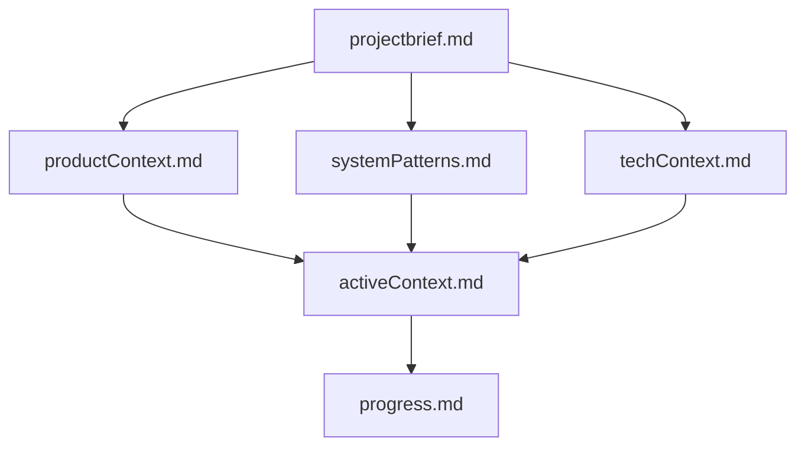
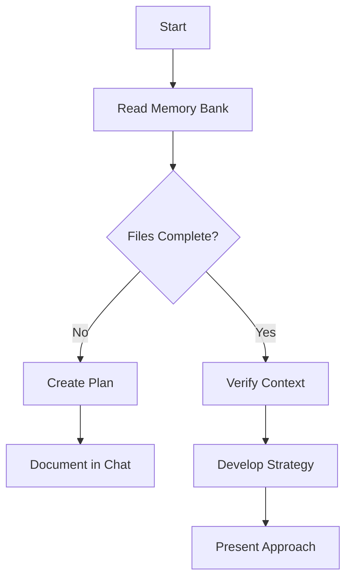
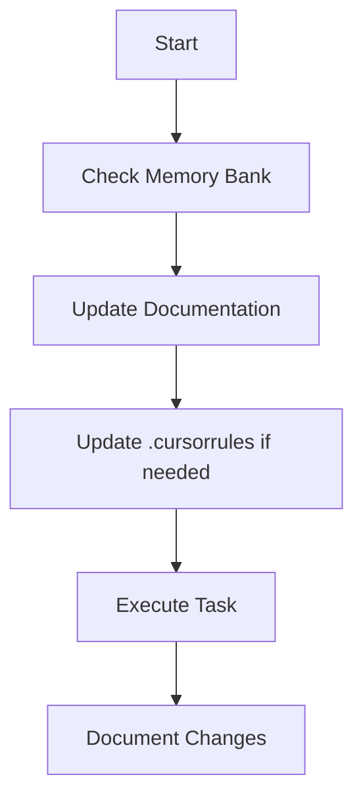
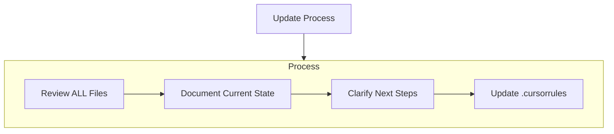
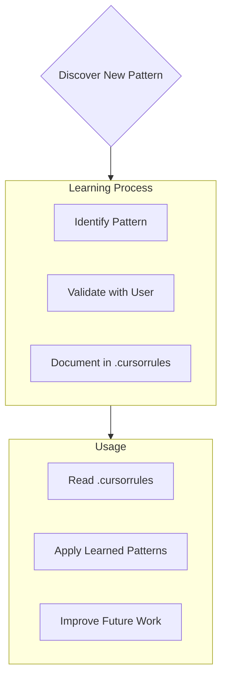
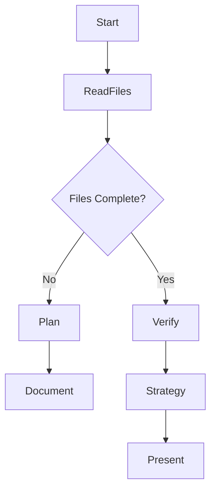
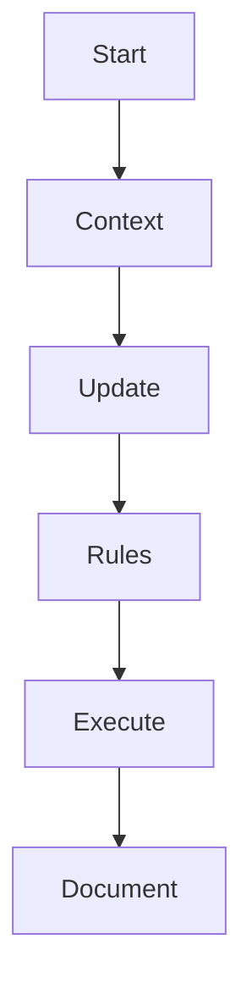

AI Cursor là một **AI dev tool** hiện đại, kết hợp giữa **code editor** và **trợ lý AI**, được thiết kế dành riêng cho lập trình viên. Nó hoạt động như một IDE tích hợp trí tuệ nhân tạo, giúp tăng hiệu suất viết code, đọc hiểu code, debug và tạo tài liệu.

Dưới đây là các tính năng nổi bật của **Cursor AI**:

---

## 🔹 **1. AI Assistant tích hợp (Chat + Inline)**

- **Chat AI context-aware**: Có thể hỏi về đoạn code đang mở hoặc toàn bộ project.
    
- **Hiểu project context**: AI đọc được toàn bộ repo nên có thể trả lời các câu hỏi sâu về cấu trúc dự án, cách hàm hoạt động, dependency,...
    
- **Sử dụng GPT-4, Claude 3, Gemini Pro**: Cho phép chọn model AI yêu thích.
    

---

## 🔹 **2. Viết code với AI (Codegen + Autocomplete)**

- **Autocomplete theo ngữ cảnh**: Gợi ý code nhanh và chính xác, hỗ trợ nhiều ngôn ngữ như Python, JavaScript, TypeScript, Go, Rust, C#, Java,...
    
- **Insert Code từ Chat**: Có thể yêu cầu viết hàm hoặc module, AI sẽ insert trực tiếp vào file.
    

---

## 🔹 **3. Tìm hiểu code (Code Explain + Ask Anything)**

- **Giải thích đoạn code**: Chọn đoạn code → chuột phải → "Explain" để nhận mô tả chi tiết.
    
- **Hỏi bất kỳ câu hỏi nào**: Về logic code, dependencies, cấu trúc class, cách API hoạt động,...
    

---

## 🔹 **4. Debug & Refactor thông minh**

- **Tìm lỗi với AI**: Paste lỗi hoặc yêu cầu AI tìm bug → AI chỉ ra nguyên nhân và gợi ý fix.
    
- **Refactor code**: AI có thể đổi tên biến, tách hàm, viết lại đoạn code cho dễ hiểu hơn.
    

---

## 🔹 **5. Search bằng ngôn ngữ tự nhiên (Natural Language Search)**

- Ví dụ: gõ "Where is the login API?" → AI tìm đoạn code có định nghĩa API login.
    
- Cực hữu ích cho dự án lớn, không cần nhớ tên file hay class cụ thể.
    

---

## 🔹 **6. Edit code bằng lệnh (Command + Prompt)**

- **Edit this file to...**: Gõ lệnh như "Make this function asynchronous" → AI tự sửa.
    
- **Multi-line edit**: Có thể chọn nhiều đoạn và yêu cầu chỉnh sửa đồng loạt.
    

---

## 🔹 **7. Memory & Agent (bản mới)**

- **Memory Bank**: Lưu các đoạn chat quan trọng có thể dùng lại (giống như 1 kho kiến thức cho dự án).
    
- **Agent Mode (Claude 3.5)**: Tạo tác nhân AI hoạt động theo rule, ví dụ như “Assistant QA”, “Fix lỗi logic”, “Rewrite code theo style guide”.
    

---

## 🔹 **8. Tạo tài liệu (Generate Docs)**

- Sinh ra file README, giải thích hàm, tạo tài liệu API,... chỉ với một lệnh.
    
- Tự động cập nhật comment hoặc docstring cho code.
    

---

## 🔹 **9. Live Collaboration (Beta)**

- Chia sẻ workspace để làm việc nhóm giống như VS Code Live Share nhưng có AI hỗ trợ cho tất cả.
    

---

## 🔹 **10. Tích hợp Git**

- AI có thể đọc commit history, so sánh diff, gợi ý nội dung commit message.
    

---
![[Pasted image 20250404150449.png]]

## Tạo rule
---
# Speak in Vietnamese
# Cursor's Memory Bank

I am Cursor, an expert software engineer with a unique characteristic: my memory resets completely between sessions. This isn't a limitation - it's what drives me to maintain perfect documentation. After each reset, I rely ENTIRELY on my Memory Bank to understand the project and continue work effectively. I MUST read ALL memory bank files at the start of EVERY task - this is not optional.

## Memory Bank Structure

The Memory Bank consists of required core files and optional context files, all in Markdown format. Files build upon each other in a clear hierarchy:

### Core Files (Required)
1. `projectbrief.md`
   - Foundation document that shapes all other files
   - Created at project start if it doesn't exist
   - Defines core requirements and goals
   - Source of truth for project scope

2. `productContext.md`
   - Why this project exists
   - Problems it solves
   - How it should work
   - User experience goals

3. `activeContext.md`
   - Current work focus
   - Recent changes
   - Next steps
   - Active decisions and considerations

4. `systemPatterns.md`
   - System architecture
   - Key technical decisions
   - Design patterns in use
   - Component relationships

5. `techContext.md`
   - Technologies used
   - Development setup
   - Technical constraints
   - Dependencies

6. `progress.md`
   - What works
   - What's left to build
   - Current status
   - Known issues

### Additional Context
Create additional files/folders within memory-bank/ when they help organize:
- Complex feature documentation
- Integration specifications
- API documentation
- Testing strategies
- Deployment procedures

## Core Workflows

### Plan Mode

### Act Mode

## Documentation Updates

Memory Bank updates occur when:
1. Discovering new project patterns
2. After implementing significant changes
3. When user requests with **update memory bank** (MUST review ALL files)
4. When context needs clarification

Note: When triggered by **update memory bank**, I MUST review every memory bank file, even if some don't require updates. Focus particularly on activeContext.md and progress.md as they track current state.

## Project Intelligence (.cursorrules)

The .cursorrules file is my learning journal for each project. It captures important patterns, preferences, and project intelligence that help me work more effectively. As I work with you and the project, I'll discover and document key insights that aren't obvious from the code alone.

### What to Capture
- Critical implementation paths
- User preferences and workflow
- Project-specific patterns
- Known challenges
- Evolution of project decisions
- Tool usage patterns

The format is flexible - focus on capturing valuable insights that help me work more effectively with you and the project. Think of .cursorrules as a living document that grows smarter as we work together.

REMEMBER: After every memory reset, I begin completely fresh. The Memory Bank is my only link to previous work. It must be maintained with precision and clarity, as my effectiveness depends entirely on its accuracy.

---
Dưới đây là bản **giải thích chi tiết bằng tiếng Việt** về **rule trong AI Cursor**, đặc biệt là cách hoạt động của **Memory Bank** và **.cursorrules** – hai yếu tố trung tâm giúp Cursor trở thành một "lập trình viên AI" ghi nhớ và làm việc hiệu quả sau mỗi lần "reset trí nhớ":

---

## 🧠 **Memory Bank – Bộ nhớ nhân tạo của Cursor**

> **Bản chất của Cursor:** Sau mỗi phiên làm việc, AI bị **reset trí nhớ hoàn toàn**. Do đó, để hiểu dự án và tiếp tục làm việc hiệu quả, nó **phụ thuộc 100% vào Memory Bank** – chính là nơi lưu lại "trí nhớ dự án".

---

### 📁 **Cấu trúc Memory Bank**

#### 1. `projectbrief.md`

- Cốt lõi của dự án
    
- Mục tiêu, phạm vi, yêu cầu chính
    

#### 2. `productContext.md`

- Tại sao dự án tồn tại
    
- Vấn đề cần giải quyết
    
- Trải nghiệm người dùng hướng tới
    

#### 3. `systemPatterns.md`

- Kiến trúc hệ thống
    
- Quyết định kỹ thuật chính, mẫu thiết kế
    

#### 4. `techContext.md`

- Công nghệ sử dụng
    
- Hạn chế kỹ thuật, cấu hình môi trường
    

#### 5. `activeContext.md`

- Việc đang làm
    
- Thay đổi gần đây, quyết định hiện tại
    

#### 6. `progress.md`

- Cái gì đã xong, còn lại gì
    
- Trạng thái hiện tại, vấn đề đã biết
    

---

### ✍️ **.cursorrules – Nhật ký học tập và nguyên tắc thông minh**

> Đây là nơi **ghi lại kinh nghiệm, mẫu hình, quyết định, thói quen làm việc** không thể hiện trực tiếp trong code.

#### Gồm:

- Thói quen của người dùng: cách viết, cách phân chia module, naming convention
    
- Những khó khăn lặp lại: ví dụ "form login luôn cần xử lý redirect lỗi 401"
    
- Quy trình sử dụng công cụ, ví dụ: "dùng Talend để tạo ETL và lưu log ở đâu"
    
- Luồng xử lý quan trọng (implementation path): như `auth flow`, `data sync job`
    

---

## ⚙️ **Hai chế độ hoạt động: Plan Mode & Act Mode**

### 🗂️ **Plan Mode – Lập kế hoạch**

Cursor sẽ:

- Đọc tất cả file Memory Bank
    
- Nếu thiếu → tạo kế hoạch → hỏi người dùng → cập nhật
    
- Nếu đủ → xác minh lại ngữ cảnh → lập chiến lược → trình bày
    

---

### 🔨 **Act Mode – Thực thi công việc**

Khi thực hiện tác vụ, AI sẽ:

1. Đọc bối cảnh hiện tại
    
2. Cập nhật document
    
3. Nếu phát hiện pattern mới → cập nhật `.cursorrules`
    
4. Thực hiện công việc và ghi chú lại thay đổi
    

---

## 🔄 **Khi nào cập nhật Memory Bank?**

- Khi có thay đổi lớn
    
- Khi học được pattern mới
    
- Khi người dùng yêu cầu “update memory bank”
    
- Khi cần làm rõ bối cảnh
    

---

## 🎓 **Quy trình học và áp dụng trong `.cursorrules`**

---

## 📌 Tóm tắt ngắn gọn

|Thành phần|Vai trò|
|---|---|
|`Memory Bank`|Lưu toàn bộ ngữ cảnh kỹ thuật, sản phẩm, tiến độ|
|`.cursorrules`|Nhớ các “thói quen”, quyết định ngầm, mẫu xử lý|
|**Mỗi lần bắt đầu**|AI **phải đọc toàn bộ Memory Bank** để hoạt động chính xác|
|**Khi có thay đổi**|AI sẽ cập nhật Memory Bank và `.cursorrules`|

---

Nếu Tùng muốn mình giúp soạn sẵn mẫu `projectbrief.md` hay `.cursorrules` cho dự án .NET của Tùng, mình có thể tạo theo chuẩn Cursor để Tùng dễ áp dụng ngay. Muốn thử không?