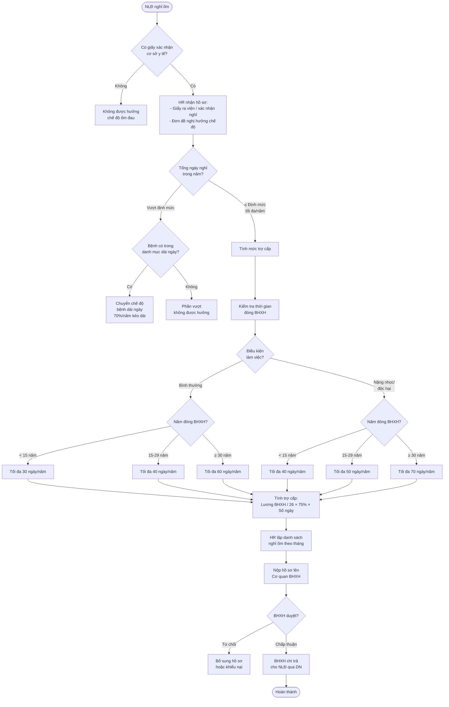

# Chế độ Nghỉ Ốm 14 Ngày (Ins_Nghi14Ngay)

## Tổng quan

Chế độ nghỉ ốm **14 ngày** áp dụng cho người lao động làm việc trong **điều kiện bình thường**, có thời gian đóng bảo hiểm xã hội **dưới 15 năm**, được hưởng tối đa **30 ngày/năm** khi ốm đau — trong đó nhóm nghỉ ngắn ngày (≤ 14 ngày liên tục) là trường hợp phổ biến nhất cần xử lý trong hệ thống HRM.
![[Pasted image 20260426181424.png]]

> Tài liệu nguồn: `Ins_Nghi14Ngay.png` — sơ đồ quy trình nghiệp vụ INS

---

## 1. Điều kiện hưởng chế độ nghỉ ốm

| Tiêu chí | Quy định |
|---|---|
| Đối tượng | NLĐ đang tham gia BHXH bắt buộc |
| Điều kiện bệnh | Có giấy xác nhận nghỉ ốm của cơ sở y tế có thẩm quyền |
| Điều kiện đóng BHXH | Không yêu cầu thời gian tối thiểu (khác với thai sản) |
| Loại bệnh | Bệnh thông thường (không phải bệnh dài ngày trong danh mục Bộ Y tế) |

---

## 2. Số ngày nghỉ tối đa theo điều kiện làm việc

### 2.1 Điều kiện bình thường

| Thời gian đóng BHXH | Ngày nghỉ tối đa/năm |
|---|---|
| < 15 năm | **30 ngày** |
| 15 – 29 năm | **40 ngày** |
| ≥ 30 năm | **60 ngày** |

### 2.2 Điều kiện nặng nhọc, độc hại, nguy hiểm

| Thời gian đóng BHXH | Ngày nghỉ tối đa/năm |
|---|---|
| < 15 năm | **40 ngày** |
| 15 – 29 năm | **50 ngày** |
| ≥ 30 năm | **70 ngày** |

> **Lưu ý:** "14 ngày" là ngưỡng nghỉ ốm liên tục — nếu nghỉ ≤ 14 ngày: doanh nghiệp nộp hồ sơ theo đợt. Nếu > 14 ngày: xem xét chuyển sang bệnh dài ngày.

---

## 3. Mức hưởng trợ cấp ốm đau

```
Mức trợ cấp = (Tiền lương đóng BHXH tháng trước nghỉ ốm / 26) × 75% × Số ngày nghỉ
```

| Yếu tố | Giá trị |
|---|---|
| Tỷ lệ hưởng | 75% tiền lương đóng BHXH |
| Số ngày công tính | 26 ngày/tháng |
| Nguồn chi trả | Quỹ BHXH (không phải doanh nghiệp) |

---

## 4. Quy trình xử lý trong hệ thống HRM



---

## 5. Hồ sơ hưởng chế độ ốm đau

### 5.1 Nghỉ ốm tại nhà (không điều trị nội trú)

- ☐ Giấy chứng nhận nghỉ việc hưởng BHXH (do cơ sở y tế cấp)
- ☐ Đơn đề nghị hưởng chế độ ốm đau (theo mẫu BHXH)

### 5.2 Điều trị nội trú

- ☐ Giấy ra viện (bản gốc hoặc bản sao y bản chính)
- ☐ Trích sao bệnh án (nếu cần)
- ☐ Đơn đề nghị hưởng chế độ (theo mẫu BHXH)

---

## 6. Thời hạn nộp hồ sơ

| Mốc thời gian | Bên thực hiện |
|---|---|
| Trong vòng **45 ngày** kể từ ngày trở lại làm việc | NLĐ nộp hồ sơ cho doanh nghiệp (HR) |
| Trong vòng **10 ngày** kể từ khi nhận đủ hồ sơ | DN nộp lên cơ quan BHXH |

---

## 7. Xử lý trong phần mềm HRM (FIT-HRM / Bizzi)

### Luồng nhập liệu

```
Menu INS → Chế độ ốm đau → Nhập ngày nghỉ → Gắn loại nghỉ "Nghỉ ốm"
→ Hệ thống tự tính mức hưởng → Xuất danh sách → Nộp BHXH
```

### Các trường quan trọng cần kiểm tra

| Trường | Mô tả |
|---|---|
| `MaNhanVien` | Mã nhân viên nghỉ ốm |
| `TuNgay` / `DenNgay` | Khoảng thời gian nghỉ |
| `SoNgayNghi` | Số ngày nghỉ thực tế |
| `NamDongBHXH` | Số năm đóng BHXH (để xác định định mức) |
| `DieuKienLamViec` | Bình thường / Nặng nhọc / Độc hại |
| `LuongDongBHXH` | Tiền lương đóng BHXH tháng trước |
| `MucTroCap` | Kết quả tính = LuongDongBHXH / 26 × 75% × SoNgay |
| `TrangThai` | Chờ duyệt / Đã nộp BHXH / Đã thanh toán |

---

## 8. Lưu ý nghiệp vụ thường gặp

> ⚠️ **Nghỉ vào ngày lễ, nghỉ Tết:** Ngày lễ, Tết **không tính** vào số ngày được hưởng trợ cấp ốm đau (chỉ tính ngày làm việc thực tế).

> ⚠️ **Nghỉ ốm nhiều đợt trong năm:** Cộng dồn tất cả các đợt trong năm dương lịch để kiểm tra có vượt định mức không.

> ⚠️ **Nghỉ ốm sau thời gian thử việc:** NLĐ trong thời gian thử việc **không đóng BHXH** → không được hưởng chế độ ốm đau từ quỹ BHXH.

> ⚠️ **Chuyển bệnh dài ngày:** Nếu cùng một bệnh và nghỉ ốm liên tục vượt định mức, cần xét chuyển sang **chế độ bệnh dài ngày** (hưởng 65% hoặc 70% tùy loại bệnh và thời gian đóng BHXH).

---

## 9. Căn cứ pháp lý

| Văn bản | Nội dung liên quan |
|---|---|
| Luật BHXH 2014 (sửa đổi) | Điều 25–27: Chế độ ốm đau |
| Thông tư 59/2015/TT-BLĐTBXH | Hướng dẫn chi tiết chế độ ốm đau |
| Quyết định 166/QĐ-BHXH | Quy trình giải quyết hưởng chế độ BHXH |


