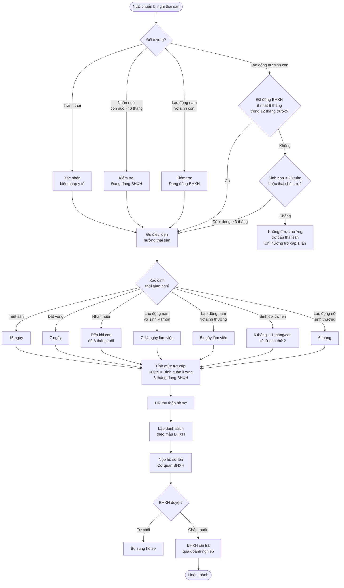

# Chế độ Nghỉ Thai Sản (NghiThaiSan)

## Tổng quan

Chế độ thai sản là quyền lợi của người lao động (NLĐ) tham gia BHXH bắt buộc khi sinh con, nhận nuôi con nuôi, hoặc thực hiện các biện pháp tránh thai. Đây là một trong những chế độ có giá trị lớn nhất trong hệ thống BHXH Việt Nam, với mức hưởng **100% tiền lương đóng BHXH** trong suốt thời gian nghỉ.
![[Pasted image 20260426181736.png]]

> Tài liệu nguồn: `NghiThaiSan.png` — sơ đồ quy trình nghiệp vụ INS

---

## 1. Điều kiện hưởng chế độ thai sản

### 1.1 Lao động nữ sinh con

| Tiêu chí | Quy định |
|---|---|
| Đóng BHXH | Ít nhất **6 tháng** trong **12 tháng trước khi sinh** |
| Trường hợp đặc biệt | Nếu lao động nữ đóng BHXH < 6 tháng, bị sinh non hoặc thai chết lưu thì chỉ cần đóng BHXH từ **3 tháng** trở lên trong 12 tháng trước sinh |
| Loại hợp đồng | Đang trong thời gian đóng BHXH bắt buộc |

### 1.2 Lao động nam có vợ sinh con

| Tiêu chí | Quy định |
|---|---|
| Điều kiện | Đang đóng BHXH tại thời điểm vợ sinh |
| Không yêu cầu | Thời gian đóng BHXH tối thiểu |

### 1.3 Nhận nuôi con nuôi dưới 6 tháng tuổi

- NLĐ (cả nam và nữ) đang đóng BHXH tại thời điểm nhận nuôi con nuôi

### 1.4 Thực hiện biện pháp tránh thai

- Đặt vòng tránh thai hoặc triệt sản → được hưởng chế độ theo số ngày nghỉ được bác sĩ chỉ định

---

## 2. Thời gian nghỉ thai sản

### 2.1 Lao động nữ sinh con

| Trường hợp | Thời gian nghỉ |
|---|---|
| Sinh con bình thường | **6 tháng** |
| Sinh đôi trở lên | 6 tháng + thêm **1 tháng/mỗi con** kể từ con thứ 2 |
| Sinh non (< 28 tuần) | Tối thiểu **4 tháng** |
| Lao động nữ làm việc trong điều kiện nặng nhọc, độc hại | Nghỉ **trước khi sinh** từ 1–2 tháng tùy điều kiện |

> **Lưu ý:** Ít nhất **2 tháng** trong 6 tháng thai sản phải nghỉ sau khi sinh

### 2.2 Lao động nam có vợ sinh con

| Trường hợp | Thời gian nghỉ |
|---|---|
| Vợ sinh thường | **5 ngày làm việc** |
| Vợ sinh phẫu thuật / Sinh con ≤ 32 tuần | **7 ngày làm việc** |
| Vợ sinh đôi | **10 ngày làm việc** |
| Vợ sinh đôi + phẫu thuật | **14 ngày làm việc** |
| Vợ sinh ba trở lên | Thêm **3 ngày/mỗi con** kể từ con thứ 3 |

> **Thời hạn:** Trong vòng **30 ngày đầu** kể từ ngày vợ sinh

### 2.3 Nhận nuôi con nuôi

| Trường hợp | Thời gian nghỉ |
|---|---|
| Nhận nuôi con nuôi < 6 tháng tuổi | Nghỉ đến khi con **đủ 6 tháng tuổi** |

### 2.4 Thực hiện biện pháp tránh thai

| Biện pháp | Thời gian nghỉ |
|---|---|
| Đặt vòng tránh thai | **7 ngày** |
| Triệt sản | **15 ngày** |

---

## 3. Mức hưởng trợ cấp thai sản

### 3.1 Trợ cấp trong thời gian nghỉ

```
Mức hưởng/tháng = 100% × Mức lương bình quân đóng BHXH 6 tháng trước khi nghỉ thai sản
```

| Yếu tố | Giá trị |
|---|---|
| Tỷ lệ hưởng | **100%** tiền lương đóng BHXH |
| Căn cứ tính lương | Bình quân **6 tháng** đóng BHXH liền kề trước khi nghỉ |
| Số ngày công | 30 ngày/tháng (trợ cấp thai sản tính theo tháng, không phải 26 ngày) |
| Nguồn chi trả | Quỹ BHXH (100%, doanh nghiệp không phải trả) |

### 3.2 Trợ cấp một lần khi sinh con hoặc nhận nuôi con nuôi

```
Trợ cấp một lần = 2 × Mức lương cơ sở × Số con
```

| Thời điểm áp dụng | Điều kiện |
|---|---|
| Lao động nữ | Khi sinh con (bất kể điều kiện đóng BHXH) |
| Lao động nam | Khi vợ sinh con, nếu lao động nữ (vợ) không đủ điều kiện hưởng thai sản |

> **Lưu ý 2026:** Mức lương cơ sở = 2.340.000 đồng/tháng → Trợ cấp 1 lần = **4.680.000 đồng/con**

### 3.3 Trợ cấp dưỡng sức sau thai sản

| Điều kiện | Mức hưởng |
|---|---|
| NLĐ chưa phục hồi sức khỏe sau khi hết nghỉ thai sản | Nghỉ dưỡng sức từ **5–10 ngày** trong năm |
| Mức trợ cấp | 30% × Lương cơ sở/ngày |

> Năm 2026: 30% × 2.340.000 / 30 = **23.400 đồng/ngày** (tham khảo)

---

## 4. Quy trình xử lý trong hệ thống HRM



---

## 5. Hồ sơ hưởng chế độ thai sản

### 5.1 Lao động nữ sinh con (đẻ thường)

- ☐ Bản sao giấy khai sinh hoặc trích lục khai sinh của con
- ☐ Nếu con chết ngay sau sinh: Trích lục khai tử hoặc giấy xác nhận chết của cơ sở y tế
- ☐ Danh sách lao động đề nghị hưởng chế độ (mẫu BHXH)

### 5.2 Lao động nữ sinh con có phẫu thuật

- ☐ Bản sao giấy khai sinh hoặc trích lục khai sinh
- ☐ Giấy tờ chứng minh sinh mổ (giấy ra viện ghi rõ phương thức sinh)

### 5.3 Lao động nam có vợ sinh con

- ☐ Bản sao giấy khai sinh hoặc trích lục khai sinh của con
- ☐ Bản sao giấy đăng ký kết hôn (hoặc xác nhận chung sống)

### 5.4 Nhận nuôi con nuôi

- ☐ Bản sao quyết định công nhận việc nuôi con nuôi của cơ quan có thẩm quyền

### 5.5 Thực hiện biện pháp tránh thai

- ☐ Giấy chứng nhận nghỉ việc hưởng BHXH (do cơ sở y tế cấp)

---

## 6. Thời hạn nộp hồ sơ

| Mốc thời gian | Bên thực hiện |
|---|---|
| Trong vòng **45 ngày** kể từ ngày trở lại làm việc | NLĐ nộp hồ sơ cho HR/doanh nghiệp |
| Trong vòng **10 ngày** kể từ khi nhận đủ hồ sơ | Doanh nghiệp nộp lên cơ quan BHXH |

---

## 7. Xử lý trong phần mềm HRM (FIT-HRM / Bizzi)

### Luồng nhập liệu

```
Menu INS → Chế độ thai sản → Chọn loại thai sản
→ Nhập thông tin NLĐ và thời gian nghỉ
→ Hệ thống tự tính mức hưởng (100% lương BQ 6 tháng)
→ Xuất danh sách → Nộp BHXH
```

### Các trường quan trọng cần kiểm tra

| Trường | Mô tả |
|---|---|
| `MaNhanVien` | Mã nhân viên hưởng thai sản |
| `LoaiThaiSan` | LĐ nữ sinh / LĐ nam / Nhận nuôi / Tránh thai |
| `NgayBatDauNghi` | Ngày bắt đầu nghỉ thai sản |
| `NgayDuKienSinh` | Ngày dự kiến sinh (để tính thời gian trước sinh) |
| `NgaySinhThucTe` | Ngày sinh thực tế |
| `SoCon` | Số con sinh ra (ảnh hưởng số ngày nghỉ và trợ cấp 1 lần) |
| `CoPhauThuat` | Có phẫu thuật không (ảnh hưởng thời gian nghỉ của LĐ nam) |
| `LuongBQDongBHXH` | Bình quân lương đóng BHXH 6 tháng liền kề |
| `MucHuong` | 100% × LuongBQDongBHXH |
| `TrocapMotLan` | 2 × Lương cơ sở × Số con |
| `TrangThai` | Chờ duyệt / Đã nộp BHXH / Đã thanh toán |

---

## 8. So sánh các chế độ liên quan đến sinh con

| Chế độ | Đối tượng | Điều kiện BHXH | Mức hưởng | Thời gian |
|---|---|---|---|---|
| Thai sản chính | LĐ nữ | ≥ 6 tháng / 12 tháng | 100% lương BQ | 6 tháng |
| Nghỉ sinh của chồng | LĐ nam | Đang đóng | 100% lương BQ | 5-14 ngày LV |
| Trợ cấp 1 lần | LĐ nữ/nam | Không bắt buộc | 2 × Lương CS | Một lần |
| Dưỡng sức sau sinh | LĐ nữ | Đủ điều kiện thai sản | 30% Lương CS/ngày | 5-10 ngày |

---

## 9. Lưu ý nghiệp vụ thường gặp

> ⚠️ **Tính thời gian 6 tháng đóng BHXH:** Tính ngược từ tháng trước tháng sinh con. Ví dụ: sinh tháng 4/2026 → tính từ tháng 4/2025 đến tháng 3/2026 (12 tháng), cần ít nhất 6 tháng đóng trong khoảng này.

> ⚠️ **Nghỉ trước sinh:** NLĐ có thể nghỉ trước khi sinh nhưng thời gian nghỉ trước sinh **tính vào 6 tháng** thai sản. Tối thiểu phải có **2 tháng sau sinh**.

> ⚠️ **Phụ cấp của DN không tính:** Chỉ tính tiền lương đóng BHXH, không tính các khoản phụ cấp, thưởng mà doanh nghiệp trả ngoài lương cơ bản.

> ⚠️ **Trường hợp thai chết lưu hoặc con chết sau sinh:** Vẫn được hưởng nguyên 6 tháng thai sản (không bị trừ).

> ⚠️ **Lao động nam bổ sung ngày nghỉ:** Nếu vợ sinh mổ + sinh đôi trở lên, cần cộng dồn số ngày theo từng điều kiện. Tối đa không quá 14 ngày làm việc cho sinh đôi mổ.

> ⚠️ **Dưỡng sức sau thai sản:** Chỉ được hưởng trong **năm dương lịch** đó; không được chuyển sang năm sau. Thời gian cụ thể do cơ sở y tế và người sử dụng lao động phối hợp xác nhận.

---

## 10. Căn cứ pháp lý

| Văn bản | Nội dung liên quan |
|---|---|
| Luật BHXH 2014 (sửa đổi) | Điều 30–41: Chế độ thai sản |
| Nghị định 115/2015/NĐ-CP | Quy định chi tiết Luật BHXH bắt buộc |
| Thông tư 59/2015/TT-BLĐTBXH | Hướng dẫn chi tiết chế độ thai sản |
| Quyết định 166/QĐ-BHXH | Quy trình giải quyết hưởng chế độ BHXH |
| Nghị quyết 27/2021/QĐ-TTg | Lương cơ sở áp dụng (tham khảo mức hiện hành) |

