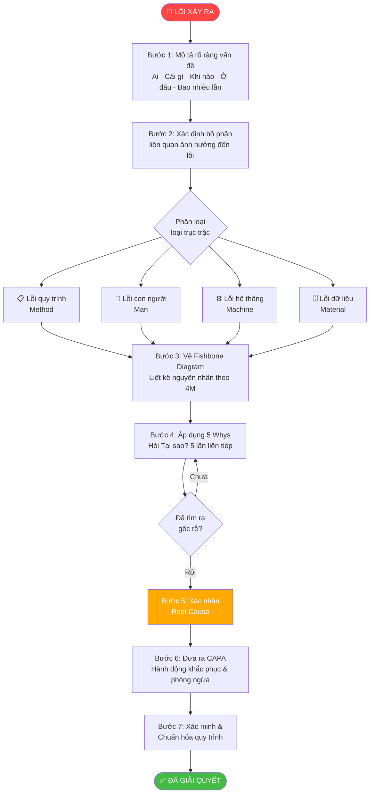
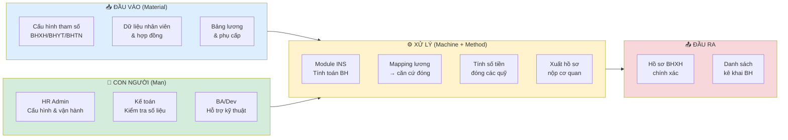
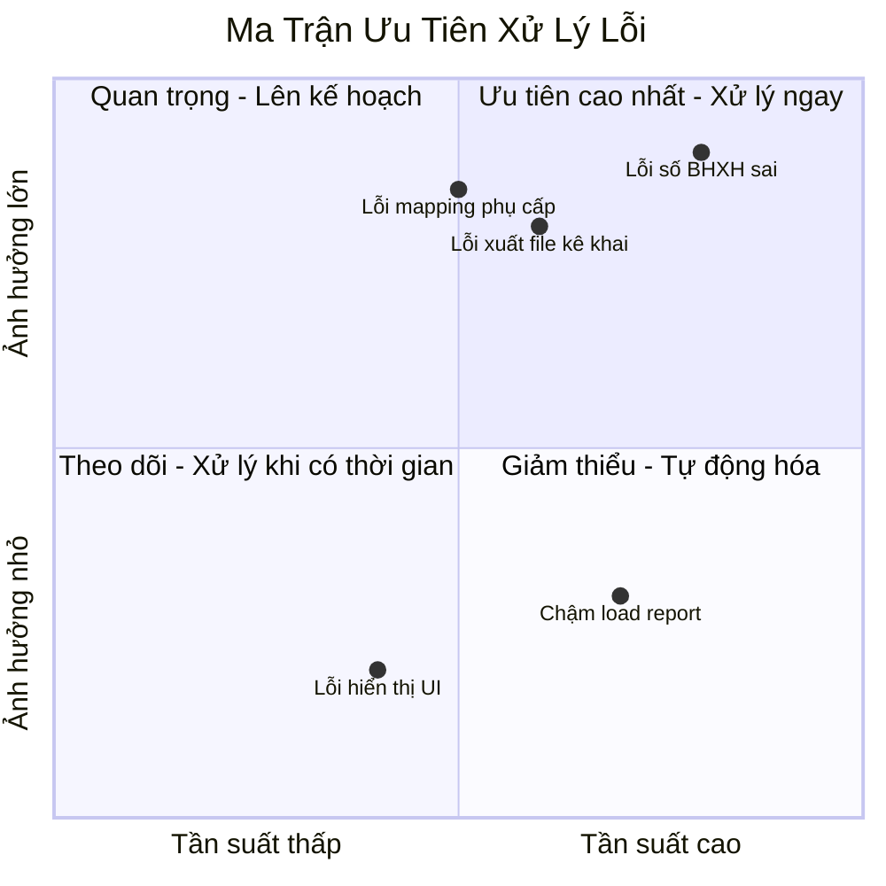

# Phương Pháp Truy Nguyên Nhân (Nhật Bản) — 4M Analysis

> **Mục đích**: Khi lỗi xảy ra trong hệ thống HRM/INS, tài liệu này là **kim chỉ nam** để truy nguyên nhân gốc rễ theo phương pháp Nhật Bản — dựa vào bộ phận liên quan ảnh hưởng đến lỗi, loại trục trặc, quy trình định vị lỗi và khung 4M.

![[Pasted image 20260426183020.png]]

---

## 1. Nền Tảng Lý Thuyết

### 1.1 Nguồn Gốc
Phương pháp **4M Root Cause Analysis** (Phân tích nguyên nhân gốc rễ 4M) xuất phát từ **Toyota Production System (TPS)** và triết lý **Kaizen** của Nhật Bản. Công cụ trực quan hóa đi kèm là **Biểu đồ Xương Cá (Fishbone / Ishikawa Diagram)** do **Tiến sĩ Kaoru Ishikawa** phát triển thập niên 1960.

### 1.2 Khung 4M

| Chữ M | Tiếng Anh | Tiếng Việt | Ví dụ lỗi trong HRM/INS |
|-------|-----------|------------|--------------------------|
| **M1** | **Man** | Con người | Nhập liệu sai, thiếu kỹ năng vận hành, cấu hình nhầm |
| **M2** | **Machine** | Máy móc / Hệ thống | Server lỗi, timeout, bug code, database crash |
| **M3** | **Material** | Dữ liệu / Nguyên liệu đầu vào | Dữ liệu master sai, file import lỗi, thiếu tham số |
| **M4** | **Method** | Phương pháp / Quy trình | Quy trình nghiệp vụ sai, SOP lỗi thời, thiếu bước kiểm tra |

> **Mở rộng**: Một số tổ chức dùng **5M** (thêm Measurement — Đo lường) hoặc **6M** (thêm Environment — Môi trường/Hạ tầng).

---

## 2. Biểu Đồ Xương Cá (Fishbone Diagram)

```
           Man                 Machine
         (Con người)          (Hệ thống)
            \                   /
             \                 /
              \               /
               ──────────────────────→ [LỖI / VẤN ĐỀ]
              /               \
             /                 \
            /                   \
        Material              Method
      (Dữ liệu đầu vào)     (Quy trình)
```

---

## 3. Quy Trình Truy Nguyên Nhân (Step-by-Step)



---

## 4. Phân Tích 4M Chi Tiết Cho HRM/INS

### 4.1 M1 — Man (Con Người)

**Câu hỏi kiểm tra:**
- [ ] Người dùng có được đào tạo đúng nghiệp vụ không?
- [ ] Có phải thao tác nhập liệu sai không?
- [ ] Cấu hình hệ thống có được thực hiện đúng người có quyền không?
- [ ] Có sự thay đổi nhân sự phụ trách gần đây không?
- [ ] Có thao tác nào được thực hiện vội vàng/thiếu kiểm tra không?

**Ví dụ lỗi INS:**
- Nhân viên HR nhập sai mức lương làm căn cứ BHXH
- Cấu hình mức đóng BHYT bị sai do người mới chưa quen hệ thống
- Quên cập nhật thay đổi mức đóng khi có quyết định điều chỉnh

### 4.2 M2 — Machine (Hệ Thống / Máy Móc)

**Câu hỏi kiểm tra:**
- [ ] Server/database có vấn đề không?
- [ ] Có lỗi code/bug trong module INS không?
- [ ] Có timeout hay performance issue không?
- [ ] Phiên bản phần mềm có được cập nhật mới nhất không?
- [ ] Có conflict giữa các module không (Lương ↔ BHXH)?

**Ví dụ lỗi INS:**
- Bug tính sai BHXH khi có kỳ lương lẻ tháng
- Lỗi round số khi tính BHYT phần trăm
- Module INS không đồng bộ được với Payroll sau khi chạy lương

### 4.3 M3 — Material (Dữ Liệu Đầu Vào)

**Câu hỏi kiểm tra:**
- [ ] Dữ liệu master (danh mục BHXH, mức lương tối thiểu) có đúng không?
- [ ] File import/excel mẫu có đúng format không?
- [ ] Thông tin nhân viên (loại hợp đồng, mức lương, phụ cấp) có đầy đủ không?
- [ ] Tham số hệ thống (tỷ lệ đóng BHXH/BHYT/BHTN) có được cập nhật không?
- [ ] Dữ liệu từ module khác truyền sang có chính xác không?

**Ví dụ lỗi INS:**
- Quên cập nhật mức lương tối thiểu vùng trong hệ thống
- Tỷ lệ đóng BHXH năm mới chưa được cấu hình
- Nhân viên có hợp đồng đặc biệt (thời vụ, CTV) không được map đúng loại đóng BH

### 4.4 M4 — Method (Phương Pháp / Quy Trình)

**Câu hỏi kiểm tra:**
- [ ] Quy trình xử lý nghiệp vụ INS có đúng không?
- [ ] Thứ tự thực hiện các bước có đúng không?
- [ ] Có bước kiểm tra trung gian không?
- [ ] SOP/hướng dẫn có được cập nhật theo quy định mới không?
- [ ] Quy trình phê duyệt có đủ cấp ký không?

**Ví dụ lỗi INS:**
- Chạy INS trước khi chốt bảng lương → số liệu sai
- Không chạy phân bổ chi phí BH theo đúng thứ tự
- Thiếu bước xác nhận cuối tháng trước khi xuất hồ sơ nộp cơ quan

---

## 5. Kỹ Thuật 5 Whys — Đào Sâu Nguyên Nhân

**Ví dụ thực tế (Lỗi INS):**

```
🚨 Vấn đề: Số liệu BHXH trên hệ thống sai so với sổ BHXH

❓ Tại sao số liệu sai?
→ Vì mức lương làm căn cứ đóng BHXH bị tính thiếu

❓ Tại sao mức lương bị tính thiếu?
→ Vì phụ cấp chức vụ không được đưa vào căn cứ đóng

❓ Tại sao phụ cấp không được đưa vào?
→ Vì cấu hình mapping loại phụ cấp → BHXH chưa được thiết lập

❓ Tại sao chưa được thiết lập?
→ Vì khi triển khai ban đầu, nghiệp vụ BHXH chưa được confirm rõ

❓ Tại sao chưa confirm?
→ Vì không có checklist nghiệm thu riêng cho module INS ✅ ROOT CAUSE
```

**→ Hành động khắc phục:** Tạo checklist nghiệm thu chi tiết cho module INS, bao gồm kiểm tra mapping từng loại phụ cấp vào căn cứ đóng BHXH.

---

## 6. Ma Trận CAPA (Corrective & Preventive Action)

| Nguyên nhân gốc rễ | Hành động khắc phục (CA) | Hành động phòng ngừa (PA) | Người chịu trách nhiệm | Deadline |
|---|---|---|---|---|
| Mapping phụ cấp → BHXH thiếu | Fix cấu hình, re-run INS | Checklist nghiệm thu INS module | BA/Dev | Ngay lập tức |
| Tỷ lệ BHXH chưa cập nhật | Cập nhật parameter | Lịch nhắc nhở đầu năm/kỳ | HR Admin | Đầu năm |
| Bug tính sai kỳ lẻ tháng | Hotfix code | Unit test bổ sung | Dev | Sprint tiếp theo |
| Quy trình chưa rõ ràng | Cập nhật SOP | Đào tạo lại HR | PM/BA | 2 tuần |

---

## 7. Flowchart Định Vị Lỗi INS Theo Bộ Phận



---

## 8. Checklist Truy Nguyên Nhân Nhanh (Khi Lỗi Xảy Ra)

### Bước 1 — Thu thập thông tin (5 phút)
- [ ] Lỗi gì? (mô tả cụ thể)
- [ ] Lần đầu hay lặp lại?
- [ ] Bao nhiêu nhân viên/bản ghi bị ảnh hưởng?
- [ ] Xảy ra sau thay đổi gì? (cập nhật hệ thống, thay đổi dữ liệu, thay đổi quy trình?)

### Bước 2 — Kiểm tra nhanh 4M (15 phút)
- [ ] **Man**: Ai thực hiện? Đúng quy trình chưa?
- [ ] **Machine**: Hệ thống có lỗi kỹ thuật không? Log lỗi là gì?
- [ ] **Material**: Dữ liệu đầu vào có đúng không? Tham số cấu hình?
- [ ] **Method**: Thứ tự thực hiện có đúng không?

### Bước 3 — Xác định hypothesis (10 phút)
- [ ] Chỉ ra 1-3 nguyên nhân có khả năng cao nhất
- [ ] Xếp thứ tự ưu tiên theo xác suất

### Bước 4 — Kiểm chứng (30 phút)
- [ ] Test từng hypothesis
- [ ] Reproduce lỗi để xác nhận

### Bước 5 — Fix & Document
- [ ] Giải quyết nguyên nhân gốc rễ
- [ ] Ghi lại vào ticket/log
- [ ] Cập nhật SOP nếu cần

---

## 9. Phân Loại Lỗi Theo Mức Độ Ưu Tiên (Priority Matrix)



---

## 10. Bài Học & Lưu Ý Quan Trọng

> **Nguyên tắc vàng**: Đừng xử lý triệu chứng — hãy tìm **nguyên nhân gốc rễ**. Một lỗi được fix đúng cách không bao giờ tái phát.

### Các Sai Lầm Thường Gặp Khi Truy Nguyên Nhân
1. **Dừng lại quá sớm** — tìm được nguyên nhân đầu tiên đã cho là xong
2. **Blame game** — đổ lỗi cho con người thay vì tìm lỗi hệ thống/quy trình
3. **Không reproduce được** — fix mà không hiểu rõ cơ chế lỗi
4. **Không document** — lỗi tương tự sẽ tái phát sau vài tháng
5. **Không phòng ngừa** — chỉ khắc phục mà không ngăn chặn tái phát

### Nguyên Tắc Nhật Bản Cần Nhớ
- **Genchi Genbutsu (現地現物)**: Đến tận nơi xảy ra lỗi, xem trực tiếp
- **5 Whys (なぜなぜ分析)**: Hỏi tại sao ít nhất 5 lần
- **Kaizen (改善)**: Mỗi lần fix là cơ hội cải tiến quy trình
- **Poka-Yoke (ポカヨケ)**: Thiết kế để không thể mắc lỗi đó lần nữa

---

## 11. Tham Chiếu & Liên Kết

- **Áp dụng cho**: Module INS (Bảo hiểm xã hội, Y tế, Thất nghiệp) trong hệ thống HRM
- **Kết hợp với**: PDCA Cycle, A3 Report, 8D Problem Solving
- **Tiêu chuẩn liên quan**: ISO 9001, IATF 16949, Toyota Production System

---

*Ghi chú được tạo từ hình ảnh phương pháp Truy Nguyên Nhân của Nhật Bản (4M Analysis) — 2026-04-26*
