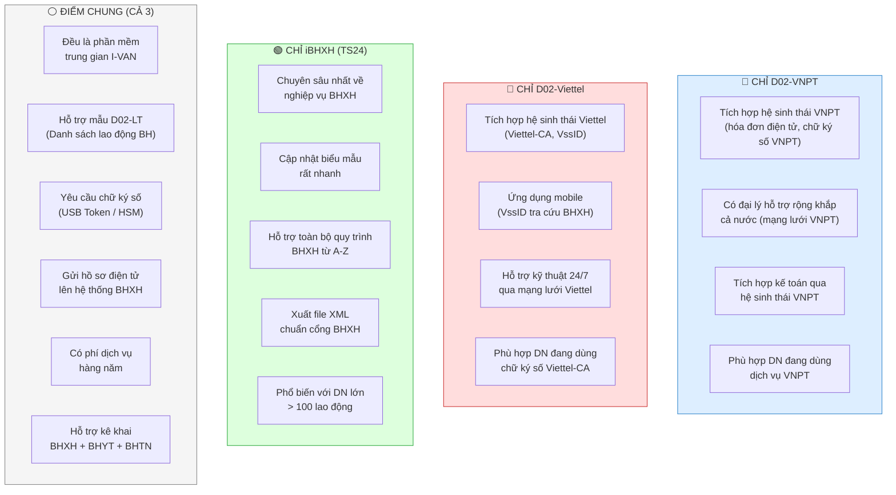
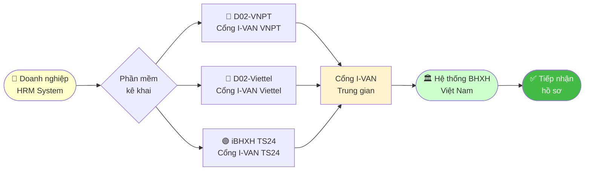
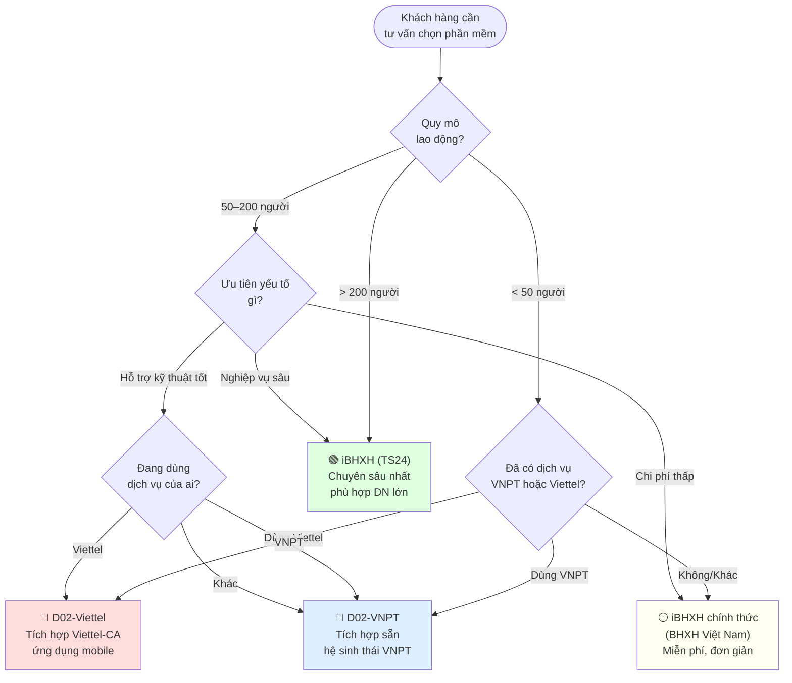

# Sự Khác Nhau Giữa D02-VNPT — D02-Viettel — iBHXH (TS24)

> **Nguồn**: Biểu đồ Venn `Venn_D02_SuKhacNhau.png` — phân tích sự khác biệt và điểm giao thoa giữa 3 phần mềm/cổng kê khai BHXH điện tử phổ biến tại Việt Nam trong bối cảnh triển khai HRM.

![[Pasted image 20260426184322.png]]

---

## 1. Tổng Quan 3 Phần Mềm / Cổng Dịch Vụ

| Phần mềm | Đơn vị cung cấp | Loại hình | Chi phí |
|----------|----------------|-----------|---------|
| **D02-VNPT** | Tập đoàn VNPT | Phần mềm trung gian I-VAN | Có phí |
| **D02-Viettel** | Tập đoàn Viettel | Phần mềm trung gian I-VAN | Có phí |
| **iBHXH (TS24)** | Công ty CP Công nghệ TS24 | Phần mềm trung gian I-VAN | Có phí / gói cơ bản |

> **Ghi chú**: Cả 3 đều là phần mềm **trung gian (I-VAN)** — nghĩa là hồ sơ được gửi qua cổng I-VAN của từng nhà cung cấp trước khi đến hệ thống BHXH Việt Nam. Khác với **iBHXH chính thức** của BHXH Việt Nam (ibhxh.vss.gov.vn — miễn phí, kết nối trực tiếp).

---

## 2. Biểu Đồ Venn — Điểm Chung & Khác Biệt

---

## 3. Bảng So Sánh Chi Tiết

| Tiêu chí | 🔵 D02-VNPT | 🔴 D02-Viettel | 🟢 iBHXH (TS24) |
|---------|-----------|--------------|----------------|
| **Loại hình** | Trung gian (I-VAN) | Trung gian (I-VAN) | Trung gian (I-VAN) |
| **Chi phí/năm** | ~1–3 triệu | ~1–3 triệu | ~3–10 triệu (tùy gói) |
| **Chữ ký số** | Bắt buộc | Bắt buộc | Bắt buộc |
| **Hỗ trợ kỹ thuật** | Tốt (mạng VNPT) | Tốt (24/7 Viettel) | Khá tốt |
| **Tích hợp kế toán** | ✅ Có (hệ sinh thái VNPT) | ✅ Có | ✅ Có |
| **Mobile app** | ❌ Hạn chế | ✅ Có (VssID) | ❌ Hạn chế |
| **Độ chuyên sâu nghiệp vụ BHXH** | Trung bình | Trung bình | ⭐ Cao nhất |
| **Tốc độ cập nhật biểu mẫu** | Trung bình | Trung bình | ⭐ Nhanh nhất |
| **Phù hợp quy mô** | DN vừa-lớn | DN vừa-lớn | DN lớn (>100 LĐ) |
| **Hệ sinh thái tích hợp** | VNPT (hóa đơn, CKS) | Viettel (Viettel-CA) | TS24 riêng |
| **Dễ sử dụng** | Trung bình | Khá dễ | Cần đào tạo |

---

## 4. Quy Trình Nộp Hồ Sơ — Cả 3 Đều Giống Nhau

---

## 5. Ứng Dụng Trong Hệ Thống HRM

### 5.1 Lựa chọn phần mềm theo đặc điểm khách hàng

### 5.2 Kết nối với module INS trong HRM

Khi hệ thống HRM tính toán xong số liệu BHXH, bước **xuất hồ sơ D02** sẽ tương tác với 1 trong 3 phần mềm:

| Bước | Mô tả |
|------|-------|
| 1 | HRM tính toán BHXH/BHYT/BHTN → Xuất danh sách D02-LT |
| 2 | Import/nhập liệu vào phần mềm kê khai (VNPT/Viettel/TS24) |
| 3 | Ký điện tử bằng chữ ký số (USB Token/HSM) |
| 4 | Nộp hồ sơ qua cổng I-VAN → BHXH tiếp nhận |
| 5 | Theo dõi trạng thái hồ sơ, nhận kết quả |

---

## 6. Điểm Khác Biệt Quan Trọng Khi Cấu Hình HRM

> **Lưu ý cho BA/Dev khi tích hợp module INS với các phần mềm này:**

### 6.1 Cấu trúc file xuất D02-LT

Mỗi phần mềm có thể yêu cầu **định dạng file XML khác nhau** dù cùng chuẩn của BHXH:

| Phần mềm | Định dạng nhận | Cách nhập liệu |
|----------|---------------|----------------|
| D02-VNPT | XML chuẩn BHXH + có thể import Excel | Import file / nhập tay |
| D02-Viettel | XML chuẩn BHXH + Excel | Import file / nhập tay |
| iBHXH (TS24) | XML chuẩn BHXH (nghiêm ngặt hơn) | Import file / API (nếu có) |

### 6.2 Những lỗi thường gặp khi tích hợp

| Tình huống | Lỗi phổ biến | Cách khắc phục |
|-----------|-------------|----------------|
| Export từ HRM sang VNPT | Mã BHXH nhân viên sai format | Chuẩn hóa mã BHXH trong HRM |
| Viettel không nhận file | Encoding XML bị sai (UTF-8 vs ANSI) | Kiểm tra encoding khi xuất |
| TS24 báo lỗi nghiệp vụ | Tỷ lệ đóng BH sai do cấu hình HRM | Đối chiếu tỷ lệ với quy định hiện hành |
| Trùng hồ sơ tháng trước | Nộp lại mà không hủy hồ sơ cũ | Hủy/điều chỉnh trước khi nộp mới |
| Chữ ký số hết hạn | Token hết hạn giữa chừng | Theo dõi hạn token, gia hạn trước |

---

## 7. So Sánh Với iBHXH Chính Thức (BHXH Việt Nam)

> **Phân biệt quan trọng**: `iBHXH của TS24` ≠ `iBHXH chính thức của BHXH Việt Nam`

| Tiêu chí | iBHXH chính thức (BHXH VN) | iBHXH (TS24) |
|----------|--------------------------|--------------|
| **Đơn vị** | BHXH Việt Nam | Công ty TS24 |
| **Website** | ibhxh.vss.gov.vn | ts24.com.vn |
| **Chi phí** | **Miễn phí** | Có phí |
| **Loại hình** | Kết nối trực tiếp | Trung gian I-VAN |
| **Nghiệp vụ** | Cơ bản | Chuyên sâu hơn |
| **Phù hợp** | DN nhỏ, đơn giản | DN vừa-lớn |

---

## 8. Checklist Khi Triển Khai / Chuyển Đổi Phần Mềm

### Khi khách hàng chuyển từ phần mềm này sang phần mềm khác:

- [ ] **Xuất toàn bộ lịch sử** đóng BH từ phần mềm cũ
- [ ] **Đối chiếu số liệu** tháng cuối trước khi chuyển
- [ ] **Kiểm tra mã BHXH** của từng lao động có tương thích không
- [ ] **Test file XML** trước khi nộp hồ sơ thật
- [ ] **Đào tạo HR** sử dụng phần mềm mới
- [ ] **Backup dữ liệu** trước khi chuyển đổi
- [ ] **Xác nhận lịch** nộp hồ sơ tháng chuyển đổi không bị gián đoạn

---

## 9. Tham Chiếu

- **BHXH Việt Nam chính thức**: [baohiemxahoi.gov.vn](https://baohiemxahoi.gov.vn) | Hotline: **1900 9068**
- **iBHXH chính thức (miễn phí)**: [ibhxh.vss.gov.vn](https://ibhxh.vss.gov.vn)
- **TS24**: [ts24.com.vn](https://ts24.com.vn)
- **Liên quan**: [[obs-Notes Networking/TungLy/1. Projects/Nghiệp vụ HRM/INS/TruyNguyenNhan|Phương pháp Truy Nguyên Nhân 4M]]

---

*Ghi chú được tạo từ biểu đồ Venn `Venn_D02_SuKhacNhau.png` — 2026-04-26*
