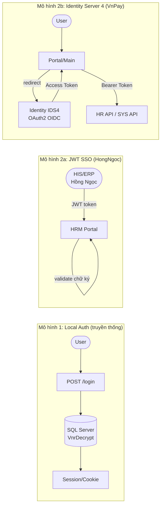
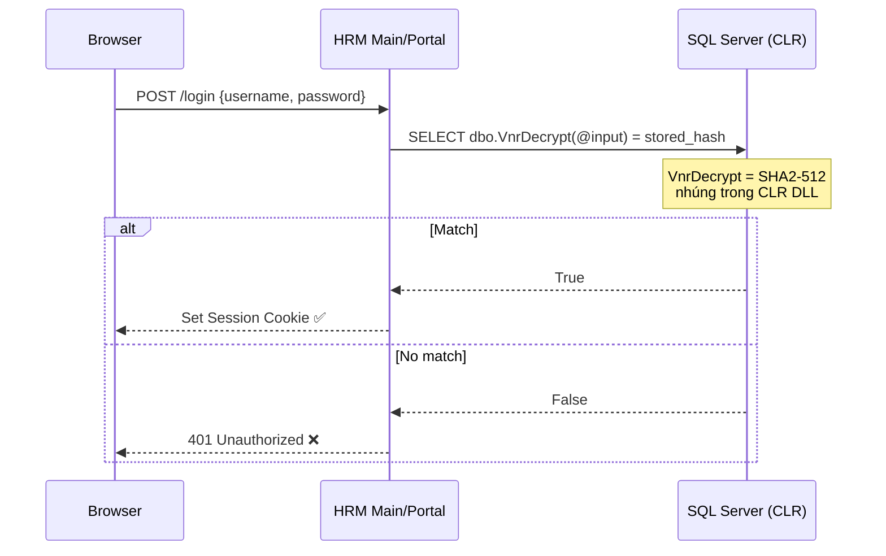
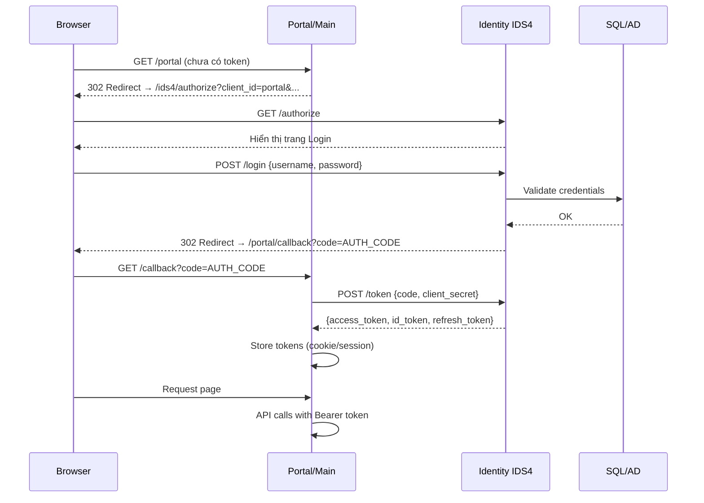

# HRM — Kiến Trúc Xác Thực (Auth Architecture)

> **Phạm vi**: SSO, JWT, OAuth2, VnrDecrypt, RBAC, LDAP  
> **Nguồn**: HongNgoc (JWT SSO) + VnPay (Identity IDS4) + SYS docs (LDAP, DB schema)

---

## Tổng quan — Hai mô hình Auth



---

## Mô hình 1 — Local Authentication

### Luồng đăng nhập



### VnrDecrypt — Cơ chế mã hóa mật khẩu

```sql
-- Cách HRM kiểm tra mật khẩu (CLR function):
SELECT dbo.VnrDecrypt(@inputPassword) = stored_password_hash
FROM Users
WHERE username = @username
```

**Đặc điểm bảo mật**:
- Thuật toán: **SHA2-512**
- Implement: C# CLR Assembly (`VnResource.DatabaseClr.dll`) — nhúng cứng key
- Mỗi khách hàng có key VnrDecrypt khác nhau (multi-tenant)
- **KHÔNG thể thay đổi** sau khi có dữ liệu → data corruption nếu đổi

---

## Mô hình 2a — JWT SSO (HongNgoc case)

### Kiến trúc

```
HIS/ERP Hồng Ngọc
  └── Tạo JWT token (signed bằng Shared Secret Key)
  └── Redirect → HRM URL?token=<JWT>

HRM Portal/Main  
  └── Nhận token từ query string
  └── Validate: HS256/RS256 verify với Secret Key đã cấu hình
  └── Nếu valid → auto-login không cần nhập mật khẩu
```

### Config trong HRM

```json
// webSettings.json hoặc appsettings.json
{
  "SSOJwt_SecretKey": "<shared-secret-32-chars-minimum>",
  "SSOJwt_Issuer": "https://his.hongngoc.vn",
  "SSOJwt_ClaimUsername": "employee_code"
}
```

### JWT Payload mẫu

```json
{
  "iss": "https://his.hongngoc.vn",
  "sub": "EMP001",
  "employee_code": "EMP001",
  "exp": 1714041600,
  "iat": 1714038000
}
```

Xem case study: [[wiki/sources/HongNgoc-DanhGia-SSO]]

---

## Mô hình 2b — Identity Server 4 (VnPay case)

### Kiến trúc OAuth2 Authorization Code Flow



### Cấu hình Client (Portal)

```csharp
// Startup.cs — Identity Server client config
services.AddAuthentication()
    .AddOpenIdConnect("oidc", options =>
    {
        options.Authority = "https://vnpay-ids4.vnresource.net";
        options.ClientId = "portal_client";
        options.ClientSecret = "<secret>";
        options.ResponseType = "code";
        options.Scope.Add("openid");
        options.Scope.Add("profile");
        options.Scope.Add("hrm_api");
    });
```

### Resource Server (API validate token)

```csharp
// API Startup — validate Bearer token
services.AddAuthentication("Bearer")
    .AddJwtBearer("Bearer", options =>
    {
        options.Authority = "https://vnpay-ids4.vnresource.net";
        options.TokenValidationParameters = new TokenValidationParameters
        {
            ValidateAudience = true,
            ValidAudience = "hrm_api"
        };
    });
```

---

## RBAC — Phân quyền theo vai trò

### Cấu trúc phân quyền

```
User
 └── thuộc → [Nhóm quyền / Role]
               └── có → [Permissions]
                         ├── Menu permissions (xem menu nào)
                         ├── Function permissions (làm gì)
                         └── Data permissions (thấy dữ liệu gì)
```

### Data-level Security

```
User login → hệ thống tự filter:
  - Chỉ thấy nhân viên trong phòng ban mình quản lý
  - Chỉ thấy báo cáo phạm vi được phân quyền
  - HR Admin → thấy tất cả
```

### Permission Cache

```
Login → Load permissions → Cache vào Redis/Memory
                                    │
                           Dùng cho mỗi request
                                    │
Đổi quyền → Cache chưa refresh → Cần key trong config:

// webSettings.json
{
  "Hrm_APICenter_Web": "https://api.hrm.company.vn/"
}
// → Khi có key này: đổi quyền sẽ tự clear cache ngay
```

**Lỗi thường gặp**: Đổi quyền xong nhưng user vẫn không nhận → thiếu `Hrm_APICenter_Web`

---

## CORS Configuration

**Khi nào cần**: Link HRM nhúng trong Google Chat, Slack, hoặc iframe từ domain khác

```xml
<!-- web.config -->
<appSettings>
  <add key="AllowOrigin" value="https://chat.google.com/" />
  <!-- Nhiều origins: ngăn cách bằng ; -->
  <!-- <add key="AllowOrigin" value="https://chat.google.com/;https://app.slack.com/" /> -->
</appSettings>
```

**Case thực tế - Lỗi lộ data (HVN)**:
```
Symantec proxy chặn header user login
→ func phân quyền nhận userLogin = null
→ trả về ALL data (không filter)
→ Vi phạm bảo mật nghiêm trọng

Fix:
1. Chặn null userLogin trong func phân quyền
2. Cài Chrome với quyền Administrator
```

---

## Security Checklist khi triển khai

```
SQL Server:
  [ ] Thu hồi sysadmin sau khi setup CLR
  [ ] Chỉ giữ: GRANT EXECUTE ON dbo.VnrDecrypt TO [AppUser]
  [ ] Không dùng sa làm app user

IIS / .NET:
  [ ] HTTPS bắt buộc (redirect HTTP → HTTPS)
  [ ] AllowOrigin chỉ whitelist domain cần thiết (không để *)
  [ ] maxRequestLength = 20480 (20MB max)

Identity Server (VnPay):
  [ ] Access token lifetime: 1 giờ
  [ ] Refresh token: 30 ngày
  [ ] Client secret rotation định kỳ

JWT SSO (HongNgoc):
  [ ] Secret Key ≥ 32 chars, random
  [ ] Token exp hợp lý (không để quá dài)
  [ ] Validate iss + exp + signature
```

---

## Mô hình 3 — LDAP / Active Directory

Xem chi tiết: [[wiki/flows/Flow-LDAP-Login]]

**Cấu hình webconfig:**
```xml
<add key="IsLdapSignIn" value="true"/>
<add key="LdapSignInSource" value="@domain.com,"/>
```

**Bảng liên quan:** `Sys_UserInfo.IsCheckLDAP`, `Sys_UserInfo.LdapConfigID` → `Sys_LdapConfig`

**Đặc điểm:**
- Hỗ trợ multi-source LDAP (nhiều domain)
- User LDAP và user thường tồn tại song song
- Xác thực qua bind LDAP — không lưu password trong DB HRM

---

## Liên kết liên quan

- [[wiki/sources/HongNgoc-DanhGia-SSO]] — Hướng dẫn config JWT SSO thực tế
- [[wiki/sources/VnPay-System-Architecture]] — Identity IDS4 trong hệ thống
- [[wiki/concepts/HRM-Security-Config]] — VnrDecrypt, AllowOrigin, sysadmin policy
- [[wiki/architecture/HRM-System-Architecture]] — Tổng quan kiến trúc
- [[wiki/architecture/HRM-SysDB-Schema]] — Schema Sys_UserInfo, Sys_LdapConfig
- [[wiki/flows/Flow-LDAP-Login]] — Workflow đăng nhập LDAP
- [[wiki/flows/Flow-ResetPassword]] — Workflow reset password
- [[wiki/projects/HongNgoc-Project]] — Case study JWT SSO
- [[wiki/projects/VnPay-Project]] — Case study Identity Server 4
