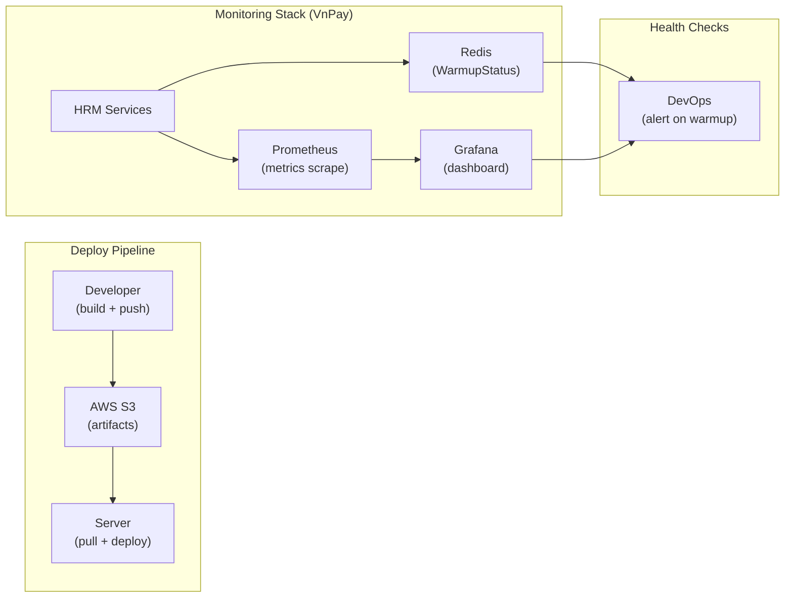

# HRM — Kiến Trúc Triển khai (Deployment Architecture)

> **Phạm vi**: Folder structure, IIS config, Docker/K8s, multi-tenant, S3

---

## Folder Structure — Source Code

### Solution Structure (.NET 8)

```
HRM.Solution/
│
├── HRM.Presentation.Main/            ← MVC App — HR Admin / Manager
│   ├── Controllers/
│   ├── Views/
│   ├── wwwroot/
│   └── web.config
│
├── HRM.Presentation.EmpPortal/       ← MVC App — Nhân viên
│   └── (tương tự Main)
│
├── HRM.Presentation.Hr.Service/      ← Web API — HR Core
│   ├── Controllers/
│   └── appsettings.json
│
├── HRM.Presentation.HrmSystem.Service/ ← Web API — SYS / Security
│
├── HRM.Business.Hr.Domain/           ← Domain layer (Entity + Service)
│   ├── CommonFeatures/
│   ├── ContractFeatures/
│   ├── DIServices/
│   │   ├── IServices/Hre/            ← Interfaces
│   │   └── Services/Hre/             ← Implementations
│   └── ProfileFeatures/
│
├── HRM.Business.Data/                ← EF DbContext + Compiled Model
│   ├── HrmDbContext.cs
│   └── CompiledModels/
│
├── HRM.SC.Service.Api/               ← API Core (vnpay-apiv3)
├── HRM.SC.Service.Identity/          ← Identity Server 4
└── HRM.SC.Core.Business/             ← Shared business logic
    └── Sys_WarmupBusinessServices.cs ← Warmup DB logic
```

---

## IIS Deployment Structure (On-Premise)

### Folder trên server

```
C:\inetpub\wwwroot\HRM\
│
├── Main\                             ← Site HRM Admin
│   ├── bin\
│   ├── Views\
│   ├── RequestInformation\           ← ⚠️ KHÔNG XÓA — log request
│   ├── web.config
│   └── PrecompiledApp.config         ← Xóa khi upbuild
│
├── EmpPortal\                        ← Site Employee Portal
│   ├── bin\
│   ├── RequestInformation\
│   └── web.config
│
├── Hr.Service\                       ← API HR Core
│   ├── bin\
│   ├── RequestInformation\
│   └── web.config
│
└── HrmSystem.Service\                ← API SYS
    ├── bin\
    ├── RequestInformation\
    └── web.config
```

### web.config — Keys bắt buộc

```xml
<appSettings>
  <!-- Database -->
  <add key="ConnectString"
       value="Server=.;Database=HRM_MAIN_DB;User Id=hrm_app;Password=***;" />

  <!-- API Center — cần để refresh permission cache -->
  <add key="Hrm_APICenter_Web"
       value="https://api.hrm.company.vn/" />

  <!-- CORS — whitelist domains -->
  <add key="AllowOrigin"
       value="https://chat.google.com/" />

  <!-- Upload size: 20MB -->
  <add key="maxRequestLength" value="20480" />
</appSettings>
```

### Application Pools — IIS Configuration

```
Pool Name              │ .NET CLR  │ Pipeline    │ Identity
───────────────────────┼───────────┼─────────────┼──────────────────
HRM_Main               │ v4.0      │ Integrated  │ ApplicationPoolIdentity
HRM_EmpPortal          │ No Managed│ Integrated  │ ApplicationPoolIdentity
HRM_HrService          │ v4.0      │ Integrated  │ ApplicationPoolIdentity
HRM_SysService         │ v4.0      │ Integrated  │ ApplicationPoolIdentity

* EmpPortal = .NET 8 → "No Managed Code" (không dùng CLR của IIS)
```

### Phân quyền thư mục (bắt buộc)

```powershell
# IIS_IUSRS cần Read/Write/Execute trên 4 thư mục:
$folders = @("Main", "EmpPortal", "Hr.Service", "HrmSystem.Service")
foreach ($f in $folders) {
    $path = "C:\inetpub\wwwroot\HRM\$f"
    icacls $path /grant "IIS_IUSRS:(OI)(CI)RWX" /T
}

# Đặc biệt cần Write trên:
# */RequestInformation/   ← ghi log
# */App_Data/             ← temp files
# */Uploads/              ← file upload
```

---

## Kubernetes Deployment (VnPay)

### Deployment Manifest mẫu

```yaml
# deployment-portal.yaml
apiVersion: apps/v1
kind: Deployment
metadata:
  name: vnpay-empportal
  namespace: hrm
spec:
  replicas: 1               # ← tăng lên ≥2 khi cần HA
  selector:
    matchLabels:
      app: vnpay-empportal
  template:
    spec:
      containers:
      - name: empportal
        image: hrm-registry/empportal:v8.12.46.01.19
        ports:
        - containerPort: 80
        env:
        - name: ConnectionStrings__HrmDb
          valueFrom:
            secretKeyRef:
              name: hrm-secrets
              key: db-connection
        resources:
          requests:
            memory: "512Mi"
            cpu: "250m"
          limits:
            memory: "1Gi"
            cpu: "500m"
```

### Traefik Routing Config

```yaml
# IngressRoute — route theo subdomain
apiVersion: traefik.io/v1alpha1
kind: IngressRoute
metadata:
  name: hrm-routes
spec:
  entryPoints:
    - websecure
  routes:
  - match: Host(`vnpay-empportal.vnresource.net`)
    kind: Rule
    services:
    - name: vnpay-empportal
      port: 80
  - match: Host(`vnpay-main.vnresource.net`)
    kind: Rule
    services:
    - name: vnpay-main
      port: 80
  - match: Host(`vnpay-ids4.vnresource.net`)
    kind: Rule
    services:
    - name: vnpay-ids4
      port: 80
  tls:
    certResolver: le
```

### K8s chuyển nhánh .NET8 ↔ .NET Framework

```
Từ .NET 8 → .NET Framework 4.6.2:
  1. git stash
  2. Tắt Visual Studio
  3. Xóa ../Main/Source/.vs  (cache IntelliSense)
  4. Xóa tất cả bin/, obj/
  5. git reset --hard
  6. Mở VS → Clean Solution → Rebuild

Từ .NET Framework → .NET 8:
  1. git stash
  2. Tắt Visual Studio
  3. Xóa ../Main/Source/.vs
  4. git reset --hard
  5. Mở VS → Clean Solution → Rebuild

Nếu vẫn lỗi → Restart máy → chạy lại git reset --hard
```

---

## Multi-tenant Architecture

```
Server vật lý / VM
│
├── IIS Site: customer-a.hrm.company.vn  ← App Pool: Pool_CustomerA
│   └── Source: HRM_CustomerA\           ← VnrDecrypt key riêng
│       ConnectString → HRM_CustomerA_DB
│
├── IIS Site: customer-b.hrm.company.vn  ← App Pool: Pool_CustomerB
│   └── Source: HRM_CustomerB\           ← VnrDecrypt key riêng
│       ConnectString → HRM_CustomerB_DB
│
└── IIS Site: customer-c.hrm.company.vn
    └── Source: HRM_CustomerC\
        ConnectString → HRM_CustomerC_DB

SQL Server
├── HRM_CustomerA_DB   (database riêng)
├── HRM_CustomerB_DB
└── HRM_CustomerC_DB
```

**Rule bắt buộc**: Mỗi tenant PHẢI có source riêng (compiled với VnrDecrypt key khác nhau)

---

## AWS S3 — Artifact Storage

### Structure

```
s3://hrm-artifacts/
│
├── vnpay/
│   ├── releases/
│   │   ├── VNPAY_v8.12.46.01.19.rar     ← Source code
│   │   ├── VNPAY_v8.12.46.01.20.rar
│   │   └── ...
│   ├── database/
│   │   ├── HRMPRO12_VNPAY_20260420.rar  ← DB backup
│   │   └── ...
│   └── config/
│       └── IIS-DB-VnPay-config.rar      ← IIS + DB config
│
└── quickpack/
    └── (tương tự)
```

### Upload/Download (PowerShell)

```powershell
# Upload artifact lên S3
aws s3 cp "VNPAY_v8.12.46.01.19.rar" `
  "s3://hrm-artifacts/vnpay/releases/" `
  --profile hrm-deploy

# Download về server
aws s3 cp `
  "s3://hrm-artifacts/vnpay/releases/VNPAY_v8.12.46.01.19.rar" `
  "C:\Deploy\" `
  --profile hrm-deploy
```

---

## Warmup — Code Pattern

### Startup warmup (C# .NET 8)

```csharp
// StartupWarmupService.cs — chạy khi app start
public class StartupWarmupService : IHostedService
{
    private readonly IRedisCaching _redis;
    private readonly IHttpClientFactory _httpClientFactory;

    public async Task StartAsync(CancellationToken ct)
    {
        var sw = Stopwatch.StartNew();

        // Warmup song song nhiều task
        var t0 = Task.Run(() => WarmupDbAsync());
        var t1 = Task.Run(() => WarmupCacheAsync());
        var t2 = Task.Run(() => WarmupRazorViewAsync());

        await Task.WhenAll(t0, t1, t2);

        // Ghi trạng thái vào Redis
        var duration = (int)sw.Elapsed.TotalSeconds;
        var value = $"{DateTime.Now:yyyy-MM-dd HH:mm:ss} ({duration}s)";
        _redis.HashSet("StartApplication_WarmupStatus",
                       "HRM.SC.Service.Identity", value);
    }

    // Giải quyết màn hình trắng login lần đầu
    private async Task WarmupRazorViewAsync()
    {
        var client = _httpClientFactory.CreateClient("warmup");
        client.Timeout = TimeSpan.FromSeconds(30);
        await client.GetAsync($"{_baseUrl}/Account/Login");
    }
}
```

---

## Monitoring Diagram



---

## Liên kết liên quan

- [[wiki/flows/Flow-Deploy-HRM]] — Quy trình deploy step-by-step
- [[wiki/concepts/HRM-Deploy-Checklist]] — Checklist dựng server mới
- [[wiki/concepts/HRM-IIS-Troubleshooting]] — Xử lý lỗi IIS
- [[wiki/sources/VnPay-Deploy-Guide]] — Hướng dẫn deploy VnPay
- [[wiki/sources/WarmupStatus-Performance-2026]] — Warmup 6 services
- [[wiki/architecture/HRM-System-Architecture]] — Kiến trúc tổng quan
- [[wiki/architecture/HRM-Database-Architecture]] — CLR + SQL setup
