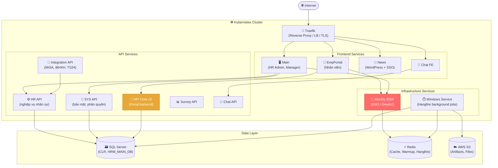
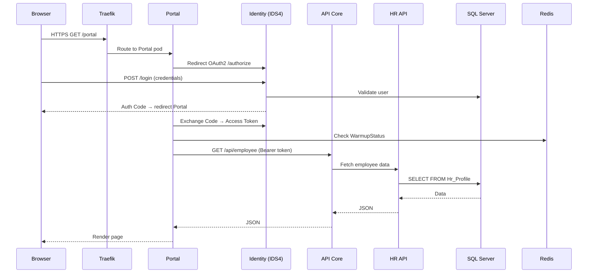
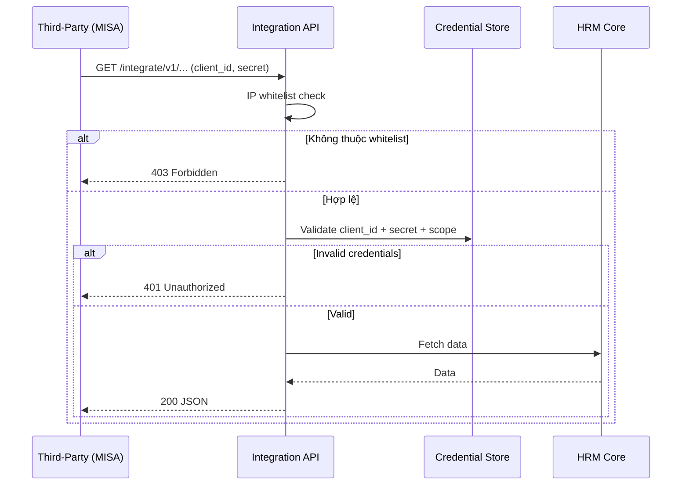

# HRM — Kiến Trúc Hệ Thống Tổng Quan

> **Phạm vi**: FIT-HRM .NET 8 — kiến trúc production (VnPay case study)

---

## Hai mô hình triển khai

### Mô hình A — On-Premise IIS (Standard)

```
┌──────────────────────────────────────────────┐
│  Windows Server                              │
│                                              │
│  ┌─────────┐  ┌─────────┐  ┌─────────────┐  │
│  │  Main   │  │ Portal  │  │ Hr.Service  │  │
│  │ (Admin) │  │  (NV)   │  │  (HR API)   │  │
│  └────┬────┘  └────┬────┘  └──────┬──────┘  │
│       └────────────┴──────────────┘          │
│                    │                         │
│             ┌──────▼───────┐                 │
│             │  SQL Server  │                 │
│             │  (CLR + BH)  │                 │
│             └──────────────┘                 │
│             ┌──────────────┐                 │
│             │    Redis     │                 │
│             │  (WarmupStatus, Cache)         │
│             └──────────────┘                 │
└──────────────────────────────────────────────┘
```

**Phù hợp**: <500 NV, on-premise, không HA

---

### Mô hình B — Kubernetes (VnPay Production)



> ⚠️ **Identity = SPOF** — chưa HA, restart tạo downtime  
> ⚠️ **API Core** — uneven load balancing giữa các pods

---

## 13 Services — VnPay Production

| # | Service | Domain UAT | Vai trò | Người dùng |
|---|---------|-----------|---------|-----------|
| 1 | **EmpPortal** | vnpay-empportal | Cổng nhân viên: hồ sơ, công, lương, nghỉ | Nhân viên |
| 2 | **Main** | vnpay-main | Quản trị HRM: tuyển dụng, đào tạo, báo cáo | HR Admin, Manager |
| 3 | **HR API** | vnpay-hr | API nghiệp vụ nhân sự | Portal, Main |
| 4 | **SYS API** | vnpay-sys | Bảo mật, phân quyền, config | Internal |
| 5 | **API Core** | vnpay-apiv3 | API lõi cho Portal | Portal |
| 6 | **Integration API** | vnpay-itgapi | Gateway tích hợp: MISA, Viettel, TS24 | Đối tác (S2S) |
| 7 | **Identity (IDS4)** | vnpay-ids4 | SSO, OAuth2, OpenID Connect | Toàn hệ thống |
| 8 | **News** | vnpay-news | Tin tức nội bộ (WordPress) + SSO | Nhân viên, HR |
| 9 | **Survey API** | vnpay-apiSurvey | Khảo sát nội bộ (DB độc lập) | Nhân viên |
| 10 | **Chat API** | vnpay-chat | Chat nội bộ backend | Nhân viên |
| 11 | **Chat FE** | vnpay-chatfe | Chat UI nhúng vào Portal | Nhân viên |
| 12 | **Windows Service** | vnpay-ws | Background jobs: lương, sync, email | Hệ thống |
| 13 | **Traefik** | vnpay-traefik | Reverse proxy, LB, TLS termination | IT/DevOps |

---

## Luồng request chính

### Nhân viên đăng nhập Portal



### Tích hợp bên thứ ba (MISA, iBHXH)



---

## Background Jobs (Windows Service + Hangfire)

```
Program.cs (Host App)
  ├── AddHangfire()                    ← cấu hình Hangfire
  ├── AddRedisStorage()                ← Redis làm job store
  └── AddHostedService<HrmTaskScheduleWorker>()

HrmTaskScheduleWorker (HostedService)
  └── RunTaskSchedule() → vòng lặp chính

TaskScheduleManager (Framework)
  ├── Timer 30 giây → RunSchedule()
  │     ├── Gọi API lấy danh sách job
  │     └── Nếu hợp lệ → AppDomainContainer.DoCallBack(...)
  └── Timer 10 phút → CheckAssemblies() (reload DLL nếu thay đổi)

AppDomainContainer (Framework)
  ├── Load DLL task động
  ├── Deserialize JSON → JobItem object
  └── job.ExecuteTask()

Redis (DB2)
  ├── Hàng đợi job (Queue)
  ├── Trạng thái job (Succeeded / Failed / Processing)
  └── StartApplication_WarmupStatus (6 services)

Hangfire Dashboard → /hangfire
  ├── Xem danh sách job
  ├── Monitor real-time
  └── Trigger thủ công
```

---

## Warmup Status — Redis Key

Sau mỗi lần restart IIS pool / K8s pod, HRM ghi trạng thái warmup:

```
Redis HASH: StartApplication_WarmupStatus
┌────────────────────────────────────────────────────────┐
│ HRM.Presentation.Main          │ 2026-04-20 10:00:15 (48s) │
│ HRM.Presentation.EmpPortal     │ 2026-04-20 10:00:20 (35s) │
│ HRM.Presentation.Hr.Service    │ 2026-04-20 10:00:25 (40s) │
│ HRM.Presentation.HrmSystem.Svc │ 2026-04-20 10:00:30 (45s) │
│ HRM.SC.Service.Api             │ 2026-04-20 10:00:40 (42s) │
│ HRM.SC.Service.Identity        │ 2026-04-20 10:00:35 (38s) │
└────────────────────────────────────────────────────────┘

Kiểm tra: redis-cli HGETALL StartApplication_WarmupStatus
```

---

## Điểm nghẽn & Rủi ro đã biết

| Component | Vấn đề | Tác động | Trạng thái |
|-----------|--------|---------|-----------|
| **Identity IDS4** | Single pod, chưa HA | Toàn hệ thống mất login khi restart | Cần multi-pod |
| **API Core** | Uneven load balancing | 1 pod overload, pod khác idle | Cần review sticky session |
| **Windows Service** | Single instance | Background jobs dừng nếu crash | Cần watchdog |
| **SQL Server** | On-prem, không horizontal scale | Bottleneck khi >500 concurrent | Cân nhắc Read Replica |

Sự cố tháng 11/2025: [[wiki/sources/VnPay-Performance-Incident]]

---

## Liên kết liên quan

- [[wiki/sources/VnPay-System-Architecture]] — Tài liệu gốc 13 services
- [[wiki/sources/VnPay-Performance-Incident]] — Sự cố scale tháng 11/2025
- [[wiki/sources/WarmupStatus-Performance-2026]] — Chi tiết warmup 6 services
- [[wiki/architecture/HRM-Auth-Architecture]] — Kiến trúc SSO / JWT
- [[wiki/architecture/HRM-Database-Architecture]] — Kiến trúc SQL Server + CLR
- [[wiki/architecture/HRM-Deployment-Architecture]] — Folder structure + deploy
- [[wiki/flows/Flow-Deploy-HRM]] — Quy trình deploy
