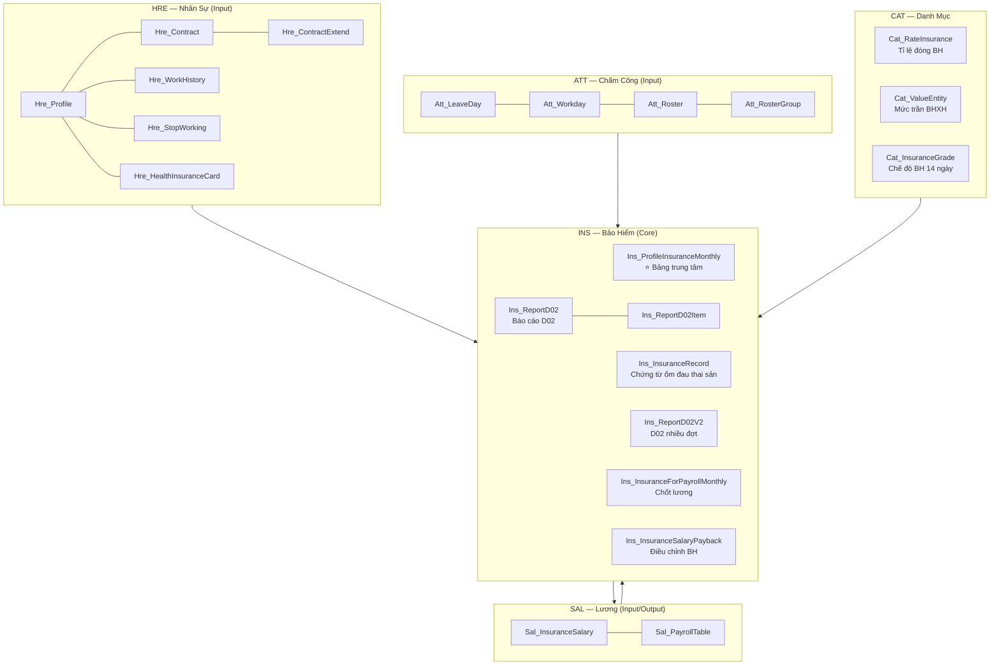

# Architecture — Phân Hệ Bảo Hiểm (INS)

## Tổng quan

Cấu trúc database và component của phân hệ **INS (Insurance / Bảo Hiểm)** trong VnResource HRM Pro 8. Bao gồm 72 bảng, 4 layer phân hệ tích hợp.

## Layer Architecture



## Bảng trung tâm — Mô tả chi tiết

### `Ins_ProfileInsuranceMonthly` — ⭐ Trích nộp BH hàng tháng
- **Vai trò**: Bảng đầu ra sau khi chạy phân tích BH; SAL module đọc từ đây
- **Key fields**: ProfileID, MonthYear, IsSocialInsurance, IsHealthInsurance, IsUnEmpInsurance, MoneySocialInsurance, SalaryInsurance, IsDecreaseWorkingDays (nghỉ >=14 ngày), IsPregnant

### `Ins_InsuranceRecord` — Chứng từ bảo hiểm
- **Vai trò**: Lưu chứng từ ốm đau, thai sản, con ốm, nghỉ ngắn ngày
- **Key fields**: InsuranceType (enum: E_SICK_SHORT, E_SICK_LONG, E_SICK_CHILD, E_PREGNANCY_SUCKLE...), Status, IsPaymented, Amount
- **Liên kết**: `Ins_ChildSick` khi loại chứng từ là con ốm

### `Ins_ReportD02` / `Ins_ReportD02Item` — Báo cáo D02
- **Vai trò**: Lưu báo cáo D02 (header) và chi tiết từng dòng (item)
- **Đặc điểm**: Cho phép thêm/xóa/sửa sau khi đã tính; có trạng thái "Tự chỉnh"/"Tự tính"
- **Key fields D02Item**: Status (E_TANG_LD...), Type (E_TANG/E_GIAM), JobName, DecisionNo, DateStart/DateEnd

### `Ins_ReportD02V2` / `Ins_ReportD02ItemV2` — D02 nhiều đợt
- **Vai trò**: Hỗ trợ nhiều đợt (kỳ) trong tháng (Perior: 1 đến 10)

### `Ins_InsuranceSalaryPayback` — Điều chỉnh BH
- **Vai trò**: Lưu truy thu/thoái thu bảo hiểm
- **Key fields**: FromMonthEffect, ToMonthEffect, InsSalary, InsSalaryPayBack

### `Ins_InsuranceForPayrollMonthly` — Chốt lương
- **Vai trò**: Dùng để tính lương (SAL đọc từ đây); khác với `Ins_ProfileInsuranceMonthly` ở chỗ chốt cho kỳ lương

### `Sal_InsuranceSalary` — Lương BHXH
- **Vai trò**: Lưu lương BHXH của từng NV theo từng kỳ
- **Key fields**: ProfileID, DateEffect, InsuranceAmount, IsSocialIns, IsMedicalIns, IsUnimploymentIns

### `Cat_RateInsurance` — Tỉ lệ bảo hiểm
- BHXH: NSDLĐ 18%, NLĐ 8%
- BHYT: NSDLĐ 3%, NLĐ 1.5%  
- BHTN: NSDLĐ 1%, NLĐ 1%
- **Tỉ lệ tổng**: 32.5% (cố định trong IBHXH/EBHXH)

### `Cat_ValueEntity` — Mức trần BHXH / Lương tối thiểu
- Type enum: `E_INSURANCE_CAPE_AMOUNT` (mức trần) / `E_MINIMUM_SALARY` (lương tối thiểu)

## Mapping bảng theo chức năng nghiệp vụ

```
Khi phân tích BH đọc từ:
  HRE:  Hre_Profile, Hre_Contract, Hre_ContractExtend, Hre_WorkHistory
  ATT:  Att_LeaveDay, Att_Workday, Att_Roster (để đếm nghỉ >=14 ngày)
  SAL:  Sal_InsuranceSalary (lương BHXH)
  CAT:  Cat_RateInsurance, Cat_ValueEntity, Cat_InsuranceGrade

Kết quả ghi vào:
  INS:  Ins_ProfileInsuranceMonthly (trích nộp BH)
        Ins_ReportD02 + Item (D02 báo cáo)
        Ins_InsuranceForPayrollMonthly (chốt lương)
```

## Phần tử bảo hiểm (Elements)

Các phần tử cấu hình trong `Cat_Element` và `Cat_GradePayroll`:

| Mã phần tử | Tên | Nguồn dữ liệu |
|-----------|-----|---------------|
| `INS_JOBNAME_JOBTITLE` | Chức Danh | `Cat_JobTitle.JobTitleNameInLaw` |
| `INS_JOBNAME_POSITION` | Chức Vụ | `Cat_Position.PositionNameInLaw` |
| `INS_SALARY_INSURANCE_ROOT` | Lương BHXH gốc | `Sal_InsuranceSalary.InsuranceAmount` |
| `INS_ALLOWANCE_AMOUNT1..15` | Phụ cấp 1-15 | `Sal_BasicSalary.E_AllowanceAmount*` |

> ⚠️ **Lưu ý**: Mã phần tử **không được có khoảng trắng**

## Liên kết

- [[wiki/flows/Flow-BaoHiem-Monthly]] — Luồng phân tích BH hàng tháng
- [[wiki/sources/INS-ThietKe-V8]] — Tài liệu thiết kế đầy đủ
- [[wiki/sources/INS-Troubleshooting-5Why]] — RCA và troubleshooting
- [[wiki/architecture/HRM-System-Architecture]] — Kiến trúc tổng thể HRM
