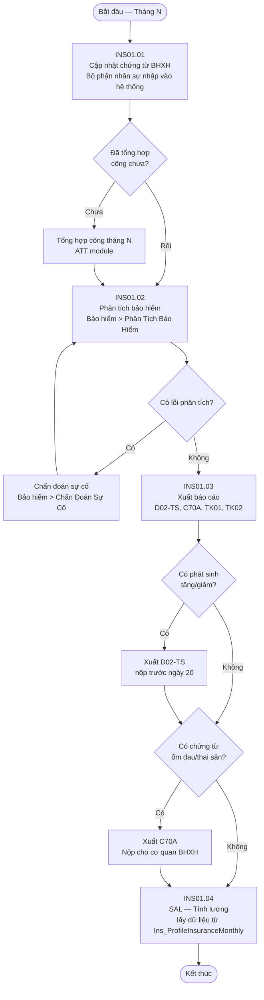
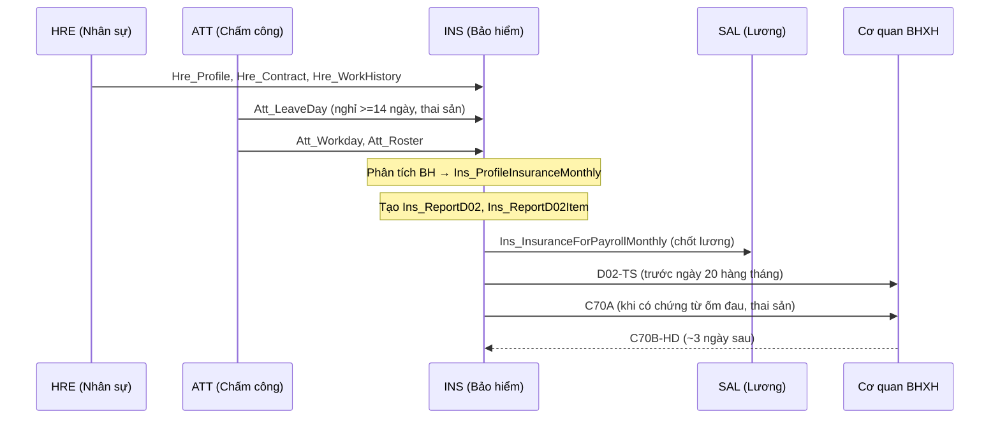

# Flow — Phân Tích Bảo Hiểm Hàng Tháng (INS01)

## Tổng quan

Luồng xử lý **phân tích bảo hiểm hàng tháng** trong FIT-HRM Pro. Diễn ra trước khi tính lương, chạy trong chu kỳ từ ngày 16 tháng N-1 đến ngày 15 tháng N.

## Luồng chính — INS01



## Luồng dữ liệu giữa phân hệ



## Chi tiết các bước

| Bước | Người thực hiện | Mô tả | Đường dẫn |
|------|----------------|-------|-----------|
| INS01.01 | Bộ phận nhân sự | Cập nhật chứng từ BHXH | Trang Chủ > Bảo Hiểm > DS Chứng Từ BHXH |
| INS01.02 | Bộ phận nhân sự | Phân tích bảo hiểm | Trang Chủ > Bảo Hiểm > Phân Tích Bảo Hiểm |
| INS01.03 | Bộ phận nhân sự | Xuất báo cáo (D02, C70A...) | Trang Chủ > Bảo Hiểm > Báo Cáo |
| INS01.04 | Bộ phận nhân sự | Nộp báo cáo cho cơ quan BHXH | Ngoài hệ thống |

## Điều kiện đặc biệt

### Nghỉ ≥ 14 ngày
- NV **giảm** khỏi D02 trong tháng nghỉ
- Sau khi đi làm lại: phải **tăng lại** với lý do rõ ràng

### Thai sản (ON/OFF)
```
ON (đóng BH tháng N):  ngày BẮT ĐẦU thai sản ∈ [15/N-1, 14/N]
OFF (không đóng BH tháng N): ngày KẾT THÚC thai sản ∈ [15/N-1, 14/N]
```

### Lỗi thường gặp

| Mã lỗi | Triệu chứng | Xử lý |
|--------|-------------|-------|
| Err_001 | Chức danh theo luật trống | Bổ sung tại Danh mục > Chức danh |
| Err002 | Chức vụ theo luật trống | Bổ sung tại Danh mục > Chức vụ |
| Err003 | Chưa tổng hợp công | Tổng hợp công ATT trước |
| Err004 | Công thức lương BH không parse | Kiểm tra công thức trong chế độ lương |
| Err007 | Phần tử công thức không tồn tại | Kiểm tra danh mục Phần tử bảo hiểm |
| Err008 | Nơi đóng BH trống | Cập nhật tại màn hình chỉnh sửa NV |

## Thời hạn nghiệp vụ

| Hạn | Nội dung |
|-----|---------|
| Trước ngày **20** hàng tháng | Nộp D02 cho cơ quan BHXH |
| Trước ngày **30** hàng tháng | Nộp tiền BH |
| ~**3 ngày** sau nộp C70A | Nhận C70B-HD từ cơ quan BHXH |

## Liên kết

- [[wiki/architecture/INS-Architecture]] — Cấu trúc database và component
- [[wiki/sources/INS-ThietKe-V8]] — Tài liệu thiết kế đầy đủ
- [[wiki/sources/INS-Troubleshooting-5Why]] — Xử lý sự cố phân tích BH
- [[wiki/sources/INS-NhatKy-VanDe-2017]] — Nhật ký bug + nguyên tắc debug
