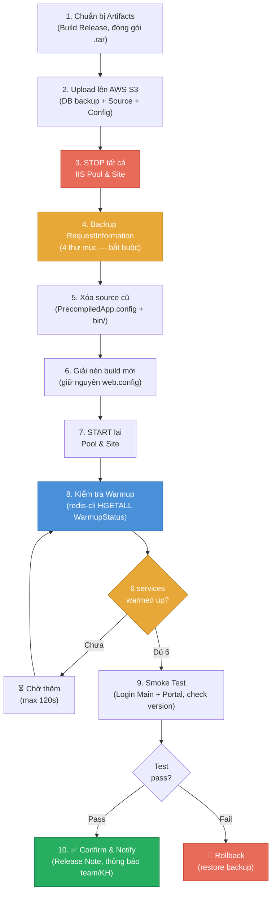
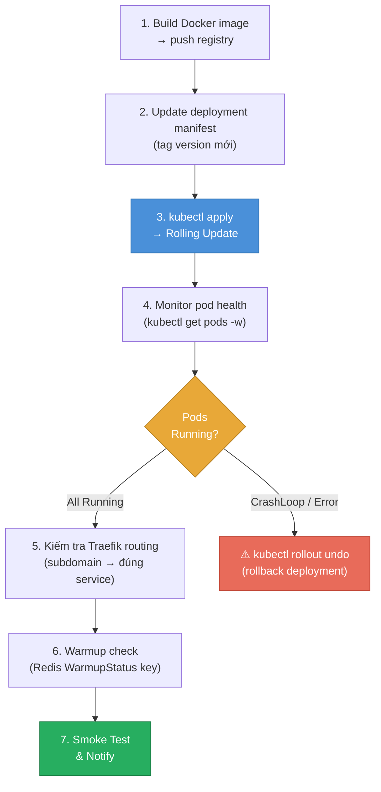

# Flow — Quy Trình Deploy HRM (Upbuild + Warmup)

> **Loại**: Technical Flow — DevOps / SE  
> **Tần suất**: Mỗi lần release / hotfix  
> **Áp dụng**: Mọi môi trường (DEV, UAT, Production)

---

## Tổng quan

Quy trình deploy HRM gồm 2 luồng chính:
1. **Upbuild** — cập nhật source code lên server
2. **Warmup** — đảm bảo hệ thống sẵn sàng phục vụ sau khi restart IIS pools

---

## Sơ đồ Flow — Upbuild (IIS)



## Sơ đồ Flow — Kubernetes (VnPay)



---

## Chi tiết từng bước

### Bước 1 — Chuẩn bị Artifacts

**SE thực hiện** trước khi deploy:
- Build Release từ solution HRM
- Kiểm tra version trong `web.config` / `appsettings.json`
- Đóng gói: `VNPAY_v8.12.46.xx.xx.rar` (version phải đúng)

**Lưu ý**: Không dùng source đã dựng từ link nhà (link shared drive có thể cũ)

---

### Bước 2 — Upload lên AWS S3

**Pattern VnPay**:
```
s3://hrm-deploy/vnpay/
  HRMPRO12_VNPAY_YYYYMMDD.rar    ← DB backup
  IIS-DB-VnPay-config.rar         ← Config IIS + DB
  VNPAY_v8.12.46.xx.xx.rar        ← Source HRM
```

S3 là nguồn phân phối chuẩn — tất cả server pull từ đây.

Xem: [[wiki/sources/VnPay-Deploy-Guide]]

---

### Bước 3 — STOP IIS Pools & Sites

**Quan trọng**: PHẢI stop trước khi thay file

```powershell
# Stop toàn bộ sites trước
Get-Website | Stop-Website

# Stop toàn bộ pools
Get-WebConfigurationProperty -pspath 'MACHINE/WEBROOT/APPHOST' `
  -filter "system.applicationHost/applicationPools/add" `
  -name "name" | ForEach-Object { Stop-WebAppPool $_.Value }
```

Hoặc dùng IIS Manager → Select All → Stop

---

### Bước 4 — Backup RequestInformation

**Bắt buộc** trước khi xóa source cũ:

```
Backup 4 thư mục:
  Main\RequestInformation\
  Hr.Service\RequestInformation\
  HrmSystem.Service\RequestInformation\
  EmpPortal\RequestInformation\
```

Đây là nơi lưu log request — mất đi không khôi phục được

---

### Bước 5 — Dọn dẹp Source Cũ

```
Xóa:
  PrecompiledApp.config          ← bắt buộc xóa
  */bin/                         ← toàn bộ thư mục bin các service
```

**KHÔNG xóa**: `web.config`, `appsettings.json`, `RequestInformation`

---

### Bước 6 — Giải nén Build Mới

- Giải nén vào đúng thư mục site (không overwrite config)
- Nếu có tool tự động (script deploy) → dùng tool
- Xác nhận `web.config` và `appsettings.json` còn nguyên (không bị ghi đè)

---

### Bước 7 — START Pool & Site

```powershell
# Start pools
Get-ChildItem IIS:\AppPools | Start-WebAppPool

# Start sites
Get-Website | Start-Website
```

---

### Bước 8 — Kiểm tra Warmup Status

**Redis monitoring** — HRM ghi warmup status vào Redis HASH:

```
Key: StartApplication_WarmupStatus
Fields:
  HRM.Presentation.Main              : "2026-04-20 10:00:15 (48s)"
  HRM.Presentation.EmpPortal         : "2026-04-20 10:00:20 (35s)"
  HRM.Presentation.Hr.Service        : "2026-04-20 10:00:25 (40s)"
  HRM.Presentation.HrmSystem.Service : "2026-04-20 10:00:30 (45s)"
  HRM.SC.Service.Api                 : "2026-04-20 10:00:40 (42s)"
  HRM.SC.Service.Identity            : "2026-04-20 10:00:35 (38s)"
```

**Kiểm tra**: `redis-cli HGETALL StartApplication_WarmupStatus`

Xem chi tiết: [[wiki/sources/WarmupStatus-Performance-2026]]

---

### Bước 9 — Smoke Test

Checklist tối thiểu sau deploy:
- [ ] Đăng nhập được Main site
- [ ] Đăng nhập được Portal (Employee Portal)
- [ ] Version hiển thị đúng số build mới
- [ ] Event Viewer không có lỗi đỏ
- [ ] Log Request ghi bình thường (không trống)
- [ ] Kiểm tra 1–2 chức năng nghiệp vụ chính (tùy phiên bản có gì mới)

---

### Bước 10 — Confirm & Notify

- Ghi lên Issue Log / Release Note: version, ngày deploy, người deploy
- Thông báo cho team và khách hàng (nếu Production)
- Theo dõi Error Log 24h sau deploy đầu tiên

---

## Deploy trên Kubernetes (VnPay)

VnPay dùng Kubernetes — xem sơ đồ K8s flow bên trên.

**Lưu ý K8s**:
- Identity service chưa HA → restart tạo downtime tạm thời
- API Core có thể uneven load → monitor sau deploy
- Xem: [[wiki/sources/VnPay-System-Architecture]]

---

## Lỗi thường gặp khi Deploy

| Lỗi | Nguyên nhân | Cách xử lý |
|-----|------------|-----------|
| 403.14 sau deploy | Thiếu `PrecompiledApp.config` mới / web.config sai | Kiểm tra lại config |
| Pool crash ngay sau start | DLL incompatible / thiếu dependency | Check Event Viewer → rollback |
| Warmup timeout (>120s) | DB cold start / network chậm | Tăng timeout, check DB connection |
| Login trắng màn hình | Identity service chưa warmup Razor view | Chờ warmup (tự fix sau 30–60s) |

Chi tiết lỗi IIS: [[wiki/concepts/HRM-IIS-Troubleshooting]]

---

## Checklist tham khảo đầy đủ

→ [[wiki/concepts/HRM-Deploy-Checklist]]

---

## Liên kết liên quan

- [[wiki/concepts/HRM-Deploy-Checklist]] — Checklist chi tiết dựng server mới
- [[wiki/concepts/HRM-IIS-Troubleshooting]] — Xử lý lỗi IIS sau deploy
- [[wiki/sources/WarmupStatus-Performance-2026]] — Chi tiết warmup 6 services
- [[wiki/sources/VnPay-Deploy-Guide]] — Hướng dẫn deploy VnPay cụ thể
- [[wiki/architecture/HRM-System-Architecture]] — Kiến trúc hệ thống tổng quan
