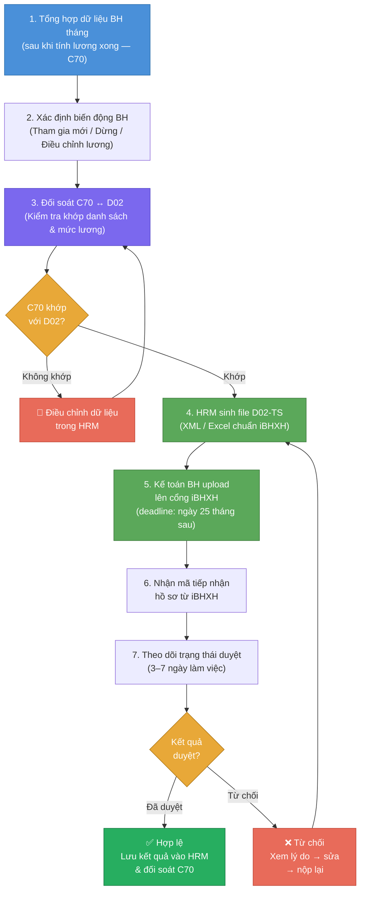

# Flow — Quy Trình Khai Báo BHXH Điện Tử (iBHXH)

> **Loại**: Business Flow — Integration  
> **Chu kỳ**: Hàng tháng (trước ngày 25 tháng sau)  
> **Phân hệ liên quan**: Bảo hiểm → iBHXH Portal → BHXH Việt Nam

---

## Tổng quan

iBHXH là cổng khai báo BHXH điện tử chính thức của BHXH Việt Nam. Doanh nghiệp **bắt buộc** nộp hồ sơ tham gia/điều chỉnh BHXH qua đây thay vì nộp giấy. HRM phải xuất đúng định dạng XML/file theo chuẩn iBHXH.

---

## Sơ đồ Flow

---

## Chi tiết từng bước

### Bước 1 — Tổng hợp dữ liệu BH tháng

**Thời điểm**: Sau khi tính lương xong (bước 6 của [[wiki/flows/Flow-TinhLuong-Monthly]])

Dữ liệu cần có:
- Danh sách nhân viên đang tham gia BH
- Mức lương đóng BH (mức sàn ≥ lương tối thiểu vùng)
- Số ngày thực tế đóng BH
- Các biến động trong tháng (vào/ra/điều chỉnh)

---

### Bước 2 — Xác định biến động BH

| Loại biến động | Biểu mẫu | Ghi chú |
|---------------|---------|---------|
| Tham gia mới | D02-TS | Nhân viên mới vào trong tháng |
| Dừng BH | D02-TS | Nhân viên nghỉ việc |
| Điều chỉnh mức lương đóng BH | D02-TS | Khi tăng lương / điều chỉnh hệ số |
| Nghỉ ốm hưởng BHXH | D03a | Xuất riêng, không qua D02 |
| Nghỉ thai sản | D03a | Tối đa 6 tháng, 100% lương đóng BH |

Xem chi tiết biểu mẫu D02: [[wiki/sources/INS-D02-ChungTu]]

---

### Bước 3 — Đối soát C70 ↔ D02

**Mục đích**: Đảm bảo dữ liệu lương trong C70 (tổng hợp lương BH) khớp với D02 (chứng từ khai báo)

Kiểm tra:
- [ ] Tổng NLĐ đóng trên C70 = Tổng trên D02 (cùng danh sách)
- [ ] Mức lương đóng BH của từng nhân viên khớp giữa C70 và D02
- [ ] Không có nhân viên trên C70 mà thiếu trên D02 (hoặc ngược lại)

Xem: [[wiki/sources/INS-C70-TinhLuong]]

---

### Bước 4 — Sinh file D02-TS

**HRM tự động sinh** file theo định dạng iBHXH:
- Format: XML (TS24 chuẩn) hoặc Excel (tuỳ phiên bản iBHXH)
- Tên file: `D02_YYYYMM_<MaSoThue>.xml`

**Rủi ro**:
- iBHXH cập nhật phiên bản schema XML → HRM phải update tương ứng
- Đây là điểm maintenance thường xuyên → cần theo dõi thông báo từ BHXH Việt Nam

So sánh phần mềm kê khai D02: [[wiki/sources/INS-VennD02]] (VNPT vs Viettel vs iBHXH trực tiếp)

---

### Bước 5 — Upload lên cổng iBHXH

**Người thực hiện**: Kế toán BH (không phải SE)

Quy trình:
1. Đăng nhập cổng iBHXH (https://baohiemxahoi.gov.vn)
2. Chọn "Nộp hồ sơ trực tuyến" → "Đơn vị"
3. Upload file D02-TS đã sinh từ HRM
4. Điền thêm thông tin bổ sung nếu cần
5. Ký điện tử (USB token hoặc BHXH số)
6. Submit

**Deadline cứng**: Ngày **25 tháng sau** — nếu trễ bị phạt hành chính

---

### Bước 6 — Nhận mã tiếp nhận

iBHXH trả về:
- **Mã tiếp nhận hồ sơ** (số tham chiếu để tra cứu)
- **Trạng thái ban đầu**: "Đang xử lý"

Lưu mã tiếp nhận vào HRM để tra cứu sau.

---

### Bước 7 — Theo dõi trạng thái duyệt

- iBHXH xử lý trong **3–7 ngày làm việc**
- Tra cứu trạng thái qua cổng hoặc nhận thông báo email/SMS

| Trạng thái | Hành động |
|-----------|----------|
| Đang xử lý | Chờ |
| Hợp lệ - Đã duyệt | Lưu kết quả vào HRM |
| Từ chối | Xem lý do → sửa → nộp lại |
| Bổ sung hồ sơ | Upload tài liệu bổ sung theo yêu cầu |

---

### Bước 8 — Lưu kết quả vào HRM

Sau khi BHXH duyệt:
- Ghi nhận trạng thái "Đã khai báo tháng X/YYYY" trong HRM
- Lưu số tiếp nhận để kiểm toán
- Đối soát kết quả với C70 tháng đó

---

## Lỗi thường gặp & cách xử lý

| Lỗi | Nguyên nhân | Cách xử lý |
|-----|------------|-----------|
| Hồ sơ bị từ chối: "Mã BHXH không khớp" | Mã số BHXH trên HRM ≠ cổng BHXH | Tra cứu mã đúng trên cổng → cập nhật HRM |
| Upload lỗi định dạng | iBHXH đổi schema XML | Update schema trong HRM (SE xử lý) |
| Thiếu chữ ký điện tử | USB token hết hạn / chưa cài driver | Gia hạn token / cài lại driver |
| D02 thiếu nhân viên | Chưa tạo bản ghi BH cho NV mới | Kiểm tra InsuranceMonthJoin |

---

## Liên kết liên quan

- [[wiki/flows/Flow-TinhLuong-Monthly]] — Quy trình tính lương (chạy song song)
- [[wiki/sources/INS-iBHXH-Analyze]] — Phân tích kỹ thuật tích hợp iBHXH
- [[wiki/sources/INS-D02-ChungTu]] — Biểu mẫu D02-TS chi tiết
- [[wiki/sources/INS-VennD02]] — So sánh phần mềm kê khai D02 (VNPT/Viettel/iBHXH)
- [[wiki/sources/INS-FishBone-Analysis]] — Phân tích lỗi BH thường gặp
- [[wiki/concepts/HRM-Modules]] — Phân hệ Bảo hiểm tổng quan
