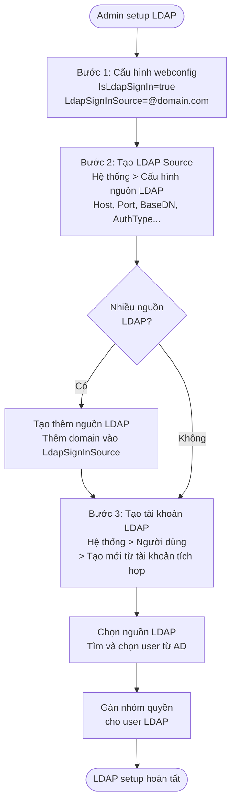
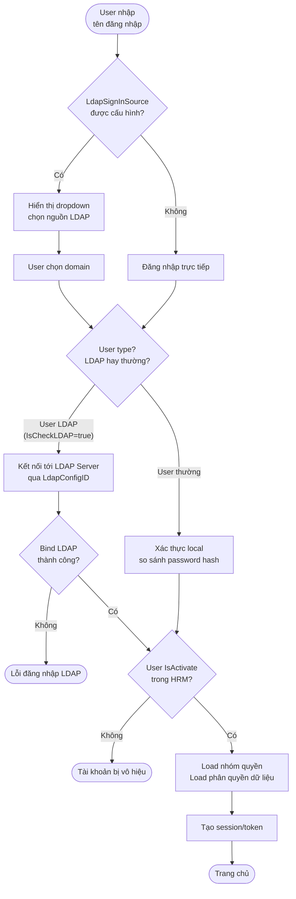

# Flow: Đăng Nhập LDAP / Active Directory HRM

Quy trình cấu hình và đăng nhập LDAP trong HRM Pro 8.

---

## Luồng cấu hình LDAP (1 lần setup)



---

## Luồng đăng nhập LDAP (runtime)



---

## Cấu hình Sys_LdapConfig

| Field | Mô tả | Ví dụ |
|-------|-------|-------|
| ServerType | Loại LDAP server | Active Directory |
| ConnectionType | Standard LDAP hoặc LDAP+SSL | Standard LDAP |
| HostName | Domain hoặc IP của LDAP server | `ad.example.com` |
| Port | Cổng kết nối (default 389) | `389` |
| AuthenticationType | Anonymous hoặc Simple | Simple |
| AuthorizedUser | User có quyền đọc toàn bộ subtree | `admin1` |
| Password | Password của authorized user | (encrypted) |
| BaseDN | Base DN của subtree cần sync | `ou=sales,dc=ad,dc=example,dc=com` |

---

## Webconfig keys LDAP

```xml
<add key="IsLdapSignIn" value="true"/>
<add key="LdapSignInSource" value="@thaco.com.vn,@vinamazda.vn,"/>
```

- `IsLdapSignIn`: bật/tắt tính năng LDAP
- `LdapSignInSource`: danh sách domain phân cách bởi dấu phẩy; nếu rỗng → không hiện dropdown chọn domain

---

## Liên kết

- [[wiki/architecture/HRM-Auth-Architecture]] — Kiến trúc xác thực tổng thể: JWT, SSO, LDAP
- [[wiki/sources/Sys-TaiLieuLDAP-03]] — Tài liệu gốc LDAP
- [[wiki/sources/Daily-2024-OPA-LDAP-Permission]] — Cài OpenLDAP Ubuntu thực tế
- [[wiki/architecture/HRM-SysDB-Schema]] — Schema Sys_UserInfo (IsCheckLDAP, LdapConfigID)
