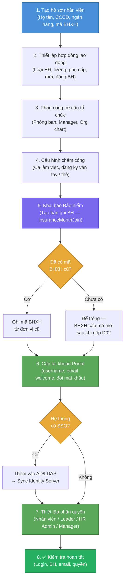

# Flow — Quy Trình Onboarding Nhân Viên Mới (Trong HRM)

> **Loại**: Business Flow — HR Core  
> **Người thực hiện**: HR Admin  
> **Hệ thống**: FIT-HRM — Phân hệ Nhân sự

---

## Tổng quan

Onboarding nhân viên mới trong HRM là quy trình tạo đầy đủ dữ liệu cho một nhân viên từ lúc họ chính thức làm việc đến khi có thể:
- Truy cập hệ thống (Portal)
- Được chấm công
- Nhận lương tháng đầu
- Được khai báo Bảo hiểm

---

## Sơ đồ Flow

---

## Chi tiết từng bước

### Bước 1 — Tạo hồ sơ nhân viên

**HR Admin nhập các thông tin**:

| Nhóm thông tin | Fields |
|---------------|--------|
| Thông tin cá nhân | Họ tên, ngày sinh, giới tính, CCCD/CMND, địa chỉ |
| Thông tin liên hệ | Email, SĐT, địa chỉ liên hệ |
| Thông tin nhân sự | Mã NV, ngày vào làm, vị trí, cấp bậc |
| Thông tin ngân hàng | Số TK, tên ngân hàng (để nhận lương) |
| Thông tin BH | Mã số BHXH (nếu đã có từ đơn vị cũ) |

**Quan trọng**: Mã số BHXH phải chính xác — sai sẽ bị từ chối khi khai báo iBHXH

---

### Bước 2 — Thiết lập hợp đồng lao động

- Loại hợp đồng: thử việc / xác định thời hạn / không xác định thời hạn
- Ngày bắt đầu, ngày kết thúc (nếu có)
- Mức lương cơ bản + hệ số
- Phụ cấp cố định (nếu có)
- Mức lương đóng BH (có thể khác mức lương thực nhận)

---

### Bước 3 — Phân công vào cơ cấu tổ chức

- Chọn Phòng ban / Bộ phận / Team
- Chọn cấp quản lý trực tiếp (Manager)
- Chọn vị trí trong org chart

**Tác động**: Phân công sai dẫn đến sai phân quyền xem báo cáo, sai người duyệt nghỉ phép

---

### Bước 4 — Cấu hình chấm công

- Chọn ca làm việc (ca hành chính / ca xoay / ca đêm)
- Đăng ký mã thẻ / vân tay / face ID vào máy chấm công
- Thiết lập rule chấm công đặc biệt (nếu có — ví dụ VnPay "1 đầu IN")

Xem rule VnPay: [[wiki/sources/H-VnPay-Att-17042025]]

---

### Bước 5 — Khai báo Bảo hiểm

- Tạo bản ghi BH từ ngày vào làm chính thức
- Điền: loại BH (BHXH + BHYT + BHTN thường gói chung)
- Mức lương đóng BH
- Nếu nhân viên có **BH từ đơn vị cũ**: cần thủ tục chuyển sổ BH

Tháng vào làm → `InsuranceMonthJoin` xác định tham gia đủ tháng hay không.
Xem: [[wiki/sources/INS-InsuranceMonthJoin]]

---

### Bước 6 — Cấp tài khoản truy cập

**Employee Portal**:
- Tạo tài khoản login Portal (username thường = mã NV hoặc email)
- Gửi email welcome + link đổi mật khẩu lần đầu

**SSO (nếu có)**:
- Add vào Active Directory / LDAP (phía IT KH thực hiện)
- Sync sang Identity Server của HRM
- Xem cấu hình SSO: [[wiki/concepts/HRM-Security-Config]]

---

### Bước 7 — Thiết lập phân quyền hệ thống

**Phân quyền theo vai trò**:

| Vai trò | Quyền cơ bản |
|---------|-------------|
| Nhân viên | Xem hồ sơ bản thân, xem lương, xin nghỉ phép, chấm công |
| Team Leader | + Duyệt nghỉ phép nhóm, xem chấm công nhóm |
| HR Admin | + Quản lý toàn bộ nhân viên, chạy lương |
| Manager | + Xem báo cáo phòng ban, duyệt đề xuất |

**Cảnh báo**: Phân quyền dư thừa (over-permission) là vi phạm bảo mật — review định kỳ

---

### Bước 8 — Kiểm tra & Xác nhận hoàn tất

Checklist cuối:
- [ ] NV login được Portal
- [ ] Hồ sơ hiển thị đúng (tên, phòng ban, chức vụ)
- [ ] Ca làm việc đã hiển thị
- [ ] Bản ghi BH đã tạo (kiểm tra trong module BH)
- [ ] NV nhận được email thông báo
- [ ] Phân quyền đúng vai trò

---

## Trường hợp đặc biệt

### Nhân viên chưa có mã số BHXH

- Xảy ra khi NV làm việc lần đầu tiên
- HRM vẫn tạo hồ sơ, để trống mã BHXH
- Sau khi đăng ký BHXH lần đầu → cập nhật mã vào hồ sơ
- Khai báo D02 ghi "Tham gia mới" — BHXH cấp mã số mới

### Nhân viên chuyển từ đơn vị khác

- Cần **sổ BHXH** từ đơn vị cũ
- HRM ghi mã BHXH đã có
- Khai báo iBHXH: "Tham gia từ đơn vị khác chuyển đến"
- BHXH xác nhận quá trình đóng tiếp tục

### Nhân viên nước ngoài

- Không có BHXH Việt Nam (theo quy định hiện hành đối với một số quốc tịch)
- Tạo hồ sơ bình thường, bỏ trống BH hoặc theo chính sách KH

---

## Liên kết liên quan

- [[wiki/concepts/HRM-Modules]] — Phân hệ Nhân sự & BH
- [[wiki/concepts/HRM-Security-Config]] — Cấu hình SSO / phân quyền
- [[wiki/sources/INS-InsuranceMonthJoin]] — Logic tham gia BH tháng đầu
- [[wiki/flows/Flow-TinhLuong-Monthly]] — Tháng đầu NV sẽ vào flow tính lương
- [[wiki/flows/Flow-KhaiBaoiBHXH]] — Khai báo BH tháng đầu tiên
