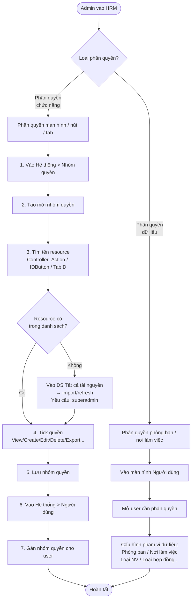
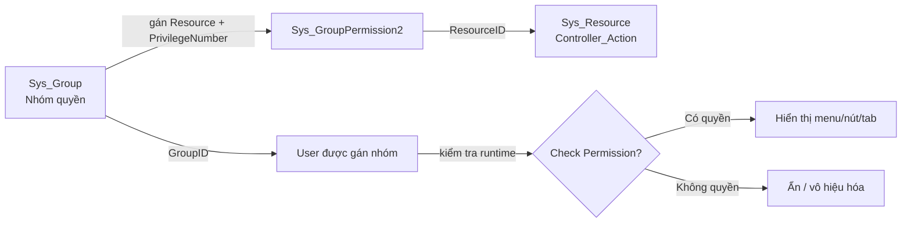

# Flow: Phân Quyền Hệ Thống HRM

Quy trình phân quyền đầy đủ trong HRM Pro 8 — từ tạo nhóm quyền đến gán user.

---

## Luồng tổng quan — 2 loại phân quyền

---

## Luồng phân quyền chức năng — Chi tiết

---

## Quy tắc đặt tên Resource

| Loại | Pattern | Ví dụ |
|------|---------|-------|
| Màn hình | `Controller_Action` | `Cat_Bank_index` |
| Nút | `Controller_Action_IDButton` | `Cat_DayOff_Index_btnAnalyzeCompensateHoliday` |
| Tab | ID HTML của tab | `InfoContactDetail` |

---

## PrivilegeNumber — Bitwise 8 quyền

| Bit | Quyền |
|-----|-------|
| 1 | View (Xem) |
| 2 | Create (Tạo mới) |
| 4 | Edit (Sửa) |
| 8 | Delete (Xóa) |
| 16 | Export |
| 32 | Import |
| 64 | Create Template |
| 128 | Change Column |

---

## Liên kết

- [[wiki/architecture/HRM-SysDB-Schema]] — Schema Sys_Group, Sys_GroupPermission2, Sys_Resource
- [[wiki/sources/Sys-TaiLieuPhanQuyen-02]] — Tài liệu đào tạo phân quyền
- [[wiki/sources/Sys-TaiLieuHeThong-01]] — Tài liệu hệ thống gốc
- [[wiki/sources/LTG-SYS-Meetings-2024]] — Ví dụ thực tế: store Get_Data_Permission_New
