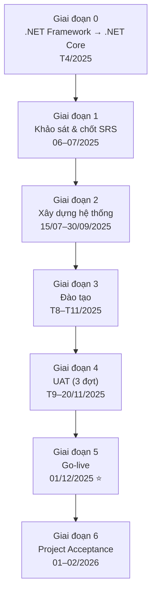
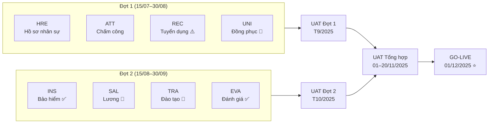
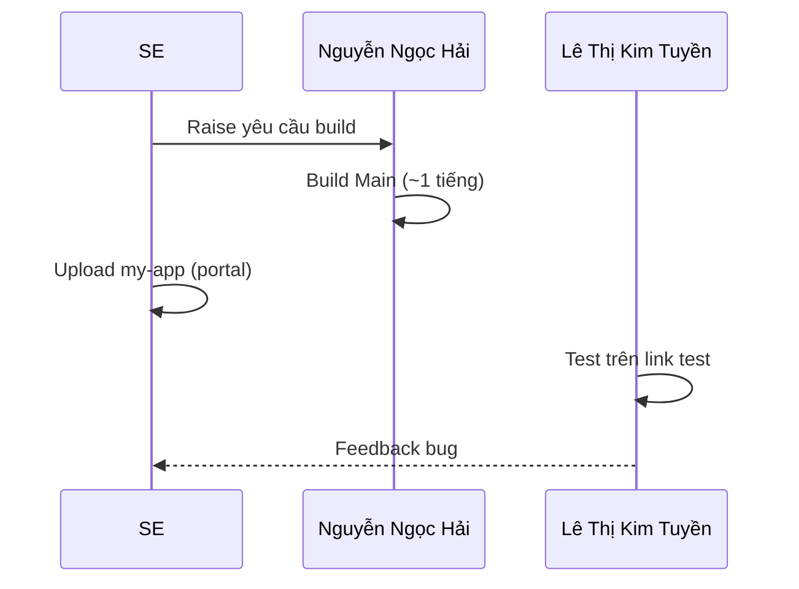

# Flow: Các giai đoạn dự án QuickPack QPVN

> Nguồn: [[wiki/sources/QuickPack-Project-Overview]] | So sánh: [[wiki/flows/Flow-Bitex-Phases]]

## Sơ đồ tổng quan 6 giai đoạn

## Sơ đồ Build — 2 đợt song song

> 🔴 = GAP rất phức tạp | ⚠️ = GAP phức tạp | ✅ = Không GAP

## Luồng Build Management

## Milestone

| Ngày | Milestone | Phụ trách |
|------|-----------|-----------|
| 29/07/2025 | Hoàn tất SRS | VnResource |
| 30/08/2025 | Hoàn tất Build Đợt 1 | VnResource |
| 29/09/2025 | Hoàn tất Training sơ bộ | Tùng.Ly |
| 30/09/2025 | Hoàn tất Build Đợt 2 | VnResource |
| 20/11/2025 | Hoàn tất UAT Tổng hợp | QPVN |
| **01/12/2025** | **Official Golive ⭐** | VnResource & QPVN |
| 01/2026 | Project Acceptance | VnResource |
