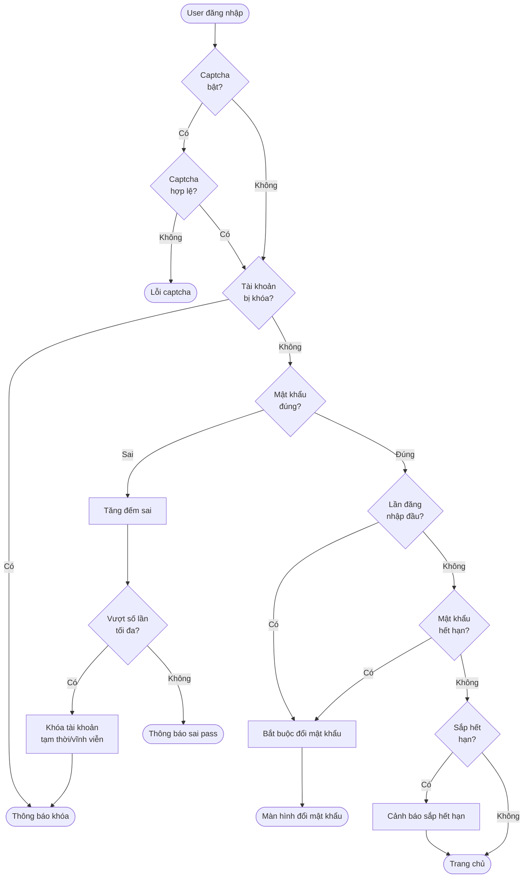
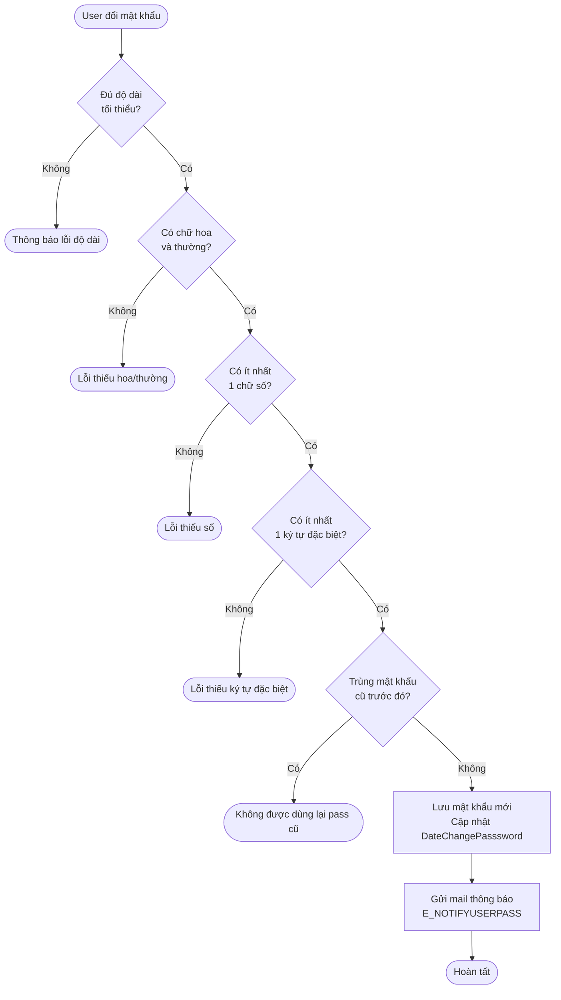
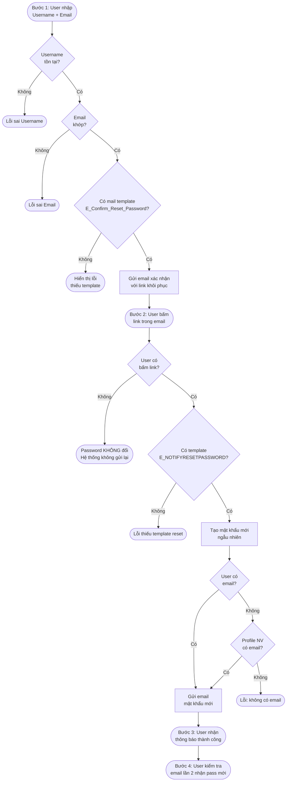

# Flow: Reset Mật Khẩu & Bảo Mật Đăng Nhập HRM

Ba luồng bảo mật password trong HRM Pro 8: đăng nhập, đổi mật khẩu, và quên mật khẩu.

---

## Luồng 1 — Đăng nhập bảo mật

---

## Luồng 2 — Đổi mật khẩu (bảo mật)

---

## Luồng 3 — Quên mật khẩu (4 bước)

---

## Cấu hình bảo mật (Sys_AllSetting)

| Tham số | Mô tả |
|---------|-------|
| Captcha đăng nhập | Google reCaptcha khi đăng nhập |
| Buộc đổi pass lần đầu | User mới đăng nhập lần đầu phải đổi |
| Chu kỳ đổi pass (ngày) | Kể từ lần đổi gần nhất |
| Cảnh báo sắp hết hạn (ngày) | Thông báo trước X ngày |
| Độ dài tối thiểu | Số ký tự tối thiểu |
| Số chữ số tối thiểu | |
| Số ký tự đặc biệt tối thiểu | |
| Số lần sai → khóa | Đăng nhập sai N lần bị khóa |
| Số phút tạm khóa | Rỗng = khóa vĩnh viễn |

---

## Liên kết

- [[wiki/architecture/HRM-SysDB-Schema]] — Sys_UserInfo: DateChangePasssword, DatePasswordExpired
- [[wiki/architecture/HRM-Auth-Architecture]] — Kiến trúc auth tổng thể
- [[wiki/sources/Sys-TaiLieuHeThong-01]] — Tài liệu gốc + Enum mail template
