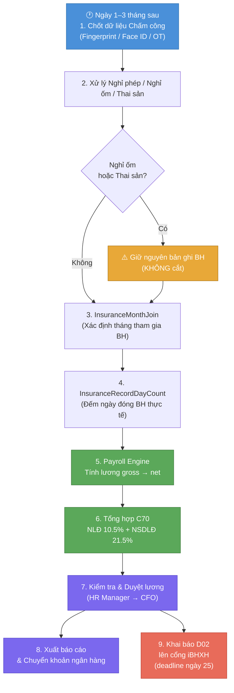

# Flow — Quy Trình Tính Lương Tháng (Monthly Payroll)

> **Loại**: Business Flow — End-to-End  
> **Chu kỳ**: Hàng tháng (đầu tháng sau)  
> **Phân hệ liên quan**: Chấm công → Bảo hiểm → Lương → Báo cáo

---

## Tổng quan

Quy trình tính lương tháng là nghiệp vụ **trọng tâm nhất** của HRM. Mọi phân hệ đều đổ dữ liệu vào đây. Lỗi ở bất kỳ bước nào đều ảnh hưởng đến lương nhân viên.

---

## Sơ đồ Flow (End-to-End)



---

## Chi tiết từng bước

### Bước 1 — Chốt dữ liệu Chấm công

**Người thực hiện**: HR Admin  
**Deadline**: Ngày 1–3 tháng sau

- Tổng hợp dữ liệu từ máy chấm công (fingerprint, face ID)
- Xử lý ngoại lệ: đi muộn, về sớm, OT, ca đêm
- **Rule đặc biệt VnPay**: đối tượng "1 đầu IN" — chỉ cần quẹt vào, không cần quẹt ra → [[wiki/sources/H-VnPay-Att-17042025]]
- Khóa sổ chấm công → không chỉnh sửa sau khi chốt

**Lỗi thường gặp**:
- Lệch timezone giữa máy chấm công và server HRM
- Thiếu ca làm việc → nhân viên bị tính thiếu công

---

### Bước 2 — Xử lý Nghỉ phép / Nghỉ ốm / Thai sản

**Nguyên tắc quan trọng**: Nghỉ ốm và thai sản **KHÔNG cắt** bản ghi BH

| Loại nghỉ | Hưởng | Tác động BH |
|-----------|-------|------------|
| Nghỉ phép năm | 100% lương | Không thay đổi BH |
| Nghỉ ốm (BHXH) | 75% lương đóng BH | Không cắt bản ghi BH |
| Thai sản | 100% lương đóng BH, 6 tháng | Không cắt bản ghi BH |
| Nghỉ không lương | 0% | Có thể cắt bản ghi BH nếu > 14 ngày |

Xem chi tiết: [[wiki/sources/INS-Nghi14Ngay]] và [[wiki/sources/INS-NghiThaiSan]]

---

### Bước 3 — Xác định bản ghi Bảo hiểm (InsuranceMonthJoin)

**Logic**: `InsuranceMonthJoin` xác định nhân viên nào **tham gia / dừng / thay đổi** BH trong tháng

- Nhân viên vào ngày 1 tháng → tham gia đủ tháng
- Nhân viên vào giữa tháng → tính từ ngày tham gia
- Nhân viên nghỉ việc → kết thúc bản ghi BH từ ngày nghỉ

Xem: [[wiki/sources/INS-InsuranceMonthJoin]]

---

### Bước 4 — Tính số ngày đóng BH (InsuranceRecordDayCount)

**Formula**: Đếm ngày thực tế đóng BH trong tháng theo bản ghi

- Tháng đủ: 30 ngày (quy ước)
- Tháng không đủ: đếm từng ngày thực
- Nghỉ không lương > 14 ngày → giảm ngày đóng BH

Xem: [[wiki/sources/INS-InsuranceRecordDayCount]]

---

### Bước 5 — Tính Lương (Payroll Engine)

**Đầu vào**:
- Dữ liệu công từ bước 1–2
- Mức lương cơ bản, hệ số, bậc lương
- Phụ cấp (ăn ca, xăng xe, điện thoại…)
- Khấu trừ (tạm ứng, thuế TNCN, BH nhân viên đóng)

**Công thức cơ bản**:
```
Lương thực nhận = Lương gross - BHXH NLĐ (8%) - BHYT NLĐ (1.5%) - BHTN NLĐ (1%) - Thuế TNCN - Khấu trừ khác
```

**Lỗi thường gặp**: Công thức lương không đồng bộ khi thay đổi chính sách giữa kỳ

---

### Bước 6 — Tổng hợp C70 (Bảng lương BH)

**C70** = Bảng tổng hợp lương Bảo hiểm xã hội

| Cột | Nội dung |
|-----|---------|
| NLĐ đóng | BHXH 8% + BHYT 1.5% + BHTN 1% = **10.5%** |
| NSDLĐ đóng | BHXH 17.5% + BHYT 3% + BHTN 1% = **21.5%** |
| Tổng chi phí BH | NLĐ + NSDLĐ = **32%** mức lương đóng BH |

C70 dùng để đối soát với D02 và làm căn cứ hạch toán kế toán.

Xem: [[wiki/sources/INS-C70-TinhLuong]]

---

### Bước 7 — Kiểm tra & Duyệt lương

**Người thực hiện**: HR Manager → CFO (hoặc BLĐ theo phân quyền)

Checklist duyệt:
- [ ] So sánh lương tháng này vs tháng trước (% deviation hợp lý)
- [ ] Kiểm tra nhân viên mới/nghỉ việc có xử lý đúng không
- [ ] Đối soát C70 với danh sách biến động BH
- [ ] Xác nhận số thuế TNCN

---

### Bước 8 — Xuất báo cáo & Chuyển khoản

- Xuất file lương (Excel, PDF) theo format ngân hàng
- Import file chuyển khoản lên hệ thống ngân hàng
- Lưu lịch sử lương trong HRM (không sửa sau khi chốt)

---

### Bước 9 — Khai báo BH lên iBHXH (song song bước 7–8)

**Deadline**: Ngày 25 tháng sau (nộp D02 lên iBHXH)

Flow chi tiết: [[wiki/flows/Flow-KhaiBaoiBHXH]]

---

## Điểm rủi ro chính

| Rủi ro | Tác động | Phòng tránh |
|--------|---------|------------|
| Lệch timezone máy chấm công | Sai công → sai lương | Đồng bộ NTP, kiểm tra trước chốt |
| Cắt bản ghi BH khi nghỉ ốm | Sai C70, sai D02 | Apply rule "không cắt bản ghi" |
| Công thức lương thay đổi giữa kỳ | Tính sai cho nhân viên | Áp dụng từ tháng sau, không hồi tố |
| Duyệt lương trễ | Trễ lương, nhân viên phản nàn | Khóa deadline hard (ngày 5 tháng sau) |

---

## Liên kết liên quan

- [[wiki/flows/Flow-KhaiBaoiBHXH]] — Quy trình khai báo BHXH song song
- [[wiki/concepts/HRM-Modules]] — Tổng quan phân hệ Lương & BH
- [[wiki/sources/INS-FishBone-Analysis]] — Phân tích lỗi BH thường gặp
- [[wiki/projects/VnPay-Project]] — Case study thực tế
