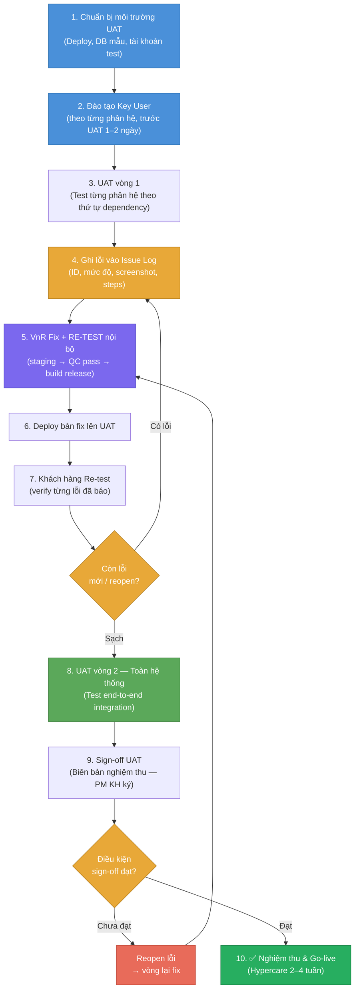

# Flow — Quy Trình UAT (User Acceptance Testing)

> **Loại**: Project Flow — Quality Assurance  
> **Áp dụng**: Giai đoạn 4 trong triển khai HRM  
> **Case study**: VnPay Phase 4 (06–07/2025)

---

## Tổng quan

UAT (User Acceptance Testing) là giai đoạn khách hàng **tự kiểm tra** toàn bộ hệ thống trước khi go-live. Đây là cửa ải cuối cùng — nếu UAT fail, không được go-live.

**Nguyên tắc VnResource**:
- Đào tạo key user **trước** khi UAT (không UAT song song với đào tạo)
- VnR phải **re-test tất cả lỗi đã sửa** trước khi gửi bản fix
- Mọi lỗi UAT phải ghi vào **Issue Log** và theo dõi đến hết

---

## Sơ đồ Flow UAT



---

## Chi tiết từng bước

### Bước 1 — Chuẩn bị môi trường UAT

**VnR thực hiện trước ngày UAT**:
- Deploy bản mới nhất lên server UAT (xem [[wiki/flows/Flow-Deploy-HRM]])
- Restore DB dữ liệu mẫu (hoặc dữ liệu thực đã cleanse)
- Cấu hình SSO / domain (nếu cần approval BLĐ → chase sớm)
- Tạo tài khoản test cho từng vai trò: HR Admin, Manager, Nhân viên

---

### Bước 2 — Đào tạo Key User

**Pattern chuẩn**: Đào tạo trước UAT 1–2 ngày

| Nhóm đào tạo | Phân hệ | Thời gian (mẫu VnPay) |
|-------------|---------|----------------------|
| Key user HR + Timekeeping | Nhân sự + Chấm công | 10/06 |
| Key user tuyển dụng + BH + đào tạo | Định biên, Tuyển dụng, BH, Tin tức | 23/06 |

**Output**: User biết thao tác → có thể tự test được

---

### Bước 3 — UAT vòng 1 (từng phân hệ)

**Phân hệ test theo thứ tự** (dependency-first):

```
Nhân sự → Chấm công → Lương → Bảo hiểm → Tuyển dụng → Đào tạo → Đánh giá
```

Mỗi phân hệ test:
- Test case cơ bản (happy path)
- Test case nghiệp vụ đặc thù của khách hàng
- Test case edge case (nghỉ phép, biến động lương, nhân viên mới/nghỉ)

**Thời gian**: 2–4 ngày/phân hệ (tuỳ độ phức tạp)

---

### Bước 4 — Ghi lỗi vào Issue Log

**Format chuẩn mỗi lỗi**:

| Trường | Nội dung |
|--------|---------|
| ID | UAT-001, UAT-002, ... |
| Phân hệ | Nhân sự / Lương / BH / ... |
| Mô tả lỗi | Chi tiết steps to reproduce |
| Screenshot | Bắt buộc |
| Mức độ | Critical / Major / Minor |
| Người báo | Key user phía KH |
| Ngày | DD/MM/YYYY |
| Trạng thái | Open / In Progress / Fixed / Verified / Closed |

---

### Bước 5 — VnR Fix + RE-TEST nội bộ

**Cam kết chất lượng VnR**: RE-TEST đủ trường hợp trước khi gửi bản fix

Quy trình nội bộ:
1. Developer fix → tạo branch / commit
2. Merge lên môi trường staging nội bộ
3. SE/QC nội bộ re-test
4. Nếu pass → build release mới
5. Nếu fail → vòng lại fix

---

### Bước 6 — Deploy bản fix lên UAT

Xem chi tiết: [[wiki/flows/Flow-Deploy-HRM]]

Sau deploy: notify khách hàng "Đã fix UAT-xxx, sẵn sàng re-test"

---

### Bước 7 — Khách hàng Re-test

Khách hàng verify từng lỗi đã báo:
- Pass → đánh dấu "Verified / Closed" trong Issue Log
- Fail → reopen, mô tả thêm

---

### Bước 8 — UAT vòng 2 (toàn hệ thống)

**Mục đích**: Test tích hợp end-to-end, không test từng phân hệ rời

Scenario quan trọng cần test:
- Nhân viên mới → tạo hồ sơ → chấm công → tính lương → khai báo BH
- Nhân viên nghỉ việc → offboarding → tất toán lương → dừng BH
- Tăng lương → điều chỉnh BH → tính lương tháng sau
- Quy trình tuyển dụng → onboarding → phân quyền hệ thống

**Thời gian**: 3–5 ngày

---

### Bước 9 — Sign-off UAT

**Điều kiện sign-off**:
- [ ] Không còn lỗi Critical nào Open
- [ ] Lỗi Major ≤ số đã thống nhất (thường 0–3)
- [ ] Lỗi Minor có roadmap fix sau go-live
- [ ] Toàn bộ test case UAT đã pass

**Văn bản**: Biên bản nghiệm thu UAT — ký bởi PM KH + BLĐ VnR

---

### Bước 10 — Nghiệm thu & Go-live

Sau sign-off UAT:
1. Họp chốt ngày go-live
2. Prepare production environment (xem [[wiki/flows/Flow-Deploy-HRM]] → production)
3. Cutover: migrate data từ hệ thống cũ (nếu có)
4. Go-live!
5. Hypercare period (2–4 tuần đầu sau go-live: support 24/7 hoặc theo SLA)

---

## Timeline tham khảo (VnPay Phase 4)

| Mốc | Ngày | Nội dung |
|-----|------|---------|
| Chuẩn bị hạ tầng + SSO | 15/05–06/06 | HTM, HT, ANTT |
| Đào tạo + UAT Nhân sự & Chấm công | 10/06–13/06 | Key users VnPay |
| Đào tạo + UAT các phân hệ còn lại | 23/06–27/06 | Key users VnPay |
| UAT vòng 2 toàn hệ thống + fix | 07/07–11/07 | All team |
| Hoàn tất UAT, ký nghiệm thu | 14/07–18/07 | PNS, PTNV |

Xem nguồn: [[wiki/sources/H-VnPay-Sys-03062025]]

---

## Rủi ro thường gặp trong UAT

| Rủi ro | Tác động | Phòng tránh |
|--------|---------|------------|
| SSO chờ approval BLĐ | Delay UAT infra | Chase từ sớm (2–3 tuần trước UAT) |
| Key user không có thời gian | UAT kéo dài | Ký cam kết lịch UAT trước |
| Lỗi phát sinh ở bước tích hợp | Phải fix nhiều → delay | Test tích hợp sớm (không để đến UAT vòng 2) |
| Data test không thực tế | Bỏ sót edge case | Dùng data anonymized từ hệ thống cũ |

---

## Liên kết liên quan

- [[wiki/concepts/Project-Phases]] — Các giai đoạn triển khai tổng quan
- [[wiki/sources/H-VnPay-Sys-03062025]] — Biên bản họp UAT Phase 4 VnPay
- [[wiki/sources/VnPay-Phases-Timeline]] — Timeline đầy đủ 8 giai đoạn
- [[wiki/flows/Flow-Deploy-HRM]] — Quy trình deploy bản fix lên UAT
- [[wiki/projects/VnPay-Project]] — Case study đầy đủ
