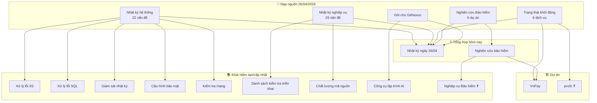

# 📊 Tổng hợp: Hoạt động Wiki ngày 26/04/2026

## Bức tranh toàn cảnh

Ngày 26/04/2026 là ngày wiki chuyển mình — từ giai đoạn **khởi tạo** sang **vận hành có nhịp**. Tổng cộng 6 nguồn mới được nạp, 7 trang khái niệm được tạo hoặc cập nhật, và 2 tổng hợp hoàn thành chỉ trong một ngày.

Điểm đáng chú ý nhất không phải số lượng: lần đầu tiên wiki tạo ra tri thức từ bên trong — nghiên cứu chủ động Bảo hiểm từ 6 dự án thực tế mà không cần tài liệu mới nào. Song song đó, 51 vấn đề kỹ thuật tích lũy 2021–2025 được số hóa lần đầu thành kho tra cứu có cấu trúc theo phương pháp 5 Tại sao.

---

## Các điểm cốt lõi

| # | Điểm | Nguồn | Độ tin cậy |
|---|------|-------|------------|
| 1 | 22 vấn đề hệ thống (IIS, SQL, Nhật ký, Mạng) được hệ thống hóa lần đầu | [[wiki/sources/Nhat-ky-van-de-he-thong]] | Dữ kiện |
| 2 | 29 vấn đề nghiệp vụ SE — nguyên nhân gốc phổ biến nhất: thiếu quy trình giao tiếp giữa các vai trò | [[wiki/sources/Nhat-ky-van-de-nghiep-vu]] | Dữ kiện |
| 3 | Phân hệ Bảo hiểm có mức tùy chỉnh cao nhất FIT-HRM — mỗi khách hàng phát sinh ít nhất 1 yêu cầu đặc thù | [[wiki/synthesis/BaoHiem-NghiepVu-Research-20260426]] | Suy luận từ 6 dự án |
| 4 | Tích hợp MISA AMIS chưa hoàn thành ở bất kỳ dự án nào — TBV (2024) và VnPay (2025) đều dang dở | [[wiki/synthesis/BaoHiem-NghiepVu-Research-20260426]] | Dữ kiện |
| 5 | Quy luật "nghỉ 14 ngày" tái xuất độc lập ở 3 dự án (LTG, Karcher, TBV), hội tụ về cùng giải pháp | [[wiki/synthesis/BaoHiem-NghiepVu-Research-20260426]] | Dữ kiện |
| 6 | WarmupStatus mở rộng 3 → 6 dịch vụ + khởi động trước Razor view — giải quyết màn hình trắng sau restart IIS | [[wiki/sources/WarmupStatus-Performance-2026]] | Dữ kiện |
| 7 | Nhãn `pvcfc` trong nguồn WarmupStatus không có trang dự án trong wiki | [[wiki/sources/WarmupStatus-Performance-2026]] | Suy luận — cần xác minh |
| 8 | `wiki/concepts/BaoHiem-NghiepVu.md` chưa tạo dù nghiên cứu đã đủ nội dung | [[wiki/synthesis/BaoHiem-NghiepVu-Research-20260426]] | Dữ kiện — khoảng trống |

---

## Biểu đồ số liệu

---

#### 📈 Tri thức đang tập trung vào VnPay — các dự án khác gần như trống

> 💡 VnPay chiếm 45% toàn bộ wiki với 10 nguồn. Nếu có thành viên mới cần tìm hiểu TrungDong hay HongNgoc, họ gần như không có gì để tra cứu — TrungDong chỉ có 2, HongNgoc và Marico mỗi dự án chỉ có 1 nguồn.

```chart
type: bar
labels: [VnPay, Chung, TrungDong, HongNgoc, Marico]
series:
  - title: Số nguồn
    data: [10, 8, 2, 1, 1]
    backgroundColor: "#4e79a7"
xTitle: Dự án
yTitle: Số nguồn
options:
  scales:
    x:
      grid:
        display: false
    y:
      grid:
        display: false
  plugins:
    datalabels:
      display: true
      anchor: end
      align: top
```

> 🎯 **Nên làm**: Nạp ít nhất 3–5 nguồn cho TrungDong trong tuần tới — trước khi bắt đầu Bitex để tránh mất tri thức khi chuyển giao.

---

#### 📈 Vấn đề hệ thống: Nhật ký và Mạng/Bảo mật chiếm nhiều hơn IIS và SQL

> 💡 Phần lớn mọi người nghĩ IIS và SQL là nguồn gây lỗi chính — nhưng số liệu cho thấy ngược lại. Nhật ký & Giám sát và Mạng & Bảo mật mỗi nhóm có 6 vấn đề, IIS và SQL chỉ 5. Sự cố hay đến từ chỗ khó nhìn nhất: log bị đầy, cache không refresh, proxy chặn ngầm.

```chart
type: pie
labels: [IIS và Pool, SQL Server, Nhật ký và Giám sát, Mạng và Bảo mật]
series:
  - title: Số vấn đề
    data: [5, 5, 6, 6]
options:
  plugins:
    datalabels:
      display: true
      formatter: "value"
```

> 🎯 **Nên làm**: Khi khách hàng báo lỗi không vào được HRM, kiểm tra Nhật ký và Mạng trước IIS Pool — xác suất cao hơn theo thực tế.

---

#### 📈 Vấn đề nghiệp vụ: Tầng gốc rễ SE-BA-QC ít người để ý nhất nhưng có đòn bẩy cao nhất

> 💡 Nhóm quy trình SE-BA-QC chỉ có 4 vấn đề — ít nhất trong 4 nhóm — nhưng đây là tầng gốc rễ. Mỗi lỗi ở đây kéo theo nhiều lỗi ở 3 nhóm còn lại. Lỗi deploy (7) và lỗi logic nghiệp vụ (7) phần lớn có thể phòng ngừa nếu giải quyết tốt quy trình giao tiếp từ đầu.

```chart
type: bar
labels: [Quy trình triển khai, Chất lượng mã, Lỗi logic nghiệp vụ, Quy trình SE-BA-QC]
series:
  - title: Số vấn đề
    data: [7, 6, 7, 4]
    backgroundColor: "#f28e2b"
xTitle: Nhóm vấn đề
yTitle: Số vấn đề
options:
  scales:
    x:
      grid:
        display: false
    y:
      grid:
        display: false
  plugins:
    datalabels:
      display: true
      anchor: end
      align: top
```

> 🎯 **Nên làm**: Cải thiện quy trình SE-BA-QC trước — đây là nơi có đòn bẩy cao nhất, mỗi cải tiến nhỏ có thể triệt tiêu nhiều lỗi ở các tầng trên.

---

#### 📈 Hoạt động hôm nay: Nghiên cứu chủ động mới là bước đột phá thực sự

> 💡 Nhìn vào số lần, nạp nguồn có vẻ chiếm ưu thế với 2 lần. Nhưng giá trị thực sự nằm ở 1 lần nghiên cứu chủ động — lần đầu tiên wiki tạo tri thức từ bên trong thay vì chỉ tiêu hóa tài liệu từ bên ngoài. Điều đó không thể đo bằng con số.

```chart
type: bar
labels: [Nạp nguồn, Nghiên cứu chủ động, Tổng hợp]
series:
  - title: Số lần trong ngày
    data: [2, 1, 2]
    backgroundColor: ["#59a14f", "#e15759", "#4e79a7"]
xTitle: Loại hoạt động
yTitle: Số lần
options:
  scales:
    x:
      grid:
        display: false
    y:
      grid:
        display: false
  plugins:
    datalabels:
      display: true
      anchor: end
      align: top
```

> 🎯 **Nên làm**: Duy trì ít nhất 1 lần nghiên cứu chủ động mỗi tuần — không chờ có tài liệu mới, đặt câu hỏi tổng hợp từ tri thức đã có.

---

## Biểu đồ quan hệ (Mermaid)



---

## Quy luật & Mâu thuẫn

**Quy luật phát hiện:**

- 🔁 **Quy luật "lỗi lặp vì thiếu quy trình"**: Truy nguyên 5 Tại sao của 29 vấn đề đều dừng ở cùng một điểm — thiếu tiêu chuẩn và thiếu tự động hóa. Đây là vấn đề hệ thống, không phải lỗi cá nhân.
- 🔁 **Quy luật "tích hợp bên thứ ba = rủi ro ngoài kiểm soát"**: MISA AMIS ở TBV (2024) và VnPay (2025) đều chưa hoàn thành — đã được ghi nhận độc lập trong [[wiki/synthesis/VnPay-Lessons-Learned]].
- ⚡ **Quy luật khởi động song song**: `Task.WhenAll()` + ghi Redis là mẫu chuẩn đã kiểm chứng — tái sử dụng được cho dịch vụ mới.

**Mâu thuẫn / Khoảng trống:**

- ❓ `pvcfc` có trong nhãn nguồn nhưng không có trang dự án — chưa rõ là tên khác của Bitex hay dự án riêng
- ❓ Nhật ký ngày ghi "22 tổng nguồn" nhưng thực tế sau đợt nạp thứ hai là 26 — snapshot giữa chừng
- ❓ `wiki/concepts/BaoHiem-NghiepVu.md` chưa tạo dù nghiên cứu đủ để viết ngay
- ❓ Dự án Bitex (đang khởi động 2026) chưa có nguồn nào

---

## Khuyến nghị

| Ưu tiên | Hành động |
|---------|-----------|
| 🔴 Cao | Tạo `wiki/concepts/bao-hiem-nghiep-vu.md` |
| 🔴 Cao | Xác định `pvcfc` — tạo trang dự án nếu cần |
| 🟡 Trung bình | Nạp 3–5 nguồn cho TrungDong trong tuần tới |
| 🟡 Trung bình | Nạp 7 file thô nghiên cứu Bảo hiểm (LTG, FIT, UNIS, TBV, Karcher) |
| 🟡 Trung bình | Theo dõi kết quả tích hợp MISA VnPay sau tháng 9/2025 |
| 🟢 Thấp | Nạp tài liệu khởi động dự án Bitex |

---

## 💬 3 Câu hỏi suy ngẫm

1. 🧠 **[Giả định]** Biểu đồ vấn đề hệ thống kết luận Nhật ký & Mạng nhiều hơn IIS — nhưng con số này đếm vấn đề được *ghi nhận*, không phải tần suất xảy ra thực tế. Liệu IIS có thực sự ít lỗi hơn, hay chỉ vì khi lỗi IIS thì nhận ra và sửa nhanh nên không ai ghi lại — khiến kho tri thức bị lệch về phía "vấn đề khó thấy"?

2. 🧪 **[Thí nghiệm]** Nếu dự án Bitex áp dụng ngay toàn bộ 51 mục từ hai nhật ký vấn đề làm danh sách kiểm tra onboarding — bao nhiêu mục sẽ không thể ngăn chặn vì phụ thuộc vào đặc thù nghiệp vụ của khách hàng chứ không phải lỗi kỹ thuật lặp lại? Tỷ lệ đó tiết lộ giới hạn thực sự của kho kiến thức chung.

3. 🌐 **[Kết nối]** Quy luật "tích hợp bên thứ ba = rủi ro ngoài kiểm soát" tái xuất ở cả nghiên cứu Bảo hiểm lẫn [[wiki/synthesis/VnPay-Lessons-Learned]] — nhưng wiki chưa có trang khái niệm riêng. Nếu tạo `wiki/concepts/rui-ro-tich-hop-ben-thu-ba.md`, liệu có thể rút ra quy trình quản lý rủi ro chuẩn cho tất cả dự án không?
