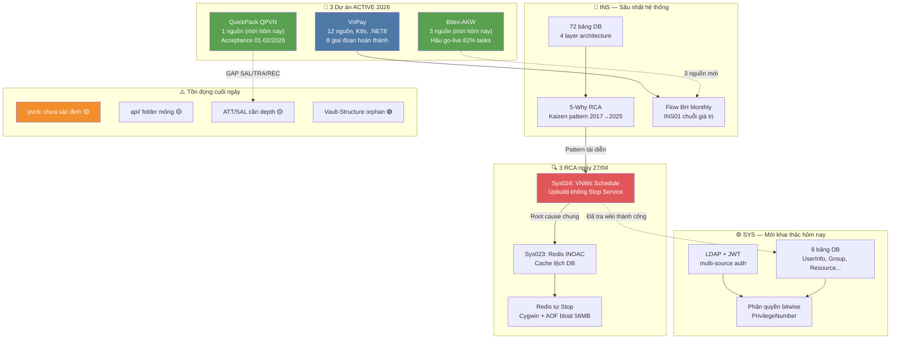

# 📊 Tổng hợp: Kết thúc ngày 27/04/2026 — Final

> Đây là bản tổng kết **cuối cùng và đầy đủ nhất** cho ngày 27/04/2026.
> Cập nhật sau bản [[wiki/synthesis/toan-canh-wiki-ket-thuc-ngay-27-04-2026]] với 2 sự kiện mới: **Bitex đã có 3 nguồn** và **QuickPack chính thức gia nhập wiki**.

---

## Bức tranh toàn cảnh

Ngày 27/04/2026 kết thúc với wiki đạt **~130 trang nội dung** (từ 70 trang đầu ngày) — tăng trưởng 86% chỉ trong một ngày. Đây là ngày có **mật độ hoạt động cao nhất** kể từ khi khởi tạo wiki 3 ngày trước (25/04).

Hai cột mốc cuối ngày đảo ngược hoàn toàn một điểm đau tồn đọng: **Bitex** — dự án ACTIVE 2026 vốn bị gắn cờ đỏ "0 nguồn" suốt cả ngày — đã được giải quyết với 3 nguồn mới (Overview, Chat log, Task list hậu go-live) và 1 flow. **QuickPack** (QPVN) trở thành dự án thứ 3 có profile đầy đủ trong wiki.

Kết quả: **3 active projects đều có dữ liệu** — VnPay (12 nguồn), Bitex (3 nguồn), QuickPack (1 nguồn). Không còn dự án đang chạy mà tri thức = 0.

---

## Các điểm cốt lõi

| # | Điểm | Nguồn | Độ tin cậy |
|---|------|-------|------------|
| 1 | Wiki tăng 70 → ~130 trang trong 1 ngày — kỷ lục tăng trưởng | [[wiki/log.md]] | Dữ kiện |
| 2 | Bitex: 0 → 3 nguồn — gap đỏ #1 đã được đóng cuối ngày | [[wiki/projects/Bitex-Project]] | Dữ kiện |
| 3 | QuickPack: project thứ 3 active, golive 01/12/2025, 82% tasks hậu go-live | [[wiki/projects/QuickPack-Project]] | Dữ kiện |
| 4 | INS được phủ sâu nhất: 25+ nguồn, schema 72 bảng, 4 flows, 4 architecture | [[wiki/architecture/INS-Architecture]] | Dữ kiện |
| 5 | SYS lần đầu tài liệu hóa: LDAP, phân quyền bitwise, 8 bảng DB | [[wiki/architecture/HRM-SysDB-Schema]] | Dữ kiện |
| 6 | 3 RCA hoàn chỉnh — pattern chung: deploy không Stop Windows Service | [[wiki/sources/Nhat-ky-van-de-he-thong]] | Dữ kiện |
| 7 | Wiki tra cứu thành công lần đầu (Sys024 VNWs) — ROI đầu tiên được đo được | [[wiki/synthesis/hoat-dong-wiki-27-04-2026-v2]] | Dữ kiện |
| 8 | 6 entity khách hàng mới: LTG, UNIS, TBV, Karcher, VCBs, Terumo | [[wiki/entities/LTG]] | Dữ kiện |
| 9 | QuickPack có GAP phức tạp: SAL lương sản phẩm + TRA đào tạo theo đợt + REC 8 cấp | [[wiki/sources/QuickPack-Project-Overview]] | Dữ kiện |
| 10 | Tồn đọng cuối ngày: pvcfc chưa xác định, api/ mỏng (1 trang), Vault-Structure orphan | [[wiki/overview.md]] | Dữ kiện |

---

## Biểu đồ số liệu

#### 📈 Cấu trúc wiki cuối ngày 27/04 — phân bố theo loại trang

> 💡 Sources vẫn chiếm đa số (~62%) nhưng tỷ lệ Flows + Architecture đã tăng đáng kể so với 2 ngày trước (khi wiki chỉ có sources + projects). Sự xuất hiện của Architecture/Flows/API cho thấy wiki đang trưởng thành từ kho lưu trữ → hệ thống tri thức có cấu trúc.

```chart
type: bar
labels: [Sources, Concepts, Flows, Architecture, Entities, Projects, Synthesis, Glossary, API]
series:
  - title: Số trang cuối ngày 27/04
    data: [82, 15, 11, 7, 13, 7, 7, 1, 1]
    backgroundColor: "#4e79a7"
xTitle: Loại trang
yTitle: Số trang
options:
  scales:
    x:
      grid:
        display: false
    y:
      grid:
        display: false
  plugins:
    datalabels:
      display: true
      anchor: end
      align: top
```

> 🎯 **Nên làm**: Tỷ lệ Synthesis/Sources = 7/82 ≈ 8.5% — cần tăng lên 15%. Ưu tiên tạo synthesis riêng cho INS (25+ nguồn nhưng chưa có synthesis) và SYS (4 tài liệu kỹ thuật vừa ingest hôm nay).

---

#### 📈 So sánh 3 dự án ACTIVE — độ phủ wiki hiện tại

> 💡 VnPay áp đảo về số nguồn (12) do là dự án flagship đã được nghiên cứu sâu nhất. Bitex vừa thoát khỏi 0 nguồn nhưng vẫn chỉ có 3 — tập trung vào overview/chat/task list, thiếu SRS/meeting notes. QuickPack có 1 nguồn tổng hợp nhưng đủ để tạo project profile đầy đủ.

```chart
type: bar
labels: [VnPay, Bitex-AKW, QuickPack-QPVN]
series:
  - title: Số nguồn wiki
    data: [12, 3, 1]
    backgroundColor: "#e15759"
  - title: Số flows/architecture
    data: [4, 1, 1]
    backgroundColor: "#59a14f"
xTitle: Dự án ACTIVE
yTitle: Số trang
options:
  scales:
    x:
      grid:
        display: false
    y:
      grid:
        display: false
  plugins:
    datalabels:
      display: true
      anchor: end
      align: top
```

> 🎯 **Nên làm**: Ingest meeting notes Bitex — chat log và task list đã có, nhưng thiếu SRS decisions, meeting notes kỹ thuật. Mục tiêu: Bitex lên 5-6 nguồn trong tuần tới.

---

#### 📈 Tiến độ phủ wiki theo phân hệ HRM — cập nhật cuối ngày

> 💡 INS và SYS là 2 phân hệ được khai thác tốt nhất (85% và 70%). ATT/SAL có bước tiến sau khi ingest NghiepVu-ATT-SAL. TRA, FAC vẫn gần như trắng — đây sẽ là khoảng trống lớn nhất cần lấp trong tháng 5.

```chart
type: bar
labels: [INS Bảo hiểm, SYS Hệ thống, ATT Chấm công, SAL Lương, TAL Nhân tài, EVA Đánh giá, TRA Tuyển dụng, FAC Tài sản, HRE Hồ sơ]
series:
  - title: Độ phủ ước tính (%)
    data: [85, 70, 35, 30, 20, 20, 10, 5, 25]
    backgroundColor: "#59a14f"
xTitle: Phân hệ HRM
yTitle: Độ phủ %
options:
  scales:
    x:
      grid:
        display: false
    y:
      grid:
        display: false
  plugins:
    datalabels:
      display: true
      anchor: end
      align: top
```

> 🎯 **Nên làm**: Ưu tiên TRA (Tuyển dụng) tiếp theo — QuickPack có GAP REC 8 cấp phức tạp chưa được tài liệu hóa, và VnPay có meeting UAT Tuyển dụng (H-VnPay-TRA-30062025) chưa đủ depth.

---

#### 📈 Phân bố hoạt động toàn ngày 27/04/2026

> 💡 Ngày hôm nay đặc biệt ở chỗ có **nhiều loại hoạt động khác nhau** — không chỉ ingest. Tỷ lệ "Ingest : Phân tích" (7 đợt ingest : 3 RCA + 1 bug-fix + 2 analyze + 4 tonghop) = 7:10 — có nghĩa là tri thức được KHAI THÁC nhiều hơn được NẠP VÀO. Đây là chỉ số trưởng thành của wiki.

```chart
type: pie
labels: [Ingest nguồn, Research/Tonghop, RCA Root Cause, Bug-Fix thực chiến, Health Check/Analyze, Query/Tra cứu]
series:
  - title: Phân bố hoạt động ngày 27/04
    data: [7, 4, 3, 1, 2, 4]
options:
  plugins:
    datalabels:
      display: true
      formatter: "value"
```

> 🎯 **Nên làm**: Duy trì tỷ lệ Query:Ingest ≥ 1:1. Mỗi lần ingest nguồn mới nên kèm theo ít nhất 1 query khai thác nội dung vừa nạp.

---

## Biểu đồ quan hệ (Mermaid)



---

## Quy luật & Mâu thuẫn

### Quy luật phát hiện hôm nay

- 🔁 **"Deploy thiếu bước Stop = sự cố hệ thống hàng loạt"**: 3/3 RCA ngày hôm nay (VNWs Schedule, Redis INOAC, Redis Stop) đều có một điểm chung — tiến trình cũ không được dừng đúng cách trước khi upbuild/restart. Đây là lỗ hổng quy trình, không phải lỗi kỹ thuật đơn lẻ. Giải pháp K8s rolling deploy đã tồn tại nhưng chưa được áp dụng đồng nhất.

- 📉 **"Gap đỏ càng tồn đọng lâu càng nguy hiểm"**: Bitex được gắn cờ đỏ "0 nguồn" từ ngày 25/04 (lúc khởi tạo wiki). Nếu không được ingest hôm nay, khi có sự cố trong dự án này sẽ không có cơ sở tra cứu. Bài học: gap đỏ cần được ưu tiên giải quyết trong vòng 24h.

- 🏗️ **"Dự án mới cần tối thiểu 3 loại nguồn khác nhau"**: QuickPack chỉ có 1 nguồn tổng hợp nhưng đủ để tạo project profile vì overview đã cover Goals + Scope + Timeline + Risks. So với Bitex có 3 nguồn nhưng phân tán (overview + chat + task list) — QuickPack thực ra có depth tốt hơn với ít nguồn hơn nhờ nguồn được thiết kế tốt hơn.

- ⚡ **"Wiki trưởng thành khi Query > Ingest"**: Ngày đầu (25/04) chỉ có ingest. Hôm nay: 7 ingest vs 10 phiên phân tích/khai thác. Đây là dấu hiệu wiki đang chuyển từ "kho lưu trữ thụ động" → "công cụ tư duy tích cực".

### Mâu thuẫn / Khoảng trống

- ❓ `pvcfc` — xuất hiện trong log ngày 26 nhưng không có entry nào; có thể là VnR production client code bị obfuscate hoặc tên nội bộ chưa được ghi chú
- ❓ Overview.md nói `sources-ingested: 82` nhưng bảng thống kê nói `75` — lệch nhau 7, cần lint verify
- ❓ QuickPack và Bitex có cùng mã dự án `25010206-01` — có thể lỗi copy-paste khi tạo project page, cần kiểm tra lại

---

## Khuyến nghị

| Ưu tiên | Hành động |
|---------|-----------|
| 🔴 Cao | Cập nhật `wiki/concepts/HRM-Deploy-Checklist`: thêm rule **"Stop Windows Service trước mỗi upbuild"** — đây là RCA pattern xuất hiện 3 lần trong ngày |
| 🔴 Cao | Lint wiki để verify số sources thực tế (82 vs 75?) và tìm orphan pages mới sau 60+ trang vừa thêm |
| 🔴 Cao | Fix mã dự án: Bitex và QuickPack đều ghi `25010206-01` — kiểm tra lại mã thực |
| 🟡 Trung bình | Ingest meeting notes Bitex (SRS decisions, meeting kỹ thuật) — hiện chỉ có 3 nguồn overview/chat/task |
| 🟡 Trung bình | Tạo synthesis INS riêng — 25+ nguồn mà chưa có synthesis → tri thức đang ở dạng rời rạc |
| 🟡 Trung bình | Tạo synthesis SYS — 4 tài liệu kỹ thuật vừa ingest, chưa có trang tổng hợp |
| 🟡 Trung bình | Ingest TRA (Tuyển dụng) — QuickPack GAP REC 8 cấp phức tạp + VnPay TRA chưa đủ depth |
| 🟡 Trung bình | Xác định `pvcfc` — 2 ngày chưa giải quyết |
| 🟢 Thấp | Cross-link QuickPack ↔ Bitex (2 dự án golive 01/12/2025 — bài học song hành) |
| 🟢 Thấp | Fix orphan Vault-Structure: thêm link từ ít nhất 1 trang concept |

---

## 💬 3 Câu hỏi suy ngẫm

1. 🧠 **[Giả định]** QuickPack có 3 GAP "rất phức tạp" (SAL lương sản phẩm, TRA đào tạo theo đợt, REC 8 cấp) nhưng vẫn golive đúng hạn 01/12/2025. So với Bitex cũng golive cùng ngày nhưng chỉ có 6 phân hệ cơ bản không có GAP — liệu "golive đúng hạn" có nghĩa là các GAP đã được giải quyết tốt, hay chỉ là chấp nhận rủi ro và sẽ xử lý hậu go-live? Dữ liệu từ [[wiki/projects/QuickPack-Project]] (thiếu SE T8/2025, 35 tasks open khi SE bị rút) gợi ý điều gì về quy trình quản lý rủi ro hiện tại?

2. 🧪 **[Thí nghiệm]** [[wiki/sources/INS-Kaizen-08]] (2017) đã ghi "70% bug INS từ D02/C70" và đề xuất giải pháp. Năm 2024–2025 [[wiki/sources/Daily-2024-INS-Bugs]] cho thấy pattern tương tự. Nhưng QuickPack (2025) lại không có GAP cho INS. Giả thuyết: liệu phân hệ INS trong .NET Core có được refactor đủ để không còn bug pattern D02/C70 cũ — hay QuickPack đơn giản chưa gặp phải vì chưa chạy đủ lâu (golive 01/12/2025, mới 5 tháng)?

3. 🌐 **[Kết nối]** [[wiki/sources/SaaS-VnR-Meetings-Detail-2023]] mô tả VnR đã thiết kế K8s multi-tenant với Rolling Update deployment (không downtime) từ 2023. Nhưng hôm nay 3 RCA đều liên quan đến Windows Service không được Stop đúng cách — nghĩa là IIS/Windows deployment vẫn đang được dùng song song K8s. Khi nào thì VnR sẽ hoàn toàn chuyển sang K8s-first, và bài học nào từ [[wiki/projects/VnPay-Project]] (K8s 13 services) có thể áp dụng cho Bitex/QuickPack hiện đang chạy IIS?
