# 📊 Tổng hợp: Toàn cảnh Wiki — Kết thúc ngày 27/04/2026

## Bức tranh toàn cảnh

Ngày 27/04/2026 là ngày bận rộn và đột phá nhất kể từ khi khởi tạo wiki. Bắt đầu từ 70 trang (cuối ngày 26), kết thúc với **~120+ trang** — tăng trưởng tuyệt đối +50 trang chỉ trong một ngày làm việc. Nội dung mở rộng trên 4 hướng lớn: **(1) Phân hệ INS** được khai thác sâu với 20+ nguồn gồm schema đầy đủ 72 bảng, 5-Why RCA, biểu mẫu D02/C70; **(2) Phân hệ SYS** lần đầu được tài liệu hóa đầy đủ với LDAP, phân quyền bitwise, reset password, schema 8 bảng; **(3) Khách hàng mới** — 6 entity mới (LTG, UNIS, TBV, Karcher, VCBs, Terumo) với các yêu cầu đặc thù; **(4) Thực chiến RCA** — 3 phân tích nguyên nhân gốc rễ thực tế (Sys023 Redis INOAC, Sys024 Schedule VNWs, Redis tự Stop).

Dấu mốc quan trọng nhất trong ngày: **wiki được dùng để tra cứu thành công lần đầu** trong phiên bug-fix VNWs — Sys024 đã có sẵn từ 18/4, xác nhận vòng lặp "ghi → tra → dùng" đã hoạt động.

---

## Các điểm cốt lõi

| # | Điểm | Nguồn | Độ tin cậy |
|---|------|-------|------------|
| 1 | Wiki tăng từ 70 → 120+ trang (ngày 26→27) — cao nhất trong 3 ngày đầu | [[wiki/log.md]] | Dữ kiện |
| 2 | INS là phân hệ được tài liệu hóa sâu nhất: 25+ sources, schema 72 bảng, 4 flow | [[wiki/architecture/INS-Architecture]] | Dữ kiện |
| 3 | SYS được khai thác lần đầu: LDAP + phân quyền + password + 8 bảng DB | [[wiki/architecture/HRM-SysDB-Schema]] | Dữ kiện |
| 4 | 6 entity khách hàng mới — đa dạng yêu cầu BH tự nguyện, ca 24h, FAC, tách user | [[wiki/entities/LTG]], [[wiki/entities/UNIS]] | Dữ kiện |
| 5 | 3 RCA hoàn chỉnh trong ngày — pattern: deploy thiếu bước Stop gây ra 2/3 sự cố | [[wiki/sources/Nhat-ky-van-de-he-thong]] | Dữ kiện |
| 6 | VnPay Research: 13 services K8s, 8 giai đoạn, sự cố nghẽn 200 users T11/2025 | [[wiki/synthesis/VnPay-Research-20260427]] | Dữ kiện |
| 7 | Bitex vẫn = 0 nguồn — dự án đang chạy 2026 không có tri thức nào được ghi lại | [[wiki/projects/Bitex-Project]] | Dữ kiện |
| 8 | Sources phân bổ lệch: VnPay 12 nguồn vs LTG 4, TrungDong 3, Bitex 0 | [[wiki/index.md]] | Suy luận |
| 9 | Kaizen #08 (2017) — 70% bug INS từ D02/C70; pattern tái diễn năm 2024–2025 | [[wiki/sources/INS-Kaizen-08]] | Suy luận |
| 10 | Tồn đọng: pvcfc chưa xác định, api/ folder chưa tạo, orphan page Vault-Structure | [[wiki/log.md]] | Dữ kiện |

---

## Biểu đồ số liệu

#### 📈 Tăng trưởng wiki theo loại trang — cuối ngày 27/04

> 💡 Sources chiếm tỷ trọng áp đảo (75/120 trang). Architecture và Flows là 2 loại mới tạo từ ngày 26 và đang tăng nhanh. Synthesis vẫn ít (6 trang) — tri thức được tích lũy nhiều nhưng tổng hợp vẫn còn ít, chưa tương xứng.

```chart
type: bar
labels: [Sources, Concepts, Flows, Architecture, Entities, Projects, Synthesis, Glossary, API]
series:
  - title: Số trang cuối ngày 27/04
    data: [75, 15, 9, 7, 12, 6, 6, 1, 1]
    backgroundColor: "#4e79a7"
xTitle: Loại trang
yTitle: Số trang
options:
  scales:
    x:
      grid:
        display: false
    y:
      grid:
        display: false
  plugins:
    datalabels:
      display: true
      anchor: end
      align: top
```

> 🎯 **Nên làm**: Tỷ lệ Synthesis/Sources hiện là 6/75 ≈ 8% — quá thấp. Mục tiêu lý tưởng là 15–20%. Ưu tiên tạo synthesis cho INS (chưa có synthesis độc lập) và SYS (vừa ingest nhiều).

---

#### 📈 Phân bố nguồn wiki theo khách hàng / dự án

> 💡 VnPay dẫn đầu với 12 nguồn — phản ánh đúng mức độ phức tạp và quy mô dự án này. Nhưng nhóm "Đa dự án/Nội bộ" (Multi-SYS, GiaoBan, SaaS, Daily) đang trở thành một cluster quan trọng chứa tri thức kỹ thuật lõi. Bitex = 0 là điểm mù nguy hiểm nhất.

```chart
type: bar
labels: [VnPay, Đa dự án/Nội bộ, LTG, INS chung, TrungDong, UNIS, VCBs, FIT, HongNgoc, Karcher, TBV, Terumo, Bitex]
series:
  - title: Số nguồn theo nhóm
    data: [12, 10, 4, 8, 3, 2, 2, 2, 2, 1, 1, 1, 0]
    backgroundColor: "#e15759"
xTitle: Khách hàng / Nhóm
yTitle: Số nguồn
options:
  scales:
    x:
      grid:
        display: false
    y:
      grid:
        display: false
  plugins:
    datalabels:
      display: true
      anchor: end
      align: top
```

> 🎯 **Nên làm**: Phân loại lại "INS chung" — các nguồn INS từ Kaizen/Schema/5Why là tri thức sản phẩm, không phải project-specific. Tạo entity `HRM-INS-Module` riêng để phân biệt.

---

#### 📈 Hoạt động ngày 27/04 theo loại (số phiên làm việc)

> 💡 Ngày hôm nay cân bằng tốt giữa ingest (nạp mới) và xử lý (analyze, RCA, bug-fix). Đây là dấu hiệu wiki đang trưởng thành — không chỉ lưu trữ mà còn được khai thác tích cực. 4 đợt ingest + 3 RCA + 1 bug-fix + 1 research là một ngày làm việc "full stack" của hệ thống tri thức.

```chart
type: pie
labels: [Ingest nguồn, Health Check, Research, RCA / Root Cause, Bug-Fix thực chiến, Tổng hợp (tonghop)]
series:
  - title: Phân bố hoạt động
    data: [4, 2, 1, 3, 1, 2]
options:
  plugins:
    datalabels:
      display: true
      formatter: "value"
```

> 🎯 **Nên làm**: Tỷ lệ RCA/Ingest = 3/4 là lý tưởng. Duy trì ít nhất 1 RCA mỗi 2 đợt ingest để biến nguồn thô thành tri thức có cấu trúc.

---

#### 📈 Tiến độ phủ wiki theo phân hệ HRM

> 💡 INS và SYS đang được phủ tốt (INS 85%, SYS 70% sau ngày hôm nay). ATT/SAL bắt đầu có nguồn. TAL có 2 nguồn từ LTG + VCBs. TRA và FAC là 2 phân hệ chưa được khai thác. EVA có 2 nguồn từ TrungDong/HongNgoc nhưng chưa có flow/architecture riêng.

```chart
type: bar
labels: [INS Bảo hiểm, SYS Hệ thống, ATT Chấm công, SAL Lương, TAL Nhân tài, EVA Đánh giá, TRA Tuyển dụng, FAC Tài sản]
series:
  - title: Độ phủ wiki ước tính (%)
    data: [85, 70, 30, 25, 20, 20, 10, 5]
    backgroundColor: "#59a14f"
xTitle: Phân hệ HRM
yTitle: Độ phủ ước tính (%)
options:
  scales:
    x:
      grid:
        display: false
    y:
      grid:
        display: false
  plugins:
    datalabels:
      display: true
      anchor: end
      align: top
```

> 🎯 **Nên làm**: Ưu tiên ingest ATT/SAL tiếp theo — 2 phân hệ này liên quan trực tiếp đến tính lương tháng (Flow-TinhLuong-Monthly) và hiện chỉ có 1 source mỗi loại.

---

## Biểu đồ quan hệ (Mermaid)

```mermaid
graph TD
    subgraph INS["🏥 Phân hệ INS — Trọng tâm ngày 27/04"]
        INS_Schema["INS-Architecture\n72 bảng, 4 layer"]
        INS_Flow["Flow-BaoHiem-Monthly\nINS01 chuỗi giá trị"]
        INS_5Why["INS-Troubleshooting-5Why\nTên CV / Số tiền / C70A=0"]
        INS_Kaizen["INS-Kaizen-08-Cards\n11 thẻ Kaizen 2017–2018"]
        INS_TaiLieu["INS-TaiLieuBaoHiem-01\nv8.0.1.x — 9 module"]
        INS_DB["INS-TaiLieuBH-01-Schema\n72+ fields, Err001-Err008"]
    end

    subgraph SYS["⚙️ Phân hệ SYS — Mới khai thác ngày 27/04"]
        SYS_Schema["HRM-SysDB-Schema\n8 bảng: UserInfo, Group..."]
        SYS_PQ["Flow-PhanQuyen-HeThong\nbitwise PrivilegeNumber"]
        SYS_LDAP["Flow-LDAP-Login\nSys_LdapConfig multi-source"]
        SYS_PWD["Flow-ResetPassword\n4 bước quên mật khẩu"]
        SYS_API["HRM-API-Excel-Integration\nBearer token Power Query"]
    end

    subgraph RCA["🔍 RCA ngày 27/04"]
        R1["Sys023: Redis INOAC\ncache lệch DB"]
        R2["Sys024: VNWs Schedule\nupbuild không Stop Service"]
        R3["Redis tự Stop\nCygwin + AOF bloat 56MB"]
    end

    subgraph Entities["👥 6 Entity mới"]
        E1["LTG — kiêm nhiệm\nđa pháp nhân, TAL, INS ca 24h"]
        E2["UNIS — BH tự nguyện\ngiáo viên nước ngoài"]
        E3["VCBs — FAC tài sản\nTAL khung năng lực"]
        E4["Karcher — nghỉ 14 ngày\nkhông có module Công"]
        E5["TBV — BH nâng cao\nAMIS D02 tích hợp"]
        E6["Terumo — tách user\nmain/portal HRM V3"]
    end

    subgraph Gaps["⚠️ Khoảng trống tồn đọng"]
        G1["Bitex = 0 nguồn 🔴"]
        G2["pvcfc chưa xác định 🟡"]
        G3["api/ folder chưa tạo 🟡"]
        G4["ATT/SAL độ phủ thấp 🟡"]
    end

    INS_Schema --> INS_Flow
    INS_5Why --> INS_Kaizen
    INS_TaiLieu --> INS_DB

    SYS_Schema --> SYS_PQ
    SYS_LDAP --> SYS_Schema

    R2 --> |"Fix: Stop trước deploy"| SYS_PQ
    R1 --> R3

    E1 --> INS_Flow
    E4 --> INS_5Why
    E2 --> INS_Schema

    G1 -.->|"Cần ingest gấp"| G4

    style G1 fill:#e15759,color:#fff
    style R2 fill:#f28e2b,color:#fff
    style INS_Schema fill:#4e79a7,color:#fff
    style SYS_Schema fill:#59a14f,color:#fff
```



---

## Quy luật & Mâu thuẫn

**Quy luật phát hiện:**

- 🔁 **"Deploy + Windows Service = Stop bắt buộc"**: Sys024 (VNWs), Sys012 (log lock), Sys004 (upbuild ghi đè) đều cùng pattern. Đây không phải lỗi ngẫu nhiên — là lỗ hổng quy trình có hệ thống. K8s rolling deploy giải quyết triệt để.
- 📚 **"Tri thức INS 2017 vẫn còn giá trị 2024–2025"**: Kaizen #08 (2017) ghi rõ 70% bug từ D02/C70. Năm 2024–2025 VDSC/C70 hotfix nghỉ ốm dài ngày (Daily-2024-INS-Bugs) lặp lại đúng pattern này. Tri thức cũ không lỗi thời — chỉ chưa được tái sử dụng.
- 🌐 **"Phân hệ SYS là nền tảng ẩn của mọi phân hệ"**: Phân quyền bitwise PrivilegeNumber quyết định ai thấy gì trong INS, ATT, SAL, TAL. Nhưng SYS chưa bao giờ được tài liệu hóa đầy đủ trước ngày hôm nay — mọi debug phân quyền đều phải "nhớ trong đầu".
- ⚡ **"Vòng lặp ghi → tra → dùng đã kín"**: Hôm nay là lần đầu tiên. Bug-fix VNWs dùng wiki thành công chứng minh ROI cụ thể. Từ đây, mỗi phiên debug nên bắt đầu bằng tra wiki, không phải grep code.

**Mâu thuẫn / Khoảng trống:**

- ❓ `pvcfc` xuất hiện trong log ngày 26 nhưng không có entry nào trong index/disk — có thể là phantom reference hoặc tên dự án chưa được ingest
- ❓ Số sources trong log.md (75) vs số thực tế trên disk có thể lệch — cần lint verify
- ❓ LTG-Project.md tạo ra nhưng chưa rõ trạng thái hiện tại của dự án (Phase 3 post-UAT)
- ❓ SaaS VnR K8s multi-tenant chưa được cross-link với HRM-Deployment-Architecture — 2 trang tả cùng chủ đề nhưng chưa liên kết

---

## Khuyến nghị

| Ưu tiên | Hành động |
|---------|-----------|
| 🔴 Cao | Ingest tài liệu Bitex ngay — dự án ACTIVE 2026 mà wiki = 0 nguồn là rủi ro tri thức cấp 1 |
| 🔴 Cao | Cập nhật `wiki/concepts/HRM-Deploy-Checklist`: thêm bước BẮT BUỘC "Stop Windows Service trước upbuild" |
| 🔴 Cao | Verify DB OPA: `SELECT ProcedureName FROM Sys_AutoBackup WHERE ProcedureName LIKE '%VNW%'` |
| 🟡 Trung bình | Tạo synthesis cho INS — đây là phân hệ có nhiều nguồn nhất nhưng chưa có synthesis riêng |
| 🟡 Trung bình | Tạo synthesis cho SYS — vừa ingest 4 tài liệu kỹ thuật quan trọng hôm nay |
| 🟡 Trung bình | Ingest ATT/SAL sâu hơn — Flow-TinhLuong-Monthly đang thiếu chi tiết tính lương |
| 🟡 Trung bình | Xác định `pvcfc` — tồn đọng 2 ngày chưa giải quyết |
| 🟡 Trung bình | Cross-link SaaS-VnR-Meetings-Detail-2023 → HRM-Deployment-Architecture |
| 🟢 Thấp | Chạy lint toàn wiki — sau khi thêm 50+ trang, kiểm tra orphan pages và ghost entries |
| 🟢 Thấp | Tạo `wiki/api/` — folder đã có trong index nhưng chỉ có 1 trang HRM-API-Excel-Integration |

---

## 💬 3 Câu hỏi suy ngẫm

1. 🧠 **[Giả định]** INS là phân hệ được tài liệu hóa tốt nhất (85% độ phủ ước tính) — nhưng Kaizen #08 năm 2017 đã ghi rõ 70% bug từ D02/C70, mà năm 2024–2025 pattern này vẫn tái diễn (Daily-2024-INS-Bugs). Điều này có nghĩa là **tài liệu tốt chưa đủ** — vấn đề thực sự là ai đọc tài liệu trước khi code? Hệ thống wiki hiện tại nên thêm cơ chế nào để đảm bảo SE đọc [[wiki/sources/INS-Kaizen-08]] trước khi bắt đầu modify logic C70/D02?

2. 🧪 **[Thí nghiệm]** SYS phân quyền dùng PrivilegeNumber bitwise — hệ thống này được thiết kế từ thời nào và liệu còn phù hợp không khi số phân hệ tăng lên? Áp dụng [[wiki/concepts/PKM-Methods]] (Microservice decision framework): nếu mỗi phân hệ HRM (INS, ATT, SAL, TAL, TRA) là một "domain" riêng, liệu mô hình bitwise tập trung trong bảng `GroupPermission2` có phải là bottleneck khi VnPay cần phân quyền 13 services độc lập không?

3. 🌐 **[Kết nối]** [[wiki/sources/SaaS-VnR-Meetings-Detail-2023]] mô tả K8s multi-tenant với Redis cache riêng per tenant và MinIO per bucket. So sánh với [[wiki/sources/Daily-2024-Cache-Redis]] (5-pool cache, Task.Run HttpContext bug) — nếu VnPay đã chuyển sang K8s nhưng vẫn dùng Redis 5-pool cũ, liệu sự cố nghẽn 200 users tháng 11/2025 (VnPay-Performance-Incident) có liên quan đến mô hình cache chưa được K8s-native hóa không?
