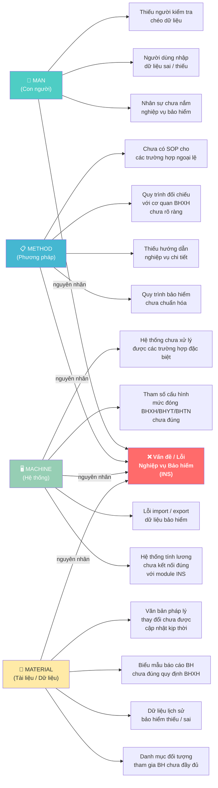

# 4M FishBone — Phân tích Nguyên nhân Gốc rễ (Nghiệp vụ Bảo hiểm HRM)

## Mô tả

Sơ đồ **Xương cá Ishikawa (Fishbone Diagram)** theo mô hình **4M** được sử dụng để phân tích nguyên nhân gốc rễ của các vấn đề phát sinh trong quá trình triển khai và vận hành nghiệp vụ **Bảo hiểm (INS)** trong hệ thống HRM.

Mô hình 4M phân loại nguyên nhân thành 4 nhóm chính:
- **Man** — Con người (nhân sự, kỹ năng, nhận thức)
- **Method** — Phương pháp (quy trình, hướng dẫn, nghiệp vụ)
- **Machine** — Máy móc / Hệ thống (phần mềm, hạ tầng, công cụ)
- **Material** — Tài liệu / Dữ liệu (dữ liệu đầu vào, biểu mẫu, danh mục)
![[Pasted image 20260426175737.png]]

---

## Sơ đồ Fishbone (Mermaid)

---

## Chi tiết 4 Nhóm Nguyên nhân

### 👤 Man — Con người

| Nguyên nhân | Mô tả | Giải pháp đề xuất |
|-------------|-------|-------------------|
| Nhân sự chưa nắm nghiệp vụ BH | HR/Payroll staff không hiểu đủ quy định BHXH, BHYT, BHTN | Đào tạo nghiệp vụ định kỳ, có tài liệu tham khảo |
| Người dùng nhập dữ liệu sai | Nhập sai mức lương đóng BH, ngày vào/ra, loại hợp đồng | Validation rules trên form, alert cảnh báo |
| Thiếu kiểm tra chéo | Không có người review dữ liệu BH trước khi nộp | Phân quyền: maker-checker workflow |

### 📋 Method — Phương pháp

| Nguyên nhân | Mô tả | Giải pháp đề xuất |
|-------------|-------|-------------------|
| Quy trình chưa chuẩn hóa | Mỗi tháng làm theo cách khác nhau | Xây dựng SOP quy trình đóng BH hàng tháng |
| Thiếu hướng dẫn nghiệp vụ | Không có tài liệu hướng dẫn step-by-step | Viết User Manual, Runbook |
| Đối chiếu với BHXH chưa rõ | Không rõ quy trình reconcile với cơ quan nhà nước | Mapping quy trình với quy định BHXH |
| Thiếu SOP ngoại lệ | Nhân viên nghỉ dài hạn, thai sản, ốm đau... không có quy trình xử lý | Bổ sung các case đặc biệt vào SOP |

### 🖥️ Machine — Hệ thống

| Nguyên nhân | Mô tả | Giải pháp đề xuất |
|-------------|-------|-------------------|
| Lương ↔ INS chưa kết nối đúng | Dữ liệu lương tính BH không đồng bộ với module INS | Kiểm tra mapping trường dữ liệu |
| Lỗi import/export | File Excel/XML nộp BHXH bị lỗi format | Fix template, kiểm tra encoding |
| Cấu hình tham số sai | % đóng BHXH/BHYT/BHTN chưa cập nhật theo quy định mới | Review và cập nhật tham số định kỳ |
| Xử lý case đặc biệt | Hệ thống không handle được nhân viên nghỉ không lương, thực tập sinh | Phát triển thêm logic xử lý |

### 📂 Material — Tài liệu / Dữ liệu

| Nguyên nhân | Mô tả | Giải pháp đề xuất |
|-------------|-------|-------------------|
| Danh mục đối tượng thiếu | Một số nhóm NLĐ chưa được phân loại đúng | Cập nhật danh mục theo quy định |
| Dữ liệu lịch sử sai | Số liệu quá khứ không chính xác ảnh hưởng tính lũy kế | Data migration, làm sạch dữ liệu |
| Biểu mẫu không đúng quy định | Mẫu báo cáo D02, D03 không khớp yêu cầu BHXH | Cập nhật template theo circular mới nhất |
| Văn bản pháp lý chưa cập nhật | Nghị định, Thông tư mới ban hành chưa được phản ánh vào hệ thống | Theo dõi văn bản pháp luật, update kịp thời |

---

## Vấn đề trung tâm (Effect)

> Các lỗi / sự cố thường gặp trong nghiệp vụ **Bảo hiểm (INS)** trong triển khai HRM:
> - Tính sai số tiền đóng BHXH/BHYT/BHTN
> - File báo cáo nộp BHXH bị lỗi hoặc không đúng format
> - Dữ liệu bảo hiểm không khớp với bảng lương
> - Không xử lý được các trường hợp đặc biệt (thai sản, tai nạn, nghỉ không lương...)

---

## Bài học & Khuyến nghị

1. **Ưu tiên cấu hình tham số** ngay từ đầu dự án — tham số BH là nền tảng cho toàn bộ tính toán
2. **Đào tạo nghiệp vụ BH** cho cả team implement và người dùng chủ chốt (HR Manager, Payroll)
3. **Xây dựng SOP** cho quy trình đóng BH hàng tháng và các case ngoại lệ
4. **Test kỹ UAT** với dữ liệu thực trước khi go-live, đặc biệt các case: nhân viên mới, nghỉ việc, thai sản
5. **Theo dõi văn bản pháp lý** BHXH định kỳ để cập nhật kịp thời vào hệ thống

---

## Liên kết

- [[4M_FishBone.png]] — Hình ảnh sơ đồ gốc
- Nghiệp vụ: Bảo hiểm Xã hội (BHXH), Bảo hiểm Y tế (BHYT), Bảo hiểm Thất nghiệp (BHTN)
- Module: INS trong hệ thống HRM (HRM / Bizzi)
