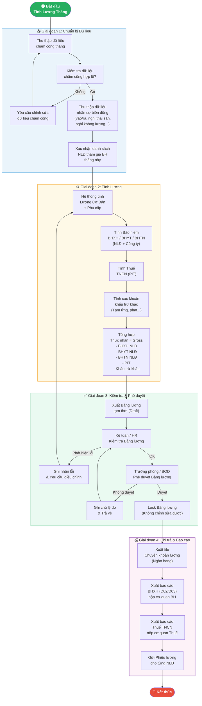

# C70 — Quy trình Tính Lương (Payroll Calculation)

## Mô tả

**C70 – Tính Lương** là quy trình tính toán lương và các khoản liên quan (bảo hiểm, thuế TNCN, phụ cấp...) trong hệ thống **HRM (HRM / Bizzi)**. Đây là quy trình trung tâm của module **INS (Insurance)** và **Payroll**, được thực hiện định kỳ hàng tháng.
![[Pasted image 20260426175916.png]]


---

## Sơ đồ Quy trình (Mermaid Flowchart)



---

## Chi tiết các Giai đoạn

### 📥 Giai đoạn 1: Chuẩn bị Dữ liệu

| Bước | Nội dung | Người thực hiện | Lưu ý |
|------|----------|-----------------|-------|
| 1.1 | Thu thập dữ liệu chấm công tháng | HR / Timekeeper | Import từ máy chấm công hoặc hệ thống |
| 1.2 | Kiểm tra dữ liệu chấm công | HR | Xác nhận không có lỗi thiếu/sai |
| 1.3 | Cập nhật biến động nhân sự | HR | Vào mới, nghỉ việc, thai sản, không lương... |
| 1.4 | Xác nhận danh sách tham gia BH | HR / Kế toán | Đúng đối tượng, đúng mức đóng |

**Điều kiện quan trọng:**
- Dữ liệu chấm công phải được **chốt (lock)** trước khi tính lương
- Danh sách biến động nhân sự phải được **HR xác nhận** trước ngày tính lương
- Các trường hợp **nghỉ thai sản, ốm đau** cần có hồ sơ chứng từ đầy đủ

---

### ⚙️ Giai đoạn 2: Tính Lương

| Khoản mục | Công thức / Cách tính | Ghi chú |
|-----------|----------------------|---------|
| **Lương Gross** | Lương CB × (Ngày công thực tế / Ngày công chuẩn) + Phụ cấp | Theo hợp đồng lao động |
| **BHXH (NLĐ)** | Lương đóng BH × 8% | Theo quy định BHXH |
| **BHYT (NLĐ)** | Lương đóng BH × 1.5% | Theo quy định BHYT |
| **BHTN (NLĐ)** | Lương đóng BH × 1% | Theo quy định BHTN |
| **BHXH (Công ty)** | Lương đóng BH × 17.5% | Ghi nhận chi phí công ty |
| **BHYT (Công ty)** | Lương đóng BH × 3% | Ghi nhận chi phí công ty |
| **BHTN (Công ty)** | Lương đóng BH × 1% | Ghi nhận chi phí công ty |
| **Thu nhập chịu thuế** | Gross - BHXH/BHYT/BHTN NLĐ - Giảm trừ bản thân - Giảm trừ người phụ thuộc | PIT |
| **Thuế TNCN** | Theo biểu lũy tiến từng phần | Theo Luật thuế TNCN |
| **Thực nhận (Net)** | Gross - BHXH NLĐ - BHYT NLĐ - BHTN NLĐ - PIT - Khấu trừ khác | |

> **Lưu ý:** Mức lương tối đa đóng BHXH = **20 × Lương Tối thiểu Vùng** (theo năm hiện hành)

---

### ✅ Giai đoạn 3: Kiểm tra & Phê duyệt

| Bước | Nội dung | Người thực hiện |
|------|----------|-----------------|
| 3.1 | Xuất bảng lương draft | Hệ thống / HR |
| 3.2 | Review bảng lương | Kế toán Lương |
| 3.3 | Phê duyệt bảng lương | Trưởng phòng / CFO / BOD |
| 3.4 | Lock bảng lương | HR / Kế toán |

**Checklist kiểm tra:**
- [ ] Tổng số NLĐ nhận lương khớp với danh sách nhân sự
- [ ] Mức lương đúng với hợp đồng lao động / quyết định điều chỉnh
- [ ] Ngày công hợp lý (không vượt ngày làm việc tối đa)
- [ ] Các khoản BHXH/BHYT/BHTN tính đúng tỷ lệ
- [ ] Thuế TNCN tính đúng, đủ người phụ thuộc đã đăng ký
- [ ] Phiếu lương không có giá trị âm bất thường

---

### 💰 Giai đoạn 4: Chi trả & Báo cáo

| Đầu ra             | Nội dung                                         | Deadline                     |
| ------------------ | ------------------------------------------------ | ---------------------------- |
| **File ngân hàng** | Danh sách chuyển khoản lương từng NLĐ            | Ngày trả lương theo quy định |
| **Báo cáo D02**    | Bảng thanh toán thẻ BHXH / Danh sách tham gia BH | Trước ngày 25 hàng tháng     |
| **Báo cáo D03**    | Báo cáo quỹ lương đóng BH                        | Theo quy định BHXH           |
| **Quyết toán PIT** | Báo cáo thuế TNCN                                | Trước ngày cuối tháng sau    |
| **Phiếu lương**    | Gửi email / in cho NLĐ                           | Sau khi trả lương            |

---

## Các Trường hợp Đặc biệt

### 🤰 Nghỉ Thai sản
- Không đóng BHXH/BHYT/BHTN trong thời gian nghỉ thai sản
- BHXH chi trả trực tiếp cho NLĐ (không qua công ty)
- Cần tách riêng danh sách NLĐ nghỉ thai sản khi kê khai BHXH

### 🏥 Nghỉ Ốm đau / BHXH chi trả
- Tính ngày công thực tế = Tổng ngày - Ngày nghỉ hưởng BHXH
- Lương công ty chỉ trả theo ngày công thực tế
- Ngày nghỉ hưởng chế độ BHXH: BHXH chi trả riêng

### 🚫 Nghỉ Không lương
- Không tính lương cho ngày nghỉ không lương
- Vẫn đóng BHXH nếu nghỉ dưới 14 ngày/tháng
- Dừng đóng BHXH nếu nghỉ từ 14 ngày trở lên trong tháng

### 🆕 Nhân viên mới (Vào giữa tháng)
- Tính lương theo ngày công thực tế từ ngày ký hợp đồng
- Đăng ký tham gia BHXH trong tháng vào làm

### 👋 Nhân viên nghỉ việc (Ra giữa tháng)
- Tính lương đến ngày nghỉ việc
- Chốt sổ BHXH, xuất thẻ BHYT
- Quyết toán thuế TNCN

---

## Các Lỗi Thường Gặp & Cách Xử lý

| Lỗi | Nguyên nhân | Cách xử lý |
|-----|-------------|------------|
| Lương bị âm | Khấu trừ > thu nhập | Kiểm tra tạm ứng, phạt; giới hạn khấu trừ tối đa |
| BHXH tính sai | Mức lương đóng BH chưa cập nhật | Cập nhật mức lương đóng BH đúng hạn |
| Trùng dữ liệu NLĐ | Cùng một người có 2 mã | Kiểm tra và gộp/xóa duplicate |
| Thiếu NLĐ trong bảng lương | NLĐ mới chưa được tạo trên hệ thống | Kiểm tra tiến trình onboarding |
| Ngày công vượt quy định | Lỗi nhập liệu chấm công | Đối chiếu với chấm công thực tế |
| Thuế TNCN tính thiếu | Chưa cập nhật người phụ thuộc hết hạn | Rà soát định kỳ người phụ thuộc |

---

## Lịch Tính Lương Hàng Tháng (Tham khảo)

```
Ngày 1-5:     Chốt dữ liệu chấm công tháng trước
Ngày 5-10:    Tính lương draft, kiểm tra sơ bộ
Ngày 10-15:   HR & Kế toán review bảng lương
Ngày 15-18:   Phê duyệt bảng lương
Ngày 18-20:   Trả lương
Trước ngày 25: Nộp hồ sơ BHXH tháng
Cuối tháng:   Nộp thuế TNCN
```

---

## Liên kết

- [[C70_TinhLuong.png]] — Hình ảnh sơ đồ gốc
- [[4M_FishBone]] — Phân tích nguyên nhân lỗi nghiệp vụ BH/Lương
- Module liên quan: **INS**, **Payroll**, **Tax (PIT)**, **Timekeeping**
- Văn bản pháp lý:
  - Luật BHXH 2014 (sửa đổi 2019)
  - Luật Thuế TNCN
  - Nghị định quy định mức đóng BHXH, BHYT, BHTN hiện hành
