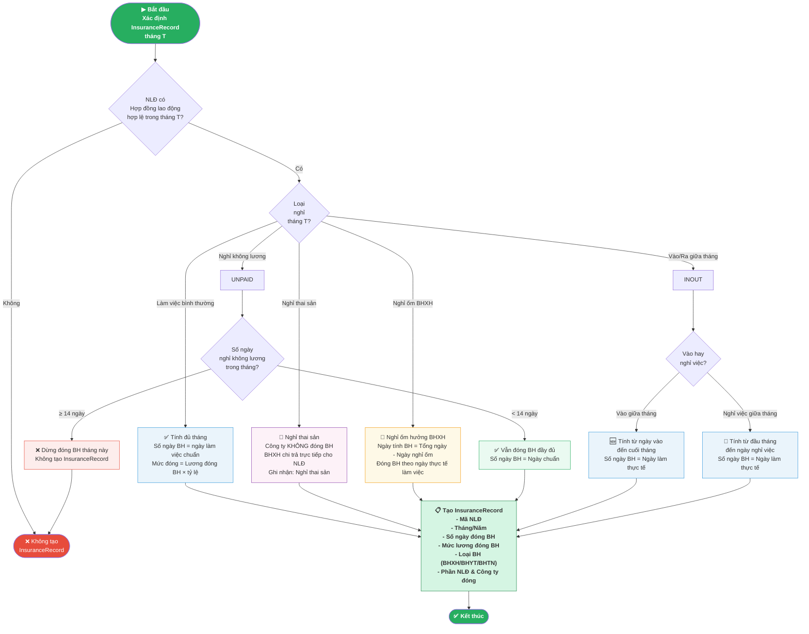

# DayCount_InsuranceRecord — Quy tắc Đếm Ngày cho Hồ sơ Bảo hiểm

## Mô tả

Tài liệu mô tả **quy tắc nghiệp vụ đếm ngày** (DayCount) dùng để xác định **hồ sơ bảo hiểm** (InsuranceRecord) trong hệ thống HRM. Đây là logic trung tâm quyết định:
- Nhân viên (NLĐ) có được **đóng BHXH/BHYT/BHTN** trong tháng hay không
- **Số ngày** tính đóng bảo hiểm
- **Mức đóng** bảo hiểm theo từng trường hợp

![[Pasted image 20260426180410.png]]

---

## Bảng Quy tắc Đếm Ngày Bảo hiểm

### Nguyên tắc chung

| #   | Tình huống                       | Quy tắc đếm ngày                                   | Kết quả BH                      |
| --- | -------------------------------- | -------------------------------------------------- | ------------------------------- |
| 1   | NLĐ làm đủ tháng                 | Đếm toàn bộ ngày làm việc trong tháng              | Đóng BH đầy đủ                  |
| 2   | NLĐ vào giữa tháng               | Đếm từ ngày vào làm đến cuối tháng                 | Đóng BH tháng đó (nếu ≥ ngưỡng) |
| 3   | NLĐ nghỉ việc giữa tháng         | Đếm từ đầu tháng đến ngày nghỉ việc                | Đóng BH tháng đó (nếu ≥ ngưỡng) |
| 4   | NLĐ nghỉ không lương < 14 ngày   | Vẫn tính đóng BH tháng đó                          | Đóng BH đầy đủ                  |
| 5   | NLĐ nghỉ không lương ≥ 14 ngày   | Dừng đóng BH tháng đó                              | Không đóng BH                   |
| 6   | NLĐ nghỉ thai sản                | Không tính đóng BH công ty                         | BHXH chi trả trực tiếp          |
| 7   | NLĐ nghỉ ốm (hưởng chế độ BHXH)  | Tính ngày thực tế = Tổng - Ngày nghỉ ốm hưởng BHXH | Đóng BH theo ngày thực tế       |
| 8   | NLĐ vừa vào vừa nghỉ không lương | Đếm ngày thực tế làm việc                          | Tùy số ngày thực tế             |

---

## Ngưỡng Quyết định Đóng/Không Đóng BH

> **Quy định quan trọng:** Nếu NLĐ nghỉ không lương **≥ 14 ngày** trong tháng → **Dừng đóng BHXH tháng đó**

```
Ngày nghỉ không lương trong tháng:
  - < 14 ngày  → Vẫn đóng BHXH bình thường
  - ≥ 14 ngày  → Không đóng BHXH tháng đó
```

---

## Sơ đồ Logic Đếm Ngày (Mermaid Flowchart)



---

## Chi tiết Từng Trường hợp

### 1. Làm việc bình thường (Full Month)

```
Điều kiện: NLĐ làm việc suốt tháng, không có biến động
Số ngày đóng BH = Ngày làm việc chuẩn của tháng (thường 22 - 26 ngày)
Mức đóng = Lương đóng BH × % tỷ lệ quy định
```

| Loại BH | NLĐ đóng | Công ty đóng |
|---------|-----------|-------------|
| BHXH | 8% | 17.5% |
| BHYT | 1.5% | 3% |
| BHTN | 1% | 1% |
| **Tổng** | **10.5%** | **21.5%** |

---

### 2. Vào làm giữa tháng (New Joiner)

```
Điều kiện: NLĐ ký HĐ ngày D trong tháng (D > 1)
Số ngày đóng BH = Tổng ngày làm việc từ D đến cuối tháng
Tháng đầu tiên: Đăng ký tham gia BHXH ngay trong tháng vào làm
```

**Ví dụ:**
- Tháng có 22 ngày làm việc chuẩn
- NLĐ vào ngày 10 → còn 15 ngày làm trong tháng
- Số ngày đóng BH = 15 ngày
- Mức đóng = Lương BH × tỷ lệ × (15/22) ← tùy hệ thống có tính theo ngày hay theo tháng đủ

---

### 3. Nghỉ việc giữa tháng (Leaver)

```
Điều kiện: NLĐ nghỉ việc ngày D trong tháng
Số ngày đóng BH = Ngày làm từ đầu tháng đến ngày D
Thực hiện: Chốt sổ BHXH, xuất thẻ BHYT
```

---

### 4. Nghỉ không lương (Unpaid Leave)

```
Trường hợp A: Nghỉ < 14 ngày
  → Vẫn đóng BHXH đầy đủ tháng đó (đóng theo mức chuẩn)

Trường hợp B: Nghỉ ≥ 14 ngày
  → Dừng đóng BHXH tháng đó
  → Không tạo InsuranceRecord cho tháng đó
  → Cần ghi nhận trong hồ sơ nhân sự
```

> **Cơ sở pháp lý:** Căn cứ Điều 85 Luật BHXH 2014 và các văn bản hướng dẫn

---

### 5. Nghỉ thai sản (Maternity Leave)

```
Thời gian nghỉ: Theo quy định (thường 6 tháng)
Trong thời gian nghỉ:
  - Công ty KHÔNG đóng BHXH/BHYT/BHTN
  - BHXH chi trả trực tiếp cho NLĐ 100% mức bình quân lương tháng
Sau khi hết thai sản:
  - NLĐ quay lại làm → đóng BH bình thường từ tháng đó
Ghi nhận hồ sơ:
  - Tạo bản ghi nghỉ thai sản trong InsuranceRecord
  - Loại: MATERNITY, không phát sinh tiền đóng
```

---

### 6. Nghỉ ốm (Sick Leave - Hưởng BHXH)

```
Phân loại:
  a) Nghỉ ốm thông thường (không hưởng chế độ BHXH): Tính bình thường
  b) Nghỉ ốm hưởng chế độ BHXH:
     - Số ngày thực tế làm = Tổng ngày làm chuẩn - Số ngày nghỉ ốm hưởng BHXH
     - Số ngày đóng BH = Số ngày thực tế làm
     - BHXH chi trả phần ngày nghỉ ốm: 75% mức lương bình quân 6 tháng gần nhất

Ngưỡng nghỉ ốm tối đa hưởng BHXH mỗi năm:
  - Điều kiện BH < 15 năm: 30 ngày/năm
  - Điều kiện BH từ 15-30 năm: 40 ngày/năm
  - Điều kiện BH > 30 năm: 60 ngày/năm
  - Bệnh dài ngày (danh mục BYT): tối đa 180 ngày/năm
```

---

## Bảng Tóm tắt Quyết định Tạo InsuranceRecord

| Tình huống | Tạo InsuranceRecord? | Số ngày tính BH | Ghi chú |
|-----------|---------------------|-----------------|---------|
| Làm đủ tháng | ✅ Có | Ngày chuẩn | Bình thường |
| Vào giữa tháng | ✅ Có | Từ ngày vào đến cuối tháng | Tháng đầu |
| Ra giữa tháng | ✅ Có | Từ đầu tháng đến ngày ra | Tháng cuối |
| Nghỉ không lương < 14 ngày | ✅ Có | Ngày chuẩn | Vẫn đóng đủ |
| Nghỉ không lương ≥ 14 ngày | ❌ Không | - | Dừng đóng BH |
| Nghỉ thai sản | ✅ Có (đặc biệt) | 0 (BHXH chi trả) | Ghi nhận loại thai sản |
| Nghỉ ốm hưởng BHXH | ✅ Có | Ngày thực tế làm | Trừ ngày nghỉ ốm hưởng BH |
| Nghỉ dài hạn không lương | ❌ Không | - | Tương tự ≥ 14 ngày |

---

## Tác động đến Hệ thống

### Luồng dữ liệu

```
Nhân sự (HR Master) 
    → Chấm công (Timesheet) 
    → Biến động nhân sự (Personnel Changes)
    → DayCount Engine
    → InsuranceRecord
    → Payroll Calculation (C70)
    → Báo cáo BHXH (D02/D03)
```

### Các bảng/module liên quan

| Module | Dữ liệu cung cấp |
|--------|-----------------|
| Nhân sự | Ngày vào/ra, loại HĐ, mức lương đóng BH |
| Chấm công | Số ngày làm thực tế, ngày nghỉ các loại |
| Bảo hiểm | Lịch sử đóng BH, loại BH |
| Lương (C70) | Tổng hợp số tiền đóng BH hàng tháng |

---

## Lỗi Thường Gặp

| Lỗi | Nguyên nhân | Cách xử lý |
|-----|-------------|------------|
| Tạo sai InsuranceRecord tháng nghỉ không lương | Chưa check ngưỡng 14 ngày | Kiểm tra logic và tham số ngưỡng ngày |
| Thiếu InsuranceRecord cho NLĐ mới vào | NLĐ chưa được khai báo kịp | Kiểm tra quy trình onboarding |
| Trùng InsuranceRecord | Bug trong logic tạo bản ghi | Kiểm tra unique constraint |
| Sai mức đóng BH | Lương đóng BH chưa cập nhật | Đồng bộ lại từ module HR |
| Không xử lý trường hợp vừa vào vừa nghỉ | Chưa có logic đặc biệt | Bổ sung rule xử lý case phức tạp |

---

## Liên kết

- [[DayCount_InsuranceRecord.png]] — Hình ảnh bảng quy tắc gốc
- [[C70_TinhLuong]] — Quy trình tính lương sử dụng InsuranceRecord
- [[4M_FishBone]] — Phân tích nguyên nhân lỗi nghiệp vụ BH
- **Văn bản tham chiếu:**
  - Điều 85, 86, 87 Luật BHXH 2014
  - Nghị định 115/2015/NĐ-CP hướng dẫn Luật BHXH
  - Thông tư 59/2015/TT-BLĐTBXH
