[Document History]{.underline}

| Date | Revision | Description | PIC |
|------|----------|-------------|-----|
| 20/03/2017 | 8.0.1.0 | Tạo tài liệu | TungLy |

## Mục đích tài liệu

> Tài liệu này ghi nhận tất cả các ý tưởng Kaizen về phân hệ bảo hiểm và
> hệ thống. Cải tiến từng bước nhỏ đều đặn hàng ngày, về lâu dài sẽ tích
> lũy thật nhiều tạo thành thay đổi lớn.

[Nội Dung - Content]{.underline}

[1. Mục đích tài liệu](#mục-đích-tài-liệu)

[1. Từ viết tắt](#từ-viết-tắt)

[2. Giới thiệu Kaizen](#giới-thiệu-kaizen)

[2.1. Thứ tự Kaizen](#thư-tư-kaizen)

[2.2. Trực quan hoá Kaizen](#trực-quan-hoá-kaizen)

[2.3. Phương pháp kaizen](#phương-phap-kaizen)

[2.3.1. Phương pháp Cộng](#phương-phap-công)

[2.3.2. Phương pháp Trừ](#phương-phap-trư)

[2.3.3. Phương pháp Nhân](#phương-phap-nhân)

[2.3.4. Phương pháp Chia](#phương-phap-chia)

[3. Mẫu Kaizen](#mẫu-kaizen)

[3.1. Mẫu đề xuất ý tưởng kaizen](#mẫu-đề-xuất-ý-tưởng-kaizen)

[3.2. Mẫu kaizen \[ModuleKey_STT\]\[Date\] : Mô tả kaizen](#mẫu-kaizen-modulekey_sttdate-mô-tả-kaizen)

[4. Đề xuất ý tưởng kaizen (3 dòng)](#đề-xuất-ý-tưởng-kaizen-3-dòng)

[4.1. Kaizen \[21/07/2018\] : Kết thúc họp đúng giờ](#kaizen-21072018-kết-thúc-họp-đúng-giờ)

[5. Thực hiện kaizen](#thực-hiện-kaizen)

[5.1. Kaizen \[Ins0001\]\[21/03/2017\] : chế độ lương](#kaizen-ins000121032017-chế-độ-lương)

[5.2. Kaizen \[Ins0002\]\[23/03/2017\] : cấu hình bảo hiểm](#kaizen-ins000223032017-cấu-hình-bảo-hiểm)

[5.3. Kaizen \[Ins0003\]\[27/03/2017\] : hướng dẫn qui trình BH](#kaizen-ins000327032017-hướng-dẫn-qui-trình-bh)

[5.4. Kaizen \[Ins0004\]\[29/03/2017\] : mô tả lỗi bảo hiểm](#kaizen-ins000429032017-mô-tả-lỗi-bảo-hiểm)

[5.5. Kaizen \[Ins0005\]\[03/04/2017\] : validate và mô tả trục trặc khi phân tích BH](#kaizen-ins000503042017-validate-và-mô-tả-trục-trặc-khi-phân-tích-bh)

[5.6. Kaizen \[Ins0006\]\[10/04/2017\] : cảnh báo và hiển thị phần trăm bộ nhớ khi phân tích BH](#kaizen-ins000610042017-cảnh-báo-và-hiển-thị-phần-trăm-bộ-nhớ-khi-phân-tích-bh)

[5.7. Kaizen \[Sys0007\]\[05/09/2017\] : Thêm button trở về đầu trang cho màn hình Nhóm quyền](#kaizen-sys000705092017-thêm-button-trở-về-đầu-trang-cho-màn-hình-nhóm-quyền)

[5.8. Kaizen \[Ins0008\]\[05/09/2017\] : Thêm chức năng mô tả thiết lập bảo hiểm](#kaizen-ins000805092017-thêm-chức-năng-mô-tả-thiết-lập-bảo-hiểm)

[5.10. Kaizen \[SYS0009\]\[12/09/2017\] : Thêm tool tự động thay đổi Web.config](#kaizen-sys000912092017-thêm-tool-tự-động-thay-đổi-web.config)

[5.11. Kaizen \[SYS0010\]\[22/09/2017\] : tìm kiếm tên quyền trong nhóm quyền](#kaizen-sys001022092017-tìm-kiếm-tên-quyền-trong-nhóm-quyền)

[5.12. Kaizen \[INS0011\]\[23/01/2018\] : Trực quan phần trăm khi phân tích BH](#kaizen-ins001123012018-trực-quan-phần-trăm-khi-phân-tích-bh)

##  Từ viết tắt

| STT | Thuật ngữ/ Viết tắt | Ý nghĩa |
|-----|---------------------|---------|
| 1. | HRM Pro | Giải pháp phần mềm nhân sự VnResource |
| 2. | \[AAAYYYY\]\[NgayThangNam\] | Với AAA là module, YYYY số thứ tự kaizen, ngày tháng năm của ý tưởng kaizen |

##  Giới thiệu Kaizen

## Thứ tự Kaizen

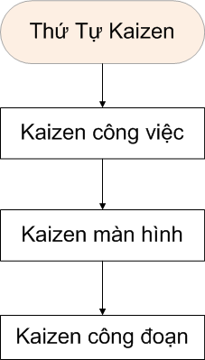

- **Kaizen công việc:**

  - Tự hỏi công việc tại sao luôn bận rộn

    - Liệu có làm quá sức không? Suy nghĩ cách làm tốt mà không vất vả

    - Cách làm này có ổn không?

  - Công việc đã chuẩn hoá chưa?

  - Làm sao hướng dẫn công việc bất kỳ ai cũng làm được

  - 5S (chỉ cần thực hiện được 2S đầu tiên)

    - Sàn lọc

      - Phân biệt chức năng *cần* và *không cần (đánh nhãn chúng)*

      - Chức năng không cần => lưu trữ hoặc loại bỏ

    - Sắp xếp

      - Cho bất kỳ ai cũng nắm rõ vị trí

      - Cái này là cái gì? tên gì?

      - Lấy ở đâu trả về đâu => cho biết nơi để

- **Kaizen màn hình :**

  - Tiến hành hướng dẫn công việc ở mỗi màn hình

  - Làm sao đánh giá năng suất server

  - Những câu hỏi thường gặp

  - Kaizen màn hình theo 3 cách

    - Chẩn đoán (Trouble shooting (chẩn đoán và xử lý sự cố))

    - Chữa trị

    - Tu sửa dự phòng (kiểm tra hàng ngày)

- **Kaizen công đoạn:**

  - Công đoạn trước là ân nhân (vì đã đảm nhiệm những phần việc ta không thể làm)

  - Công đoạn sau là khách hàng (vì đã tiếp nối công việc của ta)

  - Khi tiến hành kaizen phải hiểu cách suy nghĩ và mong muốn của công đoạn sau (QC, PE, Khách hàng), và ưu tiên kaizen cho công đoạn sau hơn là ưu tiên công đoạn bản thân.

## Trực quan hoá Kaizen

- 5S chính là giai đoạn cơ bản của Kaizen. Khi không gian làm việc sạch sẽ, các vấn đề sẽ lộ diện, sẽ biết cần kaizen cái gì và kaizen ở đâu.

- Khi xảy ra vấn đề hãy tìm nguyên nhân gốc thay vì truy cứu trách nhiệm

- Dừng ngay lập tức khi gặp vấn đề, giúp thấy vấn đề để đề xuất kaizen

- Nhìn thấy vấn đề bằng mắt, mới đưa ra sáng kiến

## Phương pháp kaizen

##  Phương pháp Cộng

- Cộng thêm một số đặc tính có lợi ích, có giá trị cho khách hàng hoặc cho những người liên quan

  - Vd: điện thoại di động, thêm tính năng camera, thêm tính năng quét QRCode giúp tạo lợi thế cạnh tranh.

## Phương pháp Trừ

- Loại bỏ những đặc tính, những tính chất có hại cho sản phẩm, bất lợi cho khách hàng, loại bỏ các lãng phí gây thiệt hại cho chúng ta

  - Vd: Dầu ăn không có cholesterol, nhà sản xuất đã tìm cách cải tiến, loại bỏ cholesterol gây hại cho sức khoẻ người dùng

## Phương pháp Nhân

- Nhân rộng kaizen cho toàn công ty, chia sẻ kaizen cho các bộ phận khác, áp dụng cho các phòng ban khác.

## Phương pháp Chia

- Chia nhỏ thành những kaizen thật nhỏ, dễ dàng thực hiện

## Mẫu Kaizen

## Mẫu đề xuất ý tưởng kaizen:

- Mỗi mục đề xuất chỉ duy nhất 1 dòng

- Tại sao lại 1 dòng. Bởi vì 1 dòng sẽ xúc tích và khiến người thực hiện cũng dễ dàng hơn và bất kỳ ai cũng có thể đề xuất được

> **\[Vấn đề\]**
>
> \[Mô tả vấn đề dưới 25 từ\]
>
> **\[Phương án giải quyết\]**
>
> \[Phương án giải quyết\]
>
> **\[Hiệu quả\]**

## Mẫu kaizen \[ModuleKey_STT\]\[Date\] : Mô tả kaizen:

| Trường           | Nội dung                                                                                                                                             |                      |                |
| ---------------- | ---------------------------------------------------------------------------------------------------------------------------------------------------- | -------------------- | -------------- |
| **Tiêu đề**      | \[Vấn đề cần kaizen\]                                                                                                                                |                      |                |
| **Page**         | \[Tên trang cần kaizen\]                                                                                                                             |                      |                |
| **Trước kaizen** | \[Hình ảnh hoặc mô tả trước khi kaizen\]                                                                                                             |                      |                |
| **Sau kaizen**   | \[Hình ảnh hoặc mô tả sau khi kaizen\]                                                                                                               |                      |                |
| **Kết quả**      | \[Kết quả sau khi triển khai kaizen vào thực tế, khảo sát người dùng, để biết được tính hiệu quả của kaizen, để có phương hướng điều chỉnh tốt hơn\] |                      |                |
| **Tên**          | **ID**                                                                                                                                               | **Phòng Ban**        | **Ngày**       |
| \[Tung.Ly\]      | InsXXXX                                                                                                                                              | SE \| BA \| QC \| PE | \[dd/MM/yyyy\] |

Note: Với InsXXXX: Ins là 3 ký tự đầu đại diện cho module, XXXX đại diện thứ tự kaizen

##  Đề xuất ý tưởng kaizen (3 dòng)

## Kaizen \[21/07/2018\] : Kết thúc họp đúng giờ

> **\[Vấn đề\]**
>
> Cuộc họp thường quá giờ
>
> **\[Phương án giải quyết\]**
>
> Đặt chuông báo 10 phút trước khi kết thúc
>
> **\[Hiệu quả\]**
>
> \- Tốc độ cuộc họp tăng lên

##  Thực hiện kaizen

## Kaizen \[Ins0001\]\[21/03/2017\] : chế độ lương

| Trường | Nội dung | | |
|--------|----------|-|-|
| **Tiêu đề** | Lưu trữ công thức bảo hiểm dễ sai sót khi nhập text | | |
| **Page** | Trang chủ >> Lương >> Cấu hình tính lương >> Chế độ lương | | |
| **Trước kaizen** | 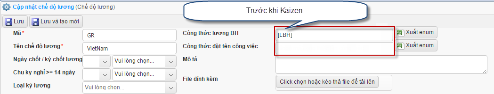 Nhập công thức bằng textbox, thường xuyên gặp vấn đề không phân tích bảo hiểm thành công vì công thức sai. | | |
| **Sau kaizen** | 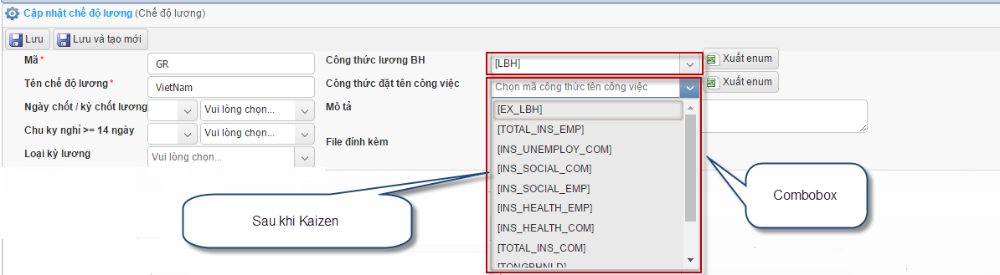 Chuyển textbox thành combobox sẽ thuận tiện và chọn công thức chính xác hơn | | |
| **Kết quả** | Không còn xảy ra vấn đề nhập công thức sai | | |
| **Tên** | **ID** | **Phòng Ban** | **Ngày** |
| Tung.Ly | Ins0001 | SE | 21/03/2017 |

## Kaizen \[Ins0002\]\[23/03/2017\] : cấu hình bảo hiểm

| Trường | Nội dung | | |
|--------|----------|-|-|
| **Tiêu đề** | Không biết cách cấu hình bảo hiểm | | |
| **Page** | Hệ thống >> cấu hình >> thiết lập bảo hiểm >> cấu hình bảo hiểm | | |
| **Trước kaizen** | 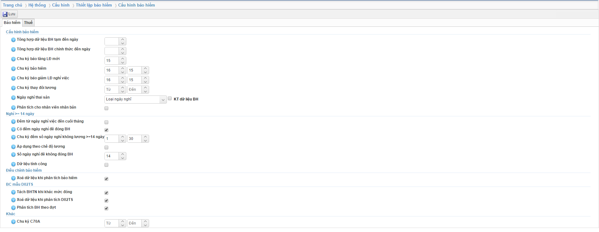 Người dùng không biết cách cấu hình, cấu hình sai sẽ dẫn đến phân tích bảo hiểm không chính xác, D02 cũng không phân tích đúng | | |
| **Sau kaizen** | 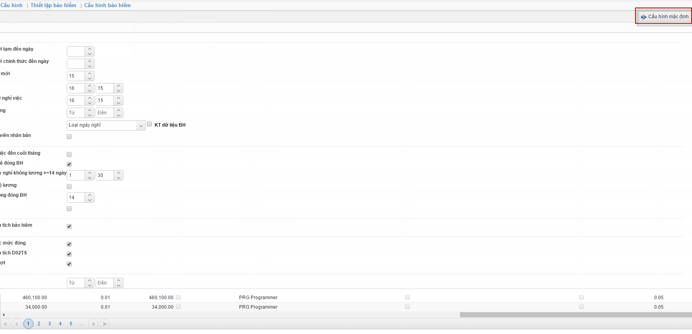 Tạo nút cấu hình mặc định (ở gốc trên bên phải màn hình), khi chọn cấu hình mặc định (và có thể phục hồi cấu hình như ban đầu), sau đó lưu. Khi phân tích bảo hiểm sẽ ra kết quả chính xác. | | |
| **Kết quả** | Thuận tiện cho những người chưa hiểu rõ về nghiệp vụ vẫn có thể cấu hình được. | | |
| **Tên** | **ID** | **Phòng Ban** | **Ngày** |
| \[Tung.Ly\] | Ins0002 | SE | 23/03/2017 |

## Kaizen \[Ins0003\]\[27/03/2017\] : hướng dẫn qui trình BH

| Trường | Nội dung | | |
|--------|----------|-|-|
| **Tiêu đề** | Không hiểu qui trình phân tích bảo hiểm | | |
| **Page** | Hệ thống >> bảo hiểm >> phân tích bảo hiểm — Path: Hrm_Main_Web/**Ins_AnalyzeInsurance/InsuranceProcess** | | |
| **Trước kaizen** | Người dùng không biết nghiệp vụ xử lý phân tích bảo hiểm | | |
| **Sau kaizen** | 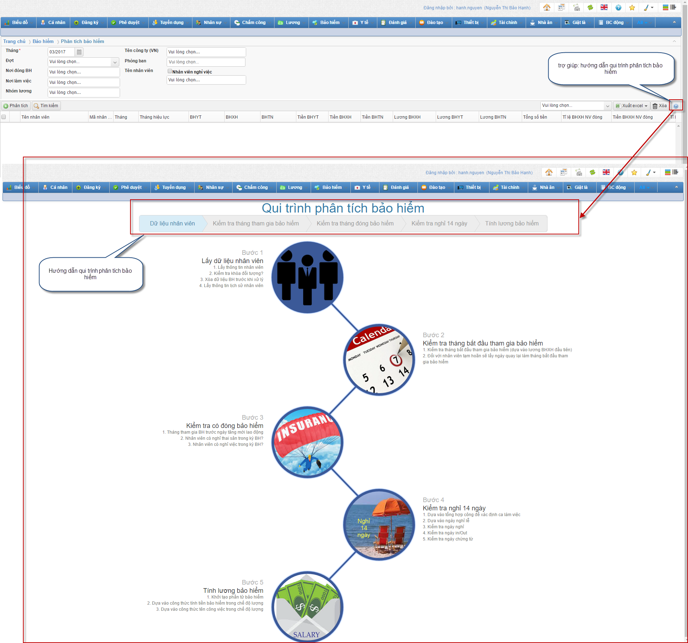 Tạo nút help (ở gốc trên bên phải màn hình), sau khi chọn icon help sẽ link đến màn hình hướng dẫn qui trình bảo hiểm. | | |
| **Kết quả** | Đào tạo cho những người hiểu rõ về nghiệp vụ bảo hiểm. | | |
| **Tên** | **ID** | **Phòng Ban** | **Ngày** |
| \[Tung.Ly\] | Ins0003 | SE | 27/03/2017 |

## Kaizen \[Ins0004\]\[29/03/2017\] : mô tả lỗi bảo hiểm

| Trường | Nội dung | | |
|--------|----------|-|-|
| **Tiêu đề** | Mô tả lỗi khi phân tích bảo hiểm | | |
| **Page** | Hrm_Main_Web/**Ins_AnalyzeInsurance/InsuranceErrorCodes** | | |
| **Trước kaizen** | Khi phân tích bảo hiểm phát hiện ngoại lệ, tuy nhiên người dùng không hiểu thông báo và không biết giải pháp nào để giải quyết. | | |
| **Sau kaizen** | 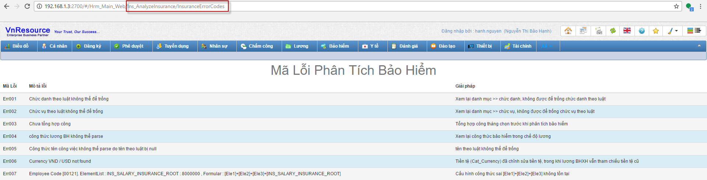 Tạo một trang thể hiện tất cả các ngoại lệ phân tích bảo hiểm, người dùng có thể tham khảo, bao gồm giải pháp ứng phó ngoại lệ đó. | | |
| **Kết quả** | Người dùng hiểu rõ các ngoại lệ và giải quyết vấn đề tức thời. | | |
| **Tên** | **ID** | **Phòng Ban** | **Ngày** |
| \[Tung.Ly\] | Ins0004 | SE | 29/03/2017 |

## Kaizen \[Ins0005\]\[03/04/2017\] : validate và mô tả trục trặc khi phân tích BH

| Trường | Nội dung | | |
|--------|----------|-|-|
| **Tiêu đề** | validate và mô tả trục trặc khi phân tích BH | | |
| **Page** | Hrm_Main_Web/**Ins_AnalyzeInsurance/Index** | | |
| **Trước kaizen** | Khi phân tích bảo hiểm chưa validate những dữ liệu input, dẫn đến một thời gian lâu sau mới phát hiện vấn đề | | |
| **Sau kaizen** | 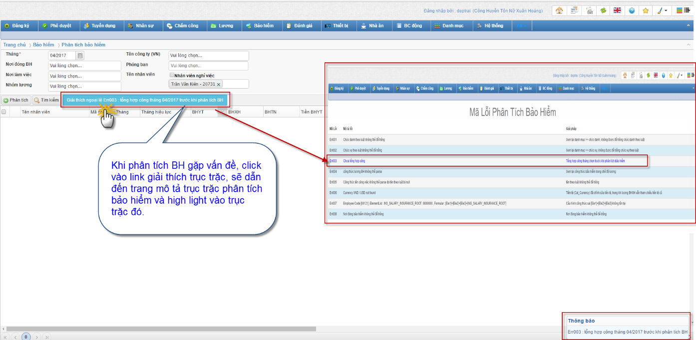 Validate kiểm tra dữ liệu đầu vào trước, sau khi xuất thông báo dữ liệu đầu vào chưa đúng hoặc phát hiện ngoại lệ, sẽ xuất hiện link giải thích ngoại lệ và dẫn đến trang mô tả trục trặc phân tích bảo hiểm và highlight vào trục trặc đó. Validate các mục: Chức danh theo luật chưa có dữ liệu; Chức vụ theo luật chưa có dữ liệu; Nơi đóng BH chưa có dữ liệu; Chưa tổng hợp công. | | |
| **Kết quả** | Người dùng hiểu rõ các ngoại lệ và gợi ý đối sách xử lý vấn đề. Giúp người dùng nhìn vấn đề một cách trực quan. | | |
| **Tên** | **ID** | **Phòng Ban** | **Ngày** |
| \[Tung.Ly\] | Ins0005 | SE | 03/04/2017 |

##  Kaizen \[Ins0006\]\[10/04/2017\] : cảnh báo và hiển thị phần trăm bộ nhớ khi phân tích BH

| Trường | Nội dung | | |
|--------|----------|-|-|
| **Tiêu đề** | cảnh báo và hiển thị thông tin bộ nhớ khi phân tích BH | | |
| **Page** | Hrm_Main_Web/**Ins_AnalyzeInsurance/Index** | | |
| **Trước kaizen** | Khi phân tích bảo hiểm trong trường hợp bộ nhớ đã full, dẫn đến khi phân tích sẽ treo server. Full bộ nhớ dẫn đến cả hệ thống sụp đổ (là điều không thể chấp nhận được). Khách hàng là người điều khiển máy, cần biết năng suất máy đáp ứng cho xử lý hiện tại không (hiện tượng full RAM đều do chưa trực quan hoá cho người dùng biết). | | |
| **Sau kaizen** | 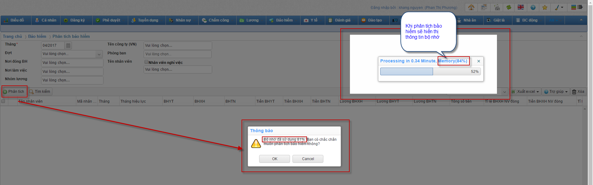 Khi chọn nút phân tích sẽ hiển thị cảnh báo bộ nhớ đầy (nếu bộ nhớ RAM vượt quá 80%), người dùng có thể tùy chọn tiếp tục phân tích hay dừng lại để đảm bảo an toàn không bị treo server. Trong khi phân tích sẽ hiển thị thông tin phần trăm của server. | | |
| **Kết quả** | Người dùng có thể nắm rõ năng suất bộ nhớ, xem xét có thể tiếp tục xử lý hay dừng lại. Giúp phát hiện vấn đề trực quan hơn. | | |
| **Tên** | **ID** | **Phòng Ban** | **Ngày** |
| \[Tung.Ly\] | Ins0006 | SE | 10/04/2017 |

## Kaizen \[Sys0007\]\[05/09/2017\] : Thêm button trở về đầu trang cho màn hình Nhóm quyền

| Trường | Nội dung | | |
|--------|----------|-|-|
| **Tiêu đề** | Thêm button trở về đầu trang cho màn hình Nhóm quyền | | |
| **Page** | /Hrm_Sys_Web/Sys_GroupPermission/Index | | |
| **Trước kaizen** | Khi phân quyền, vì dữ liệu quá lớn mỗi lần muốn lên đầu trang, người dùng phải kéo thanh cuộn lên chậm và tốn nhiều thao tác. | | |
| **Sau kaizen** | 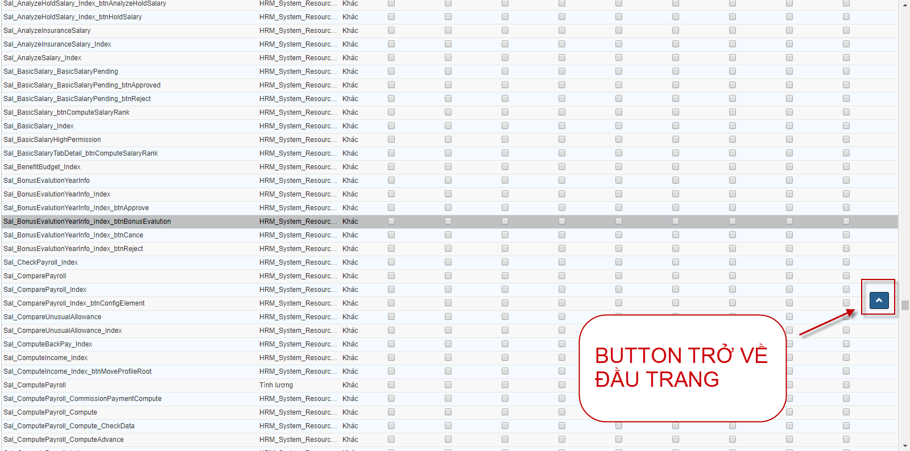 Sau khi người dùng kéo thanh cuộn dọc xuống 1 khoảng để phân quyền, button trở về đầu trang sẽ hiện lên, nếu click vào sẽ đưa thanh cuộn về đầu trang. | | |
| **Kết quả** | Giảm bớt thao tác dư, đem lại sự tiện dụng và thoải mái cho người dùng. | | |
| **Tên** | **ID** | **Phòng Ban** | **Ngày** |
| \[Tung.Tran\] | Sys0007 | SE | 05/09/2017 |

## Kaizen \[Ins0008\]\[05/09/2017\] : Thêm chức năng mô tả thiết lập bảo hiểm

| Trường | Nội dung | | |
|--------|----------|-|-|
| **Tiêu đề** | Thêm chức năng mô tả thiết lập bảo hiểm | | |
| **Page** | Hrm_Main_Web/Sys_InsConfig/Create | | |
| **Trước kaizen** | Khi cấu hình bảo hiểm, có quá nhiều cấu hình dẫn đến người dùng không thể biết được những cấu hình này dùng để làm gì, sử dụng như thế nào? | | |
| **Sau kaizen** | 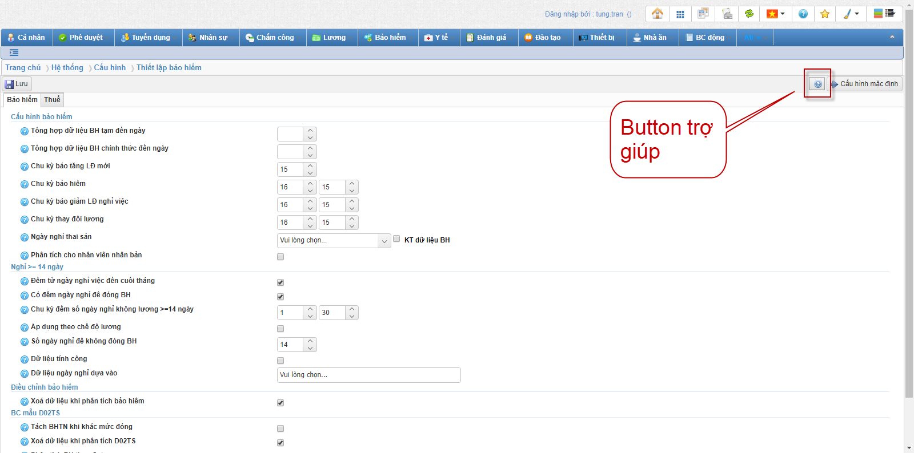 Thêm phần trợ giúp mô tả các cấu hình bảo hiểm. Sau khi click button trợ giúp, Popup mô tả thiết lập bảo hiểm sẽ hiện lên. 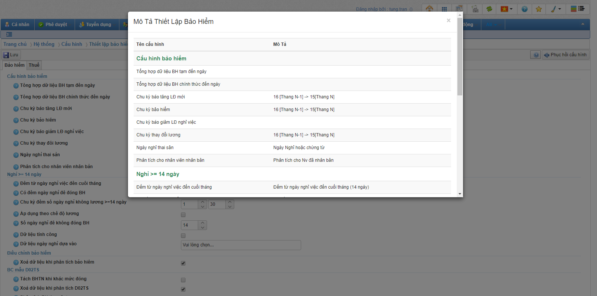 | | |
| **Kết quả** | Trợ giúp người dùng một cách trực quan nhất về cách sử dụng từng cấu hình, đem lại sự tiện ích của phần mềm. | | |
| **Tên** | **ID** | **Phòng Ban** | **Ngày** |
| \[Tung.Tran\] | Ins0008 | SE | 05/09/2017 |

## Kaizen \[SYS0009\]\[12/09/2017\] : Thêm tool tự động thay đổi Web.config

| Trường | Nội dung | | |
|--------|----------|-|-|
| **Tiêu đề** | Thêm tool tự động thay đổi Web config | | |
| **Page** | _(tool ngoài web)_ | | |
| **Trước kaizen** | Mỗi lần get Code Source các tuần về, hay cần thay đổi web config cho từng task khác nhau. Anh em SE phải vào lần lượt vào 3 Web.config của 3 project để bỏ readonly + thay đổi chuỗi kết nối. Điều này rất tốn thao tác và rất dễ bị nhầm lẫn khó phát hiện nếu thay đổi web.config nhầm project. | | |
| **Sau kaizen** | 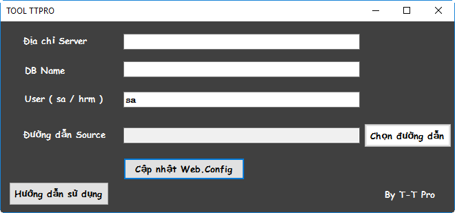 Viết thêm tool tự động thay đổi web.config => Giảm bớt công việc, hạn chế tối đa lỗi xảy ra không đáng có, thao tác nhanh gọn, chính xác. | | |
| **Kết quả** | Giảm bớt thao tác sai không đáng có, tiết kiệm thời gian, công sức, tăng hiệu suất công việc của SE. | | |
| **Tên** | **ID** | **Phòng Ban** | **Ngày** |
| \[Tung.Tran\] | Sys0009 | SE | 12/09/2017 |

## Kaizen \[SYS0010\]\[22/09/2017\] : tìm kiếm tên quyền trong nhóm quyền

| Trường | Nội dung | | |
|--------|----------|-|-|
| **Tiêu đề** | tìm kiếm tên quyền trong nhóm quyền | | |
| **Page** | Sys_GroupPermission/Index | | |
| **Trước kaizen** | Trong màn hình nhóm quyền khó tìm tên quyền, gây bất tiện người dùng | | |
| **Sau kaizen** | 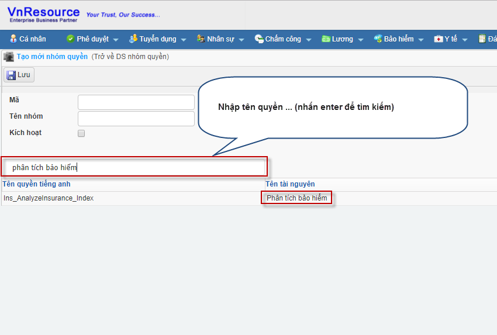 Tạo thêm textbox tìm kiếm theo tên quyền tiếng việt hoặc key quyền | | |
| **Kết quả** | Giảm bớt thời gian tìm kiếm quyền | | |
| **Tên** | **ID** | **Phòng Ban** | **Ngày** |
| \[Tung.Ly\] | Sys0010 | SE | 22/09/2017 |

## Kaizen \[INS0011\]\[23/01/2018\] : Trực quan phần trăm khi phân tích BH

| Trường | Nội dung | | |
|--------|----------|-|-|
| **Tiêu đề** | Hiển thị phần trăm khi phân tích BH | | |
| **Page** | Ins_AnalyzeInsurance/Index | | |
| **Trước kaizen** | Trong màn hình phân tích bảo hiểm không hiển thị phần trăm 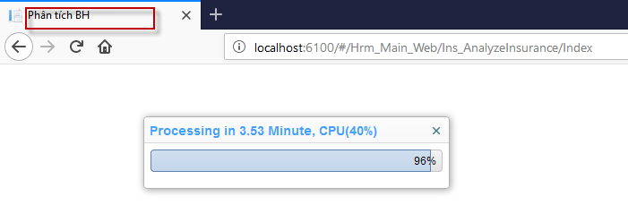 | | |
| **Sau kaizen** | 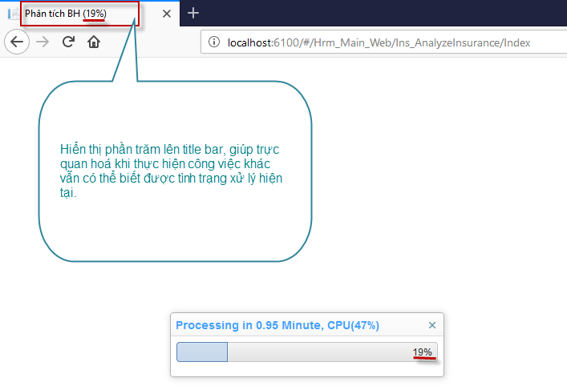 Hiển thị phần trăm màn hình phân tích bảo hiểm | | |
| **Kết quả** | Hiển thị phần trăm giúp trực quan, người dùng có thể xử lý thao tác ở tab khác vẫn biết được tình trạng đang xử lý hiện tại | | |
| **Tên** | **ID** | **Phòng Ban** | **Ngày** |
| \[Tung.Ly\] | Ins0011 | SE | 23/01/2018 |
