---
type: concept
tags:
  - D02
  - VNPT
  - Viettel
  - iBHXH
  - TS24
  - INS
  - HRM
  - phần-mềm-BHXH
  - kê-khai-điện-tử
  - so-sánh
  - venn-diagram
date-updated: 2026-04-26
related:
  - "[[wiki/projects/INS]]"
  - "[[wiki/concepts/HRM-modules]]"
  - "[[HRM-Knowledge-Base/raw/archive/1. Projects/Nghiệp vụ HRM/INS/TruyNguyenNhan]]"
  - "[[HRM-Knowledge-Base/raw/archive/1. Projects/Nghiệp vụ HRM/INS/Venn_D02_SuKhacNhau]]"
aliases:
  - So Sánh D02 VNPT Viettel iBHXH
  - Phần Mềm Kê Khai BHXH Điện Tử
  - Venn D02 Sự Khác Nhau
---

# Sự Khác Nhau Giữa D02-VNPT — D02-Viettel — iBHXH (TS24)

> **Nguồn**: Biểu đồ Venn `Venn_D02_SuKhacNhau.png` — phân tích sự khác biệt và điểm giao thoa giữa 3 phần mềm/cổng kê khai BHXH điện tử phổ biến tại Việt Nam trong bối cảnh triển khai HRM.

![[Pasted image 20260426184322.png]]

---

## 1. Tổng Quan 3 Phần Mềm / Cổng Dịch Vụ

| Phần mềm | Đơn vị cung cấp | Loại hình | Chi phí |
|----------|----------------|-----------|---------|
| **D02-VNPT** | Tập đoàn VNPT | Phần mềm trung gian I-VAN | Có phí |
| **D02-Viettel** | Tập đoàn Viettel | Phần mềm trung gian I-VAN | Có phí |
| **iBHXH (TS24)** | Công ty CP Công nghệ TS24 | Phần mềm trung gian I-VAN | Có phí / gói cơ bản |

> **Ghi chú**: Cả 3 đều là phần mềm **trung gian (I-VAN)** — nghĩa là hồ sơ được gửi qua cổng I-VAN của từng nhà cung cấp trước khi đến hệ thống BHXH Việt Nam. Khác với **iBHXH chính thức** của BHXH Việt Nam (ibhxh.vss.gov.vn — miễn phí, kết nối trực tiếp).

---

## 2. Biểu Đồ Venn — Điểm Chung & Khác Biệt

```mermaid
graph TD
    subgraph VNPT_ONLY ["🔵 CHỈ D02-VNPT"]
        V1["Tích hợp hệ sinh thái VNPT\n(hóa đơn điện tử, chữ ký số VNPT)"]
        V2["Có đại lý hỗ trợ rộng khắp\ncả nước (mạng lưới VNPT)"]
        V3["Tích hợp kế toán qua\nhệ sinh thái VNPT"]
        V4["Phù hợp DN đang dùng\ndịch vụ VNPT"]
    end

    subgraph VIETTEL_ONLY ["🔴 CHỈ D02-Viettel"]
        T1["Tích hợp hệ sinh thái Viettel\n(Viettel-CA, VssID)"]
        T2["Ứng dụng mobile\n(VssID tra cứu BHXH)"]
        T3["Hỗ trợ kỹ thuật 24/7\nqua mạng lưới Viettel"]
        T4["Phù hợp DN đang dùng\nchữ ký số Viettel-CA"]
    end

    subgraph TS24_ONLY ["🟢 CHỈ iBHXH (TS24)"]
        S1["Chuyên sâu nhất về\nnghiệp vụ BHXH"]
        S2["Cập nhật biểu mẫu\nrất nhanh"]
        S3["Hỗ trợ toàn bộ quy trình\nBHXH từ A-Z"]
        S4["Xuất file XML\nchuẩn cổng BHXH"]
        S5["Phổ biến với DN lớn\n> 100 lao động"]
    end

    subgraph CHUNG ["⚪ ĐIỂM CHUNG (CẢ 3)"]
        C1["Đều là phần mềm\ntrung gian I-VAN"]
        C2["Hỗ trợ mẫu D02-LT\n(Danh sách lao động BH)"]
        C3["Yêu cầu chữ ký số\n(USB Token / HSM)"]
        C4["Gửi hồ sơ điện tử\nlên hệ thống BHXH"]
        C5["Có phí dịch vụ\nhàng năm"]
        C6["Hỗ trợ kê khai\nBHXH + BHYT + BHTN"]
    end

    style VNPT_ONLY fill:#ddeeff,stroke:#3388cc
    style VIETTEL_ONLY fill:#ffdddd,stroke:#cc3333
    style TS24_ONLY fill:#ddffdd,stroke:#33aa44
    style CHUNG fill:#f5f5f5,stroke:#888888
```

---

## 3. Bảng So Sánh Chi Tiết

| Tiêu chí | 🔵 D02-VNPT | 🔴 D02-Viettel | 🟢 iBHXH (TS24) |
|---------|-----------|--------------|----------------|
| **Loại hình** | Trung gian (I-VAN) | Trung gian (I-VAN) | Trung gian (I-VAN) |
| **Chi phí/năm** | ~1–3 triệu | ~1–3 triệu | ~3–10 triệu (tùy gói) |
| **Chữ ký số** | Bắt buộc | Bắt buộc | Bắt buộc |
| **Hỗ trợ kỹ thuật** | Tốt (mạng VNPT) | Tốt (24/7 Viettel) | Khá tốt |
| **Tích hợp kế toán** | ✅ Có (hệ sinh thái VNPT) | ✅ Có | ✅ Có |
| **Mobile app** | ❌ Hạn chế | ✅ Có (VssID) | ❌ Hạn chế |
| **Độ chuyên sâu nghiệp vụ BHXH** | Trung bình | Trung bình | ⭐ Cao nhất |
| **Tốc độ cập nhật biểu mẫu** | Trung bình | Trung bình | ⭐ Nhanh nhất |
| **Phù hợp quy mô** | DN vừa-lớn | DN vừa-lớn | DN lớn (>100 LĐ) |
| **Hệ sinh thái tích hợp** | VNPT (hóa đơn, CKS) | Viettel (Viettel-CA) | TS24 riêng |
| **Dễ sử dụng** | Trung bình | Khá dễ | Cần đào tạo |

---

## 4. Quy Trình Nộp Hồ Sơ — Cả 3 Đều Giống Nhau

```mermaid
flowchart LR
    DN([🏢 Doanh nghiệp\nHRM System]) --> PM{Phần mềm\nkê khai}
    
    PM --> V["🔵 D02-VNPT\nCổng I-VAN VNPT"]
    PM --> T["🔴 D02-Viettel\nCổng I-VAN Viettel"]
    PM --> S["🟢 iBHXH TS24\nCổng I-VAN TS24"]
    
    V --> IVAN[Cổng I-VAN\nTrung gian]
    T --> IVAN
    S --> IVAN
    
    IVAN --> BHXH([🏛️ Hệ thống BHXH\nViệt Nam])
    BHXH --> KQ([✅ Tiếp nhận\nhồ sơ])

    style DN fill:#ffffcc
    style BHXH fill:#ccffcc
    style KQ fill:#44bb44,color:#fff
    style IVAN fill:#fff3cd
```

---

## 5. Ứng Dụng Trong Hệ Thống HRM

### 5.1 Lựa chọn phần mềm theo đặc điểm khách hàng

```mermaid
flowchart TD
    KH([Khách hàng cần\ntư vấn chọn phần mềm]) --> Q1{Quy mô\nlao động?}

    Q1 -->|"< 50 người"| Q2{Đã có dịch vụ\nVNPT hoặc Viettel?}
    Q1 -->|"50–200 người"| Q3{Ưu tiên yếu tố\ngì?}
    Q1 -->|"> 200 người"| TS24_REC["🟢 iBHXH (TS24)\nChuyên sâu nhất\nphù hợp DN lớn"]

    Q2 -->|Dùng VNPT| VNPT_REC["🔵 D02-VNPT\nTích hợp sẵn\nhệ sinh thái VNPT"]
    Q2 -->|Dùng Viettel| VT_REC["🔴 D02-Viettel\nTích hợp Viettel-CA\nứng dụng mobile"]
    Q2 -->|Không/Khác| IBHXH["⚪ iBHXH chính thức\n(BHXH Việt Nam)\nMiễn phí, đơn giản"]

    Q3 -->|Hỗ trợ kỹ thuật tốt| Q4{Đang dùng\ndịch vụ của ai?}
    Q3 -->|Nghiệp vụ sâu| TS24_REC
    Q3 -->|Chi phí thấp| IBHXH

    Q4 -->|VNPT| VNPT_REC
    Q4 -->|Viettel| VT_REC
    Q4 -->|Khác| VNPT_REC

    style VNPT_REC fill:#ddeeff
    style VT_REC fill:#ffdddd
    style TS24_REC fill:#ddffdd
    style IBHXH fill:#fffff0
```

### 5.2 Kết nối với module INS trong HRM

Khi hệ thống HRM tính toán xong số liệu BHXH, bước **xuất hồ sơ D02** sẽ tương tác với 1 trong 3 phần mềm:

| Bước | Mô tả |
|------|-------|
| 1 | HRM tính toán BHXH/BHYT/BHTN → Xuất danh sách D02-LT |
| 2 | Import/nhập liệu vào phần mềm kê khai (VNPT/Viettel/TS24) |
| 3 | Ký điện tử bằng chữ ký số (USB Token/HSM) |
| 4 | Nộp hồ sơ qua cổng I-VAN → BHXH tiếp nhận |
| 5 | Theo dõi trạng thái hồ sơ, nhận kết quả |

---

## 6. Điểm Khác Biệt Quan Trọng Khi Cấu Hình HRM

> **Lưu ý cho BA/Dev khi tích hợp module INS với các phần mềm này:**

### 6.1 Cấu trúc file xuất D02-LT

Mỗi phần mềm có thể yêu cầu **định dạng file XML khác nhau** dù cùng chuẩn của BHXH:

| Phần mềm | Định dạng nhận | Cách nhập liệu |
|----------|---------------|----------------|
| D02-VNPT | XML chuẩn BHXH + có thể import Excel | Import file / nhập tay |
| D02-Viettel | XML chuẩn BHXH + Excel | Import file / nhập tay |
| iBHXH (TS24) | XML chuẩn BHXH (nghiêm ngặt hơn) | Import file / API (nếu có) |

### 6.2 Những lỗi thường gặp khi tích hợp

| Tình huống | Lỗi phổ biến | Cách khắc phục |
|-----------|-------------|----------------|
| Export từ HRM sang VNPT | Mã BHXH nhân viên sai format | Chuẩn hóa mã BHXH trong HRM |
| Viettel không nhận file | Encoding XML bị sai (UTF-8 vs ANSI) | Kiểm tra encoding khi xuất |
| TS24 báo lỗi nghiệp vụ | Tỷ lệ đóng BH sai do cấu hình HRM | Đối chiếu tỷ lệ với quy định hiện hành |
| Trùng hồ sơ tháng trước | Nộp lại mà không hủy hồ sơ cũ | Hủy/điều chỉnh trước khi nộp mới |
| Chữ ký số hết hạn | Token hết hạn giữa chừng | Theo dõi hạn token, gia hạn trước |

---

## 7. So Sánh Với iBHXH Chính Thức (BHXH Việt Nam)

> **Phân biệt quan trọng**: `iBHXH của TS24` ≠ `iBHXH chính thức của BHXH Việt Nam`

| Tiêu chí | iBHXH chính thức (BHXH VN) | iBHXH (TS24) |
|----------|--------------------------|--------------|
| **Đơn vị** | BHXH Việt Nam | Công ty TS24 |
| **Website** | ibhxh.vss.gov.vn | ts24.com.vn |
| **Chi phí** | **Miễn phí** | Có phí |
| **Loại hình** | Kết nối trực tiếp | Trung gian I-VAN |
| **Nghiệp vụ** | Cơ bản | Chuyên sâu hơn |
| **Phù hợp** | DN nhỏ, đơn giản | DN vừa-lớn |

---

## 8. Checklist Khi Triển Khai / Chuyển Đổi Phần Mềm

### Khi khách hàng chuyển từ phần mềm này sang phần mềm khác:

- [ ] **Xuất toàn bộ lịch sử** đóng BH từ phần mềm cũ
- [ ] **Đối chiếu số liệu** tháng cuối trước khi chuyển
- [ ] **Kiểm tra mã BHXH** của từng lao động có tương thích không
- [ ] **Test file XML** trước khi nộp hồ sơ thật
- [ ] **Đào tạo HR** sử dụng phần mềm mới
- [ ] **Backup dữ liệu** trước khi chuyển đổi
- [ ] **Xác nhận lịch** nộp hồ sơ tháng chuyển đổi không bị gián đoạn

---

## 9. Tham Chiếu

- **BHXH Việt Nam chính thức**: [baohiemxahoi.gov.vn](https://baohiemxahoi.gov.vn) | Hotline: **1900 9068**
- **iBHXH chính thức (miễn phí)**: [ibhxh.vss.gov.vn](https://ibhxh.vss.gov.vn)
- **TS24**: [ts24.com.vn](https://ts24.com.vn)
- **Liên quan**: [[HRM-Knowledge-Base/raw/archive/1. Projects/Nghiệp vụ HRM/INS/TruyNguyenNhan|Phương pháp Truy Nguyên Nhân 4M]]

---

*Ghi chú được tạo từ biểu đồ Venn `Venn_D02_SuKhacNhau.png` — 2026-04-26*

