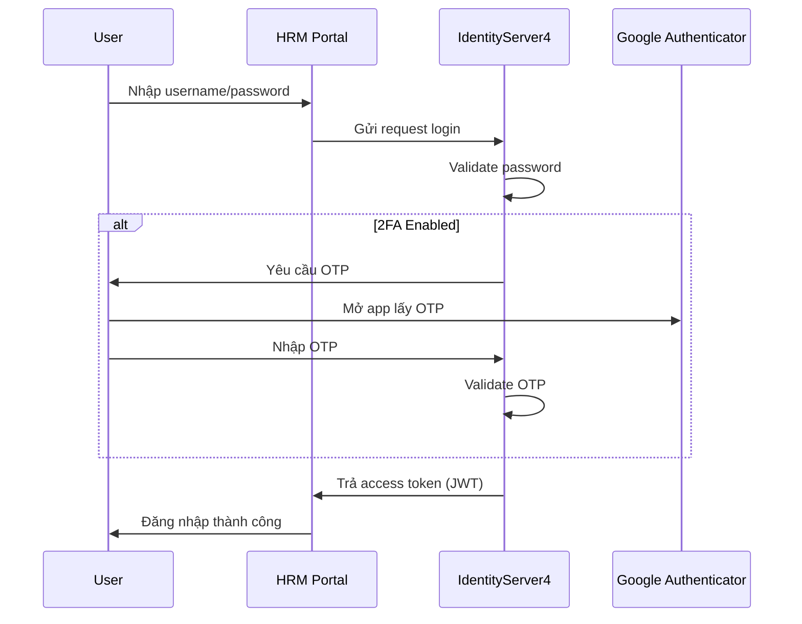

# 🔐 TÀI LIỆU GIẢI PHÁP

## XÁC THỰC HAI YẾU TỐ (2FA) – IDENTITY SERVER 4 (IDS4)

📎 Nguồn: https://confluence.vnresource.net:18001/pages/viewpage.action?pageId=27164673

---

# 1. 🎯 Mục tiêu

Giải pháp xác thực hai yếu tố (2FA) được triển khai trên hệ thống **IdentityServer4 (IDS4)** nhằm:

* Tăng cường bảo mật đăng nhập người dùng
* Ngăn chặn truy cập trái phép khi lộ mật khẩu
* Đáp ứng tiêu chuẩn bảo mật doanh nghiệp (OWASP, Zero Trust)

---

# 2. 🧱 Kiến trúc tổng thể

### 📌 Mô hình xác thực

| Thành phần           | Vai trò                          |
| -------------------- | -------------------------------- |
| IdentityServer4      | Trung tâm xác thực (SSO / Token) |
| HRM Portal           | Client ứng dụng                  |
| Google Authenticator | Sinh mã OTP                      |
| User Device          | Thiết bị người dùng              |

---

### 🔄 Luồng xác thực



---

# 3. 🔐 Nguyên lý hoạt động 2FA

### 📌 Cơ chế OTP

* Sử dụng chuẩn: **TOTP (Time-based One-Time Password)**
* Thuật toán: HMAC-SHA1
* Chu kỳ mã: 30 giây
* Độ dài: 6 chữ số

---

### 📊 Cấu trúc bảo mật

| Yếu tố   | Loại               | Ví dụ      |
| -------- | ------------------ | ---------- |
| Factor 1 | Something you know | Password   |
| Factor 2 | Something you have | OTP từ app |

---

# 4. ⚙️ Quy trình thiết lập 2FA cho người dùng

## 4.1 Cài đặt ứng dụng xác thực

Người dùng cài đặt một trong các ứng dụng:

* Google Authenticator (khuyến nghị)
* Microsoft Authenticator

---

## 4.2 Kích hoạt 2FA trên hệ thống

* Truy cập:

  ```
  HRM Portal → Cấu hình tài khoản → Bảo mật → 2FA
  ```

---

## 4.3 Liên kết thiết bị

Hệ thống cung cấp:

* QR Code
* Secret Key

Người dùng:

* Quét QR hoặc nhập key vào Google Authenticator
* App sẽ sinh mã OTP

📌 (Theo tài liệu trang 3–7)

---

## 4.4 Xác minh và hoàn tất

* Nhập mã OTP vào hệ thống
* Nếu hợp lệ → kích hoạt thành công

👉 Hệ thống trả về:

* **Recovery Code (mã khôi phục)**

📌 (Trang 10)

---

# 5. 🔄 Quy trình đăng nhập với 2FA

## 5.1 Các bước

1. Nhập username/password
2. Hệ thống IDS4 xác thực
3. Nếu bật 2FA → yêu cầu OTP
4. Nhập OTP từ Google Authenticator
5. Xác thực thành công → cấp JWT

---

## 5.2 Điều kiện áp dụng

| Trường hợp        | 2FA      |
| ----------------- | -------- |
| User thường       | Optional |
| Admin             | Bắt buộc |
| Truy cập từ IP lạ | Bắt buộc |
| Thiết bị mới      | Bắt buộc |

---

# 6. 🔑 Recovery Code

## 6.1 Mục đích

* Dùng khi:
  * Mất điện thoại
  * Không truy cập app Authenticator

---

## 6.2 Đặc điểm

| Thuộc tính | Giá trị            |
| ---------- | ------------------ |
| Số lượng   | N mã               |
| Sử dụng    | 1 lần/mã           |
| Bảo mật    | Không hiển thị lại |

---

## 6.3 Khuyến nghị

* Lưu offline (file, password manager)
* Không chia sẻ

---

# 7. 🛠 Quản lý 2FA

## 7.1 Vô hiệu hóa

* Yêu cầu:
  * Đăng nhập hợp lệ
  * Nhập OTP hoặc Recovery Code

📌 (Trang 16)

---

## 7.2 Reset 2FA

* Dành cho:
  * Admin reset user
  * User đổi thiết bị

---

## 7.3 Tạo lại Recovery Code

* Truy cập:

  ```
  Security Settings → Regenerate Recovery Code
  ```

📌 (Trang 17)

---

# 8. 🔐 Bảo mật hệ thống (Technical Security)

## 8.1 Backend (IDS4)

| Thành phần     | Mô tả              |
| -------------- | ------------------ |
| Secret Key     | Lưu DB (encrypted) |
| OTP Validation | TOTP library       |
| Clock Drift    | ±30–60s            |
| Rate Limit     | chống brute force  |

---

## 8.2 Token

* Sau khi xác thực thành công:
  * IDS4 cấp JWT
* Không lưu OTP trong token

---

## 8.3 Logging

* Ghi log:
  * Login success/fail
  * OTP fail
  * Disable 2FA

---

# 9. ⚠️ Rủi ro & kiểm soát

| Rủi ro             | Giải pháp        |
| ------------------ | ---------------- |
| Lộ QR code         | Không log / mask |
| OTP bị brute force | Rate limit       |
| Lệch giờ server    | Sync NTP         |
| Mất thiết bị       | Recovery code    |
| User bypass        | Enforce policy   |

---

# 10. 📈 Khuyến nghị nâng cao

* Bắt buộc 2FA cho:
  * Admin
  * User có quyền nhạy cảm
* Tích hợp:
  * Push Authentication (Approve login)
  * Device Trust
* Theo dõi:
  * Suspicious login

---

# 11. 🧩 Kết luận

Giải pháp 2FA tích hợp với **IdentityServer4** mang lại:

* 🔐 Bảo mật cao
* ⚙️ Dễ triển khai
* 🧠 Tương thích chuẩn quốc tế (TOTP)

👉 Phù hợp cho hệ thống HRM, tài chính, dữ liệu nhạy cảm

---

## 💡 Gợi ý kiến trúc nâng cao

Nếu muốn làm "chuẩn enterprise":

* Tách 2FA thành service riêng (Auth Service)
* Redis cache OTP attempt
* Audit trail + alert real-time
