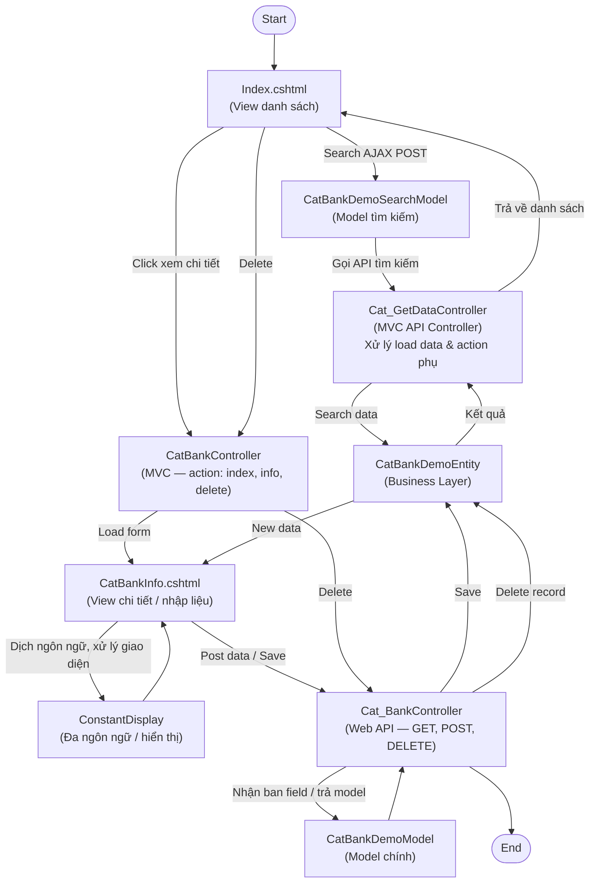

# Flow — CatBank (Danh mục Ngân hàng)

> **Loại**: System Flow
> **Chu kỳ / Trigger**: User thao tác trên màn hình Danh mục Ngân hàng (Search / View Info / Delete)
> **Phân hệ liên quan**: SYS — Danh mục hệ thống

---

## Tổng quan

Màn hình CatBank cho phép người dùng xem danh sách, tìm kiếm, xem chi tiết và xóa ngân hàng.
Luồng đi qua 4 tầng: View (Razor) → MVC Controller → HR Service (MVC API + Web API) → Business (Entity).

---

## Sơ đồ

---

## Chi tiết từng bước

### Bước 1 — User vào màn hình Index

**Người thực hiện**: User
- Render `Index.cshtml`, hiển thị danh sách ngân hàng
- Kích hoạt search mặc định hoặc theo filter

### Bước 2 — Tìm kiếm (Search)

**Trigger**: User nhấn nút tìm kiếm
- `Index.cshtml` POST data qua AJAX tới `CatBankDemoSearchModel`
- `Cat_GetDataController` (MVC API) nhận request, gọi `CatBankDemoEntity` để query DB
- Kết quả trả về render lại grid

### Bước 3 — Xem chi tiết / Nhập liệu

**Trigger**: User click vào record
- `CatBankController` (MVC) xử lý action `info`, render `CatBankInfo.cshtml`
- View sử dụng `ConstantDisplay` để dịch ngôn ngữ và xử lý hiển thị

### Bước 4 — Lưu dữ liệu (POST)

**Trigger**: User submit form
- `CatBankInfo.cshtml` POST data lên `Cat_BankController` (Web API)
- Web API nhận `CatBankDemoModel`, gọi `CatBankDemoEntity` để Save
- Sau khi lưu, trả `New data` về View

### Bước 5 — Xóa record (DELETE)

**Trigger**: User nhấn Delete từ Index hoặc Info
- `CatBankController` (MVC) nhận action `delete`, chuyển tiếp tới `Cat_BankController` (Web API)
- Web API gọi `CatBankDemoEntity` xóa record
- Kết quả trả về, Index refresh danh sách

---

## Điểm rủi ro

| Rủi ro | Tác động | Phòng tránh |
|--------|---------|------------|
| Delete không kiểm tra FK | Lỗi constraint DB | Validate trước khi gọi DELETE API |
| AJAX search không handle lỗi timeout | Màn hình treo | Thêm error handler + loading state |
| ConstantDisplay thiếu key ngôn ngữ | Hiển thị key thay vì text | Kiểm tra resource file khi thêm field mới |

---

## Liên kết

- [[wiki/Nghiệp vụ HRM/SYS/Sys_TaiLieuHeThong_01]]
