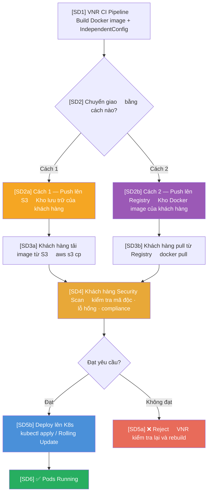
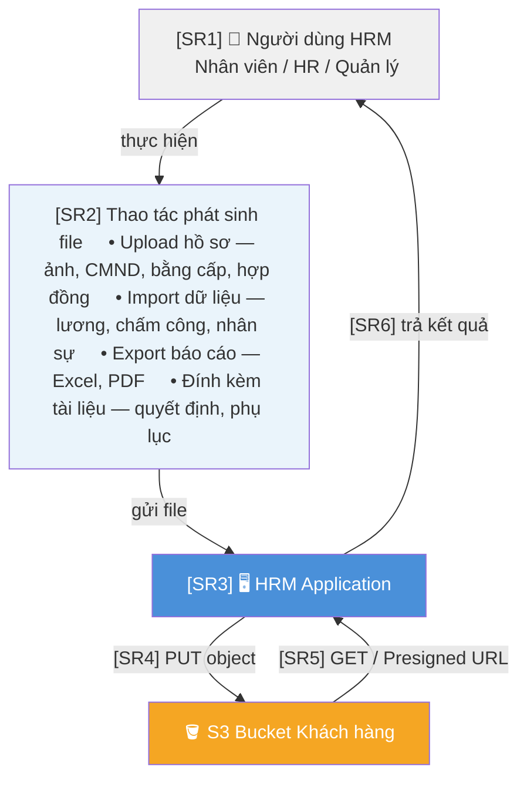
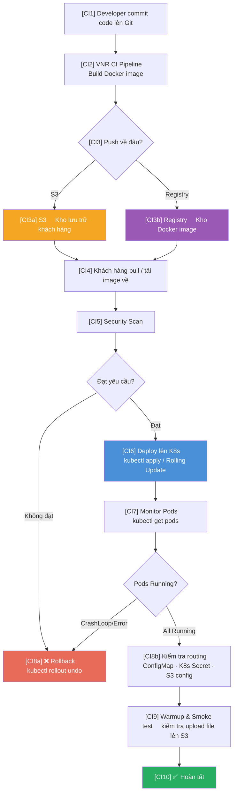
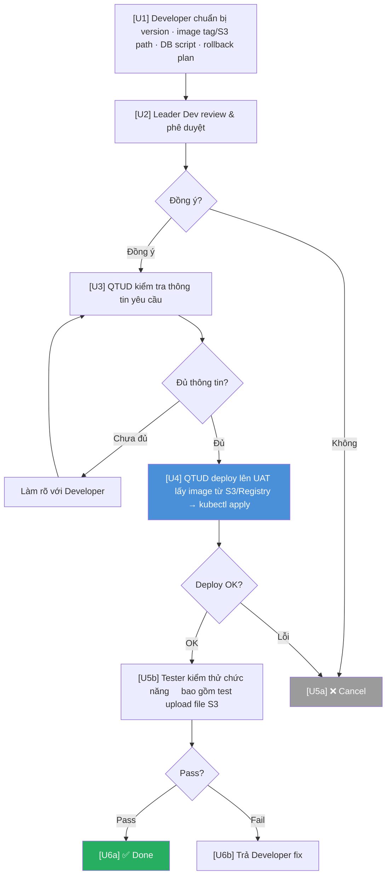
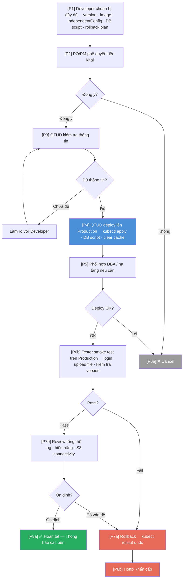

# Quy Trình Cập Nhật Ứng Dụng HRM

---

## 1. Phân chia trách nhiệm

| Công việc | Đơn vị thực hiện | Mô tả |
|-----------|-----------------|-------|
| Build & đẩy phiên bản mới | **VNR** | Build Docker image, đóng gói, đẩy lên S3 hoặc Registry |
| Deploy lên máy chủ | **Khách hàng** | Lấy image từ kho, security scan, deploy lên cluster |
| Quản lý hạ tầng | **Khách hàng** | Máy chủ UAT, Production, K8s cluster |
| Kho lưu trữ S3 | **Khách hàng** | Lưu Docker image, IndependentConfig, file nghiệp vụ |

> ⚠️ VNR **không có quyền** trực tiếp thao tác trên hệ thống máy chủ của khách hàng.

---

## 2. Môi trường triển khai

| Môi trường | Quản lý | Mục đích |
|-----------|---------|---------| 
| DEV | VNR | Phát triển nội bộ |
| TEST | VNR | Kiểm thử nội bộ |
| UAT | Khách hàng cung cấp | Kiểm thử nghiệm thu |
| Production | Khách hàng vận hành | Hệ thống chạy thực tế |

---

## 3. Vai trò của S3 trong hệ thống

S3 là **kho lưu trữ đám mây**, được dùng cho 2 mục đích hoàn toàn khác nhau:

```
┌──────────────────────────────────────────────────────────────┐
│                      Kho lưu trữ S3                          │
│                                                              │
│  Phần 1 — Phục vụ deploy                Phần 2 — Runtime    │
│  Docker image, IndependentConfig,        File người dùng     │
│  RunScript (VNR đẩy lên)                upload hàng ngày    │
└──────────────────────────────────────────────────────────────┘
```

---

### Phần 1 — S3 phục vụ deploy (Build & Deploy)

Khi VNR build xong, có **2 cách** chuyển giao Docker image cho khách hàng:



**Mô tả các bước:**

| Mã | Thực hiện | Nội dung |
|----|-----------|----------|
| SD1 | VNR | CI Pipeline tự động build Docker image và đóng gói IndependentConfig sau khi code được merge |
| SD2a | VNR | Chọn Cách 1: đẩy file image lên **S3** của khách hàng |
| SD2b | VNR | Chọn Cách 2: push image lên **Registry** của khách hàng |
| SD3a | Khách hàng | Tải image từ S3 bằng `aws s3 cp` |
| SD3b | Khách hàng | Pull image từ Registry bằng `docker pull` |
| SD4 | Khách hàng | Chạy **Security Scan** — kiểm tra mã độc, lỗ hổng, tuân thủ compliance |
| SD5a | Khách hàng | Nếu **không đạt**: từ chối, VNR nhận phản hồi và rebuild lại |
| SD5b | Khách hàng | Nếu **đạt**: deploy lên K8s bằng `kubectl apply` theo chiến lược Rolling Update |
| SD6 | Khách hàng | Xác nhận Pods chạy thành công |

#### So sánh 2 cách chuyển giao

| Tiêu chí | Cách 1 — S3 | Cách 2 — Registry |
|----------|------------|------------------|
| Hình thức | File `.tar` / `.rar` đặt trên S3 | Docker image tag trên Registry |
| Khách hàng lấy về | `aws s3 cp` — tải file từ S3 | `docker pull` — pull image từ Registry |
| Phù hợp khi | Khách hàng chưa có Registry riêng, hoặc cần lưu lâu dài | Khách hàng đã có Registry nội bộ (Harbor, ECR...) |
| Quản lý phiên bản | Theo tên file và thư mục | Theo image tag |
| Dung lượng tích lũy | Cần chủ động xóa image cũ | Registry tự quản lý theo retention policy |
| **Khuyến nghị** | Đơn giản, phù hợp giai đoạn đầu | Chuẩn hơn cho CI/CD dài hạn |

#### Nội dung VNR đẩy lên S3 (Phần 1)

| Thư mục trên S3 | Nội dung | Mục đích |
|----------------|---------|---------|
| `IndependentConfig/` | Config XML/JSON/file tĩnh tách riêng theo từng service | Thay đổi cấu hình mà **không cần rebuild Docker image** |
| `RunScript/` | Script deploy, script khởi động service | Chạy khi cold start hoặc update |
| `DLLForWindowService/` | DLL chạy Windows Service / Hangfire | Cập nhật độc lập với web app |
| `logrunscripts/` | Log các lần chạy script | Audit trail, debug deploy |

> 📌 **IndependentConfig**: Thay vì hardcode config vào Docker image, VNR tách ra thành file riêng và đẩy lên S3. Khách hàng mount file này vào container khi khởi động (qua K8s ConfigMap hoặc init container). Lợi ích: thay đổi connection string, endpoint mà **không cần rebuild image**.

#### Cấu trúc thực tế IndependentConfig (theo từng service)

```
IndependentConfig/
├── HRM.Presentation.MainCore/          ← Ứng dụng HRM chính
│   └── Settings/
│       ├── FIELD_INFO.XML              ← Định nghĩa trường dữ liệu hiển thị
│       ├── FIELD_HIDDEN.XML            ← Trường ẩn theo cấu hình khách hàng
│       ├── FIELD_READONLY.XML          ← Trường chỉ đọc
│       ├── FIELD_COLOR.XML             ← Màu sắc hiển thị
│       ├── FIELD_LENGTH.XML            ← Độ dài trường
│       ├── LANG_VN / EN / CN / JA.XML  ← File ngôn ngữ đa ngữ
│       ├── MENU_*.xml / SCREEN_INFO.xml← Cấu hình menu, màn hình
│       ├── PROFILE_INFO.XML            ← Cấu hình màn hình hồ sơ nhân viên
│       ├── SETTING_INFO.XML            ← Cài đặt chung hệ thống
│       ├── fileExt.json                ← Phần mở rộng file được phép upload
│       ├── configDiagram_org.json      ← Cấu hình sơ đồ tổ chức
│       └── Settings_Google.json        ← Tích hợp Google (Maps, OAuth...)
│
├── HRM.Presentation.EmpPortalCore/    ← Employee Portal (cổng nhân viên)
│   ├── Settings/
│   │   ├── hr-service-url.json         ← URL kết nối đến HR service
│   │   ├── sys-service-url.json        ← URL kết nối đến System service
│   │   ├── LANG_*.XML                  ← File ngôn ngữ portal
│   │   └── USER_SETTING.XML            ← Cài đặt mặc định người dùng
│   ├── New_Settings/
│   │   ├── MENU_SiteMap.xml            ← Cấu hình menu portal
│   │   ├── Theme_Settings/             ← Theme giao diện (màu sắc, font...)
│   │   └── Form_Configs/               ← Cấu hình form nhập liệu
│   └── wwwroot/Apps/mobile/
│       ├── ConfigDashboard.json        ← Dashboard mobile app
│       ├── ConfigChart.json            ← Biểu đồ mobile
│       ├── ConfigList.json             ← Danh sách màn hình mobile
│       └── Lang_VN / EN / CN.json      ← Ngôn ngữ mobile app
│
├── HRM.Integration.Service.ApiCore/   ← Service tích hợp bên ngoài
│   └── wwwroot/Resources/
│       ├── ChatGpt/                    ← Prompt AI (phân tích chấm công, hồ sơ...)
│       └── Setting/EnumSal.json        ← Enum loại lương
│
└── HRM.SC.Service.ApiCore/            ← Self-service API
    └── wwwroot/Resources/Settings/
        ├── FIELD_INFO.XML              ← Cấu hình field self-service
        ├── GRID_INFO.json              ← Cấu hình lưới dữ liệu
        ├── TOOLBAR_INFO.json           ← Cấu hình thanh công cụ
        └── LANG_VN / EN.XML            ← Ngôn ngữ self-service
```

> 💡 **Tại sao tách ra IndependentConfig?** Các file này thường **khác nhau giữa từng khách hàng** (menu ẩn/hiện, ngôn ngữ, cấu hình field...). Tách ra S3 giúp VNR cập nhật config riêng cho từng khách hàng mà không cần build lại image chung.

---

### Phần 2 — S3 lưu file Runtime (do người dùng tạo ra)

Khi hệ thống HRM đang chạy, mọi file người dùng upload đều được lưu thẳng vào S3:



**Mô tả các bước:**

| Mã | Thực hiện | Nội dung |
|----|-----------|----------|
| SR1 | Người dùng | Thực hiện thao tác trên HRM: upload hồ sơ, import dữ liệu, export báo cáo, đính kèm tài liệu |
| SR2 | Người dùng | Chọn loại thao tác cụ thể |
| SR3 | HRM Application | Nhận file/yêu cầu từ người dùng, xử lý nghiệp vụ |
| SR4 | HRM → S3 | **PUT object** — đẩy file lên S3 bucket của khách hàng |
| SR5 | S3 → HRM | Khi cần xem/tải lại: trả về file qua **GET** hoặc **Presigned URL** (URL tạm thời có thời hạn) |
| SR6 | HRM → Người dùng | Trả kết quả: link tải, preview ảnh, file export... |

#### Cấu trúc thư mục S3 (thực tế)

```
s3://vnr-hrm-[project]-deploy/
├── downloads/          ← File người dùng tải xuống từ hệ thống
├── export-model/       ← Template export báo cáo
├── images/             ← Ảnh upload từ các nghiệp vụ
├── profileimage/       ← Ảnh đại diện nhân viên
├── templates/          ← Template import (Excel, CSV)
└── uploads/            ← File import / dữ liệu tải lên
```

#### Config kết nối S3 trong ứng dụng

```json
{
  "S3Configurations": {
    "Enable": true,
    "Bucket": "vnr-hrm-[project]-files",
    "Endpoint": "https://[s3-endpoint]",
    "Accesskey": "XXX",
    "Secretkey": "YYY"
  }
}
```

> ⚠️ `Accesskey` / `Secretkey` phải lưu trong **K8s Secret** — không hardcode trong `appsettings.json`.

---

### Tổng hợp — S3 lưu trữ những gì

```
s3://vnr-hrm-[project]-deploy/
│
├── [Phần 1 — Phục vụ deploy] ──────────────────────────
│   ├── DLLForWindowService/    ← DLL chạy Windows Service / Hangfire
│   ├── IndependentConfig/      ← Config theo môi trường (không hardcode trong image)
│   ├── RunScript/              ← Script cold start / update
│   └── logrunscripts/          ← Log các lần chạy script
│
└── [Phần 2 — File phát sinh khi người dùng thao tác] ──
    ├── downloads/              ← File người dùng tải xuống
    ├── export-model/           ← Template export báo cáo
    ├── images/                 ← Ảnh upload từ nghiệp vụ
    ├── profileimage/           ← Ảnh đại diện nhân viên
    ├── templates/              ← Template import
    └── uploads/                ← File import / dữ liệu tải lên
```

---

## 4. Dự báo tăng trưởng dung lượng S3

### 4.1 Phần deploy (tăng theo số lần release)

| Loại                       | Ước tính mỗi lần | Số lần / tháng  | Tăng thêm / tháng |
| -------------------------- | ---------------- | --------------- | ----------------- |
| Docker image (6–8 service) | ~2–3 GB / bộ     | 4–8 lần         | ~10–25 GB         |
| IndependentConfig          | ~vài MB          | 4–8 lần         | Không đáng kể     |
| DB backup                  | ~500 MB – 2 GB   | Mỗi lần go-live | ~2–8 GB           |

> 🔴 **Lưu ý**: Nếu không xóa image cũ, dung lượng có thể tích lũy **100–200 GB trong 6–12 tháng**.

**Đề xuất**:
- Chỉ giữ lại **3–5 version** gần nhất
- Xóa image cũ sau 7–14 ngày khi version mới đã ổn định
- Bật **S3 Lifecycle Policy** tự động xóa / chuyển Glacier

### 4.2 Phần Runtime (tăng theo số nhân viên)

**Ước tính (~3.000–5.000 nhân viên)**:

| Thời điểm | Dung lượng ước tính |
|-----------|---------------------|
| Lúc go-live | ~5–10 GB |
| Sau 1 năm | ~20–40 GB |
| Sau 3 năm | ~60–120 GB |

> 📌 Cần monitor thực tế sau 3 tháng đầu để hiệu chỉnh.

### 4.3 Kế hoạch xử lý khi dung lượng tăng lớn

| Hành động | Thời điểm | Đơn vị thực hiện |
|-----------|-----------|-----------------|
| Xóa Docker image cũ (giữ tối đa 5 version) | Sau mỗi lần go-live | VNR / Khách hàng |
| Xóa DB backup cũ (> 3 tháng) | Hàng tháng | Khách hàng |
| Bật S3 Lifecycle Policy | Khi dung lượng > 100 GB | Khách hàng |
| Nâng quota bucket | Khi đạt 80% giới hạn | Khách hàng |
| Rà soát file Runtime không dùng | Hàng quý | VNR + Khách hàng |

---

## 5. Luồng CI/CD tổng thể



**Mô tả các bước:**

| Mã | Thực hiện | Nội dung |
|----|-----------|----------|
| CI1 | Developer | Commit và push code lên Git, trigger CI Pipeline |
| CI2 | VNR CI | Tự động build Docker image cho toàn bộ service |
| CI3a | VNR | Đẩy artifact lên **S3** (file .tar) |
| CI3b | VNR | Push image lên **Registry** (image tag) |
| CI4 | Khách hàng | Tải image về môi trường nội bộ |
| CI5 | Khách hàng | Chạy Security Scan — phải đạt mới tiếp tục |
| CI6 | Khách hàng | `kubectl apply` — deploy lên K8s theo Rolling Update |
| CI7 | Khách hàng | Monitor Pods: `kubectl get pods` — chờ tất cả về trạng thái Running |
| CI8a | Khách hàng | Nếu CrashLoop hoặc Error → **Rollback** ngay (`kubectl rollout undo`) |
| CI8b | Khách hàng | Nếu Running → kiểm tra ConfigMap, K8s Secret, cấu hình S3 |
| CI9 | VNR + Khách hàng | Warmup cache và chạy Smoke test — xác nhận upload file S3 hoạt động |
| CI10 | — | ✅ Hoàn tất |

---

## 6. Quy trình cập nhật lên UAT

**Các bên tham gia**: Developer (VNR) → Leader Dev (VNR) → QTUD / Vận hành (Khách hàng) → Tester (Khách hàng)



**Mô tả các bước:**

| Mã | Thực hiện | Nội dung |
|----|-----------|----------|
| U1 | Developer (VNR) | Chuẩn bị đầy đủ: version, image tag/S3 path, DB script, rollback plan |
| U2 | Leader Dev (VNR) | Review thông tin và phê duyệt yêu cầu deploy |
| U3 | QTUD (Khách hàng) | Kiểm tra thông tin — nếu chưa đủ yêu cầu Developer bổ sung |
| U4 | QTUD (Khách hàng) | Tải image từ S3/Registry, chạy `kubectl apply` lên môi trường UAT |
| U5a | — | Nếu deploy lỗi → Cancel, báo lại VNR |
| U5b | Tester (Khách hàng) | Nếu deploy OK → kiểm thử chức năng, bao gồm test upload file S3 |
| U6a | — | Nếu Pass → ✅ Done |
| U6b | — | Nếu Fail → trả Developer fix và lặp lại quy trình |

**Checklist Developer gửi QTUD**:
- [ ] Version (vd: `v80.0.0`)
- [ ] Danh sách service cần cập nhật
- [ ] S3 path hoặc image tag trên Registry
- [ ] IndependentConfig mới (nếu có thay đổi)
- [ ] DB migration script (nếu có)
- [ ] Rollback plan

---

## 7. Quy trình cập nhật lên Production

**Các bên tham gia**: Developer (VNR) → PO/PM → QTUD / Vận hành (Khách hàng) → Tester (Khách hàng)



**Mô tả các bước:**

| Mã | Thực hiện | Nội dung |
|----|-----------|----------|
| P1 | Developer (VNR) | Chuẩn bị đầy đủ: version, image, IndependentConfig, DB script, rollback plan |
| P2 | PO/PM | Phê duyệt triển khai — chỉ tiếp tục khi có approval |
| P3 | QTUD (Khách hàng) | Xác nhận đủ thông tin — nếu thiếu yêu cầu Developer bổ sung |
| P4 | QTUD (Khách hàng) | Deploy lên Production: `kubectl apply`, chạy DB script, clear cache |
| P5 | QTUD + DBA | Phối hợp DBA / hạ tầng nếu có thay đổi DB hoặc infra |
| P6a | — | Nếu deploy lỗi → Cancel |
| P6b | Tester (Khách hàng) | Nếu OK → Smoke test: đăng nhập, upload file, kiểm tra version |
| P7a | — | Nếu Fail → **Rollback** (`kubectl rollout undo`), đánh giá hotfix |
| P7b | VNR + Khách hàng | Nếu Pass → Review tổng thể: log, hiệu năng, S3 connectivity |
| P8a | — | Nếu ổn định → ✅ Hoàn tất, thông báo tất cả các bên |
| P8b | — | Nếu có vấn đề → Rollback + Hotfix khẩn cấp |

**Smoke test checklist (Production)**:
- [ ] Đăng nhập Main site thành công
- [ ] Đăng nhập Employee Portal thành công
- [ ] Version hiển thị đúng build mới
- [ ] Upload file lên S3 hoạt động bình thường
- [ ] Import dữ liệu chạy được
- [ ] Export báo cáo trả về file đúng

---

## 8. Quản lý Config & Secret

| Thành phần | Cách lưu | Đơn vị chuẩn bị |
|------------|---------|----------------|
| Cấu hình ứng dụng | K8s ConfigMap | Khách hàng |
| Mật khẩu CSDL / Redis | K8s Secret | Khách hàng |
| S3 Access Key / Secret Key | K8s Secret | Khách hàng |
| IndependentConfig | Thư mục `IndependentConfig/` trên S3 | Khách hàng + VNR |
| Quản lý tập trung | HashiCorp Vault | Khách hàng |

> ⚠️ **VNR cần lưu ý**: Source code phải đọc S3 key, connection string từ environment variable / K8s Secret — **không hardcode trong `appsettings.json`**.

---

## 9. So sánh UAT và Production

| Tiêu chí | UAT | Production |
|----------|-----|-----------|
| Người phê duyệt | Leader Dev | PO/PM |
| Review sau deploy | Không bắt buộc | **Bắt buộc** |
| Rollback plan | Chuẩn bị sẵn | **Bắt buộc trước khi deploy** |
| Hotfix | Không | **Có** |
| Thông báo | Nội bộ | **Toàn bộ các bên liên quan** |
| S3 bucket | UAT bucket (tách riêng) | Production bucket |

---

## 10. Các rủi ro cần lưu ý

| Rủi ro | Ảnh hưởng | Cách phòng tránh |
|--------|-----------|-----------------|
| Image bị reject sau security scan | Delay deploy | Tuân thủ security baseline của khách hàng từ sớm |
| S3 đầy do không xóa image cũ | Deploy fail / chi phí tăng | Lifecycle Policy, giữ max 5 version |
| S3 key bị lộ do hardcode | Mất an toàn dữ liệu | Dùng K8s Secret, không hardcode |
| Người dùng không upload được file (S3 timeout) | Ảnh hưởng nghiệp vụ | Monitor S3 endpoint, có retry policy |
| IndependentConfig sai môi trường | App chạy sai cấu hình | Kiểm tra kỹ trước khi deploy, tách rõ UAT/PRD |
| DB migration script lỗi | Phải rollback toàn bộ | Test script trên UAT trước, chuẩn bị rollback script |

---

## 11. Liên kết

- [[Flow-trien-khai-he-thong]] — Kiến trúc CI/CD tổng thể
- [[Flow-UAT]] — Quy trình chi tiết lên UAT
- [[Flow-Golive]] — Quy trình chi tiết lên Production
- [[CẤU HÌNH AWS S3 UPLOAD FILE]] — Hướng dẫn tạo bucket, IAM, policy
- [[S3 - HƯỚNG DẪN SỬ DỤNG S3 ĐỂ UPLOAD FILE]] — Hướng dẫn upload file
- [[Lịch sử cập nhật build]] — Lịch sử các version đã deploy
