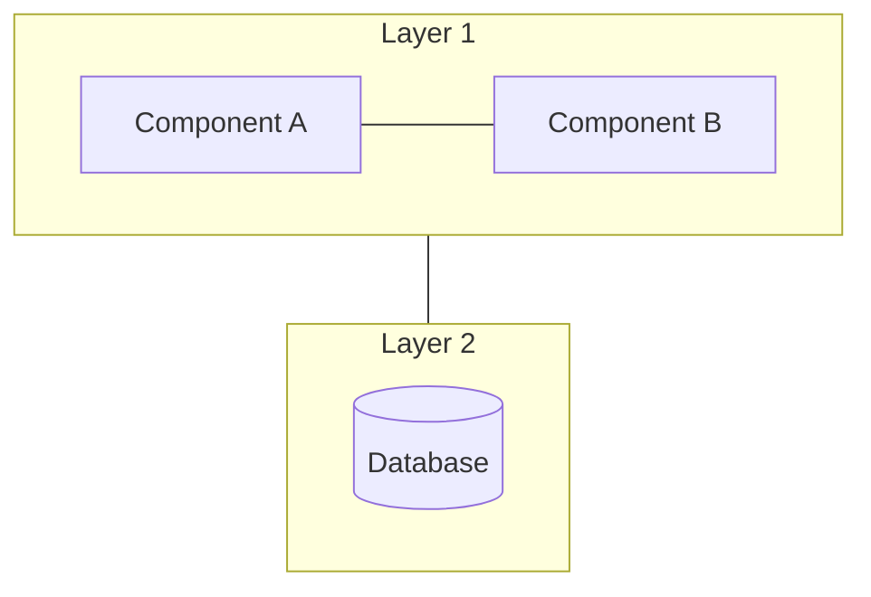

# Architecture — {{title}}

> **Loại**: System | Module | Integration | Infrastructure
> **Mô tả**: 

---

## Sơ đồ

---

## Thành phần

| Component | Vai trò | Công nghệ |
|-----------|--------|----------|
| | | |

---

## Kết nối / Integration

- 

---

## Liên kết

- 
