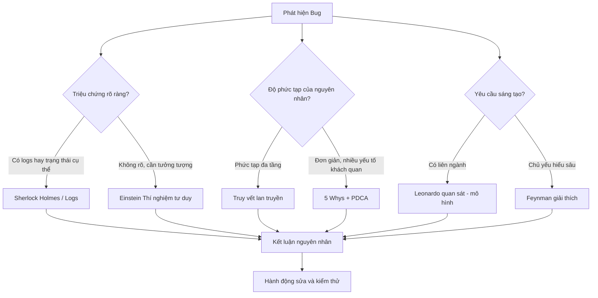

# Tổng quan: Hệ phương pháp luận Debug tư duy bậc cao

> **Mục tiêu**: LLM Wiki là "bộ não phương pháp luận" — khi gặp bug khó, query wiki nhận phương hướng tư duy phù hợp để áp dụng debug.

---

## Tóm tắt điều hành

Việc sửa lỗi (debug) đòi hỏi tư duy hệ thống và sáng tạo. Tài liệu này giới thiệu **6 phương pháp tư duy** áp dụng cho debug phần mềm — không đi sâu kỹ thuật ngôn ngữ mà tập trung vào **phương pháp luận**.

> Gỡ lỗi là quá trình thu nạp kiến thức và cập nhật **mental models** — khi mô hình tâm trí của lập trình viên không còn khớp với hiện thực của hệ thống.

---

## 6 Phương pháp trong hệ thống này

| File | Phương pháp | Khi nào dùng |
|------|------------|-------------|
| `01-Sherlock-Holmes.md` | Quan sát – Loại trừ – Lập giả thuyết | Có logs rõ, triệu chứng cụ thể |
| `02-Einstein-ThuNghiemTuDuy.md` | Thí nghiệm tư duy, đơn giản hóa | Hệ thống phức tạp, cần khái quát |
| `03-DaVinci-QuanSatHeThong.md` | Quan sát đa lĩnh vực, mô hình hóa | Cần nhìn bối cảnh rộng, sáng tạo |
| `04-Toyota-5Whys-PDCA.md` | 5 Whys + PDCA + Genchi Genbutsu | Nhiều yếu tố phụ thuộc, lỗi lặp |
| `05-ContactTracing-ChuoiNhanQua.md` | Truy vết chuỗi nhân quả (dịch tễ) | Lỗi qua nhiều tầng, ngẫu nhiên |
| `06-Feynman-GiaiThich.md` | Dạy lại – Đơn giản hóa đến nguyên lý | Cần hiểu kỹ, handover, review |
| `07-TamLy-SIR-Advanced.md` | Tâm lý học debug + SIR Model | Nâng cao, phân tích hệ thống |
| `08-Socrates-TruyVan.md` | 35 câu hỏi truy vấn, phát hiện giả định | Kiểm tra kết quả AI, đọc docs |
| `09-FirstPrinciples-TuDuyNguyenBan.md` | 30 câu hỏi truy về nguyên lý gốc | Giải pháp không hiệu quả, tư duy lại từ đầu |
| `10-Aristotle-TamDoanLuan.md` | Tam đoạn luận, bóc tách tiền đề | Kiểm tra logic câu nói/kết luận của AI |
| `11-SAT-LanTruyenKichHoat.md` | 35 câu hỏi mở rộng mạng tri thức | Tìm pattern, kết nối wiki, sáng tạo |

---

## Sơ đồ quyết định chọn phương pháp

---

## Checklist áp dụng nhanh

1. ☐ **Reproduce** — Mô tả rõ, steps tái hiện, ghi input/output
2. ☐ **Thu thập** — Logs, stack trace, metrics (Genchi: SSH nếu cần)
3. ☐ **Giả thuyết** — Liệt kê các khả năng
4. ☐ **Chọn phương pháp** — Dùng sơ đồ trên
5. ☐ **Áp dụng** — Loại trừ / Tại sao / Đơn giản hóa / Vẽ sơ đồ / Truy vết / Giải thích
6. ☐ **Ghi chú** — Ghi giả thuyết đã loại, kết quả test
7. ☐ **Kiểm chứng** — Fix, test, lặp PDCA nếu chưa xong
8. ☐ **Lưu wiki** — Bug report + cập nhật wiki

---

## Tâm lý học debug: Fixed vs Growth Mindset

| Tư duy | Tiếp cận | Hệ quả |
|--------|---------|--------|
| **Cố định (Fixed)** | Lỗi = giới hạn khả năng → thay đổi ngẫu nhiên (cargo culting) | Code xáo trộn, nợ kỹ thuật tăng, gốc rễ không giải quyết |
| **Tăng trưởng (Growth)** | Lỗi = dữ liệu → cập nhật kiến thức, áp dụng phương pháp khoa học | Hệ thống đơn giản hóa, mental model hoàn thiện, ngăn lỗi tương tự |

**Kỹ sư thực thụ = language-agnostic**: tập trung cấu trúc dữ liệu, thuật toán, tương tác thành phần — không phải cú pháp.

---

## Liên kết
- [[wiki/concepts/Kaizen-Methodology]] — 5S, 4 cách cải tiến
- [[wiki/concepts/PKM-Methods]] — Zettelkasten, Second Brain
- [[wiki/sources/INS-FishBone-Analysis]] — FishBone 4M + 5 Whys thực tế HRM
- [[wiki/sources/INS-TruyNguyenNhan]] — RCA 4M Kaizen thực tế
