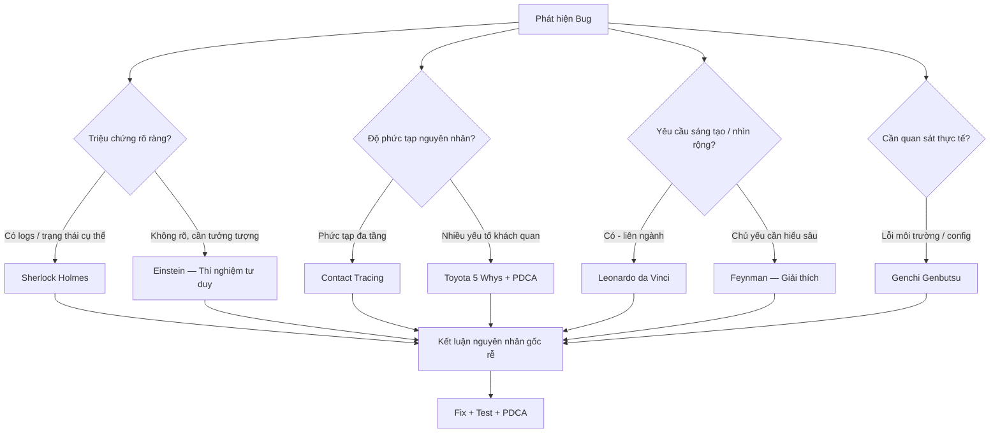

# Phương pháp luận Debug tư duy bậc cao

> Tác giả tổng hợp: Tung.Ly — 2026-05-02
> Nguồn: Tổng hợp từ các trường phái tư duy nổi tiếng áp dụng cho debug phần mềm

---

## Tóm tắt điều hành

Việc sửa lỗi (debug) đòi hỏi tư duy hệ thống và sáng tạo. Tài liệu này giới thiệu sáu phương pháp tư duy nổi bật áp dụng cho quá trình debug:

1. **Sherlock Holmes** — quan sát, loại trừ, lập giả thuyết
2. **Einstein** — thí nghiệm tư duy, đơn giản hóa giả thuyết
3. **Leonardo da Vinci** — quan sát liên ngành, phác thảo, mô hình hóa
4. **Toyota** — 5 Whys, PDCA, Genchi Genbutsu
5. **Contact Tracing** — phân tích chuỗi nhân quả lan truyền
6. **Feynman** — giải thích lại, dạy lại, đơn giản hóa đến nguyên lý

Mỗi phương pháp được mô tả chi tiết: nguyên tắc cơ bản, các bước áp dụng, và ví dụ minh họa trừu tượng (không code). Mục tiêu: dùng wiki như "bộ não phương pháp luận" — khi gặp bug khó, query wiki để nhận phương hướng tư duy phù hợp.

---

## 1. Tư duy Sherlock Holmes (quan sát – loại trừ – lập giả thuyết)

Tư duy thám tử Sherlock Holmes nhấn mạnh quan sát kỹ lưỡng, thu thập dữ liệu và loại trừ để tìm ra sự thật.

### Nguyên tắc cốt lõi
> "Một khi loại bỏ được những điều không thể, bất kể còn lại có khả năng nhỏ đến đâu, thì đó là sự thật." — Sherlock Holmes

### Các bước áp dụng

1. **Quan sát và ghi nhận triệu chứng** — Kiểm tra log, thông báo lỗi, dấu hiệu bất thường. Lập danh sách các sự kiện thực tế (facts).
2. **Lập giả thuyết** — Xác định các nguyên nhân khả dĩ. Mỗi giả thuyết = một kịch bản.
3. **Kiểm tra – loại trừ** — Thử nghiệm từng giả thuyết có hệ thống. Loại bỏ những gì không thể xảy ra dựa vào dữ liệu.
4. **Kết luận** — Giả thuyết còn sót lại là nguyên nhân gốc. Lập kế hoạch sửa và kiểm thử.

### Ví dụ trừu tượng
Một dịch vụ web bất ngờ ngắt kết nối database. Quan sát: "timeout khi kết nối". Giả thuyết: DB quá tải / timeout ngắn / lỗi mạng. Kiểm tra: ping DB thành công (loại lỗi mạng), tăng timeout vẫn lỗi (loại cấu hình), CPU DB bình thường (loại quá tải). Còn lại: driver kết nối lỗi — đó là "sự thật".

### Khi nào dùng
- Có logs/stack trace rõ ràng
- Triệu chứng cụ thể, có thể liệt kê giả thuyết
- Cần loại trừ có hệ thống

---

## 2. Tư duy Einstein (thí nghiệm tư duy – đơn giản hóa)

Einstein nổi tiếng với Gedankenexperiment — hình dung tình huống tối giản để khám phá sự thật.

### Nguyên tắc cốt lõi
> Bỏ qua các chi tiết phức tạp, rút hệ thống về trạng thái tối giản để nhìn rõ bản chất.

### Các bước áp dụng

1. **Hình dung kịch bản đơn giản** — Tạm coi hệ thống "nén" lại. Ví dụ: thay 100 node bằng 2 node.
2. **Đặt câu hỏi giả thuyết** — Trong tình huống lý tưởng, điều gì xảy ra?
3. **Phân tích hệ quả** — Nếu giả thuyết dẫn đến mâu thuẫn → điều chỉnh.
4. **Đơn giản hóa sâu** — Loại bỏ biến số không cần thiết, giữ lại thành phần cơ bản.

### Ví dụ trừu tượng
Thuật toán phân tán cho kết quả sai ở vài tình huống biên. Thí nghiệm tư duy: thu về 2 node. Với 2 node cũng sai → lỗi logic đồng bộ (không phải cấu hình phức tạp). Phát hiện: "Luồng A và B bị race condition".

### Khi nào dùng
- Lỗi khó hiểu, hệ thống phức tạp
- Cần khái quát hóa trước khi đào sâu
- Cần "giải phóng tư duy" khỏi chi tiết

---

## 3. Tư duy Leonardo da Vinci (quan sát đa lĩnh vực – phác thảo – mô hình hóa)

Leonardo da Vinci là thiên tài quan sát đa lĩnh vực và mô hình hóa bằng sketch. Phương pháp nhấn mạnh nhìn tổng thể và kết nối liên ngành.

### Nguyên tắc cốt lõi
> Quan sát liên ngành, vẽ sơ đồ tổng quan, tìm analogy từ thế giới tự nhiên để hiểu bản chất vấn đề.

### Các bước áp dụng

1. **Quan sát liên ngành** — So sánh hệ thống phần mềm với thứ khác (tuần hoàn máu, ống nước, phễu lọc...).
2. **Phác thảo / Modeling** — Vẽ sơ đồ luồng, dependency, flowchart. Artifact hóa vấn đề.
3. **Hỏi tại sao liên tục** — Đối chiếu thông tin thu được với trực giác đa ngành.
4. **Kiên nhẫn và tỉ mỉ** — Lưu lại mọi bước test, mọi phác đồ để tái sử dụng.

### Ví dụ trừu tượng
Module xử lý dữ liệu tài chính cho kết quả không hợp lệ. Phác thảo luồng dữ liệu. Nhìn tổng thể như chiếc phễu lọc — nếu "cổ họng" quá hẹp thì áp lực tăng ở đó. Phát hiện: câu lệnh SQL thiếu chỉ mục → DB chậm là nguyên nhân gốc.

### Khi nào dùng
- Lỗi cần nhìn bối cảnh rộng
- Đòi hỏi giải pháp sáng tạo
- Cần diagram hóa để trực quan

---

## 4. Phương pháp Toyota (5 Whys + PDCA + Genchi Genbutsu)

Toyota Production System (TPS) phát triển bộ công cụ phù hợp với debug hệ thống.

### 4a. 5 Whys — Truy nguyên nhân gốc rễ

**Nguyên tắc**: Hỏi "Tại sao?" liên tiếp đến khi chạm nguyên nhân có thể hành động được.

> "Tại sao trang web lỗi?" → "container đầy log" → "Tại sao đầy log?" → "không giới hạn log" → ... → nguyên nhân gốc

**Các bước:**
1. Nêu vấn đề cụ thể, rõ ràng
2. Hỏi "Tại sao?" với câu trả lời trước
3. Lặp ít nhất 5 lần đến khi đạt nguyên nhân gốc
4. Ghi chép và xác minh giải pháp

**Lưu ý**: 5 chỉ mang tính biểu tượng — hỏi đến khi nào thấy nguyên nhân "hành động được" thì dừng. Tránh đổ lỗi cá nhân, tập trung vào hệ thống.

### 4b. PDCA — Cải tiến liên tục

**Chu trình**: Plan → Do → Check → Act → lặp lại

- **Plan**: Lập kế hoạch test và phương án fix
- **Do**: Triển khai kiểm tra nguyên nhân
- **Check**: Đánh giá kết quả test
- **Act**: Fix và deploy cải tiến

Nếu fix chưa triệt để → quay lại lặp PDCA với dữ liệu mới (tinh thần Kaizen).

### 4c. Genchi Genbutsu — Đến hiện trường

**Nguyên tắc**: "Go and see" — đến nơi phát sinh vấn đề để quan sát trực tiếp.

> "Để hiểu vấn đề, hãy xác nhận thực tế và phân tích nguyên nhân gốc tại chỗ."

Khi debug: SSH vào server thực, xem log gốc, kiểm tra trực tiếp thay vì chỉ đoán qua remote.

### Ví dụ trừu tượng (tổng hợp Toyota)
Service xử lý ảnh bị timeout không thường xuyên. 5 Whys: (1) Timeout? → Queue dài. (2) Queue dài? → Server xuất file chậm. (3) Chậm? → Thiếu GPU. (4) Thiếu GPU? → Config deployment sai. (5) Config sai? → Dùng image cũ. Gốc rễ: deployment script lỗi. Áp dụng PDCA để fix. Genchi Genbutsu: SSH vào pod xem trạng thái GPU thực tế.

### Khi nào dùng
- Lỗi có nhiều yếu tố phụ thuộc lớp
- Cần cải tiến quy trình, không chỉ fix một lần
- Lỗi môi trường/config cần quan sát trực tiếp

---

## 5. Phương pháp Contact Tracing (Truy vết lan truyền kích hoạt)

Lấy cảm hứng từ truy vết dịch tễ — lần theo chuỗi tiếp xúc để tìm nguồn phát tán.

### Nguyên tắc cốt lõi
> Xây dựng chuỗi nhân quả từ triệu chứng ngược về gốc rễ. Tìm "bệnh nhân 0" — điểm phát sinh lỗi đầu tiên trong chuỗi.

### Các bước áp dụng

1. **Xác định đầu mối ("bệnh nhân 0")** — Bắt đầu từ triệu chứng lỗi cuối (crash, exception, deadlock). Ghi timestamp, thread/process, input liên quan.
2. **Xác định "tiếp xúc"** — Lần ngược qua các bước ảnh hưởng. Lập mạng causal: X lỗi ← Y truyền dữ liệu cho X ← Z khởi chạy Y.
3. **Xác nhận chuỗi** — Dùng logs / distributed tracing để kiểm chứng từng liên kết.
4. **Lặp lại đến gốc** — Tiếp tục truy vết đến khi chạm nguyên nhân gốc: phần cứng / sai cấu hình / thay đổi gần nhất.

### Ví dụ trừu tượng
Ứng dụng web đôi khi trả về 500 Internal Error. Trace: HTTP 500 → API A gọi service B → B timeout DB C → DB C đang backup (trigger). Tiếp tục: lịch backup trùng giờ peak → do cron đặt mặc định. Chuỗi causal dẫn đến root: lịch cron backup va chạm giờ sản xuất. "Bệnh nhân 0" = cron job được đặt sai giờ.

### Khi nào dùng
- Lỗi phức tạp qua nhiều tầng
- Lỗi ngẫu nhiên / không thường xuyên (race, resource conflict)
- Hệ thống có distributed tracing / log correlation

---

## 6. Phương pháp Feynman (dạy lại – đơn giản hóa đến nguyên lý)

Richard Feynman: "Nếu bạn không thể giải thích nó một cách đơn giản, nghĩa là bạn chưa hiểu nó đủ."

### Nguyên tắc cốt lõi
> Teach-back: Giải thích lỗi như dạy cho người 12 tuổi. Nếu giải thích không trôi chảy → chỗ đó là kẽ hở trong hiểu biết → đó là nơi cần điều tra.

### Các bước áp dụng

1. **Viết ra và giải thích** — Tự diễn giải lỗi bằng ngôn ngữ đơn giản nhất (rubber duck debugging).
2. **Tìm lỗ hổng hiểu biết** — Khi giải thích, lộ ra những khúc mắc chưa rõ.
3. **Sử dụng nguyên lý cơ bản** — Dùng tiên đề nền tảng (luồng, bộ nhớ, giao thức) để diễn giải bug.
4. **Kiểm tra lại với người khác** — Dạy lại cho đồng nghiệp / ghi chép để kiểm chứng.
5. **Dùng analogies** — Dùng ví dụ tương tự từ đời thực để giải thích bản chất.

### Ví dụ trừu tượng
Hàm tính thuế sau khi update thay đổi kết quả. Kỹ sư tự giải thích: "Hàm này lấy thu nhập, lắp công thức, rồi chia 100." Nghe lại thấy "sao lại chia 100?" — nhận ra chưa hiểu rõ. Kiểm tra lại: lẽ ra phải chia 1000 (nhầm đơn vị). Feynman technique làm lỗi "chia sai hệ số" trở nên hiển hiện.

### Khi nào dùng
- Cần hiểu thật kỹ trước khi fix
- Truyền đạt lỗi cho người khác (review, handover)
- Lỗi do hiểu sai logic / nhầm đơn vị / sai giả định

---

## Bảng so sánh tổng hợp

| Phương pháp | Mục tiêu | Khi dùng | Ưu điểm | Nhược điểm | Artifact |
|------------|---------|---------|---------|-----------|---------|
| **Sherlock Holmes** | Loại trừ giả thuyết sai | Có logs rõ, triệu chứng cụ thể | Chi tiết, có hệ thống | Dễ sa vào loại trừ quá lâu | Log analysis, checklist |
| **Einstein** | Tưởng tượng kịch bản tối giản | Hệ thống phức tạp, cần khái quát | Giảm phức tạp, nhìn cốt lõi | Cần khả năng tưởng tượng cao | Mô hình đơn giản, lập luận |
| **Leonardo da Vinci** | Mô hình hóa, quan sát tổng thể | Cần nhìn bối cảnh rộng, sáng tạo | Tư duy đa chiều, trực quan | Mất thời gian vẽ mô hình | Flowchart, diagram, whiteboard |
| **Toyota 5 Whys** | Tìm nguyên nhân gốc rễ | Nhiều yếu tố phụ thuộc | Đơn giản, dễ hiểu | Dễ dừng quá sớm | Chuỗi Why, sticky-note |
| **Toyota PDCA** | Cải tiến liên tục | Lỗi lặp lại, cần quy trình | Học hỏi có cấu trúc | Cồng kềnh với lỗi nhỏ | Plan/test/report |
| **Genchi Genbutsu** | Quan sát tại hiện trường | Lỗi môi trường, khó tái hiện | Tránh dự đoán nhầm | Cloud khó "xuống hiện trường" | SSH, monitoring tool |
| **Contact Tracing** | Chuỗi nhân quả từ hậu quả → gốc | Lỗi qua nhiều tầng, ngẫu nhiên | Khoanh vùng nhanh | Cần log/tracing tốt | Causal graph, Zipkin/Grafana |
| **Feynman** | Đơn giản hóa, phát hiện kẽ hở | Cần hiểu kỹ, handover, review | Phát hiện sai sót ý tưởng | Cần thời gian giải thích | Bản viết, rubber duck |

---

## Sơ đồ quyết định chọn phương pháp



---

## Quy trình chung lưu vào LLM Wiki

Cấu trúc trang debug trong wiki:

```markdown
## Debug: [Tên vấn đề]
- **Mô tả**: [Triệu chứng ngắn gọn]
- **Môi trường**: [Service / DB / server liên quan]
- **Phương pháp áp dụng**: [Sherlock / 5 Whys / ...]
- **Lịch sử điều tra**: [Timeline từng bước]
- **Kết luận nguyên nhân**: [Root cause]
- **Hành động khắc phục**: [Fix + test]
- **Tags**: #debug #root-cause #method:sherlock
```

### Template prompt mẫu cho LLM

```
# Sherlock Holmes
"Dùng phương pháp Sherlock Holmes: liên tục loại trừ các nguyên nhân không thể,
hãy tìm nguyên nhân chính của lỗi [mô tả lỗi + logs]."

# Einstein
"Dùng phương pháp Einstein: đơn giản hóa giả thuyết về lỗi [mô tả],
tưởng tượng tình huống tối giản (2 node, 1 user) và xác định gốc rễ."

# Toyota 5 Whys
"Áp dụng 5 Whys Toyota: bắt đầu từ triệu chứng [mô tả],
hỏi Tại sao? liên tiếp ít nhất 5 lần đến khi tìm nguyên nhân gốc rễ."

# Contact Tracing
"Truy vết chuỗi nhân quả từ [triệu chứng cuối cùng] ngược về gốc,
xây dựng causal chain và tìm 'bệnh nhân 0'."

# Feynman
"Giải thích lỗi [mô tả] theo Feynman: dùng ngôn ngữ đơn giản nhất,
tìm chỗ giải thích không trôi chảy — đó là kẽ hở cần điều tra."
```

---

## Checklist áp dụng nhanh

1. ☐ **Reproduce lỗi** — Mô tả rõ, steps tái hiện, ghi input/output
2. ☐ **Thu thập thông tin** — Logs, stack trace, metrics (Genchi: SSH nếu cần)
3. ☐ **Lập giả thuyết ban đầu** — Liệt kê các khả năng
4. ☐ **Chọn phương pháp** — Tham khảo sơ đồ quyết định trên
5. ☐ **Áp dụng phương pháp** — Loại trừ (Sherlock) / Hỏi Tại sao (5 Whys) / Đơn giản hóa (Einstein) / Vẽ sơ đồ (Leonardo) / Truy vết (Contact Tracing) / Giải thích (Feynman)
6. ☐ **Phân tích và ghi chú** — Ghi lại giả thuyết đã loại, kết quả thử nghiệm
7. ☐ **Kiểm chứng và lặp lại** — Fix, test, lặp PDCA nếu chưa xong
8. ☐ **Lưu kết quả** — Bug report + cập nhật wiki
9. ☐ **Tự học** — Suy ngẫm phương pháp hiệu quả không, chia sẻ team

---

## Tài liệu tham khảo

- Arthur Conan Doyle — Sherlock Holmes series (deductive reasoning)
- Wikipedia: Thought experiment (Einstein's Gedankenexperiment)
- "The Art of Manliness" — How to Think Like Leonardo da Vinci
- Shigeo Shingo — Toyota Production System (5 Whys, PDCA, Genchi Genbutsu)
- Viblo — "5 Whys: Tìm nguyên nhân gốc rễ của vấn đề"
- Microsoft Research — Adaptive Interventional Debugging (causal chain)
- Farnam Street Blog — The Feynman Technique
