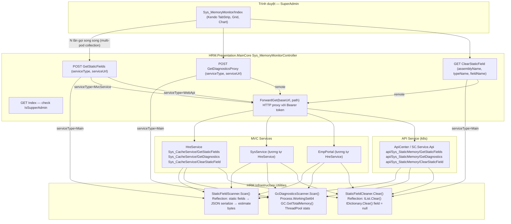

# Architecture — Sys_MemoryMonitor (Giám sát Bộ nhớ Runtime)

> **Loại**: System — Internal Tooling / Observability  
> **Stack**: ASP.NET Core MVC (.NET 8) + Kendo UI + jQuery  
> **Quyền truy cập**: Chỉ SuperAdmin  
> **Mục đích**: Theo dõi static fields chiếm RAM, phát hiện memory leak, thu thập GC diagnostics, và xóa field từ xa trên môi trường production/k8s multi-pod.

---

## Tổng quan

Hệ thống HRM chạy nhiều service trên nhiều pod (k8s) hoặc máy chủ riêng lẻ. Static fields — đặc biệt là `List<T>`, `Dictionary<K,V>`, cache tĩnh — tích lũy theo thời gian và chiếm RAM mà không bị GC thu hồi. `Sys_MemoryMonitor` là công cụ nội bộ dành riêng cho SuperAdmin để:

1. **Quét toàn bộ static fields** trong các assembly HRM đang chạy, ước tính kích thước bằng JSON serialization
2. **Thu thập GC diagnostics** chi tiết (Working Set, Managed Heap, GC generations, ThreadPool)
3. **So sánh snapshot** trước/sau để phát hiện field tăng trưởng bất thường (memory leak)
4. **Xóa field từ xa** — set null hoặc gọi `.Clear()` để giải phóng RAM ngay lập tức
5. **Multi-pod aware** — gọi nhiều lần qua Load Balancer để thu thập dữ liệu từ nhiều instance khác nhau

![[Pasted image 20260520164615.png]]
![[Pasted image 20260520164630.png]]
![[Pasted image 20260520164641.png]]
![[Pasted image 20260520164650.png]]


---

## Sơ đồ kiến trúc tổng thể



---

## Các thành phần kỹ thuật

### 1. `StaticFieldScanner` — Quét static fields

**File**: `HRM.Infrastructure.Utilities/StaticFieldScanner.cs`

**Cách hoạt động:**
- Duyệt `AppDomain.CurrentDomain.GetAssemblies()`, lọc chỉ assembly có prefix `HRM.`
- Với mỗi type, dùng Reflection lấy tất cả `static` fields (public + non-public), bỏ qua `const` (IsLiteral) và compiler-generated fields (tên bắt đầu `<`)
- **Ước tính kích thước**: serialize value sang JSON bằng `Newtonsoft.Json` với `MaxDepth=3`, `ReferenceLoopHandling=Ignore` → đếm UTF-8 bytes → `EstimatedSizeBytes`
- **ItemCount**: nếu value implement `ICollection` → `.Count`; nếu `IEnumerable` (trừ string) → `.Cast<object>().Count()`
- **ValuePreview**: 300 ký tự đầu của JSON (truncate + `...`)
- **Bảo mật**: Field/type chứa keyword nhạy cảm (`password`, `token`, `connectionstring`, `apikey`...) → `ValuePreview = "[REDACTED]"`, không serialize value thật
- **PodId**: `HOSTNAME` env var (k8s tự set theo pod name) → fallback `POD_NAME` → fallback `MachineName`
- **Kết quả**: `ScanResult { PodId, ProjectName, ScannedAt, Fields[] }` — Fields đã sort theo `EstimatedSizeBytes DESC`

**Model `StaticFieldInfo`:**

| Field | Kiểu | Mô tả |
|-------|------|-------|
| `Assembly` | string | Tên assembly ngắn (ví dụ: `HRM.Business.Attendance`) |
| `TypeName` | string | Full type name (ví dụ: `HRM.Business.Attendance.Cache.AttCache`) |
| `FieldName` | string | Tên field |
| `FieldType` | string | Kiểu dữ liệu (ví dụ: `List\`1`, `Dictionary\`2`) |
| `IsNull` | bool | Value hiện tại là null |
| `IsReadOnly` | bool | Field có `readonly` modifier |
| `IsPublic` | bool | Field là public |
| `ItemCount` | int? | Số phần tử nếu là collection |
| `EstimatedSizeBytes` | long | Ước tính bytes qua JSON serialization |
| `ValuePreview` | string | 300 ký tự đầu của JSON (hoặc `[REDACTED]`) |

**Lưu ý quan trọng — độ chính xác ước tính:**
- Số bytes là **ước tính**, không phải kích thước thật trong managed heap
- JSON serialization bỏ qua circular reference, null values, depth > 3 → con số thực tế có thể lớn hơn
- Dùng để **so sánh tương đối** và phát hiện field bất thường, không dùng để tính tổng RAM chính xác

---

### 2. `GcDiagnosticsScanner` — GC & RAM diagnostics

**File**: `HRM.Infrastructure.Utilities/GcDiagnosticsScanner.cs`

**Cách hoạt động:**
- Lấy `Process.GetCurrentProcess()` → `Refresh()` để đảm bảo data mới nhất
- Thu thập toàn bộ metrics qua .NET API chuẩn
- Gọi `BuildAnalysis()` để tạo danh sách `DiagnosticHint` với ngưỡng cảnh báo định sẵn

**Metrics thu thập:**

| Metric | Nguồn | Ý nghĩa |
|--------|-------|---------|
| `WorkingSetBytes` | `proc.WorkingSet64` | RAM thực tế OS cấp — số quan trọng nhất để theo dõi |
| `ManagedHeapBytes` | `GC.GetTotalMemory(false)` | RAM do .NET GC quản lý (objects, collections, strings) |
| `NonManagedEstimateBytes` | `WorkingSet - Managed` | Ước tính JIT code + CLR + native libs (bình thường 200–500 MB) |
| `PrivateMemoryBytes` | `proc.PrivateMemorySize64` | RAM riêng không chia sẻ với process khác |
| `PeakWorkingSetBytes` | `proc.PeakWorkingSet64` | RAM cao nhất kể từ khi khởi động |
| `GcGen0Collections` | `GC.CollectionCount(0)` | Số lần GC gen0 — object ngắn hạn, chạy nhiều = bình thường |
| `GcGen1Collections` | `GC.CollectionCount(1)` | Số lần GC gen1 — object trung gian |
| `GcGen2Collections` | `GC.CollectionCount(2)` | Số lần GC gen2 — object sống lâu (static, cache, singleton) |
| `ProcessThreadCount` | `proc.Threads.Count` | Tổng số thread của process |
| `ThreadPoolWorkerUsed` | `workerMax - workerAvail` | Thread đang xử lý request/task |
| `ThreadPoolWorkerMax` | `ThreadPool.GetMaxThreads()` | Tổng thread pool tối đa |
| `ProcessUptimeSeconds` | `DateTime.UtcNow - proc.StartTime` | Thời gian process đã chạy |
| `CpuTotalMs` | `proc.TotalProcessorTime` | Tổng CPU time tiêu thụ |

**Ngưỡng cảnh báo tự động (`BuildAnalysis`):**

| Điều kiện | Level | Category |
|-----------|-------|---------|
| Managed Heap > 500 MB | `warn` | Managed Heap |
| NonManaged > 800 MB | `warn` | Non-Managed RAM |
| GC Gen2 > 50 lần | `warn` | GC Pressure |
| ProcessThreadCount > 100 | `warn` | Threads |
| Uptime < 5 phút | `info` | Uptime |
| Không có vấn đề | `ok` | Overall |

**Lưu ý NET8:** `AspNetCacheItemCount` và `AspNetCacheSizeEstimateBytes` luôn = 0 vì `HttpRuntime.Cache` không tồn tại trong .NET 8. Nếu cần monitor `IMemoryCache`, phải inject `IMemoryCache` và đọc riêng.

---

### 3. `StaticFieldCleaner` — Xóa field từ xa

**File**: `HRM.Infrastructure.Utilities/StaticFieldCleaner.cs`

**Input**: `assemblyName` + `typeName` + `fieldName` (khớp với data từ Scanner)

**Logic xóa theo thứ tự ưu tiên:**

```
1. Tìm Assembly trong AppDomain theo assemblyName
2. Tìm Type theo typeName (FullName hoặc Name)
3. Tìm Field (static, public + non-public)
4. Kiểm tra IsLiteral → từ chối nếu là const
5. Lấy value hiện tại:
   - Nếu IList       → asList.Clear()    [xóa in-place, giữ reference]
   - Nếu IDictionary → asDict.Clear()    [xóa in-place, giữ reference]
   - Nếu IsReadOnly  → từ chối           [không set null được an toàn]
   - Còn lại:
     - ValueType     → Activator.CreateInstance(T)  [set default(T)]
     - Reference     → null
6. Trả về ClearFieldResult { Success, FieldName, Message }
```

**Tại sao dùng `.Clear()` thay vì `= null` cho collection?**
- Collection thường có nhiều nơi hold reference → set null chỉ xóa reference trong field đó, không giải phóng được
- `.Clear()` xóa hết phần tử, GC có thể collect từng element → hiệu quả hơn ngay lập tức
- Giữ nguyên reference → code khác không bị `NullReferenceException` bất ngờ

**Sau khi xóa (controller side):** Background thread chạy:
```csharp
Thread.Sleep(200);
GC.Collect(2, GCCollectionMode.Forced);
GC.WaitForPendingFinalizers();
GC.Collect(2, GCCollectionMode.Forced);
```
Delay 200ms để đảm bảo tất cả thread đang dùng field kịp hoàn thành, rồi ép GC full collection.

---

### 4. `Sys_MemoryMonitorController` — Proxy trung tâm

**File**: `Presentation/HRM.Presentation.MainCore/Controllers/Sys_MemoryMonitorController.cs`

**Vai trò**: Điểm vào duy nhất từ UI. Nhận request từ browser, quyết định xử lý local hoặc forward HTTP đến service remote.

**Actions:**

| Action | Method | Auth | Mô tả |
|--------|--------|------|-------|
| `Index` | GET | IsSupperAdmin | Trả về view Index |
| `Help` | GET | Public | Trả về view Help |
| `GetStaticFields` | POST | NoAuthLogin* | Scan/proxy static fields |
| `GetDiagnosticsProxy` | POST | NoAuthLogin* | Scan/proxy GC diagnostics |
| `ClearStaticField` | GET | NoAuthLogin* + IsSupperAdmin | Xóa field (check SuperAdmin trong code) |

*`[NoAuthLoginAttribute]`: bỏ qua session login check, cho phép service gọi nội bộ. Tuy nhiên `ClearStaticField` vẫn check `IsSupperAdmin` trong code.

**Routing logic `GetStaticFields`:**
```
serviceType == "Main" (hoặc empty)
  → StaticFieldScanner.Scan("HRM.Presentation.MainCore") [local]

serviceType == "HreService" | "SysService" | "EmpPortal"
  → ForwardGet(GetServiceUrl(serviceType), "Sys_CacheService/GetStaticFields")

serviceType == "ApiCenter"
  → ForwardGet(url, "api/Sys_StaticMemory/GetStaticFields")
```

**`ForwardGet` — HTTP proxy:**
- Tạo `HttpClient` mới mỗi lần (không dùng `IHttpClientFactory` — TODO cần cải thiện)
- Timeout: 30 giây
- Auth propagation theo thứ tự ưu tiên:
  1. `Authorization` header từ request hiện tại (Bearer token nếu client đã có)
  2. `access_token` từ `Session[SessionObjects.UserToken]` (sau SSO login)

**Config URLs (AppSettings):**
```
Hrm_Hre_Service    → URL của HreService
Hrm_Sys_Service    → URL của SysService
Hrm_EmpPortal_Web  → URL của EmpPortal
Hrm_APICenter_Web  → URL của ApiCenter
```
ApiCenter có thể không có trong config → user nhập thủ công → lưu `localStorage["memmon_url_SCServiceApi"]`

---

## Luồng hoạt động chi tiết

### Luồng 1: Load dữ liệu (Multi-pod collection)

```
1. User chọn Service + nhập "Số lần gọi" (mặc định 3, tối đa 50)
2. UI click btnLoad → loadAllPods()
3. Tính maxAttempts = podCount × 4 (để đủ cơ hội gặp đủ pod)
4. Concurrency = min(podCount, 5) — tối đa 5 request song song
5. Mỗi request: POST /Sys_MemoryMonitor/GetStaticFields {serviceUrl, serviceType}
6. Response chứa PodId (hostname của pod đã xử lý)
7. Nếu PodId chưa có trong allPodResults → lưu, tạo tab pod
8. Lặp lại cho đến khi đủ podCount pod hoặc hết maxAttempts
9. Tự động activate pod đầu tiên tìm được
```

**Tại sao gọi nhiều lần?**  
Môi trường k8s với Load Balancer — mỗi request có thể được route đến pod khác nhau. Gọi N lần với xác suất cao thu được N pod khác nhau. `PodId = HOSTNAME` (env var k8s tự inject) giúp phân biệt từng pod.

### Luồng 2: Snapshot & So sánh

```
1. Load dữ liệu lần 1 → xem baseline
2. btnSnapshot → lưu allPodResults hiện tại vào snapshotData
3. Chờ một khoảng thời gian (vài phút đến vài giờ)
4. btnCompare → Load lại dữ liệu
5. activatePod() tính delta = current.EstimatedSizeBytes - snapshot.EstimatedSizeBytes
   - delta > 0 → delta-up (đỏ): field đang tăng trưởng
   - delta < 0 → delta-down (xanh): field đang giảm
   - delta = 0 AND size ≥ 100KB → "stale?" (xám): không thay đổi sau snapshot
   - field mới xuất hiện → [NEW] (tím)
6. filterStale → lọc chỉ hiện field stale (potential leak)
```

### Luồng 3: Xóa field

```
1. Click row trên Grid → detail panel mở
2. Hiển thị FieldName, TypeName, FieldType, ValuePreview
3. Nếu field không null và EstimatedSizeBytes > 0 → hiện btnClearField
4. Click btnClearField → confirm dialog (cảnh báo rõ: chỉ ảnh hưởng pod hiện tại)
5. POST /Sys_MemoryMonitor/ClearStaticField {serviceUrl, serviceType, assemblyName, typeName, fieldName}
6. Controller check IsSupperAdmin → Forward/Local clear
7. Nếu thành công → GC.Collect(2) nền
8. Sau 600ms → tự động reload GetStaticFields để xác nhận
```

---

## Giao diện người dùng (UI)

### Toolbar & Controls

| Control | Chức năng |
|---------|-----------|
| `ddlService` | Chọn service cần giám sát (5 service) |
| `txtPodCount` | Số lần gọi để thu thập pod (1–50, mặc định 3) |
| `txtSearch` | Tìm kiếm theo Assembly / FieldName / Type |
| `filterNonNull` | Toggle chỉ hiện field không null |
| `filterStale` | Toggle chỉ hiện field stale (xuất hiện sau Snapshot) |
| `lblTotal` | Tổng ước tính RAM của pod đang xem |
| `lblCount` | Số fields của pod đang xem |
| `lblPod` | PodId đang active |
| `lblProgress` | Tiến trình thu thập pod |
| `snapshotInfo` | Thời điểm chụp snapshot gần nhất |

### 4 Tab nội dung

**Tab 1 — Bảng dữ liệu (Kendo Grid)**
- Columns: Assembly/Class, Field (access modifier + name + type), Items, Size (est.)
- Sortable, resizable, selectable row
- PageSize = 500 (không phân trang thật, hiển thị hết)
- Click row → mở detail panel (Kendo Splitter): field info + ValuePreview + btnClearField
- Color coding size: đỏ > 5MB, cam > 512KB, xanh ≤ 512KB
- Delta indicators: ▲ tăng (đỏ), ▼ giảm (xanh), ≈ stale (xám), [NEW] (tím)

**Tab 2 — Biểu đồ Top 20 (Kendo Chart)**
- Bar chart ngang, top 20 fields lớn nhất của pod active
- Toggle: hiển thị so sánh Snapshot (2 bar: trước/sau)
- Toggle: Log scale (khi 1 field quá lớn che các field nhỏ)
- Pannable (kéo) + Zoomable (scroll chuột)

**Tab 3 — GC Diagnostics**
- Load data qua `POST /Sys_MemoryMonitor/GetDiagnosticsProxy`
- Hiển thị bảng RAM, GC Collections, Threads, IMemoryCache
- Phần phân tích tự động (`Analysis` hints) với màu theo level: ok=xanh, info=xanh dương, warn=cam, critical=đỏ

**Tab 4 — Tổng hợp máy chủ**
- Bảng tất cả pod đã thu thập: PodId, Tổng RAM, Non-null count, Top 3 fields
- Sort theo tổng RAM DESC → pod nặng nhất lên đầu
- Click row → switch Tab 1 + activate pod đó

### Pod Tabs
- Dải tab phía trên Grid, mỗi tab = 1 pod đã tìm được
- Click pod tab → Grid/Chart hiển thị data của pod đó
- Tab màu đỏ = pod có lỗi khi collect

---

## Bảo mật & Phân quyền

| Điểm | Cơ chế |
|------|--------|
| Truy cập trang | `Index` check `IsSupperAdmin` → `UnauthorizedResult` |
| Xóa field (server) | `ClearStaticField` check `IsSupperAdmin` trả JSON `Access denied` |
| Xóa field (UI) | Confirm dialog với thông tin rõ ràng về tác động |
| Internal API | `[NoAuthLoginAttribute]` — service gọi nhau nội bộ không cần session |
| Auth forward | Bearer token propagation (session hoặc header) khi forward HTTP |
| Sensitive data | Field/type chứa keyword nhạy cảm → `[REDACTED]`, không serialize value |

---

## Export Report

- `btnExport` → generate JSON blob, download file `hrm-memory-report-<timestamp>.json`
- Chỉ export field **không null** và `EstimatedSizeBytes > 0`
- Sort theo size DESC trong mỗi pod
- Bao gồm: `exportedAt`, `service`, `pods[]` (mỗi pod có `podId`, `projectName`, `collectedAt`, `totalBytes`, `fieldCount`, `fields[]`, `diagnostics`)

---

## Hạn chế kỹ thuật & TODO

| Hạn chế | Chi tiết |
|---------|---------|
| `new HttpClient()` mỗi lần | `ForwardGet` tạo mới thay vì dùng `IHttpClientFactory` — socket exhaustion risk khi gọi nhiều |
| Ước tính size không chính xác | JSON serialize depth=3, bỏ circular ref → số thực tế có thể lớn hơn nhiều |
| `AspNetCacheItemCount` luôn = 0 | NET8 không có `HttpRuntime.Cache` — cần inject `IMemoryCache` để đo thật |
| Pod discovery không guaranteed | N lần gọi qua LB → xác suất thống kê, không đảm bảo gặp đủ tất cả pod |
| GC.Collect forced | Ảnh hưởng performance nhất thời sau khi Clear — nên tránh dùng trong giờ cao điểm |
| Reflection GetValue | Với field phức tạp hoặc đang được ghi đồng thời → có thể race condition |

---

## Checklist sử dụng khi RAM cao

```
□ 1. Mở Sys_MemoryMonitor/Index
□ 2. Chọn service đang nghi ngờ, đặt podCount phù hợp
□ 3. Load → ghi nhận lblTotal và top fields trong Grid
□ 4. filterNonNull để bỏ null, sort theo Size DESC
□ 5. Kiểm tra Tab GC Diagnostics: xem Working Set, Gen2 count, ThreadPool
□ 6. Nếu cần so sánh: btnSnapshot → chờ → btnCompare → filterStale
□ 7. Field nào stale + size > 1MB và là collection → có thể xóa an toàn
□ 8. Trước khi xóa: đọc TypeName để hiểu field dùng cho gì
□ 9. Xóa → chờ reload tự động → xác nhận size giảm
□ 10. Export report để lưu lại bằng chứng
```

---

## Liên kết code

- `Main/Source/Infrastructure/HRM.Infrastructure.Utilities/StaticFieldScanner.cs`
- `Main/Source/Infrastructure/HRM.Infrastructure.Utilities/GcDiagnosticsScanner.cs`
- `Main/Source/Infrastructure/HRM.Infrastructure.Utilities/StaticFieldCleaner.cs`
- `Main/Source/Presentation/HRM.Presentation.MainCore/Controllers/Sys_MemoryMonitorController.cs`
- `Main/Source/Presentation/HRM.Presentation.MainCore/Views/Sys_MemoryMonitor/Index.cshtml`
- `Main/Source/Presentation/HRM.Presentation.MainCore/Views/Sys_MemoryMonitor/Help.cshtml`
