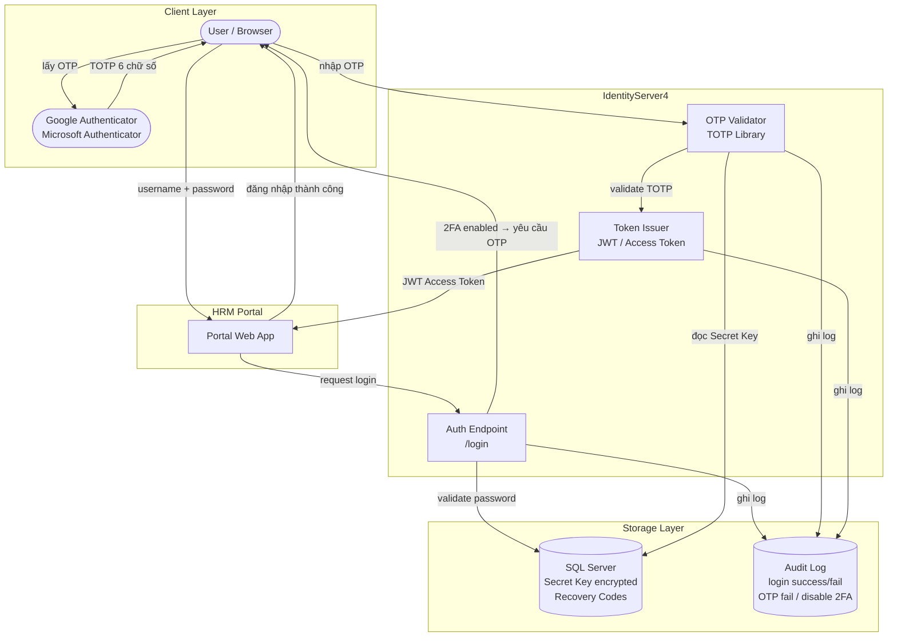

# Architecture — 2FA trên IdentityServer4

> **Phạm vi**: Kiến trúc component và bảo mật kỹ thuật giải pháp 2FA  
> **Nguồn**: [[wiki/sources/2fa-ids4-solution]]

---

## Mô hình component



---

## Cơ chế TOTP

| Thuộc tính | Giá trị |
|---|---|
| Chuẩn | TOTP — Time-based One-Time Password (RFC 6238) |
| Thuật toán | HMAC-SHA1 |
| Chu kỳ mã | 30 giây |
| Độ dài mã | 6 chữ số |
| Clock Drift | ±30–60s (server chấp nhận mã lân cận) |
| Secret Key | Lưu DB dạng encrypted |

---

## Cấu trúc bảo mật 2 yếu tố

```
Factor 1 — Something you know
  └── Password (xác thực qua VnrDecrypt / LDAP)

Factor 2 — Something you have
  └── OTP từ Google Authenticator (TOTP algorithm)
       └── Sinh từ Secret Key + timestamp hiện tại
```

---

## Recovery Code

```
Đặc điểm:
  - Sinh ra khi kích hoạt 2FA thành công
  - Số lượng: N mã (configurable)
  - Mỗi mã dùng 1 lần → tự vô hiệu hóa sau khi dùng
  - Không hiển thị lại sau lần đầu
  - Lưu DB dạng hashed

Dùng khi:
  - Mất điện thoại
  - Không truy cập được app Authenticator

Khuyến nghị:
  - Lưu offline (encrypted file / password manager)
  - Không chia sẻ
  - Regenerate ngay nếu nghi ngờ lộ
```

---

## Backend Security Components

| Thành phần | Mô tả | Mục đích |
|---|---|---|
| Secret Key | Lưu DB encrypted per-user | Seed cho TOTP generator |
| TOTP Library | Server-side OTP validation | Tính toán và so khớp OTP |
| Clock Drift | ±30–60s tolerance | Chấp nhận lệch giờ nhỏ giữa server và thiết bị |
| Rate Limit | Giới hạn số lần nhập OTP sai | Chống brute force |
| Audit Log | Ghi login success/fail, OTP fail, disable 2FA | Truy vết sự cố |
| NTP Sync | Đồng bộ giờ server | Tránh OTP luôn invalid do lệch giờ |

---

## Token Flow sau xác thực thành công

```
User xác thực xong (password + OTP)
  └── IDS4 cấp Access Token (JWT)
       ├── Payload: user claims, scope, exp
       ├── KHÔNG chứa OTP
       └── Lifetime: configurable (thường 1h)

Portal nhận JWT → gửi Bearer token cho các API calls
```

---

## Điểm tích hợp với HRM-Auth-Architecture

```
HRM-Auth-Architecture có 3 mô hình auth:
  ├── Mô hình 1: Local Auth (VnrDecrypt)
  ├── Mô hình 2a: JWT SSO (HongNgoc)
  └── Mô hình 2b: Identity Server 4 (VnPay) ← 2FA được thêm vào đây

2FA chỉ áp dụng cho Mô hình 2b (IDS4):
  - IDS4 là điểm kiểm soát duy nhất
  - Sau khi validate password → IDS4 check "user có bật 2FA không?"
  - Nếu có → redirect sang step nhập OTP trước khi cấp token
```

---

## Khuyến nghị nâng cao (Enterprise)

```
Hiện tại:
  2FA tích hợp trực tiếp trong IDS4

Nâng cao:
  ┌─────────────────────────────────────────┐
  │           Auth Service riêng            │
  │  IDS4 → gọi Auth Service để validate OTP│
  │  Redis cache OTP attempt (TTL ngắn)     │
  │  Audit trail + alert real-time          │
  └─────────────────────────────────────────┘

Tích hợp thêm:
  - Push Authentication (approve login trên app)
  - Device Trust (ghi nhớ thiết bị đã tin tưởng)
  - Suspicious login detection
```

---

## Liên kết

- [[wiki/sources/2fa-ids4-solution]] — Tài liệu giải pháp đầy đủ
- [[wiki/architecture/HRM-Auth-Architecture]] — Kiến trúc xác thực HRM tổng quan
- [[wiki/flows/Flow-2FA-Login]] — Các flow đăng nhập và quản lý 2FA
- [[wiki/concepts/HRM-Security-Config]] — Cấu hình bảo mật HRM
- [[wiki/architecture/SaaS-MultiTenant-Architecture]] — IDS4 trong kiến trúc SaaS multi-tenant
