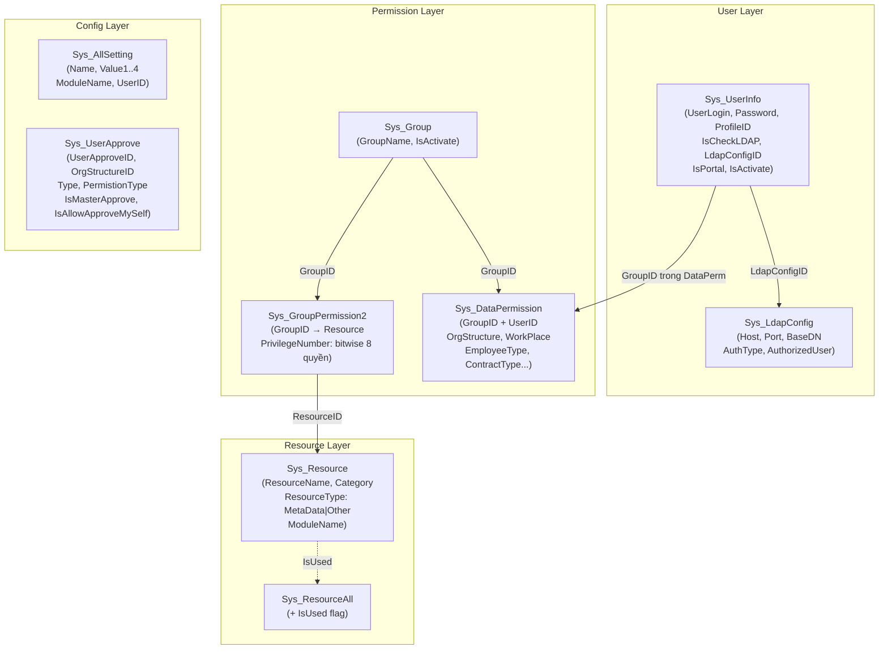

# HRM SYS — Database Schema

Schema 8 bảng cốt lõi của Module Hệ Thống (SYS), VnResource HRM Pro 8.

---

## Sơ đồ quan hệ

---

## Chi tiết bảng

### Sys_UserInfo
Bảng user chính — lưu thông tin đăng nhập và kết nối LDAP.

| Field | Type | Ghi chú |
|-------|------|---------|
| UserInfoName | NVARCHAR(100) | NOT NULL |
| UserLogin | NVARCHAR(50) | Tên đăng nhập |
| Password | VARCHAR(100) | |
| FullName | NVARCHAR(200) | |
| OrgStructureID | Uniqueidentifier | FK → Cat_OrgStructure |
| ProfileID | Uniqueidentifier | FK → Hre_Profile |
| IsActivate | bit | NOT NULL |
| Email | Varchar(100) | Dùng cho reset password |
| IsCheckLDAP | bit | User LDAP hay không |
| LDAPDatasource | Varchar(1000) | Domain LDAP |
| LdapConfigID | Uniqueidentifier | FK → Sys_LdapConfig |
| IsPortal | bit | User portal (nhân viên tự phục vụ) |
| DateChangePasssword | DateTime | Ngày đổi password gần nhất |
| DatePasswordExpired | DateTime | Ngày hết hạn password |

> ⚠️ **Force reset toàn bộ user**: UPDATE `DateChangePasssword` + `DatePasswordExpired` về ngày quá khứ → toàn bộ user bị yêu cầu đổi password lần đăng nhập tiếp theo.

---

### Sys_Resource / Sys_ResourceAll
Danh sách tài nguyên (màn hình, nút, tab).

| Field | Type | Ghi chú |
|-------|------|---------|
| ResourceName | Nvarchar(100) | Tên resource: `Controller_Action` |
| Category | Nvarchar(100) | Tên Module |
| ResourceType | Nvarchar(50) | `MetaData` hoặc `Other` |
| ModuleName | Nvarchar(50) | Tên Module |
| IsUsed | Bit | Chỉ có trong ResourceAll |

**Quy tắc đặt tên resource:**
- Màn hình: `Cat_Bank_index` (Controller_Action)
- Nút: `Cat_DayOff_Index_btnAnalyzeCompensateHoliday` (Controller_Action_IDButton)
- Tab: `InfoContactDetail` (ID HTML của tab)

---

### Sys_Group / Sys_GroupPermission2
Nhóm quyền và quyền chức năng theo tài nguyên.

**Sys_Group**: GroupName, Notes, IsActivate

**Sys_GroupPermission2**:

| Field | Type | Ghi chú |
|-------|------|---------|
| GroupID | Uniqueidentifier | FK → Sys_Group |
| ResourceID | Uniqueidentifier | FK → Sys_Resource |
| PrivilegeNumber | int | **Bitwise**: View \| Create \| Edit \| Delete \| Export \| Import \| Create Template \| Change Column |

---

### Sys_DataPermission
Phân quyền **dữ liệu** nhân viên cho từng user theo nhiều chiều.

| Field | Type | Ghi chú |
|-------|------|---------|
| GroupID | Uniqueidentifier | FK → Sys_Group (NOT NULL) |
| UserID | Uniqueidentifier | FK → Sys_UserInfo (NOT NULL) |
| OrgStructure | varchar(8000) | Danh sách orderNumber phòng ban (chuỗi) |
| Branches | Image | orderNumber đã mã hóa thành byte |
| WorkPlace | Varchar(4000) | Nơi làm việc |
| EmployeeType | Varchar(4000) | Loại nhân viên |
| Position | Varchar(4000) | Vị trí |
| SalaryClass | Varchar(4000) | Bậc lương |
| GradePayroll / GradeAttendance | Varchar(4000) | Bậc lương / Bậc công |
| PayrollGroup | Varchar(4000) | Nhóm lương |
| ContractType | Varchar(4000) | Loại hợp đồng |
| IsNotCheckPermisstion | bit | Bypass phân quyền dữ liệu |

---

### Sys_AllSetting
Cấu hình hệ thống theo module và user.

| Field | Type |
|-------|------|
| Name | Nvarchar(150) |
| Value1..4 | Nvarchar(500/150/4000/4000) |
| ModuleName | Nvarchar(150) |
| UserID | Uniqueidentifier |

---

### Sys_UserApprove
Cấu hình phê duyệt theo user và phòng ban.

| Field | Ghi chú |
|-------|---------|
| UserApproveID | FK → Sys_UserInfo — người phê duyệt |
| UserRequestID | FK → Sys_UserInfo — người được phê duyệt |
| OrgStructureID | FK → Cat_OrgStructure |
| Type | Loại phê duyệt |
| PermistionType | Loại quyền phê duyệt |
| IsMasterApprove | bit — người phê duyệt chính |
| IsAllowApproveMySelf | bit — cho phép tự phê duyệt |
| IsNoGetMail | bit — không nhận mail thông báo |

---

## Liên kết

- [[wiki/architecture/HRM-Auth-Architecture]] — Kiến trúc auth tổng thể
- [[wiki/flows/Flow-PhanQuyen-HeThong]] — Quy trình phân quyền thực tế
- [[wiki/sources/Sys-TaiLieuHeThong-01]] — Tài liệu gốc
