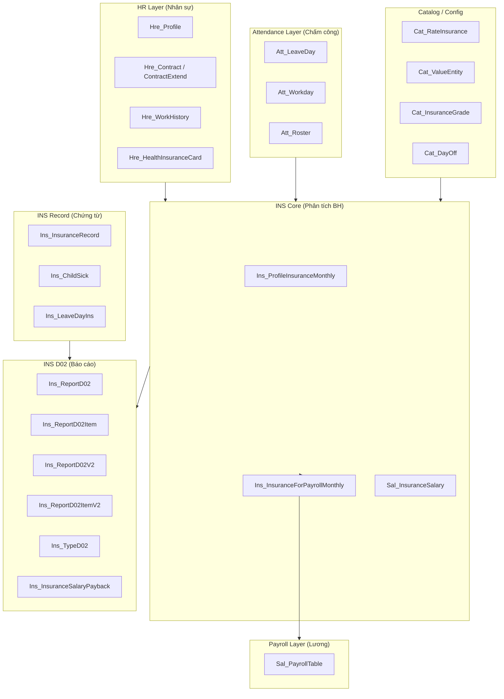

# INS — Database Schema (Kiến trúc dữ liệu phân hệ BH)

> Nguồn: [[wiki/sources/INS-TaiLieuBaoHiem-01]] — HRM Pro v8.0.1.x

---

## Sơ đồ các nhóm bảng chính

---

## Bảng trung tâm: `Ins_ProfileInsuranceMonthly`

Kết quả phân tích BH từng tháng cho từng nhân viên. **Đây là bảng quan trọng nhất** — module Lương đọc từ đây để tính khấu trừ.

| Field quan trọng | Kiểu | Ý nghĩa |
|----------------|------|---------|
| `ProfileID` | GUID | FK → Hre_Profile |
| `MonthYear` | DateTime | Tháng phân tích |
| `IsSocialInsurance` | bit | Có đóng BHXH |
| `IsHealthInsurance` | bit | Có đóng BHYT |
| `IsUnEmpInsurance` | bit | Có đóng BHTN |
| `IsDecreaseWorkingDays` | bit | Nghỉ ≥ 14 ngày |
| `IsPregnant` | bit | Thai sản |
| `IsQuit` | bit | Đã nghỉ việc |
| `SalaryInsurance` | float | Lương BHXH |
| `MoneySocialInsurance` | double | Tiền BHXH (tổng) |
| `SocialInsEmpAmount` | double | Tiền BHXH NV đóng |
| `SocialInsComAmount` | double | Tiền BHXH Cty đóng |
| `LeaveType14Days` | varchar | Loại nghỉ 14 ngày: E_14_LEAVE / E_14_UNPAID / E_14_SICK |
| `ReductionType` | varchar | E_QUIT / E_PREGNANT / E_14_SICK... |
| `Status` | varchar | E_CONFIRMED |

---

## Bảng `Cat_RateInsurance` — Tỉ lệ BH

| Field | Giá trị mặc định | Ý nghĩa |
|-------|-----------------|---------|
| `SocialInsEmpRate` | 8% | BHXH NLĐ đóng |
| `SocialInsCompRate` | 18% | BHXH NSDLĐ đóng |
| `HealthInsEmpRate` | 1.5% | BHYT NLĐ đóng |
| `HealthInsCompRate` | 3% | BHYT NSDLĐ đóng |
| `UnemployInsEmpRate` | 1% | BHTN NLĐ đóng |
| `UnemployInsCompRate` | 1% | BHTN NSDLĐ đóng |
| `SMCompRate` | — | Ốm đau, TS NSDLĐ đóng |
| `OADCompRate` | — | TNLĐ, BNN NSDLĐ |
| `PSCompRate` | — | Hưu trí, Tử tuất NSDLĐ |

---

## Bảng `Ins_InsuranceRecord` — Chứng từ BH

Lưu chứng từ ốm đau, thai sản, con ốm, nghỉ dưỡng sức...

| Enum quan trọng | Giá trị |
|----------------|---------|
| `InsuranceType` | E_SICK_SHORT, E_SICK_LONG, E_SICK_CHILD, E_PREGNANCY_SUCKLE, E_PREGNANCY_EXAMINE... |
| `TypeSuckle` | E_SUCKLE_USUALLY, E_SUCKLE_SURGERY, E_SUCKLE_TWINS |
| `Status` | E_CONFIRM, E_REJECT |
| `DocumentStatus` | E_TEMPSAVE, E_WAITINGCONFIRM, E_ATTACHFILEVALID, E_ORIGINFILEVALID |
| `IsPaymented` | bit — đã thanh toán hay chưa |

---

## Mapping V6 → V7 → V8

| V8 | V7 | V6 | Ghi chú |
|----|----|----|---------|
| `Ins_ProfileInsuranceMonthly` | `Ins_ProfileInsuranceMonthly` | *(không có)* | Bảng chính phân tích BH |
| `Ins_InsuranceForPayrollMonthly` | *(không có)* | *(không có)* | **Mới V8** — dùng cho lương |
| `Ins_InsuranceRecord` | `Hre_InsuranceRecord` | `Hre_InsuranceRecord` | Chứng từ BH |
| `Sal_InsuranceSalary` | `Sal_BasicSalary` | `Sal_BasicSalary` | Lương BHXH |
| ~~`Ins_InsuranceSalary`~~ | — | — | **Đã xóa** — không dùng nữa |
| ~~`Hre_InsuranceRecord`~~ | — | — | **Đã xóa** — đổi tên |

---

## Liên kết

- [[wiki/sources/INS-TaiLieuBaoHiem-01]] — nguồn gốc schema này
- [[wiki/flows/Flow-TinhLuong-Monthly]] — luồng tính lương đọc từ `Ins_InsuranceForPayrollMonthly`
- [[wiki/sources/INS-InsuranceMonthJoin]] — logic xác định tháng tham gia BH
- [[wiki/sources/INS-D02-ChungTu]] — biểu mẫu D02 và các bảng liên quan
