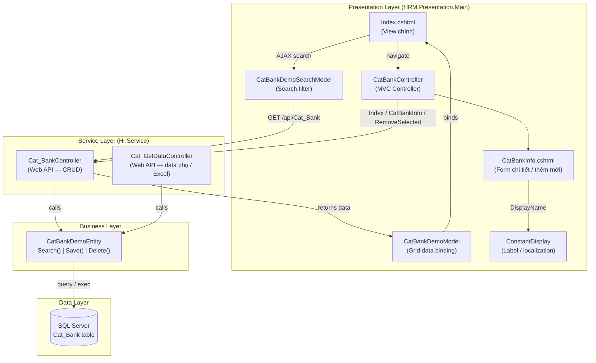

# Architecture — CatBank MVC (Màn hình danh mục mẫu)

> **Loại**: Module
> **Mô tả**: Kiến trúc 4 tầng của màn hình danh mục CatBank — dùng làm mẫu chuẩn đào tạo developer mới HRM.

---

## Sơ đồ

---

## Thành phần

| Component | Tầng | Vai trò | Công nghệ |
|-----------|------|---------|-----------|
| `Index.cshtml` | Presentation / View | Giao diện chính: tìm kiếm, xóa, mở form | Razor + Kendo Grid |
| `CatBankInfo.cshtml` | Presentation / View | Form chi tiết / thêm mới | Razor |
| `CatBankController` | Presentation / MVC | Điều phối View, gọi API xóa | ASP.NET MVC |
| `CatBankDemoSearchModel` | Model | Gom điều kiện filter | C# POCO |
| `CatBankDemoModel` | Model | Binding dữ liệu vào Grid, định nghĩa `FieldNames` | C# + `BaseViewModel` |
| `ConstantDisplay` | Cross-cutting | Hằng số label dùng với `[DisplayName]` | C# const |
| `Cat_BankController` | Service / Web API | `GetByID`, `POST`, `DeleteOrRemove` | Web API |
| `Cat_GetDataController` | Service / Web API | Data phụ, xuất Excel | Web API |
| `CatBankDemoEntity` | Business | `Search()`, `Save()`, `Delete()` | C# |
| SQL Server | Data | Lưu trữ `Cat_Bank` | T-SQL |

---

## Kết nối / Integration

- `Index.cshtml` → AJAX → `Cat_BankController` (search/delete)
- `CatBankController` (MVC) → HTTP → `Cat_BankController` (API) khi `RemoveSelected`
- `Cat_BankController` + `Cat_GetDataController` → `CatBankDemoEntity` → SQL Server
- `CatBankInfo.cshtml` dùng `ConstantDisplay` cho mọi label — không hard-code chuỗi

---

## Liên kết

- Chi tiết từng component: [[wiki/sources/p4m7x-catbank-search-structure]]
- Tổng quan đào tạo dev mới: [[wiki/sources/x7k2p-dao-tao-dev-moi-hrm-2025]]
- Kiến trúc hệ thống HRM tổng quan: [[wiki/architecture/HRM-System-Architecture]]
- Luồng đào tạo 3 module: [[wiki/flows/Flow-DaoTao-DevMoi-HRM]]
