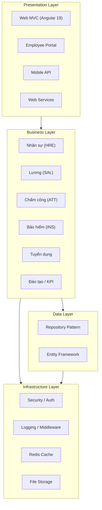
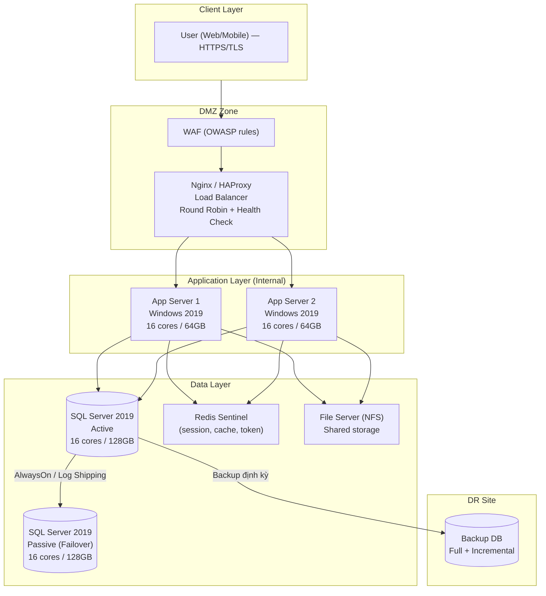
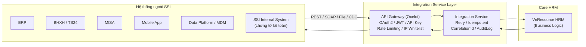

# Architecture — SSI Kiến trúc Giải pháp VnResource HRM Pro

> **Loại**: System + Integration + Infrastructure
> **Mô tả**: Kiến trúc tổng thể đề xuất trong hồ sơ thầu SSI — Chương 8 + 10; bao gồm 4 sub-architecture: Application, System, Integration, Database

---

## Sơ đồ — Application Architecture (4 tầng)



---

## Sơ đồ — System Architecture (Production)



---

## Sơ đồ — Integration Architecture



---

## Thành phần công nghệ

| Component | Công nghệ | Ghi chú |
|-----------|-----------|---------|
| Frontend | Angular 19 | Responsive, multi-browser |
| Backend | .NET 8 / ASP.NET Core | RESTful API, stateless |
| Legacy | .NET Framework 4.6.2 / ASP.NET MVC | HRM Main hiện tại |
| Database | SQL Server 2019 Standard+ | Active/Passive HA |
| Cache | Redis Sentinel | Session, token, lookup, config |
| API Gateway | Ocelot | Routing, LB, auth, logging |
| Auth | OAuth2 / OpenID Connect | SSO Azure AD, MFA |
| Load Balancer | Nginx / HAProxy | Round Robin, health check |
| WAF | WAF (OWASP rules) | XSS, SQLi, CSRF protection |
| Container | Docker / Kubernetes | Scale-out, rolling deploy |
| Monitoring | Prometheus + Grafana | Metrics, alerting |
| Logging | ELK / Graylog | Centralized, correlationId |
| Tracing | OpenTelemetry / Jaeger | Distributed tracing |
| CI/CD | Pipeline (SAST + Deploy) | DEV → UAT → PROD |
| File Storage | NFS + S3/Object Storage | Shared + long-term backup |

---

## URL Routing (Multi-tenant)

```
HRM Main:        https://{tenant}-main.vnrlocal.com/
Employee Portal: https://{tenant}-portal.vnrlocal.com/
HR Service:      https://{tenant}-hr.vnrlocal.com/
System Service:  https://{tenant}-sys.vnrlocal.com/
```

---

## Kết nối / Integration

- SSO: Azure AD / Microsoft Entra ID (OpenID Connect)
- Integration methods: REST API, SOAP/Web Service, File Exchange (CSV/JSON), CDC
- Dữ liệu đồng bộ: nhân viên, chấm công, lương, BH, KPI, master data
- Security: OAuth2 / JWT / API Key + Scope, IP Whitelist, Rate Limiting

---

## HA / DR specs

| Item | Spec |
|------|------|
| Availability target | 99.99% |
| DB HA | AlwaysOn AG hoặc Log Shipping/Mirroring |
| App HA | 2 node Active/Active, stateless, session trên Redis |
| Failover | LB health check → tự động route sang node còn lại |
| Backup | Full + Incremental, mã hóa at-rest |
| DR drill | Định kỳ, có bằng chứng |
| RTO/RPO | Được định nghĩa tại Ch.7.3 và Ch.7.4 |

---

## Liên kết

- [[wiki/projects/SSI-Project]] — Project page
- [[wiki/sources/x2p7k-thau-ssi-ho-so-tong-the]] — Hồ sơ thầu tổng thể
- [[wiki/sources/f8c4n-ssi-infrastructure-requirements]] — Hardware specs chi tiết
- [[wiki/sources/v7m2p-ssi-devops-requirements]] — CI/CD, DR, Monitoring
- [[wiki/architecture/HRM-System-Architecture]] — Kiến trúc HRM hiện tại
- [[wiki/architecture/SaaS-MultiTenant-Architecture]] — Multi-tenant K8s
- [[wiki/architecture/p9k2w-k8s-hrm-service-architecture]] — K8s service mesh
