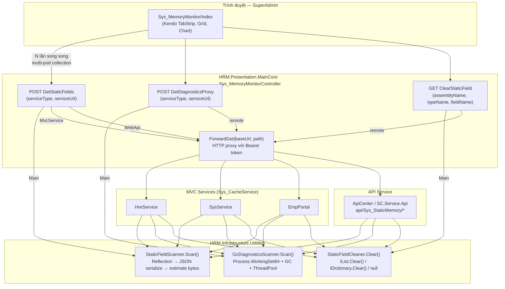

# Architecture — Sys_MemoryMonitor (Giám sát Bộ nhớ Runtime)

> **Loại**: System — Internal Tooling / Observability  
> **Stack**: ASP.NET Core MVC (.NET 8) + Kendo UI + jQuery  
> **Quyền truy cập**: Chỉ SuperAdmin  
> **Mục đích**: Theo dõi static fields chiếm RAM, phát hiện memory leak, thu thập GC diagnostics, và xóa field từ xa trên môi trường production/k8s multi-pod.

---

## Tổng quan

Hệ thống HRM chạy nhiều service trên nhiều pod (k8s) hoặc máy chủ riêng lẻ. Static fields — đặc biệt là `List<T>`, `Dictionary<K,V>`, cache tĩnh — tích lũy theo thời gian và chiếm RAM mà không bị GC thu hồi. `Sys_MemoryMonitor` là công cụ nội bộ dành riêng cho SuperAdmin để:

1. **Quét toàn bộ static fields** trong các assembly HRM đang chạy, ước tính kích thước bằng JSON serialization
2. **Thu thập GC diagnostics** chi tiết (Working Set, Managed Heap, GC generations, ThreadPool)
3. **So sánh snapshot** trước/sau để phát hiện field tăng trưởng bất thường (memory leak)
4. **Xóa field từ xa** — set null hoặc gọi `.Clear()` để giải phóng RAM ngay lập tức
5. **Multi-pod aware** — gọi nhiều lần qua Load Balancer để thu thập dữ liệu từ nhiều instance khác nhau

---

## Sơ đồ kiến trúc tổng thể



---

## Các thành phần kỹ thuật

### 1. `StaticFieldScanner` — Quét static fields

**File**: `HRM.Infrastructure.Utilities/StaticFieldScanner.cs`

**Cách hoạt động:**
- Duyệt `AppDomain.CurrentDomain.GetAssemblies()`, lọc chỉ assembly prefix `HRM.`
- Với mỗi type: Reflection lấy tất cả `static` fields (public + non-public), bỏ qua `const` và compiler-generated (tên bắt đầu `<`)
- **Ước tính kích thước**: serialize → JSON (`MaxDepth=3`, `ReferenceLoopHandling=Ignore`) → đếm UTF-8 bytes
- **ItemCount**: `ICollection.Count` hoặc `IEnumerable.Cast<object>().Count()`
- **ValuePreview**: 300 ký tự đầu JSON
- **Bảo mật**: keyword nhạy cảm (`password`, `token`, `connectionstring`, `apikey`...) → `[REDACTED]`
- **PodId**: `HOSTNAME` env var → `POD_NAME` → `MachineName`
- **Output**: `ScanResult { PodId, ProjectName, ScannedAt, Fields[] }` — sorted by `EstimatedSizeBytes DESC`

**Model `StaticFieldInfo`:**

| Field | Kiểu | Mô tả |
|-------|------|-------|
| `Assembly` | string | Tên assembly ngắn |
| `TypeName` | string | Full type name |
| `FieldName` | string | Tên field |
| `FieldType` | string | Kiểu dữ liệu |
| `IsNull` | bool | Value hiện tại là null |
| `IsReadOnly` | bool | Field có `readonly` modifier |
| `IsPublic` | bool | Field là public |
| `ItemCount` | int? | Số phần tử nếu là collection |
| `EstimatedSizeBytes` | long | Ước tính bytes qua JSON serialization |
| `ValuePreview` | string | 300 ký tự đầu JSON (hoặc `[REDACTED]`) |

> ⚠️ **Độ chính xác**: Đây là **ước tính** — JSON bỏ circular ref, null values, depth > 3. Dùng để so sánh tương đối, không dùng tính tổng RAM chính xác.

---

### 2. `GcDiagnosticsScanner` — GC & RAM diagnostics

**File**: `HRM.Infrastructure.Utilities/GcDiagnosticsScanner.cs`

**Metrics thu thập:**

| Metric | Nguồn | Ý nghĩa |
|--------|-------|---------|
| `WorkingSetBytes` | `proc.WorkingSet64` | RAM thực tế OS cấp — **số quan trọng nhất** |
| `ManagedHeapBytes` | `GC.GetTotalMemory(false)` | RAM .NET GC quản lý |
| `NonManagedEstimateBytes` | `WorkingSet - Managed` | JIT code + CLR + native libs (bình thường 200–500 MB) |
| `PrivateMemoryBytes` | `proc.PrivateMemorySize64` | RAM riêng không chia sẻ |
| `PeakWorkingSetBytes` | `proc.PeakWorkingSet64` | RAM cao nhất kể từ khởi động |
| `GcGen0Collections` | `GC.CollectionCount(0)` | Object ngắn hạn — chạy nhiều = bình thường |
| `GcGen1Collections` | `GC.CollectionCount(1)` | Object trung gian |
| `GcGen2Collections` | `GC.CollectionCount(2)` | Object sống lâu (static, cache, singleton) |
| `ProcessThreadCount` | `proc.Threads.Count` | Tổng số thread |
| `ThreadPoolWorkerUsed` | `workerMax - workerAvail` | Thread đang xử lý |
| `ThreadPoolWorkerMax` | `ThreadPool.GetMaxThreads()` | Thread pool tối đa |
| `ProcessUptimeSeconds` | `DateTime.UtcNow - proc.StartTime` | Uptime |
| `CpuTotalMs` | `proc.TotalProcessorTime` | Tổng CPU time |

**Ngưỡng cảnh báo tự động:**

| Điều kiện | Level | Category |
|-----------|-------|---------|
| Managed Heap > 500 MB | `warn` | Managed Heap |
| NonManaged > 800 MB | `warn` | Non-Managed RAM |
| GC Gen2 > 50 lần | `warn` | GC Pressure |
| ProcessThreadCount > 100 | `warn` | Threads |
| Uptime < 5 phút | `info` | Uptime |
| Không có vấn đề | `ok` | Overall |

> ⚠️ **NET8**: `AspNetCacheItemCount` luôn = 0 vì không có `HttpRuntime.Cache`. Cần inject `IMemoryCache` riêng để đo thật.

---

### 3. `StaticFieldCleaner` — Xóa field từ xa

**File**: `HRM.Infrastructure.Utilities/StaticFieldCleaner.cs`

**Logic xóa theo thứ tự ưu tiên:**

```
1. Tìm Assembly → Type → Field qua Reflection
2. Từ chối nếu IsLiteral (const)
3. Xử lý theo loại:
   IList       → asList.Clear()           [in-place, giữ reference]
   IDictionary → asDict.Clear()            [in-place, giữ reference]
   IsReadOnly  → từ chối                   [không an toàn]
   ValueType   → Activator.CreateInstance  [default(T)]
   Reference   → null
4. Trả về ClearFieldResult { Success, FieldName, Message }
```

**Tại sao `.Clear()` thay vì `= null`?**
- Giữ nguyên reference → không gây `NullReferenceException` cho code khác
- GC collect từng element → hiệu quả hơn ngay lập tức
- `= null` chỉ xóa reference trong field đó, không giải phóng nếu còn nơi khác hold

**Post-clear GC (controller):**
```csharp
Task.Run(() => {
    Thread.Sleep(200);
    GC.Collect(2, GCCollectionMode.Forced);
    GC.WaitForPendingFinalizers();
    GC.Collect(2, GCCollectionMode.Forced);
});
```

---

### 4. `Sys_MemoryMonitorController` — Proxy trung tâm

**Actions:**

| Action | Auth | Mô tả |
|--------|------|-------|
| `Index` | IsSupperAdmin | View Index |
| `Help` | Public | View Help |
| `GetStaticFields` | [NoAuthLogin] | Scan/proxy static fields |
| `GetDiagnosticsProxy` | [NoAuthLogin] | Scan/proxy GC diagnostics |
| `ClearStaticField` | [NoAuthLogin] + IsSupperAdmin check | Xóa field |

**Service URL config:**
```
Hrm_Hre_Service    → endpoint Sys_CacheService/GetStaticFields
Hrm_Sys_Service    → endpoint Sys_CacheService/GetStaticFields
Hrm_EmpPortal_Web  → endpoint Sys_CacheService/GetStaticFields
Hrm_APICenter_Web  → endpoint api/Sys_StaticMemory/GetStaticFields
```

ApiCenter không có config → user nhập URL thủ công → lưu `localStorage["memmon_url_SCServiceApi"]`

**`ForwardGet` auth propagation:**
1. `Authorization` header từ request gốc (Bearer)
2. `Session[UserToken]` (sau SSO login)
3. Timeout: 30 giây

> ⚠️ **Technical debt**: `new HttpClient()` mỗi lần — risk socket exhaustion. Cần migrate sang `IHttpClientFactory`.

---

## Luồng hoạt động chi tiết

### Luồng 1: Multi-pod collection

```
User chọn Service + podCount (mặc định 3)
→ loadAllPods(): maxAttempts = podCount × 4, concurrency = min(podCount, 5)
→ Mỗi lần: POST /GetStaticFields {serviceUrl, serviceType}
→ Response.PodId (HOSTNAME k8s) → phân biệt pod
→ allPodResults[podId] = data → tạo pod tab
→ Dừng khi đủ podCount pod hoặc hết maxAttempts
→ Auto-activate pod đầu tiên
```

**Lý do**: k8s LB route mỗi request đến pod khác nhau → gọi N lần ≈ N pod khác nhau.

### Luồng 2: Snapshot & So sánh

```
btnSnapshot → snapshotData = clone allPodResults (chỉ key fields)
[chờ N phút/giờ]
btnCompare → Load lại → tính delta:
  delta > 0   → ▲ đỏ (tăng)
  delta < 0   → ▼ xanh (giảm)
  delta = 0 AND size ≥ 100KB → ≈ stale? (xám — potential leak)
  field mới   → [NEW] tím
filterStale → lọc chỉ stale fields
```

### Luồng 3: Xóa field

```
Click row → detail panel → btnClearField (nếu !IsNull && size > 0)
→ Confirm dialog (thông báo chỉ ảnh hưởng pod hiện tại)
→ POST /ClearStaticField {assemblyName, typeName, fieldName}
→ Controller: IsSupperAdmin check → Clear() / null
→ GC.Collect(2) × 2 nền (delay 200ms)
→ Sau 600ms: auto reload GetStaticFields xác nhận
```

---

## Giao diện — 4 Tab

| Tab | Nội dung |
|-----|---------|
| **Bảng dữ liệu** | Kendo Grid: Assembly/Class, Field, Items, Size — detail panel + Clear |
| **Biểu đồ Top 20** | Kendo Chart bar ngang, so sánh snapshot, log scale |
| **GC Diagnostics** | RAM, GC Gen0/1/2, Threads, ThreadPool + Analysis hints |
| **Tổng hợp máy chủ** | So sánh tất cả pod, click drill-down |

**Color coding:**

| Ngưỡng | Màu |
|--------|-----|
| > 5 MB | Đỏ `size-critical` |
| > 512 KB | Cam `size-warn` |
| ≤ 512 KB | Xanh `size-ok` |

---

## Bảo mật

| Điểm | Cơ chế |
|------|--------|
| Truy cập trang | `IsSupperAdmin` → `UnauthorizedResult` |
| Xóa field | Double-check `IsSupperAdmin` trong code server |
| Internal forward | `[NoAuthLoginAttribute]` bypass session |
| Auth forward | Bearer token propagation |
| Sensitive data | `[REDACTED]` cho field/type chứa keyword nhạy cảm |

---

## Hạn chế kỹ thuật & TODO

| Hạn chế | Chi tiết |
|---------|---------|
| `new HttpClient()` mỗi lần | Socket exhaustion risk → migrate `IHttpClientFactory` |
| Size estimate không chính xác | JSON depth=3, bỏ circular ref → thực tế lớn hơn |
| `AspNetCacheItemCount` = 0 | NET8 không có `HttpRuntime.Cache` |
| Pod discovery không guaranteed | Xác suất thống kê, không đảm bảo đủ pod |
| GC.Collect forced | Ảnh hưởng perf nhất thời — tránh giờ cao điểm |
| Reflection race condition | Field đang ghi đồng thời khi GetValue |

---

## Checklist vận hành khi RAM cao

```
□ 1. Mở Sys_MemoryMonitor/Index
□ 2. Chọn service nghi ngờ, podCount phù hợp
□ 3. Load → xem lblTotal + top fields (sort Size DESC)
□ 4. filterNonNull để bỏ null
□ 5. Tab GC Diagnostics: Working Set, Gen2, ThreadPool
□ 6. Snapshot → chờ → Compare → filterStale
□ 7. Field stale + size > 1MB + collection → xóa an toàn
□ 8. Đọc TypeName trước khi xóa để hiểu field dùng cho gì
□ 9. Xóa → reload tự động → xác nhận size giảm
□ 10. Export report lưu bằng chứng
```

---

## Liên kết code

```
HRM.Infrastructure.Utilities/StaticFieldScanner.cs
HRM.Infrastructure.Utilities/GcDiagnosticsScanner.cs
HRM.Infrastructure.Utilities/StaticFieldCleaner.cs
Presentation/MainCore/Controllers/Sys_MemoryMonitorController.cs
Presentation/MainCore/Views/Sys_MemoryMonitor/Index.cshtml
Presentation/MainCore/Views/Sys_MemoryMonitor/Help.cshtml
```

## Liên kết wiki

- [[wiki/sources/mm9x--memory-monitor]] — trang source tóm tắt
- [[wiki/concepts/HRM-IIS-Troubleshooting]] — troubleshooting OutOfMemory IIS
- [[wiki/architecture/HRM-System-Architecture]] — kiến trúc tổng quan
- [[wiki/architecture/p9k2w-k8s-hrm-service-architecture]] — K8s services
