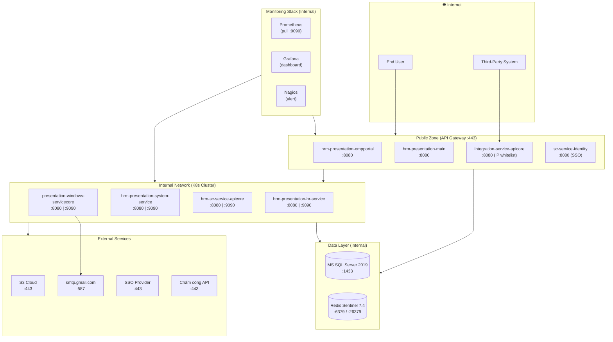
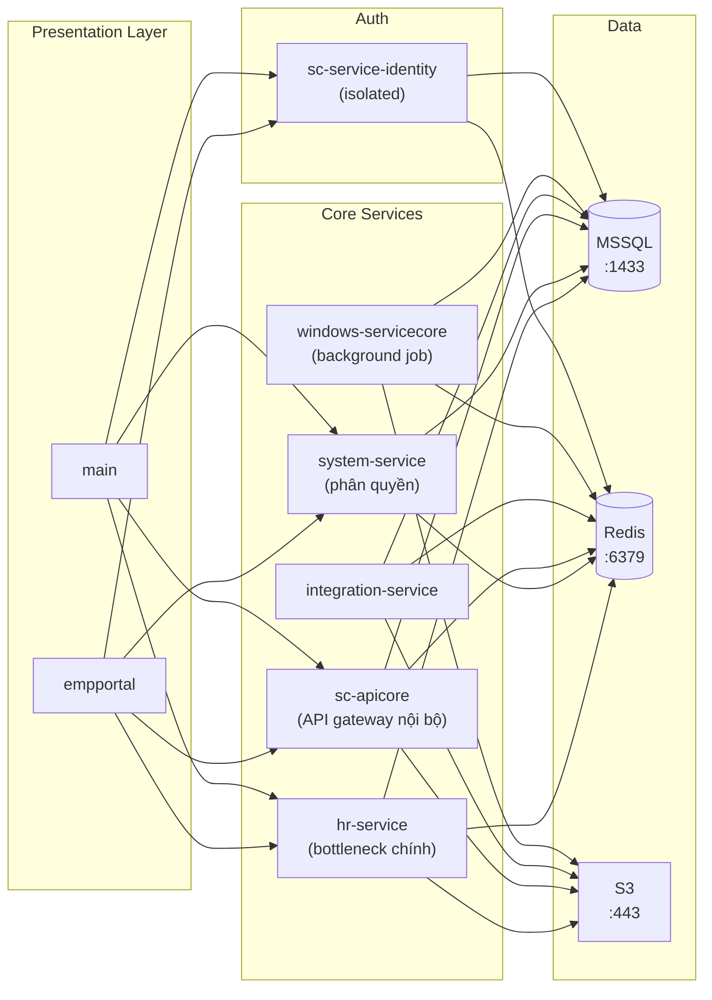

# Architecture — K8s HRM Service Architecture

> **Loại**: Infrastructure  
> **Mô tả**: Kiến trúc 8 service HRM chạy trên Kubernetes — 2 network zones, service mesh, VM sizing PROD, external dependencies

---

## Sơ đồ kiến trúc tổng thể

---

## Sơ đồ service mesh (kết nối nội bộ)

---

## Thành phần

| Component | Vai trò | Replicas PROD | CPU Limit | RAM Limit |
|-----------|--------|:---:|---------|---------|
| hrm-presentation-empportal | Giao diện nhân viên | 2 | 4 Core | 8 Gi |
| hrm-presentation-hr-service | Xử lý nghiệp vụ HR (bottleneck) | 6 | 4 Core | 8 Gi |
| hrm-presentation-system-service | Phân quyền hệ thống | 4 | 2 Core | 4 Gi |
| hrm-presentation-main | Giao diện quản trị HR | 6 | 2 Core | 8 Gi |
| hrm-sc-service-apicore | API gateway nội bộ | 6 | 4 Core | 8 Gi |
| integration-service-apicore | Tích hợp bên ngoài | 2 | 2 Core | 4 Gi |
| sc-service-identity | Auth / SSO (isolated) | 2 | 4 Core | 8 Gi |
| presentation-windows-servicecore | Background job / email | 1 | 2 Core | 4 Gi |
| **TỔNG** | | **29 pods** | **98 Core** | **220 Gi** |

> Tất cả: **.NET 8**, K8s **Deployment** (stateless), Port **8080** (service) / **9090** (metrics)

---

## VM Infrastructure

### UAT (VNR quản lý)
| Loại | Số server | CPU | RAM | SSD | Phần mềm |
|------|-----------|-----|-----|-----|---------|
| Database | 1 | 8 Core | 64 GB | 300 GB | MS SQL Server 2019 |
| Redis | 1 | 2 Core | 4 GB | 128 GB | Redis 7.4 |

### PROD (KH quản lý)
| Loại | OS | Số server | CPU | RAM | SSD | Phần mềm |
|------|-----|-----------|-----|-----|-----|---------|
| Database | RHEL 8.10 | 2 | 8 Core | 16 GB | 100 GB | MS SQL Server 2019 |
| Redis Sentinel | Ubuntu 24 | 3 | 8 Core | 32 GB | 150 GB | Redis 7.4 |

---

## Kết nối / Integration

### External dependencies

| Service | Domain | Port | Dùng bởi |
|---------|--------|------|---------|
| S3 Cloud | KH endpoint | 443 | Tất cả trừ identity |
| smtp.gmail.com | smtp.gmail.com | **587** | windows-servicecore only |
| SSO Provider | KH endpoint | 443 | identity, presentation |
| Chấm công API | KH xác nhận | 443 | integration-service |

### Network zones
- **Public Zone**: empportal, main, integration (IP whitelist), identity — qua API Gateway
- **Internal Network**: hr-service, system-service, apicore, windows-service, MSSQL, Redis
- **Monitoring**: Prometheus pull port 9090 (internal only — không expose Internet)

---

## Liên kết

- [[wiki/sources/p9k2w-deploy-k8s-hrm-planning]] — Tài liệu nguồn đầy đủ
- [[wiki/flows/m3t7x-flow-cicd-deploy-k8s]] — Luồng CI/CD build → deploy
- [[wiki/flows/r5n8q-flow-integration-thirdparty]] — Luồng third-party API call
- [[wiki/flows/v2k9m-flow-golive-k8s]] — Quy trình go-live PROD
- [[wiki/architecture/HRM-Deployment-Architecture]] — Kiến trúc deploy IIS + K8s tổng quan
- [[wiki/architecture/HRM-System-Architecture]] — Kiến trúc tổng quan HRM
