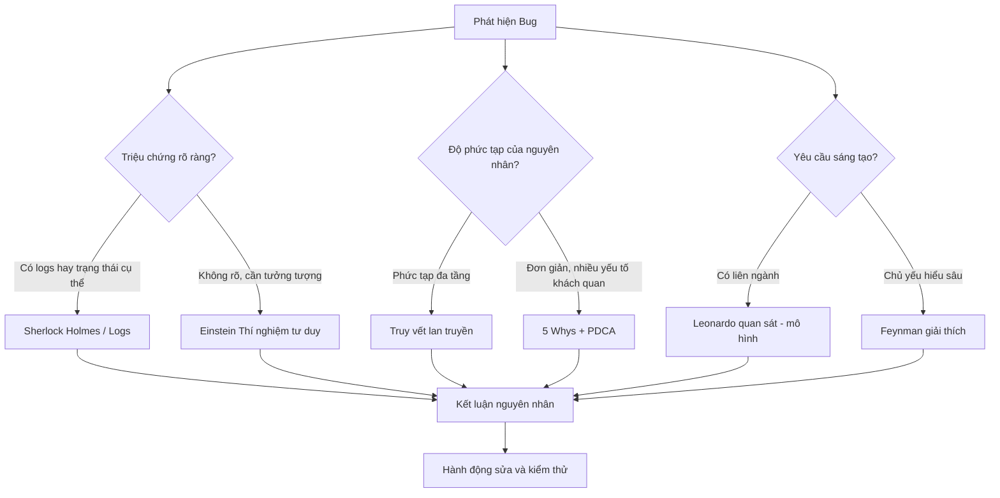

# Phương pháp luận Debug — Tư duy bậc cao

> **Domain**: system  
> **Mô tả ngắn**: Hệ 6 phương pháp tư duy kinh điển áp dụng cho debug phần mềm. LLM Wiki = "bộ não phương pháp luận" — khi gặp bug khó, chọn đúng phương pháp để định hướng điều tra.

---

## Định nghĩa

Phương pháp luận debug là tập hợp các **khung tư duy** (mental frameworks) giúp kỹ sư tiếp cận và giải quyết lỗi phần mềm một cách có hệ thống — không phụ thuộc vào ngôn ngữ lập trình cụ thể.

> Gỡ lỗi = cập nhật **mental models** khi mô hình tâm trí không còn khớp với hiện thực hệ thống.

---

## Sơ đồ quyết định nhanh



---

## 6 Phương pháp Core — Tóm tắt

| # | Phương pháp | Khi dùng | File tham chiếu |
|---|------------|---------|----------------|
| 1 | **Sherlock Holmes** — Quan sát, loại trừ, giả thuyết | Có logs rõ, triệu chứng cụ thể | `01-Sherlock-Holmes.md` |
| 2 | **Einstein** — Thí nghiệm tư duy, đơn giản hóa | Race condition, hệ thống phức tạp | `02-Einstein-ThuNghiemTuDuy.md` |
| 3 | **Da Vinci** — Quan sát đa lĩnh vực, mô hình hóa | Cần nhìn bối cảnh rộng, sáng tạo | `03-DaVinci-QuanSatHeThong.md` |
| 4 | **Toyota** — 5 Whys + PDCA + Genchi Genbutsu | Lỗi có nhiều yếu tố phụ thuộc, lặp lại | `04-Toyota-5Whys-PDCA.md` |
| 5 | **Contact Tracing** — Causal chain, tìm bệnh nhân 0 | Lỗi qua nhiều tầng, ngẫu nhiên | `05-ContactTracing-ChuoiNhanQua.md` |
| 6 | **Feynman** — Dạy lại, đơn giản hóa đến nguyên lý | Cần hiểu kỹ, handover, review | `06-Feynman-GiaiThich.md` |

## 5 Phương pháp bổ sung — Logic · Tiền đề · Mạng tri thức

| # | Phương pháp | Khi dùng | Wiki |
|---|------------|---------|------|
| 7 | **Socrates** — 35 câu hỏi, bóc giả định ẩn | AI đưa kết luận tự tin, cần kiểm tra tiền đề | [[wiki/sources/PhuongPhapLuan-Socrates]] |
| 8 | **First Principles** — Strip → Identify → Rebuild → Compare | Giải pháp cũ không hiệu quả, bug không giải thích được bằng docs | [[wiki/sources/PhuongPhapLuan-FirstPrinciples]] |
| 9 | **Aristotle Syllogism** — Tam đoạn luận, Black Swan | Kiểm tra tính hợp lệ kết luận, phát hiện Correlation ≠ Causation | [[wiki/sources/PhuongPhapLuan-Aristotle]] |
| 10 | **SAT Lan truyền kích hoạt** — Kích hoạt nút → lan truyền mạng wiki | Tìm pattern bug tương tự, mở rộng wiki, kết nối liên ngành | [[wiki/sources/PhuongPhapLuan-SAT]] |
| 11 | **Zettelkasten** — Atomic notes + linking + emergence | Quản lý tri thức, xây dựng wiki bền vững | [[wiki/concepts/PKM-Methods]] |

## Phương pháp nền tảng — Bước 0 trước khi debug

| # | Phương pháp | Khi dùng | Wiki |
|---|------------|---------|------|
| 12 | **Bóc tách chức năng** — CÂU HỎI GỐC → INPUT → LOGIC → OUTPUT → GUARD → PHẢN BIỆN | Chưa biết bug ở đâu, module xa lạ, mô tả mơ hồ | [[wiki/sources/PhuongPhapLuan-BocTachChucNang]] |

---

## Quy tắc / Logic chính

- **Sherlock**: Không loại trừ bằng cảm tính — chỉ bằng bằng chứng. Giả thuyết còn sót lại = sự thật.
- **Einstein**: Lỗi chỉ ở Production → do "lực" vô hình (tải, phân mảnh bộ nhớ, phần cứng). Thí nghiệm tư duy bắc cầu.
- **Da Vinci**: Giải pháp cục bộ thường "đẩy lỗi" sang bộ phận khác. Tìm **leverage point** để một thay đổi nhỏ fix nhiều nơi.
- **Toyota 5 Whys**: Sửa ở cấp độ sâu nhất (quy trình/thiết kế) mới ngăn lỗi tái phát — không chỉ thêm `if null`.
- **Genchi Genbutsu**: Dashboard đôi khi tạo bức tranh giả — phải SSH thực, xem log thô.
- **Contact Tracing**: R₀ > 1 → cascading failure. Cô lập (Circuit Breaker) hiệu quả hơn cố sửa trong khi tương tác.
- **Feynman**: Nếu giải thích không trôi chảy → chỗ đó là kẽ hở hiểu biết → đó là nơi bug ẩn.
- **Bóc tách chức năng**: GUARD silent skip là nguyên nhân phổ biến nhất bị bỏ qua — không lỗi, không log, chỉ đơn giản không chạy.

---

## Tâm lý học debug

| Mindset | Hành vi | Hệ quả |
|---------|---------|--------|
| **Fixed** | Cargo culting — thêm code ngẫu nhiên, restart service | Nợ kỹ thuật, gốc rễ không giải quyết |
| **Growth** | Lỗi = dữ liệu, áp dụng phương pháp khoa học | Mental model hoàn thiện, ngăn lỗi tương tự |

---

## Template Prompt cho LLM Wiki

```
[Holmes] Liệt kê nghi phạm + loại trừ từng cái bằng logs: [logs]
[Einstein] Đơn giản hóa về 2 node: [mô tả]. Lỗi có xảy ra không?
[Da Vinci] Vẽ dependency graph [hệ thống]. Tìm cổ họng / leverage point.
[Toyota] 5 Whys từ: [triệu chứng]. Hỏi ≥5 lần.
[Tracing] Causal chain từ [HTTP 500] ngược về gốc. Bệnh nhân 0 là gì?
[Feynman] Tôi giải thích như này: [giải thích]. Chỗ nào sai / thiếu?
```

---

## Liên quan đến phân hệ

| Phân hệ | Mô tả liên quan |
|---------|----------------|
| System (SYS) | Áp dụng khi debug IIS, auth, permission, config |
| INS / SAL / ATT | Áp dụng khi RCA lỗi nghiệp vụ phức tạp |
| Deploy / K8s | Einstein + Contact Tracing cho lỗi environment |

---

## Văn bản / Nguồn gốc

- Conan Doyle — Sherlock Holmes (deductive reasoning)
- Einstein — Gedankenexperiment
- Da Vinci — Connessione, systems thinking
- Toyota Production System — 5 Whys, PDCA, Genchi Genbutsu
- Epidemiology — SIR Model, Contact Tracing
- Richard Feynman — Feynman Technique (Farnam Street)

---

## Liên kết

- [[wiki/sources/PhuongPhapLuan-Debug]] — Source tổng hợp 6 phương pháp core + file archive
- [[wiki/sources/PhuongPhapLuan-Socrates-FirstPrinciples-Aristotle]] — Source 3 phương pháp bổ sung
- [[wiki/concepts/Kaizen-Methodology]] — Nền tảng Toyota thinking (5S, PDCA)
- [[wiki/concepts/PKM-Methods]] — Second Brain, Zettelkasten
- [[wiki/sources/INS-FishBone-Analysis]] — FishBone 4M + 5 Whys thực tế HRM
- [[wiki/sources/VNPAY1538-RCA-AppChiTietDonNghiTrong]] — RCA thực tế Contact Tracing
- [[wiki/bugs/Sys025-iis-oom-vnpay]] — Bug thực tế đã áp dụng PDCA
- [[wiki/sources/PhuongPhapLuan-BocTachChucNang]] — Bóc tách chức năng: bước 0 trước khi debug
- [[wiki/sources/PhuongPhapLuan-Debug-12-TongHop]] — Tổng hợp 12 phương pháp + sơ đồ chọn nhanh + template prompt
