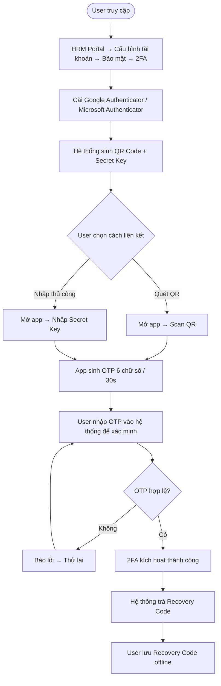
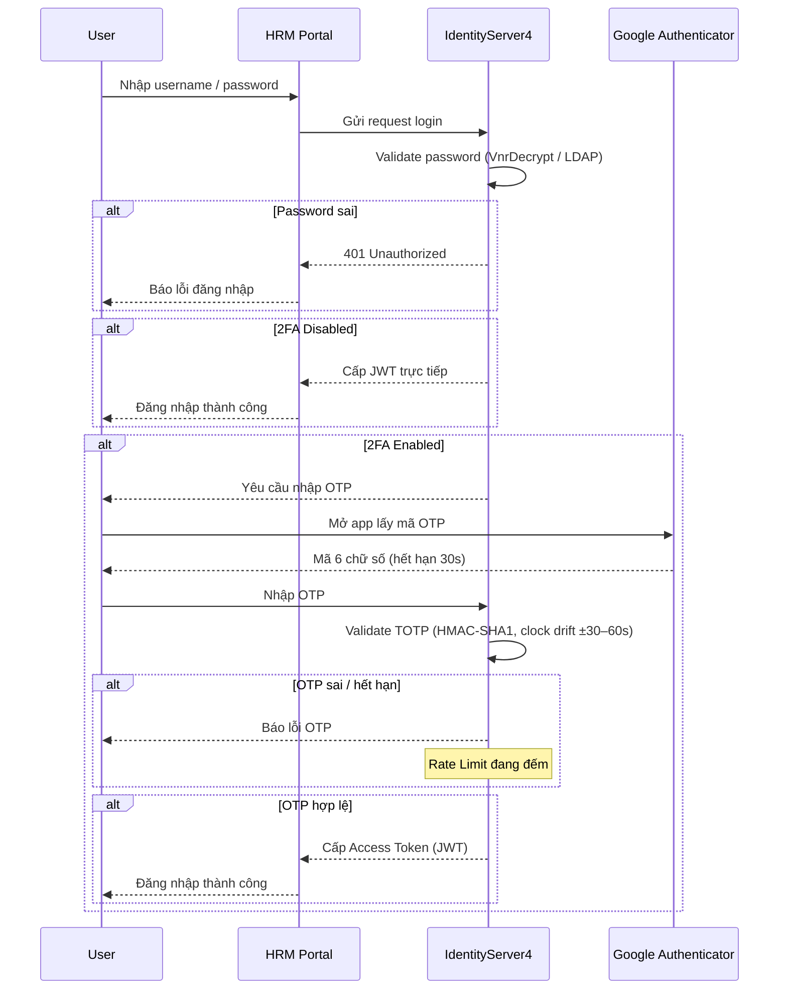
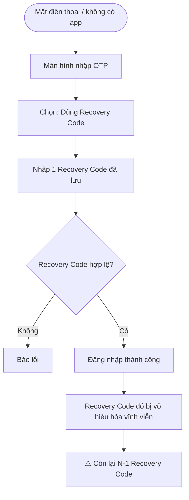
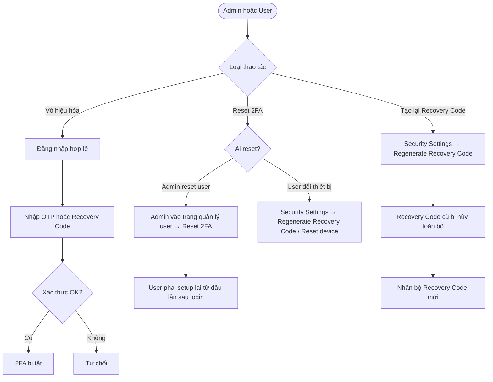

# Flow — 2FA Login & Setup (IdentityServer4)

> **Loại**: System Flow  
> **Trigger**: User đăng nhập / User kích hoạt 2FA lần đầu  
> **Phân hệ liên quan**: SYS — IdentityServer4, HRM Portal

---

## Tổng quan

Hai flow chính:
1. **Setup 2FA** — User kích hoạt 2FA lần đầu: quét QR → nhận Recovery Code
2. **Login với 2FA** — Đăng nhập bình thường khi 2FA đã bật: password → OTP → JWT

---

## Flow 1 — Thiết lập 2FA lần đầu

---

## Flow 2 — Đăng nhập với 2FA đã bật

---

## Flow 3 — Đăng nhập bằng Recovery Code (mất thiết bị)

---

## Flow 4 — Quản lý 2FA (Vô hiệu hóa / Reset)

---

## Điều kiện áp dụng 2FA

| Trường hợp | 2FA |
|---|---|
| User thường | Optional |
| Admin | Bắt buộc |
| Truy cập từ IP lạ | Bắt buộc |
| Thiết bị mới | Bắt buộc |

---

## Điểm rủi ro

| Rủi ro | Tác động | Phòng tránh |
|--------|---------|------------|
| Lộ QR code khi setup | Kẻ tấn công clone được OTP | Không log / mask QR trên server |
| OTP brute force | Bypass 2FA | Rate Limit — giới hạn số lần nhập sai |
| Lệch giờ server vs thiết bị | OTP luôn invalid | Sync NTP server; clock drift ±30–60s |
| Mất điện thoại | Không đăng nhập được | Recovery Code — lưu offline |
| User bypass policy | Admin không bật bắt buộc | Enforce 2FA policy theo role |
| Recovery Code lộ | Truy cập trái phép | Không hiển thị lại; lưu offline an toàn |

---

## Liên kết

- [[wiki/sources/2fa-ids4-solution]] — Tài liệu giải pháp đầy đủ
- [[wiki/architecture/2FA-IDS4-Architecture]] — Kiến trúc component 2FA
- [[wiki/architecture/HRM-Auth-Architecture]] — Kiến trúc xác thực HRM tổng quan
- [[wiki/flows/Flow-ResetPassword]] — Flow reset mật khẩu (security liên quan)
- [[wiki/flows/Flow-LDAP-Login]] — Flow đăng nhập LDAP
