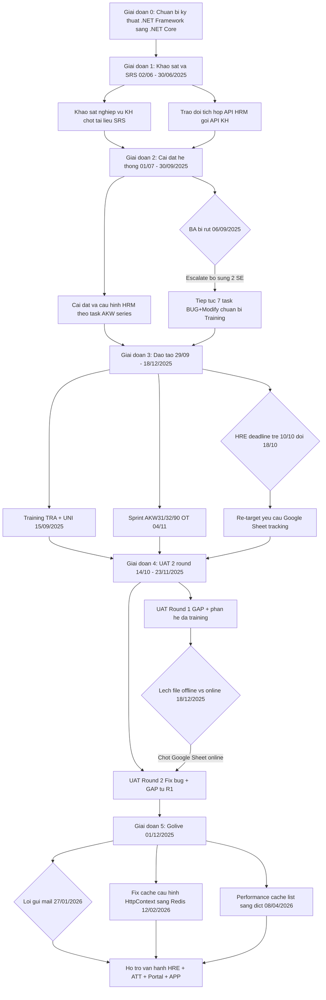

# Flow: Các Giai Đoạn Dự Án Bitex-AKW

## Bối cảnh

Dự án triển khai HRM cho Bitex + AKW (2 hợp đồng, 1 hệ thống). Timeline: 02/06/2025 → nay (hỗ trợ vận hành hậu go-live). Gồm 6 giai đoạn từ chuẩn bị kỹ thuật (.NET Framework → .NET Core), khảo sát SRS, cài đặt, đào tạo, UAT 2 round, đến go-live và hỗ trợ vận hành.

## Mermaid Flow

## Diễn giải từng bước

### Giai đoạn 0: Chuẩn bị kỹ thuật
- **Nhiệm vụ**: Chuyển .NET Framework → .NET Core
- **Deadline ban đầu**: 20/03/2025
- **QC/SE fix**: đến 19/04/2025

### Giai đoạn 1: Khảo sát & SRS (02/06 – 30/06/2025)
- Khảo sát nghiệp vụ, chốt tài liệu SRS
- Trao đổi tích hợp API: HRM gọi API KH lấy dữ liệu real-time
- **Rủi ro**: Chưa có môi trường Linux; tài liệu API từ KH có thể trễ

### Giai đoạn 2: Cài đặt hệ thống (01/07 – 30/09/2025)
- Cài đặt & cấu hình HRM, thực hiện task AKW series
- Branch: `HRM9-BRANCH/v8.12.48.01/BITEX_v8.12.48.01.09` (tách 23/08/2025)
- **Sự cố**: BA bị rút 06/09 → Thức escalate → yêu cầu bổ sung 2 SE

### Giai đoạn 3: Đào tạo (29/09 – 18/12/2025, kéo dài)
- Training TRA + UNI: 15/09 (sớm hơn kế hoạch)
- Sprint 04/11: OT cho AKW31/32/90 (dependency: AKW90 → AKW32)
- **Sự cố**: HRE trễ 10/10 → re-target 18/10 → yêu cầu Google Sheet tracking chuẩn

### Giai đoạn 4: UAT 2 round (14/10 – 23/11/2025)
- Round 1: GAP analysis + test phân hệ
- Round 2: Fix bug + GAP từ Round 1
- **Bài học**: SE xong ≠ xong → cần buffer 2–3 ngày PE test
- **Quy tắc tracking**: Google Sheet online là nguồn duy nhất

### Giai đoạn 5: Golive & Hậu kỳ (01/12/2025 → nay)
- Golive 01/12/2025
- Lỗi gửi mail tồn đọng (27/01/2026) 🔴
- Fix cache cấu hình HttpContext → Redis (12/02/2026) ✅
- Tối ưu performance cache (08/04/2026) ✅
- PE Tuyết Anh hỗ trợ vận hành: HRE + ATT + Portal + APP (81/99 tasks done)

---

## Nguyên tắc vàng rút ra

| Nguyên tắc | Xuất phát từ |
|------------|-------------|
| Thông báo rút nhân sự ≥ 3 ngày trước | Issue nguồn lực 06/09 |
| Deadline SE = Deadline UAT - 2~3 ngày | Issue HRE trễ 15/10 |
| 1 nguồn task duy nhất = Google Sheet online | Lệch data 18/12 |
| Breakdown sub-task trước estimate | AKW32 phức tạp 01/11 |
| SE báo sớm khi sắp trễ | Issue HRE trễ 15/10 |

## Liên kết

- [[wiki/projects/Bitex-Project]] — Trang dự án chính
- [[wiki/sources/Bitex-Project-Overview]] — Nguồn chi tiết goals/scope/risks
- [[wiki/flows/Flow-UAT-Process]] — Quy trình UAT chuẩn HRM
- [[wiki/concepts/Project-Phases]] — Khái niệm giai đoạn triển khai
