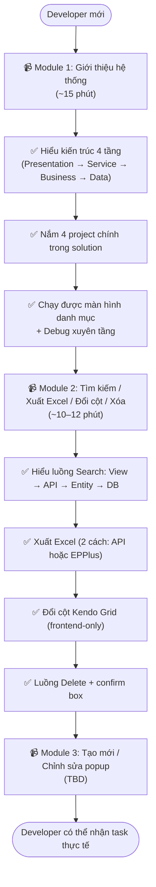
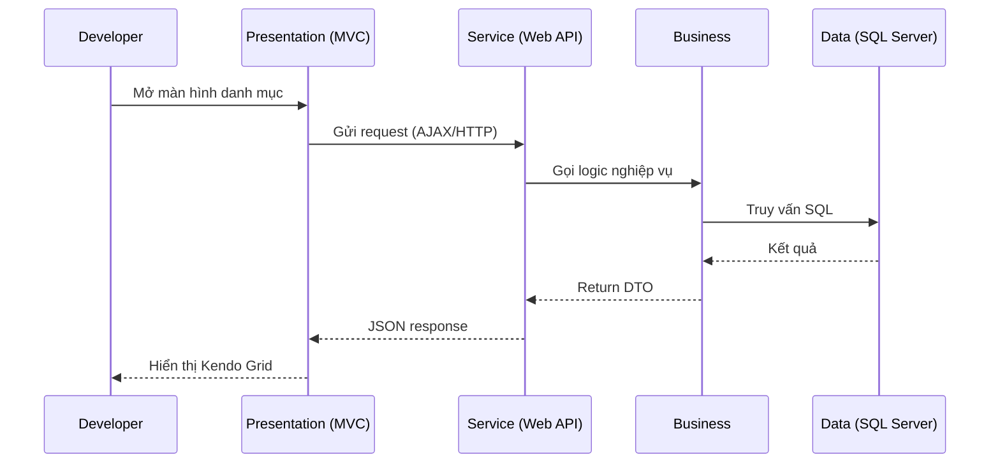

# Flow: Đào tạo Developer mới vào HRM

## Tổng quan

Lộ trình đào tạo nội bộ năm 2025, dành cho developer mới tiếp cận codebase HRM. Gồm 3 module video tuần tự, mỗi module ~15 phút.

**Yêu cầu đầu vào**: MVC, Web API, SQL Server, Kendo UI, JavaScript/jQuery.

---

## Lộ trình 3 module

---

## Module 1 — Giới thiệu hệ thống (chi tiết)

**4 project cần nắm:**
| Project | Vai trò |
|---------|---------|
| `HRM.Presentation.Main` | Web UI chính |
| `HRM.Presentation.EmpPortal` | Portal nhân viên |
| `HRM.Presentation.Hr.Service` | Web API nghiệp vụ HR |
| `HRM.Presentation.HrmSystem.Service` | API hệ thống (phân quyền, thiết lập) |

---

## Module 2 — Tìm kiếm / Xuất Excel / Đổi cột / Xóa (chi tiết)

```mermaid
flowchart TD
    subgraph Search["🔎 Tìm kiếm"]
        S1["Index.cshtml\nnhập điều kiện"] --> S2["CatBankDemoSearchModel\ngom filter"]
        S2 --> S3["Cat_BankController.GET\nWeb API"]
        S3 --> S4["CatBankDemoEntity.Search()\n→ DB"]
        S4 --> S5["Kendo Grid\nhiển thị kết quả"]
    end

    subgraph Export["📁 Xuất Excel"]
        E1["Nút Export Excel"] --> E2["Cat_GetData.ExportAllBankList()\nMVC Controller"]
        E2 --> E3a["Cách 1: Gọi API lấy data\n→ tạo Excel"]
        E2 --> E3b["Cách 2: Xử lý tại Controller\n(EPPlus/Aspose)"]
        E3a --> E4["File .xlsx tải về trình duyệt"]
        E3b --> E4
    end

    subgraph Delete["🗑️ Xóa"]
        D1["Nút Xóa\n→ Confirm box"] --> D2["DELETE /api/Cat_Bank/{id}"]
        D2 --> D3["CatBankDemoEntity.Delete(id)\n→ DB"]
        D3 --> D4["Cập nhật lại Grid"]
    end
```

**Điểm debug quan trọng Module 2:**
- Chrome DevTools → tab Network: kiểm tra AJAX call search
- Breakpoint tại: `CatBankController`, `Cat_BankController.Get()`, `CatBankDemoEntity.Search()`
- Kiểm tra `isDelete = true` vs xóa cứng
- Đảm bảo search model được truyền khi xuất Excel

---

## Liên kết

- Tài liệu gốc: [[wiki/sources/x7k2p-dao-tao-dev-moi-hrm-2025]]
- Kiến trúc hệ thống: [[wiki/architecture/HRM-System-Architecture]]
- Onboarding nhân viên (quy trình HR): [[wiki/flows/Flow-Onboarding-NhanVien]]
