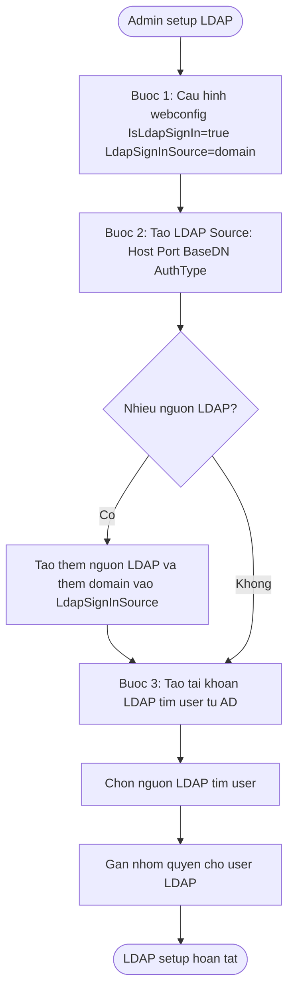
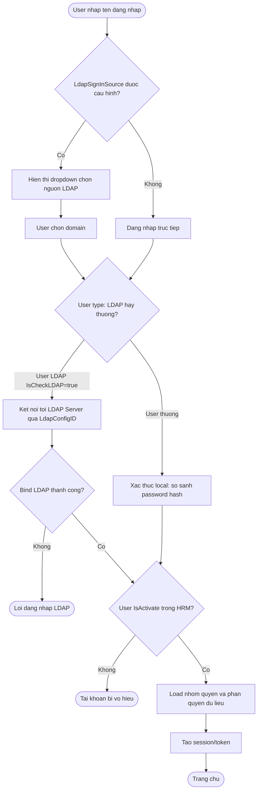

# Flow: Đăng Nhập LDAP / Active Directory HRM

## Bối cảnh

Quy trình cấu hình và đăng nhập LDAP trong HRM Pro 8. LDAP cho phép nhân viên đăng nhập HRM bằng tài khoản Active Directory của công ty thay vì tài khoản riêng. Gồm 2 luồng: setup 1 lần (admin cấu hình) và runtime (mỗi lần user đăng nhập).

## Mermaid Flow

### Luồng cấu hình LDAP (1 lần setup)



### Luồng đăng nhập LDAP (runtime)



## Diễn giải từng bước

### Cấu hình setup (1 lần)

**Bước 1 — Cấu hình webconfig**:
```xml
<add key="IsLdapSignIn" value="true"/>
<add key="LdapSignInSource" value="@thaco.com.vn,@vinamazda.vn,"/>
```
- `IsLdapSignIn`: bật/tắt tính năng LDAP
- `LdapSignInSource`: danh sách domain phân cách bởi dấu phẩy; nếu rỗng → không hiện dropdown chọn domain

**Bước 2 — Tạo LDAP Source** (Hệ thống > Cấu hình nguồn LDAP):

| Field | Mô tả | Ví dụ |
|-------|-------|-------|
| ServerType | Loại LDAP server | Active Directory |
| ConnectionType | Standard LDAP hoặc LDAP+SSL | Standard LDAP |
| HostName | Domain hoặc IP của LDAP server | `ad.example.com` |
| Port | Cổng kết nối (default 389) | `389` |
| AuthenticationType | Anonymous hoặc Simple | Simple |
| AuthorizedUser | User có quyền đọc toàn bộ subtree | `admin1` |
| Password | Password của authorized user | (encrypted) |
| BaseDN | Base DN của subtree cần sync | `ou=sales,dc=ad,dc=example,dc=com` |

**Bước 3 — Tạo tài khoản LDAP**: Hệ thống > Người dùng > Tạo mới từ tài khoản tích hợp → chọn user từ AD → gán nhóm quyền.

---

### Đăng nhập runtime

1. User nhập username → hệ thống kiểm tra `LdapSignInSource`
2. Nếu có nhiều domain → hiển thị dropdown để chọn
3. Nếu user type là LDAP (`IsCheckLDAP=true`) → bind với LDAP server qua `LdapConfigID`
4. Bind thành công → kiểm tra `IsActivate` trong HRM
5. Tài khoản active → load nhóm quyền + phân quyền dữ liệu → tạo session → vào trang chủ

---

### LDAPS (LDAP over SSL)

> ⚠️ **AVN (2026-04-29)**: Khách hàng yêu cầu chuyển từ LDAP → LDAPS vì bảo mật.
> `Sys_LdapConfig.ConnectionType` có option `LDAP+SSL` nhưng **chưa xác nhận hoạt động thực tế**.
> Cần raise task + xin tài khoản test LDAPS từ IT khách hàng.
> → Xem: [[wiki/sources/2026-04-29-avn-hrm-co-ho-tro-ldaps-chua]]

| ConnectionType | Port | Ghi chú |
|---------------|------|--------|
| Standard LDAP | 389 | Mặc định |
| LDAP+SSL (LDAPS) | 636 | Cần certificate phía server AD |

## Liên kết

- [[wiki/architecture/HRM-Auth-Architecture]] — Kiến trúc xác thực tổng thể: JWT, SSO, LDAP
- [[wiki/sources/Sys-TaiLieuLDAP-03]] — Tài liệu gốc LDAP
- [[wiki/sources/Daily-2024-OPA-LDAP-Permission]] — Cài OpenLDAP Ubuntu thực tế
- [[wiki/architecture/HRM-SysDB-Schema]] — Schema Sys_UserInfo (IsCheckLDAP, LdapConfigID)
- [[wiki/sources/2026-04-29-avn-hrm-co-ho-tro-ldaps-chua]] — AVN: câu hỏi LDAPS đang pending
