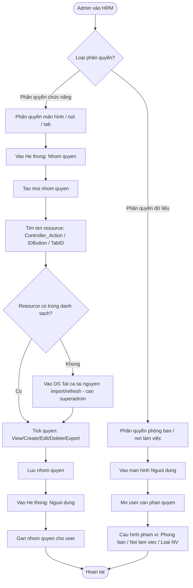
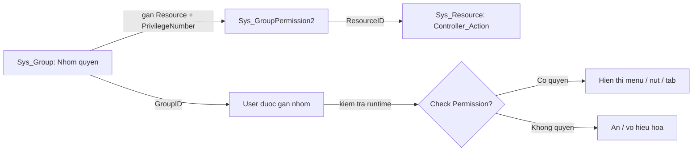

# Flow: Phân Quyền Hệ Thống HRM

## Bối cảnh

Quy trình phân quyền đầy đủ trong HRM Pro 8 — từ tạo nhóm quyền đến gán user. Có 2 loại phân quyền độc lập: **phân quyền chức năng** (màn hình / nút / tab theo RBAC) và **phân quyền dữ liệu** (phòng ban / nơi làm việc). Hệ thống dùng bitwise 8 bit để mã hóa các quyền View/Create/Edit/Delete/Export/Import.

## Mermaid Flow

### Luồng tổng quan — 2 loại phân quyền

### Luồng phân quyền chức năng — Chi tiết

## Diễn giải từng bước

### Phân quyền chức năng

**Bước 1–2**: Vào Hệ thống > Nhóm quyền → Tạo mới nhóm quyền (đặt tên theo vai trò, vd: "HR Admin", "Manager Phòng Kỹ Thuật").

**Bước 3**: Tìm tên resource theo pattern:

| Loại | Pattern | Ví dụ |
|------|---------|-------|
| Màn hình | `Controller_Action` | `Cat_Bank_index` |
| Nút | `Controller_Action_IDButton` | `Cat_DayOff_Index_btnAnalyzeCompensateHoliday` |
| Tab | ID HTML của tab | `InfoContactDetail` |

**Bước 4**: Tick quyền theo bitwise — PrivilegeNumber là tổng bit:

| Bit | Quyền |
|-----|-------|
| 1 | View (Xem) |
| 2 | Create (Tạo mới) |
| 4 | Edit (Sửa) |
| 8 | Delete (Xóa) |
| 16 | Export |
| 32 | Import |
| 64 | Create Template |
| 128 | Change Column |

**Bước 5–7**: Lưu nhóm quyền → Vào Hệ thống > Người dùng → Gán nhóm quyền cho user.

> Nếu resource chưa có trong danh sách → superadmin vào "DS Tất cả tài nguyên" → import/refresh để đăng ký resource mới.

---

### Phân quyền dữ liệu

Vào màn hình Người dùng → mở user cần phân quyền → cấu hình phạm vi:
- Phòng ban / Nơi làm việc
- Loại nhân viên / Loại hợp đồng

Phân quyền dữ liệu xác định **user thấy dữ liệu của ai**, độc lập với phân quyền chức năng.

## Liên kết

- [[wiki/architecture/HRM-SysDB-Schema]] — Schema Sys_Group, Sys_GroupPermission2, Sys_Resource
- [[wiki/sources/Sys-TaiLieuPhanQuyen-02]] — Tài liệu đào tạo phân quyền
- [[wiki/sources/Sys-TaiLieuHeThong-01]] — Tài liệu hệ thống gốc
- [[wiki/sources/LTG-SYS-Meetings-2024]] — Ví dụ thực tế: store Get_Data_Permission_New
