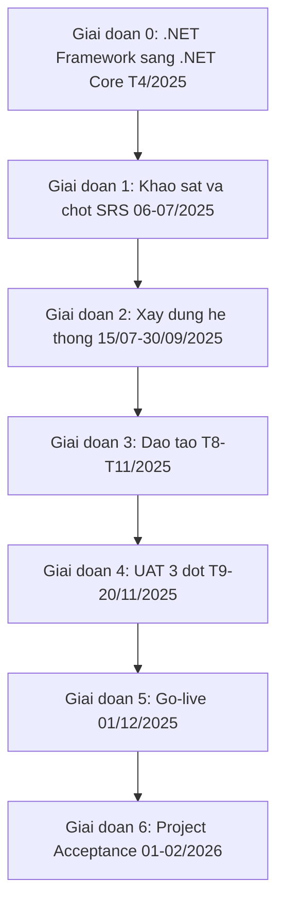
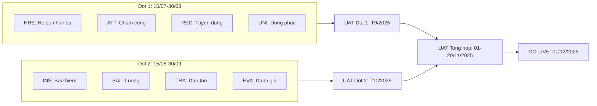
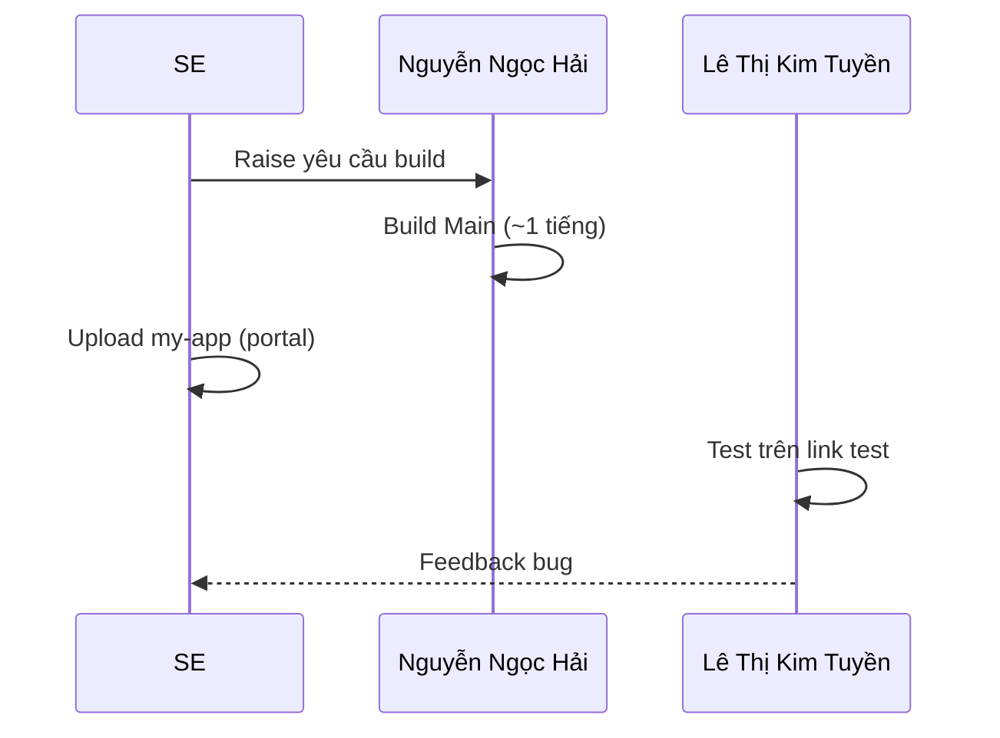

# Flow: Các Giai Đoạn Dự Án QuickPack QPVN

## Bối cảnh

Dự án triển khai HRM cho QuickPack Việt Nam (QPVN). Gồm 6 giai đoạn từ chuẩn bị kỹ thuật (.NET Framework → .NET Core, T4/2025) đến Project Acceptance (01–02/2026). Go-live chính thức 01/12/2025. Build theo 2 đợt song song, UAT 3 đợt. So sánh cấu trúc với: [[wiki/flows/Flow-Bitex-Phases]].

## Mermaid Flow

### Sơ đồ tổng quan 6 giai đoạn

### Sơ đồ Build — 2 đợt song song

> 🔴 = GAP rất phức tạp | ⚠️ = GAP phức tạp | ✅ = Không GAP

### Luồng Build Management

## Diễn giải từng bước

### Giai đoạn 0 — Chuẩn bị kỹ thuật (T4/2025)
- Chuyển codebase từ .NET Framework sang .NET Core
- Tiền đề kỹ thuật cho toàn bộ dự án

### Giai đoạn 1 — Khảo sát & chốt SRS (06–07/2025)
- Deadline hoàn tất SRS: **29/07/2025**
- Phụ trách: VnResource

### Giai đoạn 2 — Xây dựng hệ thống (15/07–30/09/2025)
- **Đợt 1** (15/07–30/08): HRE, ATT, REC ⚠️, UNI 🔴
- **Đợt 2** (15/08–30/09): INS ✅, SAL 🔴, TRA 🔴, EVA ✅
- Deadline Build Đợt 1: **30/08/2025** | Đợt 2: **30/09/2025**

### Giai đoạn 3 — Đào tạo (T8–T11/2025)
- Training sơ bộ hoàn tất: **29/09/2025** — Tùng.Ly phụ trách

### Giai đoạn 4 — UAT 3 đợt (T9–20/11/2025)
- UAT Đợt 1: T9/2025 (sau Build Đợt 1)
- UAT Đợt 2: T10/2025 (sau Build Đợt 2)
- UAT Tổng hợp: 01–20/11/2025
- Deadline hoàn tất UAT: **20/11/2025** — QPVN phụ trách

### Giai đoạn 5 — Go-live (01/12/2025 ⭐)
- Official Golive: **01/12/2025** — VnResource & QPVN

### Giai đoạn 6 — Project Acceptance (01–02/2026)
- Nghiệm thu dự án: **01/2026** — VnResource

---

## Milestone

| Ngày | Milestone | Phụ trách |
|------|-----------|-----------| 
| 29/07/2025 | Hoàn tất SRS | VnResource |
| 30/08/2025 | Hoàn tất Build Đợt 1 | VnResource |
| 29/09/2025 | Hoàn tất Training sơ bộ | Tùng.Ly |
| 30/09/2025 | Hoàn tất Build Đợt 2 | VnResource |
| 20/11/2025 | Hoàn tất UAT Tổng hợp | QPVN |
| **01/12/2025** | **Official Golive ⭐** | VnResource & QPVN |
| 01/2026 | Project Acceptance | VnResource |

## Liên kết

- [[wiki/projects/QuickPack-Project]] — Trang dự án chính
- [[wiki/sources/QuickPack-Project-Overview]] — Nguồn chi tiết goals/scope/risks
- [[wiki/flows/Flow-Bitex-Phases]] — So sánh với dự án Bitex-AKW
- [[wiki/flows/Flow-UAT-Process]] — Quy trình UAT chuẩn HRM
