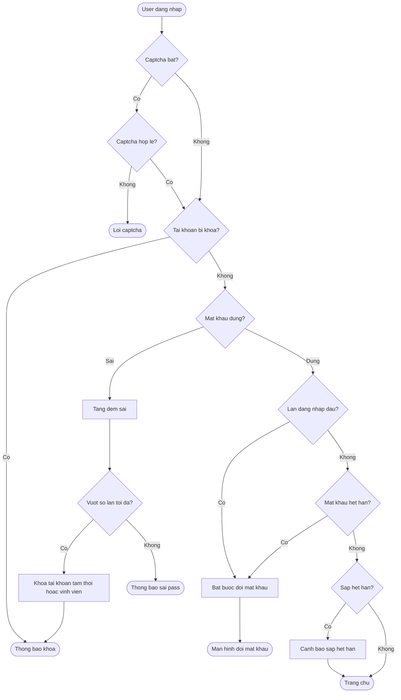
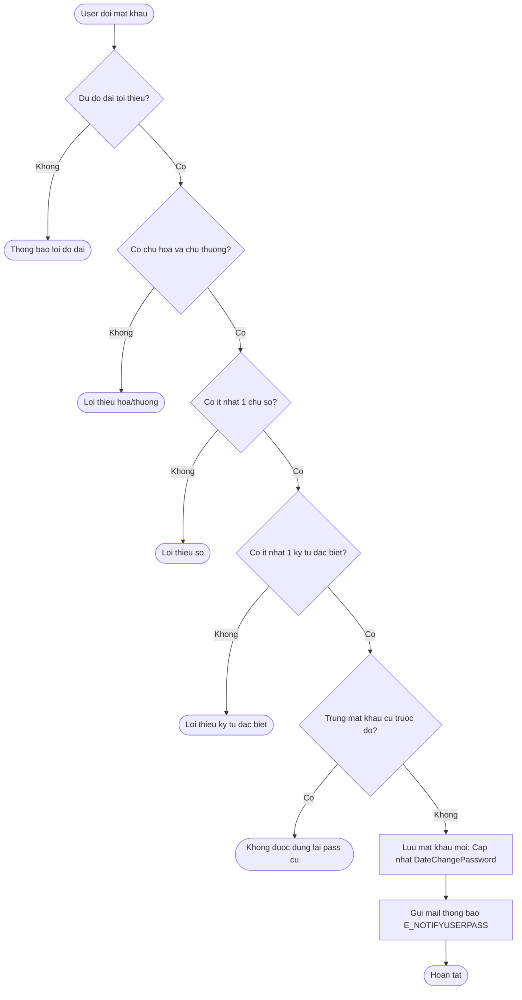
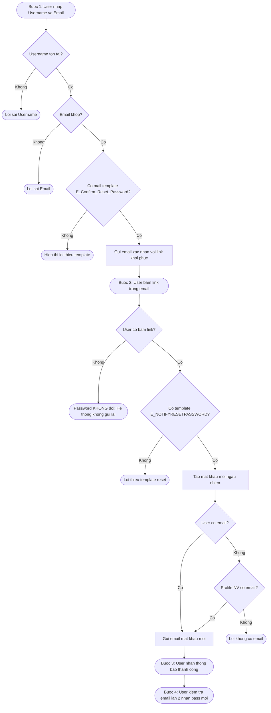

# Flow: Reset Mật Khẩu & Bảo Mật Đăng Nhập HRM

## Bối cảnh

Ba luồng bảo mật password trong HRM Pro 8: đăng nhập (với captcha, khóa tài khoản), đổi mật khẩu (validate độ phức tạp, lịch sử), và quên mật khẩu (4 bước qua email). Tất cả cấu hình qua `Sys_AllSetting`, lưu trạng thái trong `Sys_UserInfo`.

## Mermaid Flow

### Luồng 1 — Đăng nhập bảo mật

### Luồng 2 — Đổi mật khẩu (bảo mật)

### Luồng 3 — Quên mật khẩu (4 bước)

## Diễn giải từng bước

### Luồng 1 — Đăng nhập bảo mật

1. **Captcha** (nếu bật): validate reCaptcha → fail → dừng ngay
2. **Kiểm tra khóa**: tài khoản đang bị khóa → hiển thị thông báo
3. **Xác thực mật khẩu**: sai → tăng đếm sai → vượt ngưỡng → khóa tài khoản (tạm thời hoặc vĩnh viễn tùy cấu hình)
4. **Đúng mật khẩu**: kiểm tra lần đầu đăng nhập / mật khẩu hết hạn → bắt buộc đổi
5. **Sắp hết hạn**: cảnh báo nhưng vẫn vào được trang chủ

### Luồng 2 — Đổi mật khẩu

Validate tuần tự: độ dài → có chữ hoa+thường → có số → có ký tự đặc biệt → không trùng lịch sử → lưu + gửi mail thông báo `E_NOTIFYUSERPASS`.

### Luồng 3 — Quên mật khẩu (4 bước)

- **Bước 1**: Nhập username + email → gửi link xác nhận (`E_Confirm_Reset_Password`)
- **Bước 2**: User bấm link → hệ thống tạo mật khẩu mới ngẫu nhiên
- **Bước 3**: Gửi mật khẩu mới qua email (`E_NOTIFYRESETPASSWORD`) → thông báo thành công
- **Bước 4**: User kiểm tra email lần 2 để lấy mật khẩu mới

> **Lưu ý**: Nếu user không bấm link → password **KHÔNG** đổi; hệ thống không tự gửi lại.

---

## Cấu hình bảo mật (Sys_AllSetting)

| Tham số | Mô tả |
|---------|-------|
| Captcha đăng nhập | Google reCaptcha khi đăng nhập |
| Buộc đổi pass lần đầu | User mới đăng nhập lần đầu phải đổi |
| Chu kỳ đổi pass (ngày) | Kể từ lần đổi gần nhất |
| Cảnh báo sắp hết hạn (ngày) | Thông báo trước X ngày |
| Độ dài tối thiểu | Số ký tự tối thiểu |
| Số chữ số tối thiểu | |
| Số ký tự đặc biệt tối thiểu | |
| Số lần sai → khóa | Đăng nhập sai N lần bị khóa |
| Số phút tạm khóa | Rỗng = khóa vĩnh viễn |

## Liên kết

- [[wiki/architecture/HRM-SysDB-Schema]] — Sys_UserInfo: DateChangePasssword, DatePasswordExpired
- [[wiki/architecture/HRM-Auth-Architecture]] — Kiến trúc auth tổng thể
- [[wiki/sources/Sys-TaiLieuHeThong-01]] — Tài liệu gốc + Enum mail template
